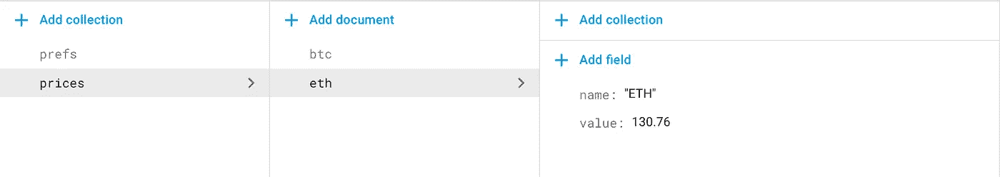
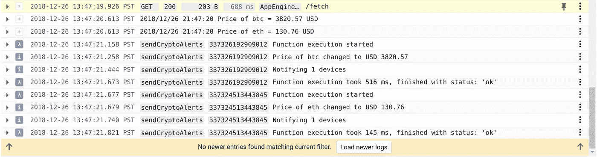
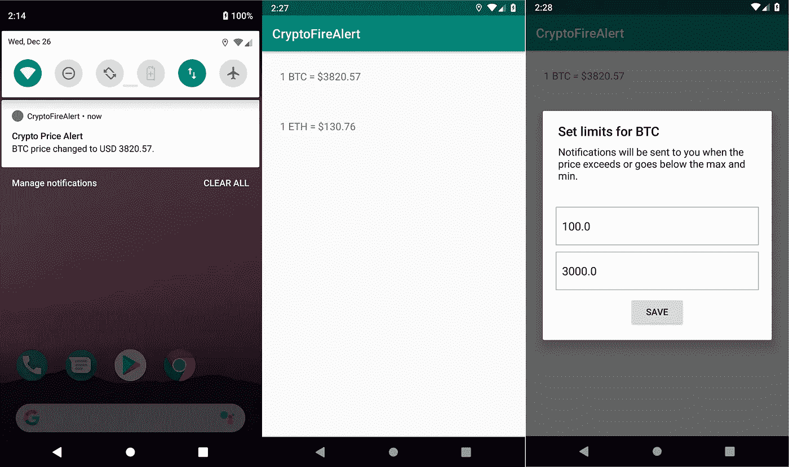

# 利用 Firebase 和 Google 云平台开发加密货币价格监测器

> 原文：<https://medium.com/google-cloud/developing-a-cryptocurrency-price-monitor-using-firebase-and-google-cloud-platform-34d5538f73f6?source=collection_archive---------0----------------------->


在这篇文章中，我演示了如何使用 [Firebase](https://firebase.google.com) 和[谷歌云平台(GCP)](https://cloud.google.com) 构建一个加密货币价格监控应用。每当市场上比特币或以太坊的价格发生变化时，该应用都会收到通知。用户可以为每种加密货币配置最低和最高价格阈值，我们使用这些设置来确定任何给定的价格变化要通知哪些用户。

这款应用的灵感来自 Pusher 社区发布的一篇文章(点击此处阅读[第 1 部分](https://pusher.com/tutorials/cryptocurrency-kotlin-go-part-1)和[第 2 部分](https://pusher.com/tutorials/cryptocurrency-kotlin-go-part-2))。他们的加密货币价格提醒应用程序使用[推送器](https://pusher.com/)来发送通知，这似乎是在引擎盖下使用 [Firebase 云消息(FCM)](https://firebase.google.com/docs/cloud-messaging/) 。此外，他们使用 SQLite 数据库和在 Go 中开发的独立后端服务器来实现必要的功能。当我读那篇文章的时候，我不禁想到这个用例也可以作为 Firebase 和 GCP 的一个很好的演示。这篇文章和相关的应用程序就是这个想法的结果。

我们开发的应用程序版本不需要部署独立的数据库或后端服务器。我们使用各种平台即服务(PaaS)和无服务器产品实施所有服务器端功能，这些产品在 Firebase 和 GCP 生态系统中随时可用。具体来说，我们的示例应用程序展示了以下特性。

*   在 [Google Cloud Firestore](https://firebase.google.com/docs/firestore/) 中存储加密货币价格和每用户阈值设置。
*   使用[谷歌应用引擎](https://cloud.google.com/appengine/)服务定期检查加密货币的市场价格。
*   使用 [Google Cloud 函数](https://cloud.google.com/functions/)来确定每次价格变化要通知哪些用户。
*   通过 FCM 发送推送通知。

在客户端，我们使用 [Firebase Android SDK](https://firebase.google.com/docs/android/setup) 直接与 Firestore 和 FCM 交互。这排除了实现单独的 REST API 的需要，或者在 Android 应用程序中编写任何 HTTP 交互的需要。

## Firestore

我们的应用程序使用两个 Firestore 系列。

*   `prices`集合用于存储最新的加密货币价格。它只有两个文档——我们希望监控的每种货币一个文档。我们将分别给它们分配 id`btc`和`eth`。
*   `prefs`集合是我们存储每个用户设置的地方。每个应用程序实例在这个集合中创建一个文档，使用其唯一的 [Firebase 实例 ID](https://firebase.google.com/docs/reference/android/com/google/firebase/iid/FirebaseInstanceId) 作为文档标识符。

不需要手动创建这些集合。它们是在我们的应用程序开始运行时自动创建的。但是如果您希望通过添加一些样本数据来测试应用程序，图 1 显示了您的 Firestore 数据库应该是什么样子。



图 1:应用程序使用的 Firestore 集合

作为建立 Firestore 的一部分，我们部署了以下[安全规则](https://firebase.google.com/docs/firestore/security/get-started)。这些基本上使得`prices`集合是只读的，而`prefs`集合是可读写的。你碰巧在同一个 Firestore 数据库中的任何其他收藏将无法被该应用程序访问。

```
service cloud.firestore {
  match /databases/{database}/documents {
    match /prices/{currency} {
      allow read;
      allow write: if false;
    }
    match /prefs/{device} {
      allow read, write;
    }
  }
}
```

我们在这个演示中没有实现用户认证，但是使用 [Firebase Auth](https://firebase.google.com/docs/auth/) 来实现是相当简单的。如果您决定探索这个选项，您可以使用 Firebase Auth 提供的惟一用户 id 作为`prefs`集合中的文档 id。这也将允许您进一步收紧您的安全规则，允许每个用户只写他们指定的文档。

另请注意，Firebase 安全规则仅适用于客户端应用程序(本例中为 Android 用户)。在后端，我们使用[Firebase Admin SDK](https://firebase.google.com/docs/admin/setup)，它绕过安全规则，以特权用户的身份访问数据库。

## Android 客户端应用程序

该应用的完整源代码可以在我的 [firecloud GitHub repo](https://github.com/hiranya911/firecloud/tree/master/crypto-fire-alert/android-app) 中找到。整个事情相当于大约 170 行 Kotlin 代码，加上通常的 Android 资源和清单文件。当应用程序启动时，我们在`prices`集合上启动 Firestore [实时监听器](https://firebase.google.com/docs/firestore/query-data/listen)。通过这种方式，应用程序总是显示 Firestore 中存储的最新加密货币价格。清单 1 展示了来自`MainActivity`的相关代码片段。

清单 1:使用 Firestore Android SDK 接收实时更新

`MainActivity`布局包含两个文本视图，id 分别为`btc`和`eth`。请注意，我们对`prices`集合中的 Firestore 文档使用相同的 id。因此，我们可以使用第 16–18 行中的技巧将每个 Firestore 文档映射到 UI 中的文本视图。

点击文本视图启动相应加密货币的设置对话框。用户可以指定最小和最大阈值，并保存设置。这个想法是，每当价格低于最低阈值或超过最高阈值时，应用程序都会通知用户。清单 2 显示了将设置保存到 Firestore 的方法。

清单 2:将用户偏好保存到 Firestore

除了阈值，我们还将应用程序实例的注册令牌保存到 Firestore(第 6 行)。稍后当我们想要通过 FCM 通知设备时，会用到它。我们使用稳定的 Firebase 实例 ID 作为文档标识符。在实现用户认证的应用中，我们可以使用这里的唯一用户 ID。

清单 3 中使用的`await()`方法(第 2 行和第 9 行)是我们添加到 Android GMS 核心的`[Task](https://developers.google.com/android/reference/com/google/android/gms/tasks/Task)` [类](https://developers.google.com/android/reference/com/google/android/gms/tasks/Task)中的扩展方法。这使得在 Kotlin 协程中使用`Task` API 更加容易。清单 3 展示了`await()`方法的实现。

清单 3:添加到 Android 任务 API 的 Suspendable 扩展方法

最后，我们将 [FCM Android SDK](https://firebase.google.com/docs/cloud-messaging/android/client) 添加到应用程序中，并如清单 4 所示扩展`FirebaseMessagingService`以接收推送通知。

清单 4:在 Android 中接收 FCM 推送通知

当应用程序在前台时，该服务处理传入的推送通知。它显示一个带有通知有效负载的简单弹出窗口。当应用程序在后台时，通知将被发送到 Android 的系统通知托盘。

这几乎是客户端应用程序中所有令人兴奋的部分。现在让我们看看应用程序的后端组件。

## 加密货币价格检查器

我们在 Go (v1.11)中实现了一个应用引擎服务，以定期检查加密货币的市场价格，并将结果保存到 Firestore。我们的实现由以下文件组成:

```
cryptocron/
├── cryptocron.go (core functionality of the service)
└── web/
    ├── app.yaml  (App Engine deployment descriptor)
    ├── cron.yaml (App Engine cron configuration)
    └── main.go   (main function that exposes the service over HTTP)
```

该服务的完整源代码可以在 [firecloud repo](https://github.com/hiranya911/firecloud/tree/master/crypto-fire-alert/cryptocron) 中找到。您可以运行下面的命令将代码直接导入到您的`GOPATH`中:

```
$ go get github.com/hiranya911/firecloud/crypto-fire-alert/cryptocron
```

价格检查器服务使用 [Firebase Admin SDK for Go](https://firebase.google.com/go) 访问 Firestore。由于我们的代码将部署在 App Engine 中，我们可以让 SDK 自动发现 Google [应用默认凭证(ADC)](https://cloud.google.com/docs/authentication/production) 来授权 Firestore API 调用。这意味着我们可以用清单 5 所示的最小配置来初始化 Admin SDK。

清单 5:为 Firestore 访问初始化 Admin Go SDK

注意，我们只将一个`Context`传递给了`firebase.NewApp()`函数。SDK 能够自动发现访问 Firestore 所需的授权凭证和任何其他设置(例如 GCP 项目 ID)。我们随后在第 19 行获得的`firestore.Client`提供了对 Android 客户端应用程序使用的同一个 Firestore 数据库的访问。

我们使用 [CryptoCompare REST API](https://min-api.cryptocompare.com/) 获取比特币和以太坊的最新价格。清单 6 展示了如何将发现的价格保存到 Firestore。

清单 6:将加密货币价格从 Go 保存到 Firestore

我们在 Firestore 上执行批量写操作，在一次操作中更新比特币和以太坊的价格。由于我们的 Android 应用程序已经*在*监听`prices`集合中的更新，这些变化会立即被用户看到。

我们在 URL 路径`/fetch`将该服务公开为 HTTP 端点。接下来，为了让我们的应用程序数据保持最新，我们需要指示 Google App Engine 定期调用我们的服务。这是通过编写清单 7 所示的`[cron.yaml](https://cloud.google.com/appengine/docs/standard/go111/scheduling-jobs-with-cron-yaml)` [文件](https://cloud.google.com/appengine/docs/standard/go111/scheduling-jobs-with-cron-yaml)来完成的。

清单 7:应用引擎 cron 作业配置

要在本地测试这个服务，将`GOOGLE_APPLICATION_CREDENTIALS`环境变量设置为指向从 Firebase 项目下载的[服务帐户](https://firebase.google.com/docs/admin/setup#add_firebase_to_your_app) JSON 文件。然后执行服务的`main.go`文件:

```
$ export GOOGLE_APPLICATION_CREDENTIALS=path/to/serviceAccount.json
$ go run main.go
```

这将启动端口 8080 上的服务，您可以通过向`http://localhost:8080/fetch`发送请求来尝试一下。结果，您将看到 Firebase 控制台中的价格集合得到了更新。这些更新还会出现在 Android 客户端应用程序上，如果它碰巧正在运行的话。注意，在本地测试时，您必须手动调用服务的`/fetch`端点。`cron.yaml`文件只有在部署到云中后才会生效。

在测试该服务时，加密货币价格在现实世界中的变化率可能不足以触发许多更新。如果这成为一个问题，您可以放弃 CryptoCompare API，让服务在每次调用时产生随机定价数据。在启动服务之前设置以下环境变量以启用此功能。

```
$ export SIMULATE_MODE=1
```

要将服务部署到 App Engine，请安装并设置 [Google Cloud SDK](https://cloud.google.com/sdk/) 。确保配置了`gcloud`命令行实用程序来管理您的 GCP/Firebase 项目。

```
$ gcloud config set project <your-project-id>
```

然后从与`app.yaml`文件相同的目录中运行以下命令。

```
$ gcloud app deploy
$ gcloud app deploy cron.yaml
```

第一个命令部署服务实现。后者启动定期调用服务的计划任务。此后不久，您将在应用引擎日志中看到类似以下内容的条目。

```
2018-12-26 13:47:19.926 PST GET 200 203 B 688 ms AppEngine-Google; /fetch
2018-12-26 13:47:20.613 PST 2018/12/26 21:47:20 Price of btc = 3820.57 USD
2018-12-26 13:47:20.613 PST 2018/12/26 21:47:20 Price of eth = 130.76 USD
```

我们还将我们的服务编程为只接受来自 App Engine cron scheduler 的请求。试图手动调用云中的 HTTP 端点将产生一个`404 Not Found`响应。您可以通过从`app.yaml`文件中删除`CRON_ONLY`环境变量来改变这种行为。

## 通知发送者

我们需要完成我们的应用程序的最后一部分是在加密货币价格变化时通知感兴趣的用户的服务。我们已经有了更新 Firestore 价格的服务。因此，我们可以使用 Firebase 的[云函数来实现一个无服务器函数，每当有新价格写入 Firestore 的`prices`集合时，该函数就会发出通知。清单 8 展示了这个实现的样子。](https://firebase.google.com/docs/functions/)

清单 8:使用 Firebase 的云功能发送目标通知

我们为`prices`集合中的文档定义了一个`onUpdate` Firestore 触发器。正在更新的文档的 ID(即`btc`或`eth`)及其价格值可以从传递给触发器的参数中获得。我们将这些值传递给`findTargetDevices()` helper 方法，该方法查询 Firestore 中的`prefs`集合，以确定应该通知哪些用户价格发生了变化。

我们希望通知用户其最低阈值高于当前价格，或其最高阈值低于当前价格。由于 Firestore 不支持析取查询(即`OR`查询)，我们运行两个单独的查询(第 33–34 行)，并汇总结果。这也是我们引用 Android 客户端保存在 Firestore 中的设备注册令牌的地方。最后，我们使用 Admin SDK 中的 FCM API 向选定的用户发送推送通知。

同样，请注意，我们正在用最少的配置初始化 Firebase Admin SDK(第 4–5 行)。SDK 自动发现有效的授权凭证，并连接到 Android 客户端和 App Engine 服务使用的相同 Firestore 数据库。

云功能的完整实现可以在 [GitHub](https://github.com/hiranya911/firecloud/tree/master/crypto-fire-alert/notification-sender) 上获得。使用 [Firebase 函数模拟器](https://firebase.google.com/docs/functions/local-emulator)在本地测试代码。从项目的`functions/`目录运行以下命令。

```
$ export GOOGLE_APPLICATION_CREDENTIALS=path/to/serviceAccount.json
$ npm run shell
```

这将启动 Firebase 模拟器外壳。现在，您可以使用一些示例数据直接调用该函数，如下所示。

```
firebase > sendCryptoAlerts({before: {}, after: {value: 5000, name: 'BTC'}}, {params: {currency: 'btc'}})'Successfully invoked function.'
info: User function triggered, starting execution
info: Price of btc changed to USD 5000
info: Execution took 2263 ms, user function completed successfully
```

在验证了我们的功能按预期工作之后，我们可以使用 Firebase CLI 将其部署到云中。

```
$ firebase deploy --only functions
```

现在，您可以等待 App Engine 服务更新加密货币价格，或者手动在 Firestore 中输入一些样本价格。也可以使用 GCP 控制台手动运行 App Engine cron 作业。无论哪种方式，云功能都将被触发，您将能够在 Firebase 控制台中看到相应的日志。

```
1:47:21.821 PM sendCryptoAlerts Function execution took 145 ms, finished with status: 'ok'
1:47:21.740 PM sendCryptoAlerts Notifying 1 devices
1:47:21.679 PM sendCryptoAlerts Price of eth changed to USD 130.76
1:47:21.677 PM sendCryptoAlerts Function execution starte
1:47:21.673 PM sendCryptoAlerts Function execution took 516 ms, finished with status: 'ok'
1:47:21.444 PM sendCryptoAlerts Notifying 1 devices
1:47:21.258 PM sendCryptoAlerts Price of btc changed to USD 3820.57
1:47:21.158 PM sendCryptoAlerts Function execution started
```

图 2 是 GCP 控制台的屏幕截图，在同一个窗口中显示了 App Engine 和云函数日志。此图中显示的所有条目都是由 App Engine 服务的一次运行生成的。



图 2:价格变化产生的应用引擎和云功能日志

图 3 显示了 Android 客户端应用程序的各种屏幕，包括当应用程序在后台时如何发送通知。



图 3: Android 客户端应用程序 UI

## 结论

在这篇文章中，我们看了如何使用几个 Firebase 和 GCP 产品开发一个加密货币价格监控应用程序。我们使用 Firebase Android SDK 直接与 Google Cloud Firestore 和 FCM 进行交互。我们在 Google App Engine 中实现了一项服务，定期查看比特币和以太坊的市场价格。最后，我们实现了一个 Google Cloud 函数，它根据单个用户配置的价格阈值通知用户价格变化。整个练习花了我几个小时，你可以在 GitHub 上找到完整的实现。

该应用的后端功能在谷歌应用引擎和谷歌云功能之间拆分。但是，也可以单独使用 App Engine 来实现所有后端功能。我们可以对 Go 服务进行编程，使其在每次更新加密货币价格时发送推送通知。其实我实现的服务已经支持这个了，只是默认是禁用的。查看代码，看看是否能找出如何在 App Engine 服务中启用推送通知。

就我个人而言，我非常倾向于使用不同的服务来检查加密货币的价格，并发送推送通知。这使得关注点的分离更加明确，同时导致更加松散耦合的实现。它还使得每个服务可以独立测试和部署，从而使我们更接近微服务架构。例如，想象一下试图改变我们的应用程序检查加密货币价格的方式。有了两个不同的服务，我们可以简单地更新价格检查服务，而不必接触通知发送者。

我希望这篇文章和相关的演示应用程序对你有用。欢迎提出任何问题或反馈。如果你有任何想让我尝试和实现的演示应用想法，我也很想听听。一如既往，我们也欢迎您通过各种开源 Firebase 库参与到 [Firebase 社区](https://firebaseopensource.com/)中来。