# 使用云代码和 Google Cloud Run 开发和部署无服务器容器

> 原文：<https://medium.com/google-cloud/developing-and-deploying-containers-with-cloud-code-on-google-cloud-run-4d8dfd88af48?source=collection_archive---------0----------------------->

使用云代码在云上编写、调试和部署无服务器容器

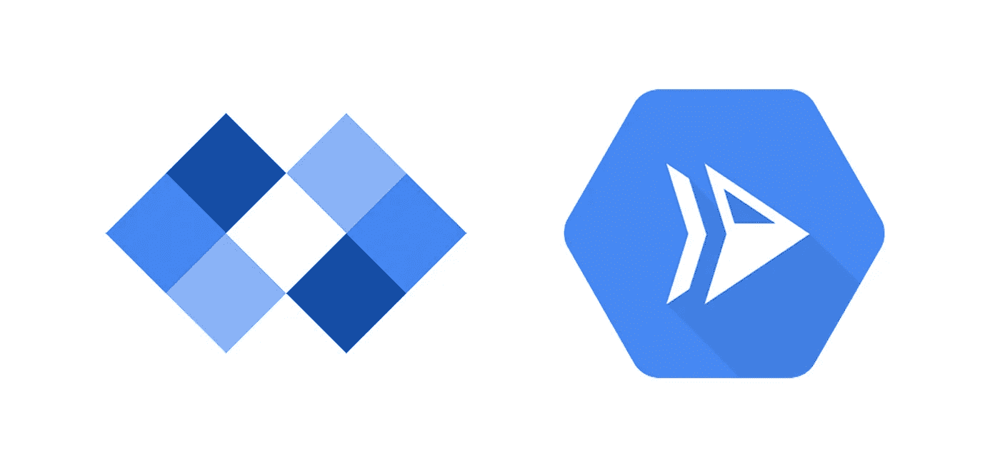

云代码是一个工具，可以帮助你编写、调试和部署你的应用到谷歌云服务。对 ide 的扩展，如 Visual Studio 代码、云外壳编辑器和 JetBrains IDEs 家族。它为 Google Kubernetes 引擎和 Cloud Run 提供开发工具。

如果您不熟悉 CLI 或使用 web 控制台，它可以为您节省大量时间，因为它可以更容易地将许多工具部署和集成到您的 IDE 中。

我将逐步展示使用该工具的日常工作流程，从运行本地模拟器到部署您的容器。

## 安装

你可以从你的 IDE 扩展管理器或者源代码[安装云代码](https://github.com/GoogleCloudPlatform/cloud-code-vscode)。在本教程中的例子和图像将与 [Visual Studio 代码](https://code.visualstudio.com/)。

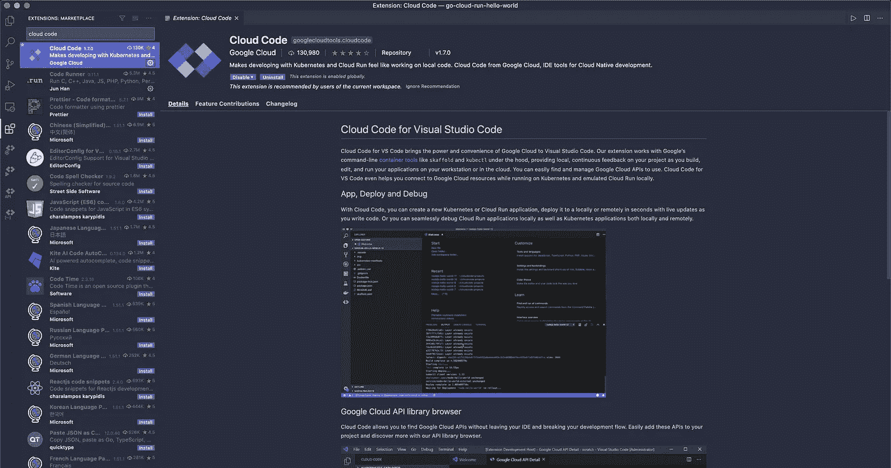

我使用 Google 提供的示例代码来部署一个用 Go on Cloud Run 编写的 Hello World。您可以从扩展欢迎页面或他们的[存储库](https://github.com/GoogleCloudPlatform/cloud-code-samples/tree/master/golang/go-cloud-run-hello-world)中获得示例。

既然我们在讨论代码云，我就不深入讨论 GCP 基础设施的细节了。但请记住，你需要一个谷歌云和云运行(run.googleapis.com)启用项目。

## 初始设置

安装云代码后，您将在左侧栏看到四个图标，分别代表 Kubernetes Explore、Cloud Run、Cloud APIs 和 Secret Manager。您可以隐藏不使用的文件。要开始，请访问云运行图标。

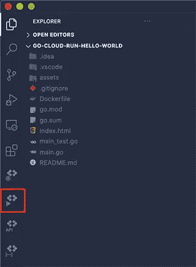

如果您还没有在 Cloud SDK 上验证您的 Google 帐户，它会要求您登录。点击邮件，它会在你的浏览器上打开一个标签，并按照那里的指示进行操作。

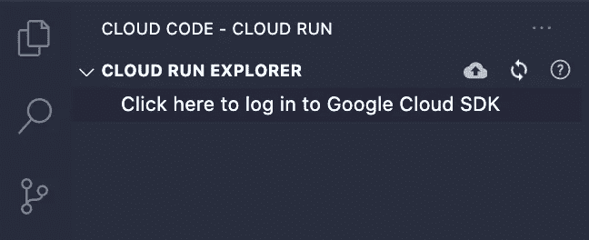

## 云运行模拟器

按`cmd + shift + P`搜索“云运行”，有以下选项:

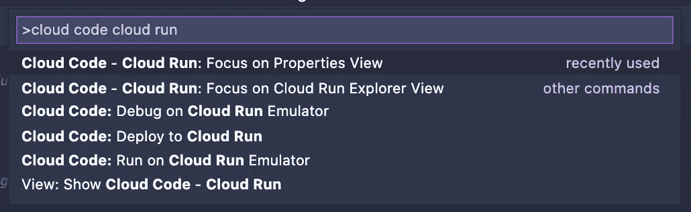

模拟器选项允许您在部署应用程序之前对其进行本地测试。在 VSCode 上打开示例项目或您自己的项目，并尝试使用`Run on Cloud Run Emulator`选项。

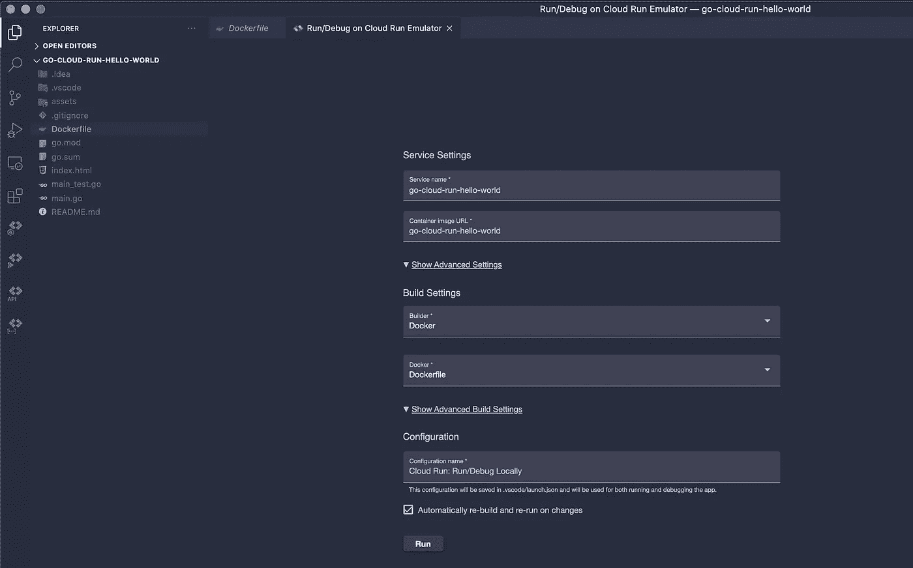

单击 run，Minikube 将运行您的容器并在您的机器上打开一个端口。Visual Studio 代码在`.vscode/`目录中创建一个`launch.json`文件，带有容器设置，相当于云运行设置。

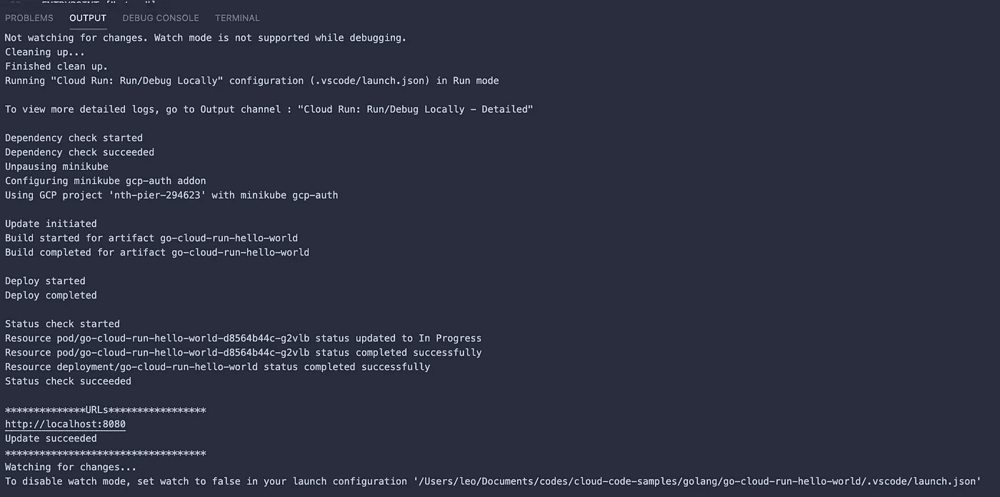

现在你可以在浏览器上访问`http://locahost:8080`并看到你的容器正在运行。

为了调试您的应用程序，在您的代码上放置一些断点并运行`Debug on Cloud Run Emulator`。

## 部署

要部署您的应用程序，运行`Deploy to Cloud Run`选项，它将打开容器设置，这与 web 控制台非常相似。

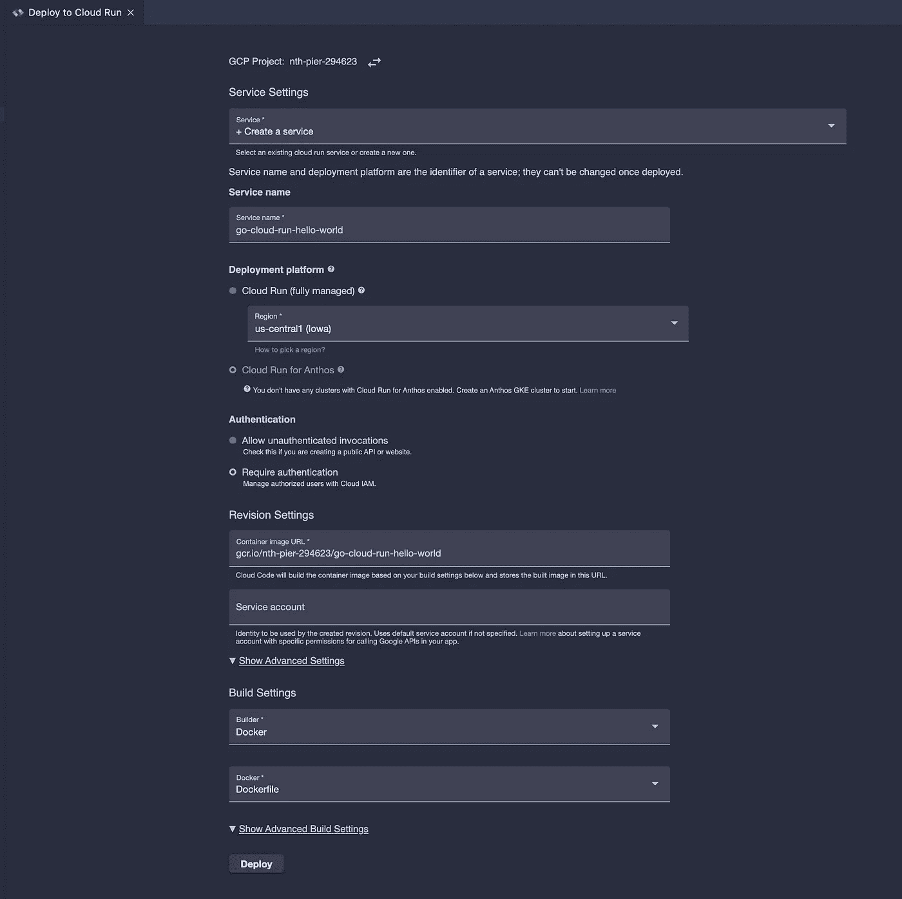

进行必要的更改并点击 deploy，您将在顶部看到一条消息，其中包含应用程序的链接:

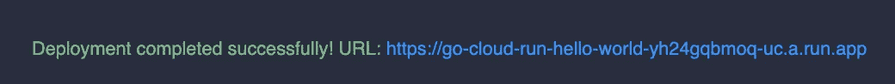

在您的浏览器中输入链接，您应该会看到您的应用程序启动并运行:

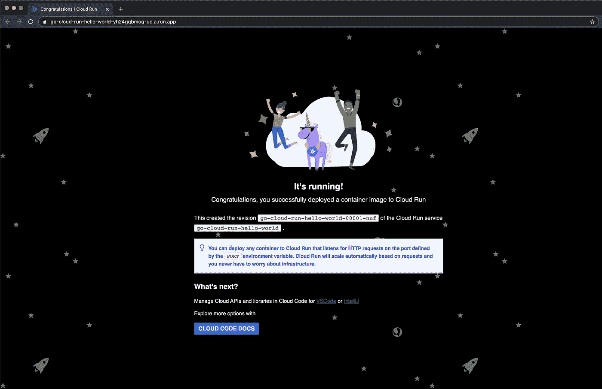

这样，您就有了从 IDE 部署到 Google Cloud 的无服务器容器。如果您检查 IDE 上的“云运行”选项卡，您将看到您的应用程序状态和一些相关信息。

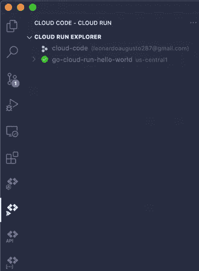

这就是使用云代码的日常工作流程的样子！