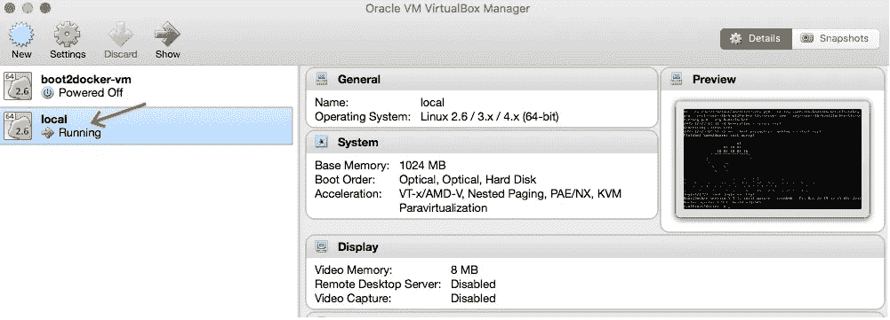
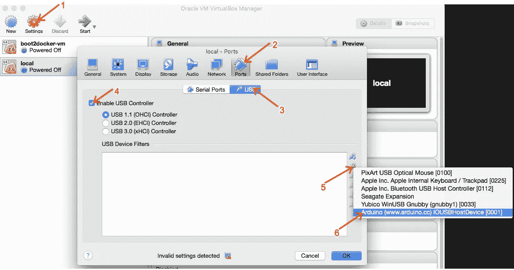
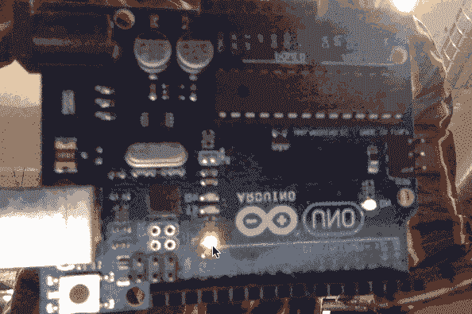

# 与 Docker 和 Johnny-Five 一起在 OS X 开发 Arduino

> 原文：<https://medium.com/google-cloud/developing-for-arduino-with-docker-and-johnny-five-on-osx-cc6813ae6e9d?source=collection_archive---------1----------------------->

我喜欢用 Arduino 做物联网项目的原型。有了 [Johnny-Five](http://johnny-five.io/) ，编写简单的 Node.js 应用程序变得如此容易，可以充分利用 Arduino 提供的一切！

我也喜欢使用 Docker。可复制的环境和构建使得共享代码变得非常简单。许多复杂的项目已经打包在 Docker 容器中，所以在您的 Johnny-Five 项目中使用它们变得容易多了！

不幸的是，让他们在 OS X 或 Windows 上玩得好可能有点痛苦。由于额外的 VM 层，您需要执行一些额外的步骤。

[首先，如果你正在云上运行 Docker Machine，就此打住。](/google-cloud/my-slow-internet-vs-docker-7678ae1cae72#.qyycofcli)这样不行，因为云 VM 无法访问你的本地 USB 设备。你需要使用 boot2docker 或 docker 机器与 VirtualBox 主机。我正在使用 Docker 机器。

# 第一步:

[安装对接机](https://docs.docker.com/machine/install-machine/)

[安装 VirtualBox](https://www.virtualbox.org/wiki/Downloads)

# 第二步:

创建本地 docker-machine 虚拟机

```
$ docker-machine create local -d virtualbox
```

# 第三步:

停止您的 Docker 虚拟机

```
$ docker-machine stop local
```

现在，打开 VirtualBox



前往“设置”并安装 Arduino



现在启动你的 Docker 虚拟机

```
$ docker-machine start local
$ eval "$(docker-machine env local)"
```

# 第四步:

此时，您应该能够将 Arduino 与 Johnny-Five 和 Docker 配合使用

```
$ docker run -ti --privileged node /bin/bash
# mkdir test && cd test
# npm install johnny-five
# apt-get update && apt-get install -y vim
# vim test.js
```

现在是代码，标准的 Johnny-Five hello world

```
**var** five = require(“johnny-five”);
**var** board = **new** five.Board();
board.on(“ready”, **function**() { 
  **var** led = **new** five.Led(13); 
  led.blink(500); 
});
```

运行代码

```
# node test.js
```

如果一切正常，您应该会看到一个闪烁的灯！



厉害！现在去黑吧！