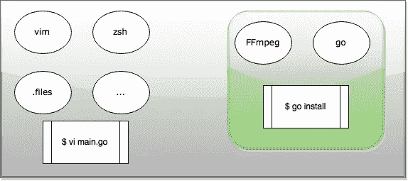

# 使用 Docker 轻松开发绑定

> 原文：<https://medium.com/google-cloud/developing-go-apps-that-depend-on-libraries-without-having-to-install-them-1172deefd171?source=collection_archive---------2----------------------->

## 避免在您的机器上安装依赖项

想象一下这种情况:你想为你最喜欢的语言编写 [FFmpeg](http://ffmpeg.org) 的绑定，当然你也想用你的笔记本电脑来这么做。

这些是步骤:

1.  在计算机上安装 FFmpeg

等等，你说什么？你不装东西吗？你的笔记本上唯一能运行的是 docker 容器？？杰西，是你吗？

好吧，让我再试一次:

1.  创建一个包含 FFmpeg 的 Docker 图像。
2.  添加你的开发工具，你的代码，你的点文件，和…

好吧，你不用这么使劲翻白眼，我懂了！
所以你想基本上在你的笔记本电脑上编辑你的代码…但是从容器中编译它？这可能吗？

嗯，是的，它是！

## 我的发展过程

剧透:我的解决方案很简单，但我对它的工作方式非常满意，所以我决定分享一下。最后，对于这个例子，我将使用 Go 作为我的编程语言(毕竟，我是一个 gopher ),但是你可以用任何你喜欢的语言做类似的事情。

首先，我基于官方 [golang](https://registry.hub.docker.com/_/golang/) Docker 镜像写了一个安装 FFmpeg 的 Docker 文件。

```
FROM golang# install FFmpeg
RUN apt-get update && apt-get install -y yasm pkg-config
RUN git clone [https://github.com/FFmpeg/FFmpeg.git](https://github.com/FFmpeg/FFmpeg.git)
RUN cd FFmpeg && ./configure && make && make install# this is the directory where the terminal will start
WORKDIR /go
CMD ["/bin/bash"]
```

太好了，让我们建立并运行它！

```
➜ docker build -t campoy/ffmpeg .
➜ docker run -it campoy/ffmpeg
```

是啊！我们现在有一个 bash 在一个安装了 go 和 FFmpeg 的容器中运行！

```
# go version
go version go1.4.2 linux/amd64# ffmpeg -version
ffmpeg version N-74181-gc1bfb99 Copyright (c) 2000–2015 the FFmpeg developers
...
```

但是我们的代码在哪里？我们可以在 docker 文件中添加一行来添加我们需要的所有代码，但是每次更改代码时，我们都应该重新构建容器。我们能做得更好吗？

## 码头卷 FTW

这是很酷的事情发生的地方。我们可以在运行容器时添加代码，而不是使用 Docker 卷来构建。

```
➜ docker run -it -v $GOPATH:/go/src campoy/ffmpeg
```

现在，如果我们从您的主机对映射目录中的任何文件进行更改，容器将立即看到这些更改，反之亦然。因此，我们可以在笔记本电脑上使用我们最喜欢的编辑器，并运行任何需要容器依赖项的工具。



您可以使用您的工具来编辑您喜欢的代码，并且您的依赖项保留在您可以运行 go install 的容器(绿色)中。

最棒的是，这将有助于人们为您的项目做出贡献！不需要解释如何安装你的项目可能有的所有不同的依赖项，只需将 docker 文件添加到你的 repo 中！

感谢您的阅读，请在此评论或在 [@francesc](http://twitter.com/francesc) 告诉我您的问题或意见。