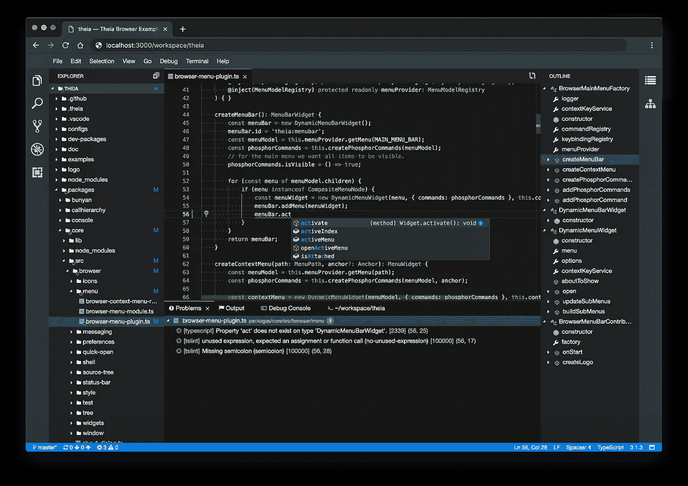
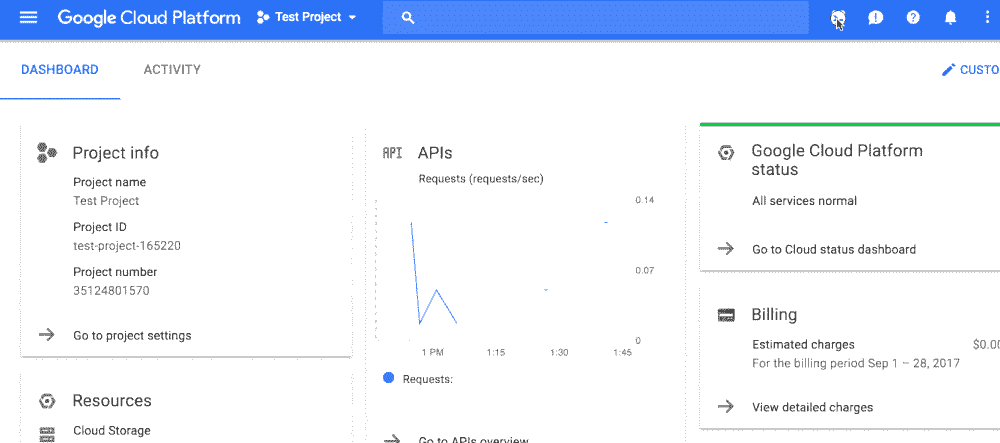
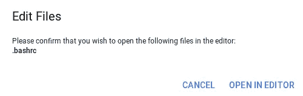
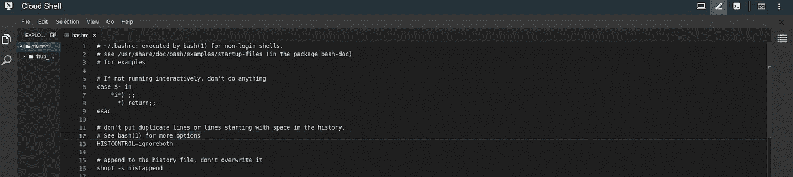
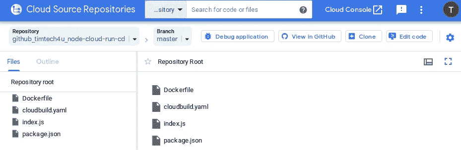
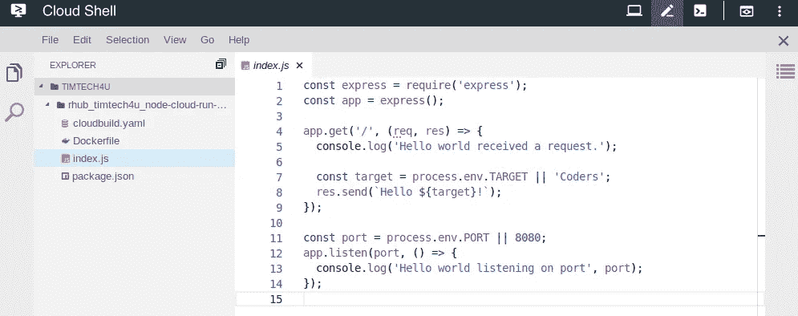
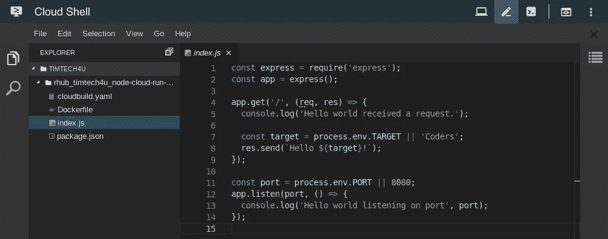
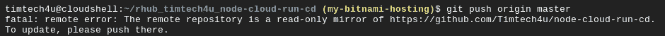

# 在 GCP 发展💻—云壳入门(编辑器)📝

> 原文：<https://medium.com/google-cloud/developing-on-gcp-getting-started-with-cloud-shell-editor-e074f2fa49d9?source=collection_archive---------1----------------------->



> *Google Cloud Shell 是一个面向 Google 云平台的交互式 Shell 环境。它使您可以轻松管理您的项目和资源，而不必在您的系统上安装 Google Cloud SDK 和其他工具。有了 Cloud Shell，Cloud SDK gcloud 命令行工具和其他你需要的实用工具在你需要的时候随时可用。*

Google Cloud Shell 提供了以下功能:

*   临时计算引擎虚拟机实例
*   从 web 浏览器对实例的命令行访问
*   **内置代码编辑器** — 5 GB 持久磁盘存储
*   预装谷歌云 SDK 等工具
*   语言支持 Java，Go，Python，Node.js，PHP，Ruby 和。网
*   Web 预览功能
*   访问 GCP 控制台项目和资源的内置授权
*   定制环境



# 谷歌云外壳内置编辑器

在本文中，我们将使用 Google Cloud Shell 内置编辑器来修改 Google Cloud Source Repository(CSR)上的源代码，如果您不熟悉 CSR，请查看我的文章— [*使用 Cloud Source Repository 管理源代码📁*](https://fullstackgcp.com/developing-on-gcp-getting-started-with-cloud-shell-editor-cjxcj7phn000w8bs1q450i4oi)

内置编辑器目前处于测试阶段，运行的是云桌面 IDE 平台[忒伊亚](https://github.com/theia-ide/theia)。作为一个常规的代码编辑器，它有很多特性。

您可以使用代码编辑器浏览文件目录以及查看和编辑文件，同时继续访问云外壳。默认情况下，每个云 Shell 实例都有代码编辑器。

# 修改文件

要使用编辑器轻松修改文件，您可以简单地*激活云外壳*并执行命令**云外壳编辑文件路径**，在我的例子中，我正在编辑 **~/。bashrc** 文件。

`cloudshell edit ~/.bashrc`

你会得到一个提示，确认你是否想在编辑器中打开，批准后，编辑器将与文件一起显示。



# 修改云源存储库(CSR)上的源

云壳编辑器允许我们轻松地修改 CSR 上的文件，为此，导航到您的[云源代码库](http://source.cloud.google.com)，并选择一个库。点击页面右上角*的**编辑代码***



您还可以继续执行 git 操作，并在 Shell 终端上运行常规的终端命令。

## 自定义编辑器

如果你想切换到黑暗主题，在菜单上，导航到**文件>设置>改变颜色主题**并选择*黑暗主题*



## 修改镜像存储库的源

如果您使用的是镜像的云资源存储库，那么当您尝试推送代码时，可能会出现这样的错误:



一个快速的解决方法是添加您正在镜像的存储库的远程 URL，在我的例子中，我正在镜像一个 GitHub 存储库，所以我将在我的 Shell 终端上运行以下命令:

```
git remote add github https://github.com/Timtech4u/node-cloud-run-cd git push github master
```

一旦完成，您就可以推进到您的主存储库。

**此外，谷歌云壳是免费的。🕺🕺**

*感谢通读！如果我错过了任何步骤，如果有些事情不太适合你，或者如果这个指南有帮助，请告诉我。*

*最初发表于*[*https://fullstackgcp.com*](https://fullstackgcp.com/developing-on-gcp-getting-started-with-cloud-shell-editor-cjxcj7phn000w8bs1q450i4oi)*。*