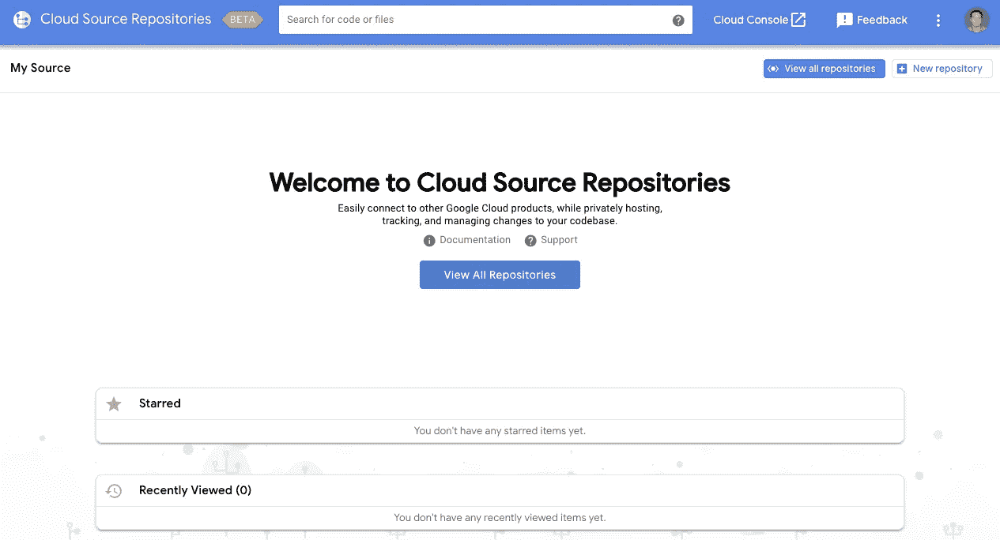
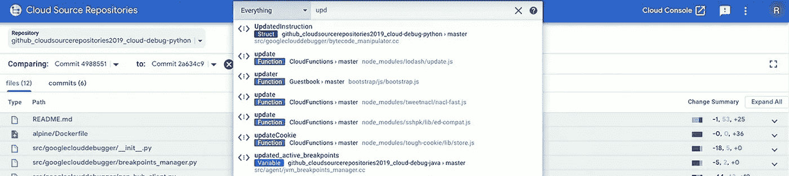
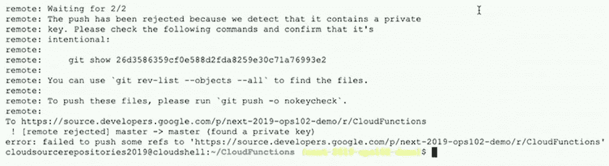
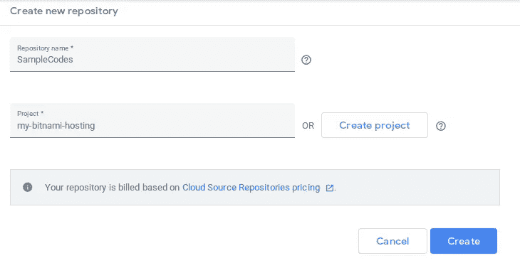
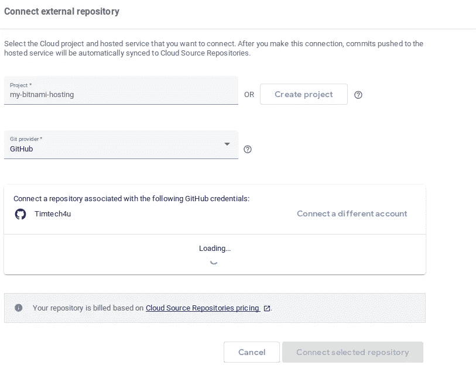

# 在 GCP 发展💻—使用云资源存储库管理源代码📁

> 原文：<https://medium.com/google-cloud/developing-on-gcp-managing-source-codes-with-cloud-source-repositories-a1c341200321?source=collection_archive---------1----------------------->



# 谷歌云资源仓库

> Google Cloud Source Repositories 是您的团队存储、管理和跟踪代码的单一场所。云源代码库允许开发人员在一个功能全面、可扩展的私有 Git 库上轻松协作并更安全地管理您的代码。它还可以通过连接其他 GCP 工具进行扩展，包括云构建、应用引擎、Stackdriver 和云发布/订阅。云源代码库支持跨您所有的库进行快速、有索引的强大代码搜索，以节省时间。

我们将重点关注在开发过程中使用 Google Cloud Source Repositories 来管理源代码，并探索它的一些有助于提高开发人员生产力的特性。

# 使用谷歌云资源仓库的好处

## 无限的私有 Git 存储库

获得免费的无限私有库，以最适合你的方式组织你的代码。从 GitHub 或 Bitbucket 存储库中镜像代码，以获得强大的代码搜索、代码浏览和诊断功能。云资源仓库允许开发者为每个谷歌云平台项目创建多达 1000 个仓库。

## 与 GCP 服务集成

通过内置集成获得关于代码更改的快速反馈，以实现持续集成。当您向云源存储库推送更改时，您可以轻松地设置触发器来使用 Cloud Build 自动构建和测试。

## 快速代码搜索

使用强大的正则表达式搜索多个目录。您可以使用正则表达式来细化您的搜索，或者在项目、文件和代码库中执行单一的目标搜索。云资源存储库使用与 Google Search 相同的搜索技术，但是优化了索引算法。



## 源浏览器

使用源代码浏览器从云源代码库中查看存储库文件。过滤您的视图以关注特定的分支、标记或提交。

## 跨托管存储库自动同步

将云源存储库连接到 GitHub 或 Bitbucket 上的托管存储库。当更改被推送到 GitHub 或 Bitbucket 时，自动将更改同步到云源存储库。

## Git 操作

基本上，你可以使用所有的 Git 操作，例如推、拉、克隆和日志，以及执行你的工作流所需的其他 Git 操作。

## 可靠的可靠性

在地理上分布在多个数据中心的系统上管理您的代码，并在 Google 的基础设施上以高可用性运行。

## 安全性和调试

云源存储库启用了推送阻止功能，该功能检查您提交的秘密凭证，并可以阻止您推送此类凭证的详细信息。此外，Stackdriver debugger 允许您在云源代码库中[调试代码](https://cloud.google.com/debugger/docs/source-options)。



# 在云源存储库上设置新的存储库

您可以使用 Google Cloud Source Repositories 创建一个新的空存储库。

在您的[云资源存储库](https://source.cloud.google.com/repos)仪表板上，执行以下步骤:

*   点击*添加资源库*
*   选择*创建新库*和*继续*
*   输入*库名*并选择它所属的*项目*。



或者，您可以使用 cloud 命令创建一个新的存储库:

```
gcloud source repos create SampleCodes
```

# 镜像存储库

在本文发表时，云资源存储库支持 GitHub 和 Bitbucket 存储库。通过启用镜像，推送到 GitHub/Bitbucket 存储库的提交被复制或镜像到云资源存储库中托管的存储库中。

要镜像存储库，在您的[云资源存储库](https://source.cloud.google.com/repos)仪表板上，执行以下步骤:

*   点击*添加存储库*
*   选择*连接外部储存库*和*继续*
*   选择拥有存储库的*项目*、镜像的 *Git 提供者*、*授权*和*连接*
*   选择一个存储库并点击*连接选择的存储库*



# 克隆存储库

您必须在您的环境中设置身份验证，然后才能从您的系统访问任何托管存储库。云源存储库支持以下类型的身份验证:

你可以在这里阅读关于认证技术[的更多信息](https://cloud.google.com/source-repositories/docs/authentication)

使用此处[描述的步骤](https://cloud.google.com/sdk/install)下载并设置 **Google Cloud SDK**

完成后，您可以使用以下工具简单地克隆一个云资源存储库:

```
gcloud source repos clone SourceCodes --project=my-project
```

其中 **SourceCodes** 是存储库名称，而 **my-project** 是项目 ID。

如果你想坚持使用谷歌云平台来修改你在云资源仓库上的源代码，看看我的文章— [**云外壳入门(编辑器)📝**](https://fullstackgcp.com/developing-on-gcp-getting-started-with-cloud-shell-editor-cjxcj7phn000w8bs1q450i4oi)

*感谢通读！如果我错过了任何步骤，如果有些事情不太适合你，或者如果这个指南有帮助，请告诉我。*

*最初发表于*[*【https://fullstackgcp.com】*](https://fullstackgcp.com/developing-on-gcp-managing-source-codes-with-cloud-source-repositories-cjxhtj8b000251hs14zd58nil)*。*