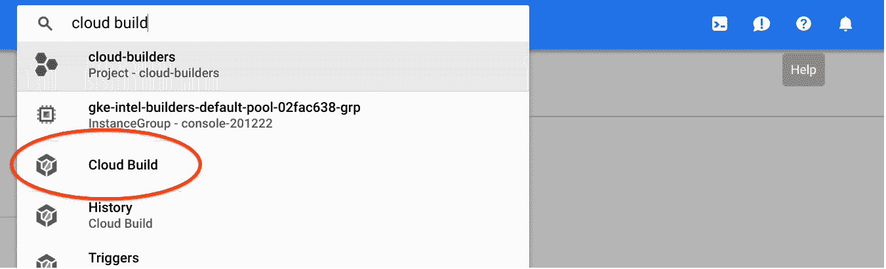
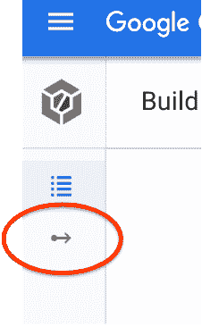
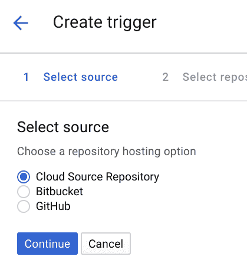
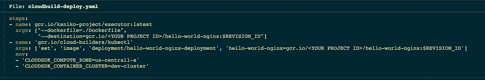

# 正确使用容器进行开发

> 原文：<https://medium.com/google-cloud/developing-with-containers-done-right-831a4bae1d28?source=collection_archive---------0----------------------->


建造和运输。建造和运输。冲洗并重复。

这篇文章的目标是为开发人员和开发团队建立一个无缝的、非侵入性的工作流程，通过 GKE 来使用 Kubernetes。该工作流最终将以一种安全的、最低特权的格式，不加修改地集成到一组不可信和可信环境中。唯一的补充是，开发人员可能不会自己直接提供集群，尽管这取决于组织和如何建立信任。以下是我们将构建的内容:


注意，如果愿意的话，完全可以利用外部 Git 存储库(例如 GitHub)来代替云源代码存储库。Google Cloud Build 可以直接从 GitHub、Google Source Repository(基于 git)或 BitBucket 获取。

这篇文章假设你已经安装了 gcloud，并且有一个 GCP 项目。由于这是一次性安装，我强烈推荐使用 Google Cloud Shell，因为它已经预装和配置好了一切。一旦您浏览完本指南，您就可以留在本地。如果您没有 gcloud 或 GCP 项目来尝试这一点，请查看以下内容:

*   安装 gcloud(很简单):https://cloud.google.com/sdk/docs/downloads-interactive
*   谷歌云免费层(无附加条件):【https://tinyurl.com/ycsln48r 

让我们开始吧。调配 GKE 群集(这将花费 3 分钟或更少的时间！):

```
gcloud container clusters create dev-cluster --zone=us-central1-a
```

检索群集凭据:

```
gcloud container clusters get-credentials dev-cluster --zone=us-central1-a
```

由于 Google Cloud 热衷于最小特权和安全性，我们需要给予云构建许可来部署到我们的集群:

```
PROJECT="$(gcloud projects describe \
    $(gcloud config get-value core/project -q) --format='get(projectNumber)')"gcloud projects add-iam-policy-binding $PROJECT --member=serviceAccount:$PROJECT@cloudbuild.gserviceaccount.com --role=roles/container.developer
```

现在让我们来看看示例 repo，它包含一个基本的 web 应用程序、一些 Kubernetes 部署清单和一个 cloudbuild.yaml 文件，该文件允许我们利用 Google Cloud Build 进行自动构建，并通过简单的 Git 推送部署到 Kubernetes 集群中:

```
git clone [https://github.com/tariq-islam/hello-world-nginx](https://github.com/tariq-islam/hello-world-nginx) -b devflowcd hello-world-nginx
```

在我们开始迭代开发之前，我们需要在集群中快速实例化我们的初始部署，以便将来的部署有所参考，我们有一个一致的终点，这样我们就不必担心以后的事情:

```
kubectl apply -f .
```

现在让我们把这些代码放到 Google Source Repository (GSR)中，这是一个托管在 GCP 的 git repo。如果你想使用你已经拥有的另一个代码树，或者将这个代码树复制到你的 GitHub 中，你也可以使用 GitHub 源代码库。对于这些说明，我们假设是 GSR。通过运行以下命令开始:

```
gcloud source repos create hello-world-nginx
```

现在，让我们对新创建的 GSR repo 进行身份验证，并将我们的代码添加到:

```
git config --global credential.https://source.developers.google.com.helper gcloud.shgit remote add google [https://source.developers.google.com/p/<YOUR PROJECT ID>/r/hello-world-nginx](https://source.developers.google.com/p/certstudy-env/r/hello-world-nginx)git push --all google
```

如果您想使用不同的代码树，只需复制 cloudbuild.yaml 和 cloudbuild-deploy.yaml 文件，从现在开始，说明是类似的，只是不是在 GSR 中创建新的 repo，而是创建 Google Cloud Build 触发器，直接指向 GitHub repo，而不是我们现在要做的 GSR 中的 repo。

导航到 Google Cloud Build(并在提示时启用 API):



在“云构建”页面上，通过单击左侧导航栏上的图标导航至“触发器”页面:



选择“创建触发器”

在下一页选择“云源存储库”:



从下一页的列表中选择“hello-world-nginx”repo。

此时，为您的触发器提供以下信息:

1.  名字
2.  分支(保留默认通配符)
3.  选择“cloudbuild.yaml”
4.  指定“cloudbuild-deploy.yaml ”,因为我们希望构建我们的映像并将其部署到我们的 GKE 集群
5.  选择“创建触发器”

下面是 cloudbuild-deploy.yaml 文件，它将为您的触发器提供从源构建映像并将其部署到集群所需的信息:



请注意，有几个带尖括号的地方需要填写您的区域、项目名称和集群名称的信息。完成后，提交并推送您的更新，云构建应该会根据您的推送触发和部署。那是你的心流。按下按钮，几秒钟后您就可以开始部署了。这篇文章只是带你完成一次性设置，然后你可以设置它，忘记它，专注于你的代码，同时享受以容器为中心的开发的好处。

这个流程有十几种排列方式，这取决于你想在本地管理和定制多少，或者让谷歌云为你管理多少。这恰好是主要利用 Google Cloud 工具的最自动化和最直接的工作流。这里可以进行优化，比如构建缓存以加快构建速度，但这是一个很好的起点。

哦，如果你没有从 cloudconfig-deploy.yaml 定义中注意到，我们没有使用 docker 在 Cloud Build 中构建我们的容器。

我们用的是 Kaniko :) 。

致谢:

*   此处使用的代码回购原本是分叉自:【https://github.com/mattes/hello-world-nginx】T2