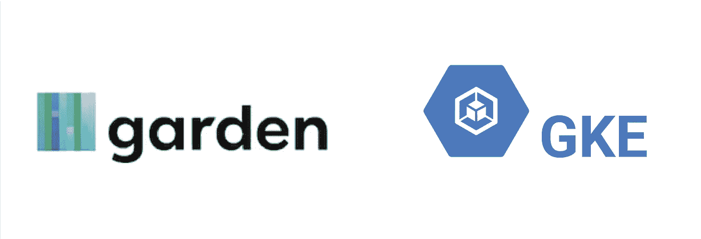
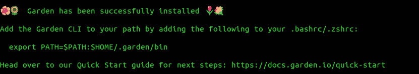
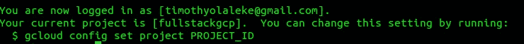
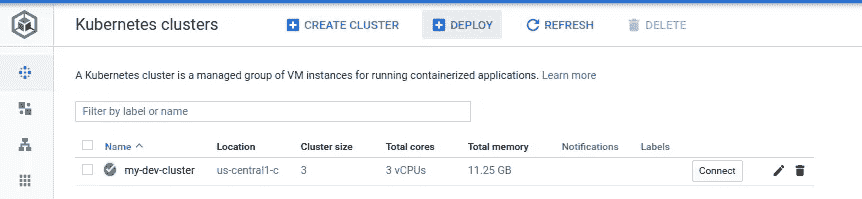
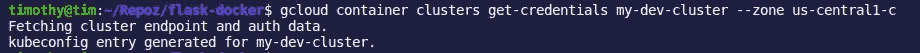
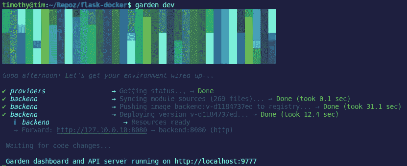
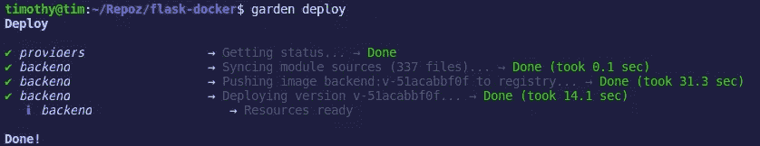

# 利用园区发展 GKE 产业集群

> 原文：<https://medium.com/google-cloud/development-to-production-on-gke-clusters-using-garden-989bdef1c890?source=collection_archive---------1----------------------->



> 在本文中，我们将使用 Garden 在远程 Google Kubernetes 引擎(GKE)集群上开发和部署应用程序。

> [Garden](https://garden.io) 是一款开发工具，它可以自动化您的工作流程，使开发、测试和部署 Kubernetes 应用程序比以往任何时候都更快、更容易。
> 
> [Google Kubernetes 引擎](https://cloud.google.com/kubernetes-engine/) (GKE)提供了一个托管环境，用于部署、管理和扩展运行在使用 Google 基础设施的 Kubernetes 集群上的容器化应用程序。

## 文章中的部分

*   [开始之前](#8939)
*   [园林特色](#5d6a)
*   [GKE 特色](#1eb0)
*   [花园设置](#1eb0)
*   [GKE 聚类器设置](#34b1)
*   [花园配置到远程 GKE 集群](#55ef)
*   [其他资源](#ce4d)

## 开始之前:

1.  创建一个[谷歌云平台(GCP) **项目**](https://console.cloud.google.com/project) ，或者使用一个现有的。
2.  确保你已经安装了 **gcloud** ，按照这里的[步骤](https://cloud.google.com/sdk)进行操作。
3.  如果还没有，请按照这里的步骤[安装 **kubectl** 。](https://kubernetes.io/docs/tasks/tools/install-kubectl/)
4.  从 [GitHub](https://github.com/Timtech4u/flask-docker) 克隆源代码。

# 园林特色

Garden 有这么多令人敬畏的特性，我将只列出几个，你可以点击[这里](https://github.com/garden-io/garden#features)了解更多。

*   像在本地一样快速地使用远程集群进行开发和迭代，并与您的团队共享开发集群。使用远程集群，您甚至可以在没有安装 Kubernetes 或 Docker 的情况下运行 Garden！
*   对于支持就地重载的服务，热重载允许您在容器运行时近乎即时地更新容器中的代码和静态文件。
*   内置的 web dashboard 为您提供了一个完整的堆栈概览(还计划了更多的 UI 特性来进一步帮助开发)。
*   构建、测试和部署 Docker 容器、舵图、OpenFaaS 函数等等。

# GKE 特色

谷歌 Kubernetes 引擎为开发者、操作者和系统管理员提供了一些很棒的功能，你可以在这里得到详细信息。

*   [计算引擎实例的负载平衡](https://cloud.google.com/compute/docs/load-balancing-and-autoscaling)。
*   [节点池](https://cloud.google.com/kubernetes-engine/docs/node-pools)指定集群中的节点子集，以提供额外的灵活性。
*   [自动扩展集群的节点实例数量](https://cloud.google.com/kubernetes-engine/docs/cluster-autoscaler)。
*   [集群节点软件的自动升级](https://cloud.google.com/kubernetes-engine/docs/node-auto-upgrade)。
*   [节点自动修复](https://google.qwiklabs.com/focuses/Node%20auto-repair%5D(https://cloud.google.com/kubernetes-engine/docs/node-auto-repair)维护节点健康和可用性。
*   [使用 Stackdriver 对集群进行日志记录和监控](https://cloud.google.com/kubernetes-engine/docs/how-to/logging)。

# 花园设置

要在本地安装 Garden，请运行以下命令:

```
curl -sL https://get.garden.io/install.sh | bash
```



如果您将使用本地 kubernetes 集群，您将需要安装 [Docker](https://docs.docker.com/) 和 [Kubernetes](https://docs.garden.io/guides/local-kubernetes) 。

# GKE 集群设置

确保您已经创建了一个 GCP 项目。如果你是第一次使用 GCP，你可以免费获得 300 美元的信用来探索谷歌云产品[这里](https://cloud.google.com/free/)。

使用下面的命令登录到 gcloud，这将打开一个浏览器窗口供您登录。您也可以在登录后设置一个默认项目。

```
gcloud auth login
```



*要设置 GKE 集群，* [*单击此处*](https://console.cloud.google.com/kubernetes/add) *或在 GCP 控制台上导航如下:* ***Kubernetes 引擎>集群>创建集群***

我将创建一个名为 **my-dev-cluster** 的集群，您可以随意使用其他配置选项。

或者，您可以使用下面的 gcloud 命令创建集群:

```
gcloud container clusters create my-dev-cluster
```



找到创建的集群[这里](https://console.cloud.google.com/kubernetes/list)，点击**连接**并复制命令。
这将有助于您获得认证凭证，从而配置 ku ectl 并允许您管理集群，同时确保您的终端安装了[**ku ectl**](https://kubernetes.io/docs/tasks/tools/install-kubectl/)和 [**gcloud**](https://cloud.google.com/sdk) 。以下是我自己的连接命令:

```
gcloud container clusters get-credentials my-dev-cluster --zone us-central1-c
```



*Garden 最强大的特性之一是能够在您的 Kubernetes 开发集群中构建映像，请确保您的集群具有指定的* [*这里*](https://docs.garden.io/guides/in-cluster-building#requirements) *的最低要求。*

# 远程 GKE 集群的花园配置

使用 Garden 的第一步是创建一个项目。您可以使用`garden create project` helper 命令，或者在项目的根目录中手动创建一个`garden.yml`文件。

花园通过`garden.yml`配置文件进行配置。[项目范围的](/guides/configuration-files#project-configuration) `garden.yml`文件应该位于项目的 Git 存储库的顶层目录中。

我们将在同一个配置文件中使用多个模块，这可以通过在模块定义之间使用文档分隔符(`---`)来实现。
点击了解更多关于花园配置文件[的信息。](https://docs.garden.io/guides/configuration-files)

以下是我的花园配置文件，你可以在 GitHub gist [这里](https://gist.github.com/Timtech4u/cd609a696f56a5df949c6e86370f6a91)找到。

*将****gke _ fullstackgcp _ us-central 1-c _ my-cluster****更改为集群的上下文名称。要得到你的，执行命令:*T5

该配置针对一个简单的容器模块。我们假设 Dockerfile 文件和源文件与`garden.yml`文件在同一个目录中。

一个模块可以对应一个 Docker 文件及其相关代码、一个远程 Docker 映像、一个 Helm chart、一个 OpenFaaS 函数等等，所有这些都取决于模块类型。

Garden 包含一个`container`模块类型，它提供了基于容器的服务的高级抽象，易于理解和使用。点击了解更多关于花园容器模块[的信息。](https://docs.garden.io/guides/container-modules)

一旦您确保您有一个 ***Dockefile*** 和您的 ***garden.yml*** 配置，该配置使用它的上下文名称连接到您的 GKE 集群。
您需要初始化集群范围的系统服务，在部署到该集群之前，通过执行以下命令来完成:

```
**garden --env=dev plugins kubernetes cluster-init**
```

现在，您可以在 GKE 集群上开始迭代开发，它会观察您的项目的变化，然后使用以下命令进行重新构建和重新部署:

```
garden dev
```



这将为`backend`服务构建和部署 Docker 映像。当它运行时，您可以对项目中的任何文件进行更改，Garden 会自动触发重建和重新部署。当您重新加载转发的本地主机 url 时，这些更改将会反映出来。

要部署服务(如果需要，还会构建模块和依赖项)，请运行以下命令:

```
garden deploy
```



*要了解更多关于 Garden CLI 命令和使用信息，请点击* [*此处*](https://docs.garden.io/reference/commands) *。*

> “使用 Garden，您可以完全摆脱本地 Kubernetes 集群，并在编写代码时享受快速反馈。”—乔恩·埃德瓦尔德

感谢阅读，请务必*在 [GitHub](https://github.com/garden-io/garden) 上给花园一颗星*。

## 其他资源

*   [花园文件](https://docs.garden.io/)
*   [谷歌 Kubernetes 引擎文档](https://cloud.google.com/kubernetes-engine#documentation)
*   [Google Kubernetes 引擎介绍](https://fullstackgcp.com/kubernetes-on-gke-series-intro-5969ae700e99) (FullStackGCP 博客)
*   [你的笔记本电脑上不需要 Kubernetes](/garden-io/you-dont-need-kubernetes-on-your-laptop-37653cbb28c9)(中型文章)
*   [GKE &云 SQL:一步一步的指导](/garden-io/gke-and-cloud-sql-a-complete-workflow-with-garden-and-terraform-1cad091e2be2)