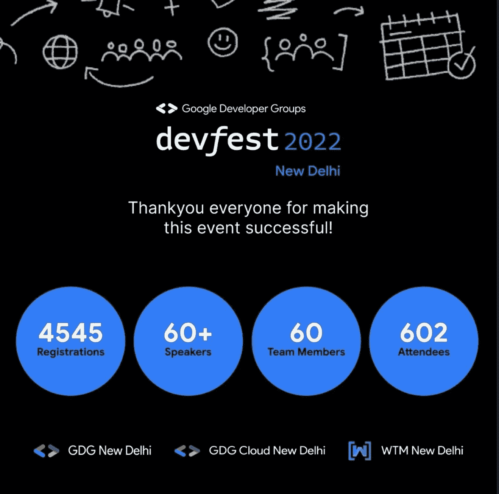
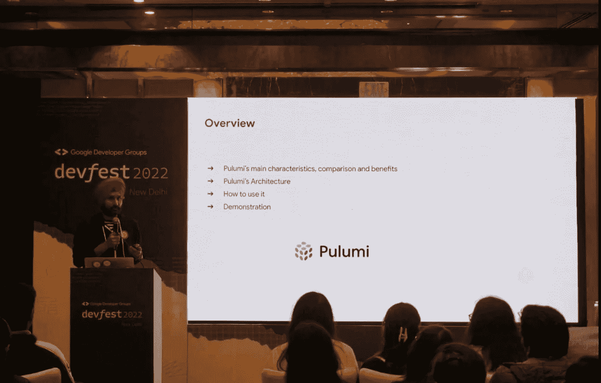
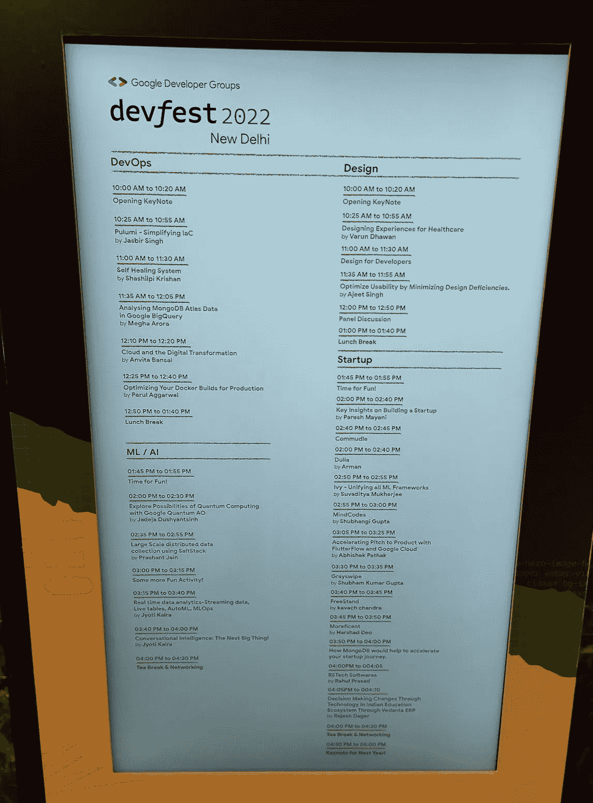
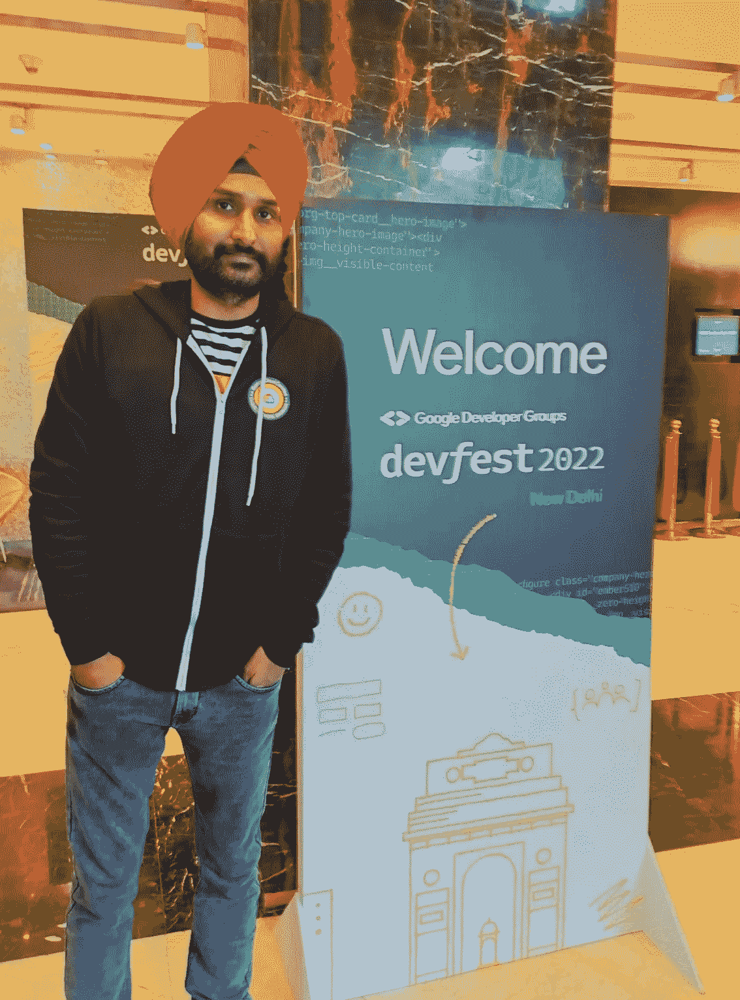
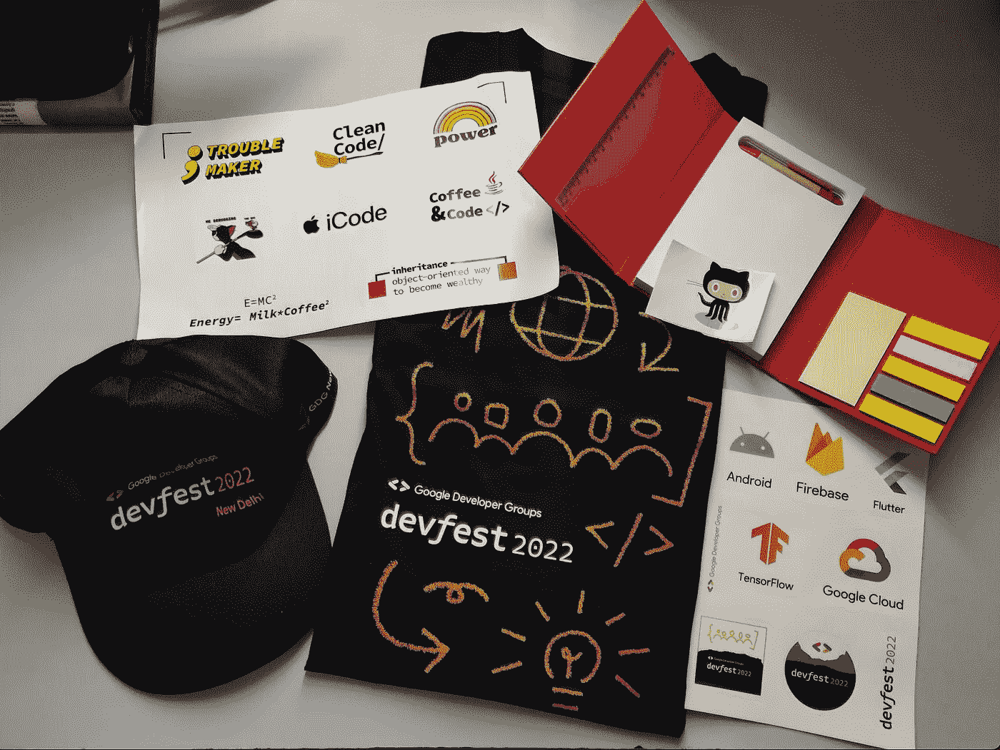

# DevFest 2022 德里体验

> 原文：<https://medium.com/google-cloud/devfest-2022-delhi-experience-4cf4043e6e5e?source=collection_archive---------3----------------------->

在 covid 之前，我曾作为与会者参加过 2019 年的 DevFest，但今年，我有机会参加 12 月 3 日在德里举行的 DevFest，担任演讲人。今年 DevFest 的举办地点是德里机场丽笙酒店。在今年的 DevFest 上，来自 NCR 德里的开发者和技术爱好者人数众多。大约有 4545 人注册，60 多名演讲者，602 名与会者和一个由 60 名志愿者组成的强大团队。

# 什么是 DevFest？

DevFests 是由谷歌开发者团队(GDG)每年在全球举办的社区主导的开发者活动。gdg 专注于社区建设和学习谷歌的技术，这些技术可能涵盖多个产品，如 Android、Firebase、谷歌云平台、谷歌助手、AI、Flutter、TensorFlow 机器学习和移动 web。活动可能包括演讲者会议、黑客马拉松、codelabs、学习 jams 和与科技公司演讲者的培训。

# 德里电影节

今年，当 GDG 德里需要演讲者的时候，我申请了关于 Pulumi 的演讲——通过 Commudle link 以代码为中心的 IaC 方法。

[https://www.commudle.com/fill-form/1533](https://www.commudle.com/fill-form/1533)

我认为 Pulumi 将是一个有趣的话题，可以与活跃的 DevFest 德里开发者社区分享。Pulumi 是一个通用的基础设施代码平台，允许您使用熟悉的编程语言和工具来构建、部署和管理云基础设施。

Pulumi 是免费的，[开源](https://github.com/pulumi/pulumi)，并且可选地与 [Pulumi 服务](https://www.pulumi.com/docs/intro/pulumi-service/)配对，以使管理基础设施变得安全、可靠、省事。Pulumi 的主要目标是开发人员/程序员，他们希望利用他们已经使用的编程语言为 IaC 构建应用程序。

有多个主题，如移动、Web、ML/AI、设计、DevOps、初创公司，在每个主题下，都有多个演讲者被邀请参加各自的演讲。我的演讲被 DevOps track 选中，我对这个消息感到非常高兴和满意，因为我迫不及待地想看到德里/NCR 的 600 多名开发者和学生。我一直想作为一名演讲者参加这次活动，这是我的机会，与社区分享我的知识，并回馈社区，从那里我学到了很多东西，并帮助我更好地塑造我的职业生涯。

我能够在 GDG 德里活跃的开发者社区中产生很大的兴趣，探索 Pulumi 并在他们各自的项目中利用它作为 IaC 的素材。这个演讲很受欢迎，我接触到了业内的开发人员或开发者，以及 NCR 的许多工程专业学生，他们都渴望了解更多关于 Pulumi 的知识。在 Devops 轨道上还有其他一些很好的讨论，比如在 Google BigQuery 中分析 MongoDB 亚多拉斯数据，以及为生产优化 Docker 构建。我个人很喜欢 MakeMyTrip 总监关于自我修复系统的演讲，他们如何利用 StackStorm，这是一个跨 MakeMyTrip 服务和工具的集成和自动化平台。

# DevFest 会谈

这些讲座主要由在德里/NCR 的组织中工作的演讲者进行，他们就各自的专业主题发表了自己独特的见解。这项活动的安排适合每一个参加的人。主题范围从初级、中级到其他，适合所有人，我真的认为这很酷。

活动以组织者的结束语和观众的一些反馈结束。

**dev fest 上展示的幻灯片:**[https://docs . Google . com/presentation/d/1 qrm 5 hzw 45 jtebufjxzhxmecsyrnmdw 2 cn 8j 1 ryholhw/edit # slide = id . g 19 a 4 f 8 F8 f 75 _ 0 _ 6](https://docs.google.com/presentation/d/1QRm5HZw45JteBUFJxZHxMeCSYRnmDW2Cn8J1rYhOLhw/edit#slide=id.g19a4f8f8f75_0_6)

https://github.com/jasbir84/GDGDevFest2022-DelhiGitHub 回购

****GitHub 回购(GCP 普鲁米的例子):**[https://github.com/pulumi/examples/](https://github.com/pulumi/examples/)**

# **结论**

**我有机会建立关系网，并最终在午休和集体合影期间看到了我通常在 linkedin、社交媒体网站(Twitter/脸书)和其他开发平台上看到的人们的面孔。我将鼓励技术社区的个人来参加这样的活动，因为你可以从行业专家那里学到很多东西，这是一个与志同道合的人交流的好平台。**

**分享我在活动中的照片，以及我作为活动发言人之一得到的一些很酷的照片:)**

********