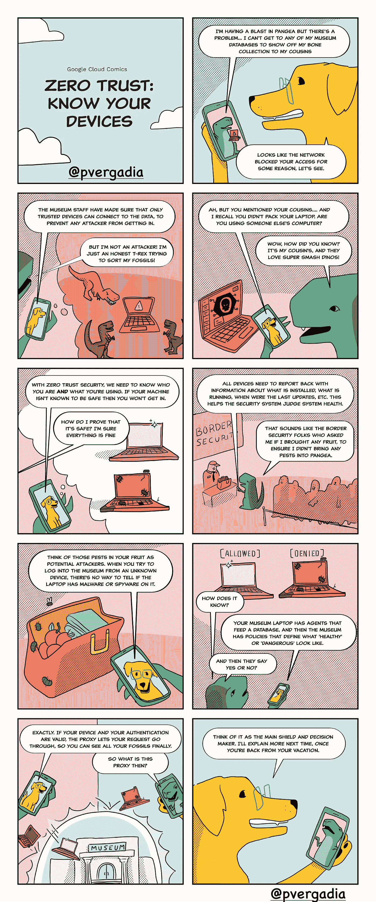

# 设备和零信任安全

> 原文：<https://medium.com/google-cloud/devices-and-zero-trust-security-21864ceb0a96?source=collection_archive---------2----------------------->

## GCP 漫画#7 设备安全

在零信任环境中，每台设备都必须赢得信任才能获得访问权限。在确定是否应授予访问权限时，安全系统依赖于设备元数据，如正在运行的软件或操作系统上次更新的时间，并检查设备是否符合该组织的最低健康标准。

把它想象成你的体温:低于 100 度，你是安全的，但是过去，你现在处于发烧的医学领域，你可能不被允许进入某些场所。

> **零信任依赖于你是世卫组织和你使用什么来确定访问权限**

在本期 [GCP 漫画](https://gcpcomics.com/)中，我们关注设备，以及它们如何在零信任环境中发挥作用。

设备数据可以采取多种形式，并且可以来自多种来源。我们建议从多个系统中收集多种类型的数据，并使用这些数据做出明智的决策，确定哪些设备可以访问您的重要系统。

## 这些数据类型是什么？

*   操作系统版本:帮助您限制对旧的、不受支持的版本的访问
*   补丁日期:找出是否存在未打补丁的漏洞
*   上次签入日期:了解该计算机“离线”多长时间
*   安装二进制文件:查看是否有任何已知的恶意软件或危险的可执行文件
*   最近运行的可执行文件:查看是否有可疑的东西仍在运行
*   磁盘加密:查看设备是否符合数据保护策略
*   位置数据:将某些工具的访问权限限制在特定的城市、州或国家
*   最近登录的用户:查看其他人是否可能共享此设备

你能在哪里收集数据？有许多来源，包括:

*   DNS 服务器
*   DHCP 服务器
*   本地代理
*   移动设备管理解决方案
*   特定于操作系统的管理工具

有关此主题的更多信息，请查看以下资源:

*   [OSQuery](https://osquery.io/) —开源端点可见性
*   [端点验证](https://cloud.google.com/endpoint-verification/docs/overview) —谷歌云库存管理
*   [BeyondCorp:打造一支健康的舰队](https://research.google/pubs/pub47356/)
*   [BeyondCorp:从设计到部署在谷歌](https://research.google/pubs/pub44860/)

想要更多的 GCP 漫画吗？访问[gcpcomics.com](https://gcpcomics.com/)，请务必在推特上关注我们，网址为 [@pvergadia](https://twitter.com/pvergadia) 和 [@maxsaltonstall](https://twitter.com/maxsaltonstall) ，这样你就不会错过下一期了！