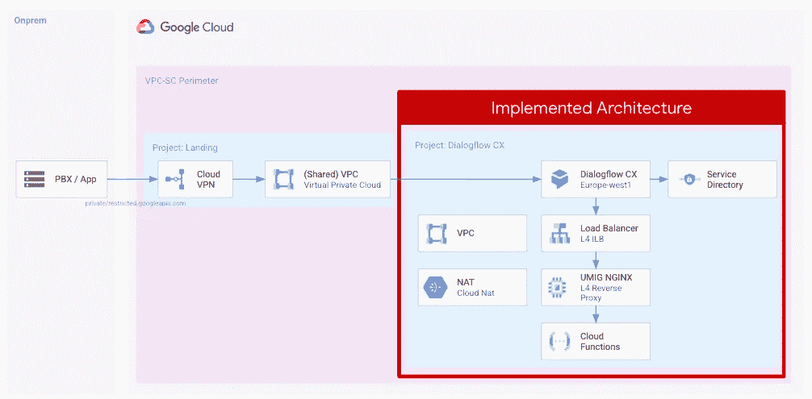

# Dialogflow CX 云函数 Webhook 与 VPC-SC

> 原文：<https://medium.com/google-cloud/dialogflow-cx-cloud-function-webhook-with-vpc-sc-6eaef97cb908?source=collection_archive---------0----------------------->

Dialogflow CX 是一个很棒的服务，可以让你创建文本和语音代理。如果您在生产环境中运行您的代理，您可能希望在组件之间使用[私有](https://en.wikipedia.org/wiki/Private_network)通信来运行它，而不通过互联网进行通信。

Dialogflow CX 支持与 Webhooks 的私人通信。它与[服务目录私有网络访问](https://cloud.google.com/service-directory/docs/private-network-access-overview)集成，因此它可以连接到您的 VPC 网络内部的 webhook 目标。这将流量保持在谷歌云网络内，并实施 [IAM](https://cloud.google.com/iam/docs/overview) 和 [VPC 服务控制](https://cloud.google.com/vpc-service-controls/docs/overview)。

截至今天，当 VPC 服务控制边界或在服务目录中使用时，当前不支持使用 Dialogflow webhooks 的云功能。你需要一个更清晰的架构来让它工作。

在下面的架构中，您可以找到让您的 Dialogflow CX 代理无需通过互联网即可与云功能 Webhook 通信所需的目标架构。



对话流 CX 实现的架构。

为了设计解决方案，我们必须考虑到目前服务目录专用网络访问仅支持 GCE 实例、TCP 内部负载平衡器(ILB)和 GKE 端点。

可以实施不同的解决方案，我们决定采用上述架构，依靠 Dialogflow CX 和云功能之间的自动身份验证，避免创建自签名证书。

在我们将要实现的体系结构中，请求如下:

*   Dialogflow 从服务目录中检索要使用的内部负载平衡和 VPC 网络的 IP 地址
*   Dialogflow 将连接到 VPC 网络并到达 TCP ILB
*   ILB 将请求转发到后端:我们将实现的架构中的 GCE 实例
*   在 GCE 实例中，我们将配置一个 NGINX TCP 反向代理，将所有请求转发给云功能
*   云函数将对 Dialogflow 服务帐户进行身份验证，并完成请求

让我们开始配置所有需要的资源。

# 先决条件

与开单关联的 GCP 项目，您在该项目中具有责任人职责。
打开云外壳，准备创建您的基础设施！

# 设置环境变量

让我们开始创建一些变量，以便更容易地使用该命令。请更新变量以匹配您的配置。

```
export BACKEND_PORT=443
export GCE_INSTANCE=webhook
export ILB_IP=10.10.20.99
export INSTANCE_GROUP=webhook
export NETWORK=net
export PROJECT_ID=$(gcloud info --format='value(config.project)')export PROJECT_NUMBER=$(gcloud projects describe $PROJECT_ID --format=json | jq -r '.projectNumber')
export REGION=europe-west1
export SUBNET_LB=lb-subnet
export SUBNET=europe-subnet
export SD_URL=projects/$PROJECT_ID/locations/$REGION/namespaces/df-namespace/services/df-service
export ZONE=$REGION-b
export FUNCTIONS_URL=$REGION-$PROJECT_ID.cloudfunctions.net
```

# 启用服务和服务身份服务帐户和角色

```
gcloud services enable \
  compute.googleapis.com \
  cloudbuild.googleapis.com \
  cloudfunctions.googleapis.com \
  dialogflow.googleapis.com \
  logging.googleapis.com \
  pubsub.googleapis.com \
  servicedirectory.googleapis.comgcloud beta services identity create --service=dialogflow.googleapis.comgcloud projects add-iam-policy-binding $PROJECT_ID \
--member=serviceAccount:[service-$PROJECT_NUMBER@gcp-sa-dialogflow.iam.gserviceaccount.com](mailto:service-$PROJECT_NUMBER@gcp-sa-dialogflow.iam.gserviceaccount.com) \
--role=roles/servicedirectory.viewergcloud projects add-iam-policy-binding $PROJECT_ID \
--member=serviceAccount:[service-$PROJECT_NUMBER@gcp-sa-dialogflow.iam.gserviceaccount.com](mailto:service-$PROJECT_NUMBER@gcp-sa-dialogflow.iam.gserviceaccount.com) \
--role=roles/servicedirectory.pscAuthorizedService
```

# 配置网络

```
gcloud compute networks create $NETWORK \
  --project=${PROJECT_ID} \
  --subnet-mode=customgcloud compute networks subnets create $SUBNET_LB \
  --project=${PROJECT_ID} \
  --range=10.10.10.0/24 \
  --network=$NETWORK \
  --region=$REGION \
  --enable-private-ip-google-accessgcloud compute networks subnets create $SUBNET \
  --project=${PROJECT_ID} \
  --network=$NETWORK \
  --region=$REGION \
  --enable-private-ip-google-access \
  --range=10.10.20.0/24gcloud compute firewall-rules create allow \
  --network $NETWORK \
  --allow tcp:22,tcp:3389,icmpgcloud compute firewall-rules create allow-ssh-ingress-from-iap \
  --network=$NETWORK \
  --direction=INGRESS \
  --action=allow \
  --rules=tcp:22 \
  --source-ranges=35.235.240.0/20gcloud compute firewall-rules create allow-lb-access \
  --project=${PROJECT_ID} \
  --direction=INGRESS \
  --priority=1000 \
  --network=$NETWORK \
  --action=ALLOW \
  --rules=tcp,udp,icmp \
  --source-ranges=10.10.10.0/24,10.10.20.0/24gcloud compute firewall-rules create allow-health-check \
  --direction=INGRESS \
  --priority=1000 \
  --network=$NETWORK \
  --action=ALLOW \
  --rules=tcp,udp,icmp \
  --source-ranges=130.211.0.0/22,35.191.0.0/16 \
  --target-tags=lb-backendgcloud compute firewall-rules create allow-hope \
  --direction=INGRESS \
  --priority=1000 \
  --network=$NETWORK \
  --action=ALLOW \
  --rules=tcp:80,tcp:443 \
  --source-ranges=35.199.192.0/19gcloud compute routers create nat-router \
  --network=$NETWORK \
  --region=$REGIONgcloud compute routers nats create nat-config \
  --router=nat-router \
  --auto-allocate-nat-external-ips \
  --nat-all-subnet-ip-ranges \
  --enable-logging \
  --router-region=$REGION
```

# 创建 GCE 实例

让我们创建一个没有公共 IP 的 GCE 实例。在启动脚本中，我们将安装 Docker 和运行应用程序所需的其他组件。

```
gcloud compute instances create $GCE_INSTANCE \
  --project=$PROJECT_ID \
  --zone=$ZONE \
  --machine-type=e2-medium \
  --network-interface=subnet=$SUBNET_LB,no-address \
  --maintenance-policy=MIGRATE \
  --tags=lb-backend \
--create-disk=auto-delete=yes,boot=yes,device-name=instance-1,image=projects/debian-cloud/global/images/debian-10-buster-v20220519,mode=rw,size=10,type=projects/$PROJECT_ID/zones/$ZONE/diskTypes/pd-balanced \
  --no-shielded-secure-boot \
  --shielded-vtpm \
  --shielded-integrity-monitoring \
  --reservation-affinity=any \
  --metadata=startup-script='#! /bin/bash
sudo apt-get update
sudo apt-get install -y \
    ca-certificates \
    curl \
    gnupg \
    lsb-release \
    nginx
curl -fsSL [https://download.docker.com/linux/debian/gpg](https://download.docker.com/linux/debian/gpg) | sudo gpg --dearmor -o /usr/share/keyrings/docker-archive-keyring.gpg
echo \
  "deb [arch=$(dpkg --print-architecture) signed-by=/usr/share/keyrings/docker-archive-keyring.gpg] [https://download.docker.com/linux/debian](https://download.docker.com/linux/debian) \
  $(lsb_release -cs) stable" | sudo tee /etc/apt/sources.list.d/docker.list > /dev/null
sudo apt-get update
sudo apt-get install -y docker-ce docker-ce-cli containerd.io docker-compose-plugin'# For the purpose of the demo, we will create an Unmanaged Instance group. **For a production ready env, we would suggest a MIG.**
gcloud compute instance-groups unmanaged create webhook \
    --zone=$ZONEgcloud compute instance-groups unmanaged add-instances webhook \
    --zone=$ZONE \
    --instances=$GCE_INSTANCE
```

# 配置 GCE 实例

让我们配置 NGINX TCP 反向代理

```
gcloud compute ssh $GCE_INSTANCE \
 --zone=$ZONEexport FUNCTIONS_URL=**YOU_REGION**-**YOUR_PROJECT_ID**.cloudfunctions.netmkdir nginx_confcat > nginx_conf/nginx.conf << EOL
events {}
stream {
    server {
        listen     443;
        proxy_pass $FUNCTIONS_URL:443;
    }
}
EOLsudo docker run -v ~/nginx_conf/:/etc/nginx/ -p 443:443 -d nginx
```

# 创建云函数 Webhook

在同一项目和区域中手动创建云函数。云功能只需要允许内部流量。在这里你可以找到一个详细的一步一步的指南和一个工作实例。

# 配置 ILB TCP(第 4 级)

```
gcloud compute health-checks create tcp hc-tcp \
    --region=$REGION \
    --port=443
gcloud compute backend-services create be-ilb \
    --load-balancing-scheme=internal \
    --protocol=tcp \
    --region=$REGION \
    --health-checks=hc-tcp \
    --health-checks-region=$REGION
gcloud compute backend-services add-backend be-ilb \
    --region=$REGION \
    --instance-group=webhook \
    --instance-group-zone=$ZONE
gcloud compute forwarding-rules create fr-ilb \
    --region=$REGION \
    --load-balancing-scheme=internal \
    --network=$NETWORK \
    --subnet=$SUBNET \
    --address=10.10.20.99 \
    --ip-protocol=TCP \
    --ports=443 \
    --backend-service=be-ilb \
    --backend-service-region=$REGION
```

# 配置服务目录

```
gcloud service-directory namespaces create df-namespace \
   --location $REGIONgcloud service-directory services create df-service \
   --namespace df-namespace \
   --location $REGIONgcloud service-directory endpoints create df-endpoint \
  --service=df-service \
  --namespace=df-namespace \
  --location=$REGION \
  --address=10.10.20.99 \
  --port=443 \
  --network=projects/$PROJECT_NUMBER/locations/global/networks/$NETWORKgcloud service-directory services describe df-service \
  --location $REGION\
  --namespace df-namespace
```

# 配置对话流 CX

我们快完成了！让我们在同一个区域手动创建一个代理，它将使用作为 webhook 创建的云功能。[在这里](https://cloud.google.com/dialogflow/cx/docs/quick/webhook)你可以找到一个详细的分步指南和一个工作实例。

使用以下配置来配置 webhook:

*   [在云功能的同一个$区域创建一个代理](https://cloud.google.com/dialogflow/cx/docs/quick/build-agent)
*   [配置一个 webhook](https://cloud.google.com/dialogflow/cx/docs/concept/webhook#sd) :
    *服务目录链接:$SD
    *主机:云函数 URL
*   [配置一个页面调用 webhook](https://cloud.google.com/dialogflow/cx/docs/quick/webhook#use_the_webhook) 。可以用`message`标签来测试一下。消息标签将使用静态消息和时间戳参数进行响应
*   使用[测试代理](https://cloud.google.com/dialogflow/cx/docs/quick/webhook#test_the_agent_in_the_simulator)来测试您的代理- webhook 集成

# 后续步骤

一旦你的基础设施投入使用，你就可以开始定制你的代理和 webhook 来满足你的业务需求。