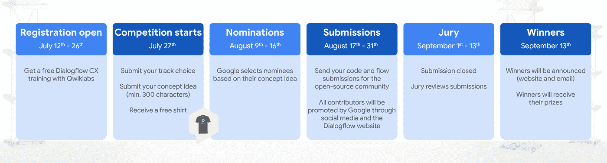
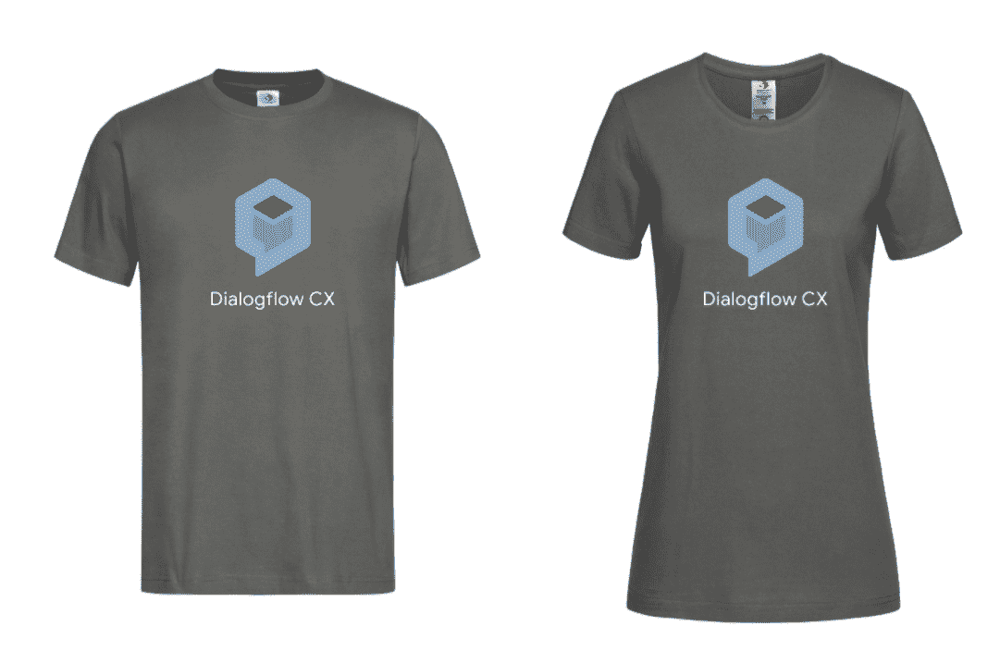
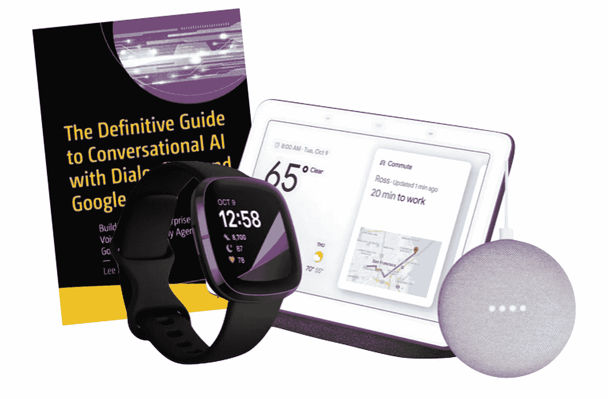
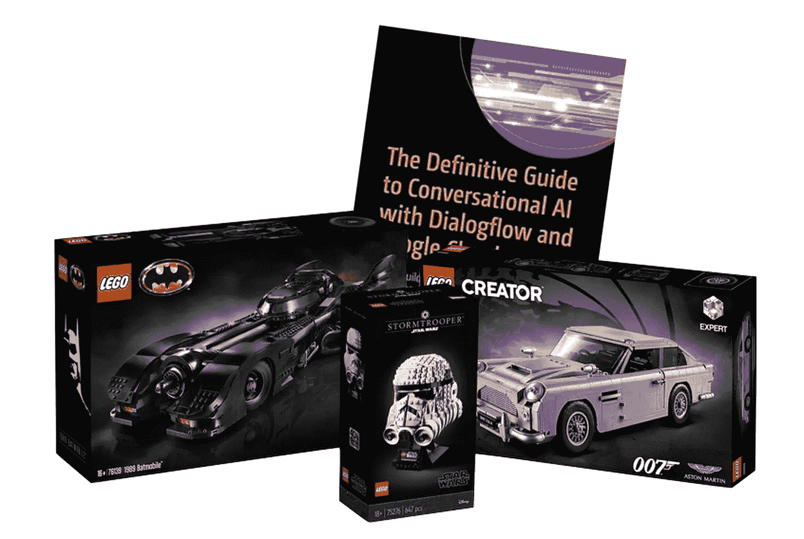

# Dialogflow CX 竞赛—了解 Dialogflow CX &设计开源组件

> 原文：<https://medium.com/google-cloud/dialogflow-cx-competition-learn-dialogflow-cx-design-open-source-components-db2b138fe2a4?source=collection_archive---------0----------------------->

由于我们今年不能举办任何 Dialogflow 社区面对面活动，我们想出了另一个很棒的社区活动！*一场设计师&开发者(学习)大赛！*在 Dialogflow CX 接受培训，获得一件免费 t 恤，并使用开源组件。

谷歌云最近发布了[对话流 CX](https://cloud.google.com/dialogflow/) ，一个用于构建聊天机器人和电话代理的机器人构建平台。它使您的团队能够通过可视化机器人构建器和高级 NLU 加速创建企业级对话体验。

要有理由摆弄这个工具，你可以加入竞争。开发商和 UX 设计师可从 7 月 12 日起登录活动网站进行注册:

[https://events . with Google . com/dialog flow-CX-competition-global/](https://events.withgoogle.com/dialogflow-cx-competition-global/?utm_source=medium_post&utm_medium=site&utm_campaign=cx_competition)

比赛时间线

**免费 Dialogflow CX 培训课程**

每一个注册的人都将参加免费的 Dialogflow CX Qwiklabs 课程。您将能够学习如何设计对话流以及如何构建集成。该在线课程由 Google 开发，作为一种培训资源受到强烈推荐。

*注册后，我将手动将每个人注册到培训系统。请注意，这是我们通常用于培训的培训系统，所以我必须手动注册每个人。这意味着，你不会马上收到你的确认邮件，而是在几个小时内。(取决于您所在的时区)*

**竞赛**

从 7 月 27 日起，您将被邀请回到活动网站，在这里您可以输入您的注册信息。输入信息的前 200 名参与者将获得一件免费的 Dialogflow CX t 恤！

前 200 名参与者将获得免费赠品！

作为比赛的一部分，您将选择以下曲目之一:

*   **UX 设计师:设计对话流程**

设计一个对话流 CX 流/对话，为新冠肺炎建立一个文本聊天机器人。它可能是一个疫苗接种计划，可能是一个常见问题，可能是一个允许你去哪里旅行的机器人，等等。

*   **Bot 开发者:构建集成**

使用 Dialogflow CX API (REST、gRPC 或客户端库)构建一个很酷的集成。例如，在网站或博客、WhatsApp、CRM、CMS、Mobile 等中集成聊天机器人

最后，你要写一个 300 到 600 字的简短提议，说明你的想法是什么，为开源社区做贡献。比如，分享为什么你认为你的想法很棒或者很独特。在编写流程的情况下，终端用户可能会问什么样的问题，在构建集成的情况下，您将如何构建它。这个想法会在文本聊天机器人、智能音箱或联络中心运行吗？等等。

谷歌评委团队将入围 50 个最佳参赛作品，所以请确保你的想法足够详细。

**提名**

从 8 月 9 日起，谷歌将提名 50 个最佳创意。我们将与您联系，并要求您开始开发您的流程或整合。您必须提交一个到 Github 存储库的 URL，其中应该包含一个 [Apache 2 开源许可](https://www.apache.org/licenses/LICENSE-2.0)。您的 Github repo 是您在 8 月 31 日之前上传代码或导出流程(blob 导出)的地方。

作为 Dialogflow CX 的新用户，您将获得 600 美元的[积分](https://cloud.google.com/dialogflow/pricing?utm_source=ext&utm_medium=partner&utm_campaign=CDR_lee_aiml_dialogflow_contest_cx_&utm_content=-#cx-trial)，可以免费试用 Dialogflow CX，这足以开始开发您的竞争解决方案。

**所有开源贡献将通过 Dialogflow Docs 网站与社区共享，并由 Google 通过社交媒体进行推广。这是你与世界分享你的解决方案的机会！**

**判断**

一个谷歌工程师团队将评判你的工作代码，并选出总共 10 名获奖者。我们将观察您的解决方案是否可行，是否包含安装说明，执行情况如何，是否有用，以及您的想法有多有创意和独特。

**赢取超酷奖品！**

你可以赢得很酷的奖品(像乐高盒子和谷歌助理设备)，每个获胜者都将收到这本书:[dialog flow 和谷歌云对话式人工智能的权威指南](https://www.amazon.com/Definitive-Guide-Conversational-Dialogflow-Google/dp/1484270134/ref=sr_1_1?dchild=1&keywords=the+definitive+guide+to+conversational+ai&qid=1625732877&sr=8-1)。

要赢得的奖励——路线 1:写一个对话流程

要赢得的奖品—路线 2:构建对话流 CX 组件

获奖者将会在 Google event 和 Dialogflow Docs 网站上联系和展示。

*一直想潜入 Dialogflow CX？现在在活动网站上注册，您将注册参加免费的 Dialogflow CX 培训课程，从 7 月 27 日起，您可以开始提交您的聊天机器人/语音机器人提案。*

祝你好运，玩得开心！

[https://events . with Google . com/dialog flow-CX-competition-global/](https://events.withgoogle.com/dialogflow-cx-competition-global/?utm_source=medium_post&utm_medium=site&utm_campaign=cx_competition)