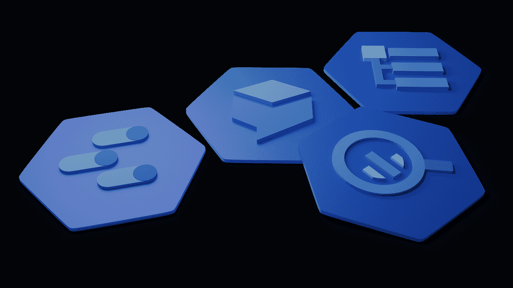
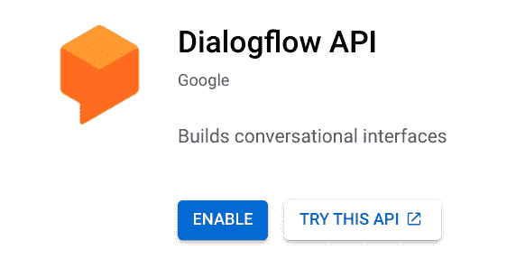
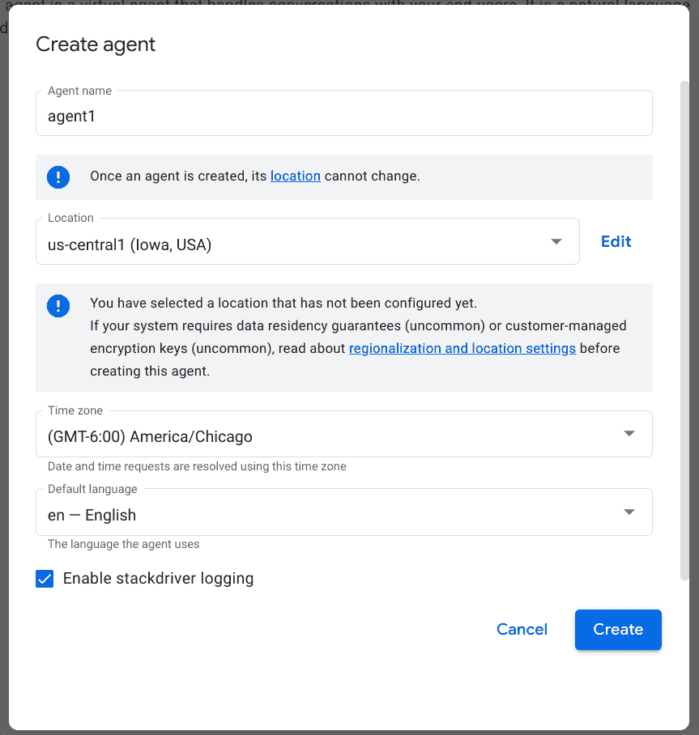
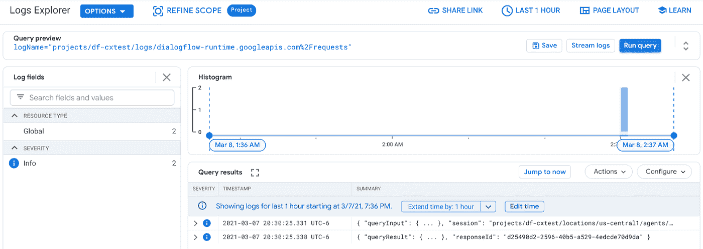
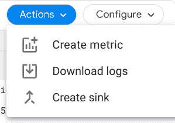
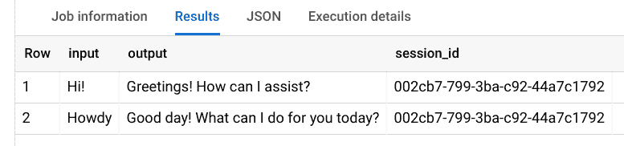
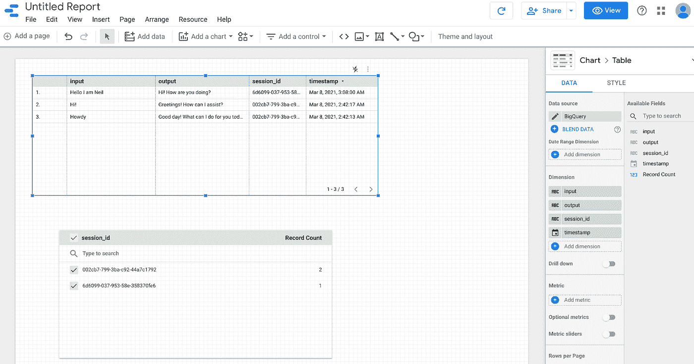

# 对话流 CX 响应日志记录

> 原文：<https://medium.com/google-cloud/dialogflow-cx-response-logging-e1b77d7a9fc6?source=collection_archive---------0----------------------->



Dialogflow CX 的一个特性是能够将其操作记录到 GCP 云日志中。这意味着当一个请求被提交给 Dialogflow 进行意图匹配时，一个日志记录被写入。当 Dialogflow 响应时，会生成第二个日志记录。日志记录的每个实例都是一个结构化的实体，包含一组通过 JSON 描述的丰富的字段。数据中包括各种各样的项目，包括:

*   日志写入的日期/时间。
*   用于将多个交互关联为同一对话的一部分的 Dialogflow 会话 id。
*   话语输入。
*   匹配的意向反应。
*   …许多附加字段。

这些数据对我们非常有用。一些可能的目的可能是:

*   将用户的交互记录为与用户相关联的交易历史的一部分。
*   调查客户询问的与意图不匹配的话语。
*   确定附加/替代训练短语。
*   路径流分析，了解客户在对话中采用的路径。
*   …许多其他使用案例。

虽然将数据写入云日志是好事，但从分析的角度来看，这并不好。云日志对于诊断日志来说很棒，但是对于数据分析来说不是很有用。好消息是，写入云日志的日志数据可以导入 BigQuery 进行更丰富的分析。为此，我们定义了一个日志导出，并将 BQ 配置为目标。一旦完成，写入云日志的新 Dialogflow 记录也将作为新行写入 BQ 表中。从 BQ 表中，我们可以执行 SQL 查询来提取我们感兴趣的数据。

让我们来看一下设置这样一个环境并查看数据的方法。

从新项目开始…

启用对话流 API

[https://console.cloud.google.com/apis/library](https://console.cloud.google.com/apis/library)



访问 CX 对话流

https://dialogflow.cloud.google.com/cx/projects

创建代理

启用 stackdriver 日志记录(遗憾的是这就是它的名字…因为这项技术现在是云日志记录):



深入代理。

在这里，我们可以在 Dialogflow CX 中构建我们的代理…但是，这不是我们练习的目的。我们在这里学习日志记录和处理日志输出。

我们可以直接测试我们的框架代理，看看它是否有响应。在右上角，单击测试代理。

在右下角显示“与代理交谈”的地方，输入“你好”。

请注意，会返回一个响应。此时，我们将工作传递给 Dialogflow，它正在响应。

这应该已经足够记录日志了。现在我们将去参观云日志。

将 Dialogflow 的日志指定为消息过滤器。我们将看到我们交互的日志记录。



展开这些日志记录并检查它们。你会发现它们包含了大量有用的信息。它们被捕获是件好事，但也不是那么有用，它们只是被写入日志。理想情况下，我们希望它们在 BQ 表中，这样我们就可以对它们进行查询。

设置好过滤器后，单击 Actions 菜单，然后创建 sink:



最后，我们将拥有一个云日志记录接收器。这将把日志记录写入表中。只会写入*新的*记录，不会写入历史记录。使用 Dialogflow 与代理交互，然后验证我们在云日志记录日志中看到新记录。

如果我们现在切换到 BigQuery，我们会发现创建了一个新表。

我们会发现，该表包含的记录中，每条记录都与写入云日志记录的日志记录中的数据相匹配。

如果我们运行一个简单的查询来查看所有记录，我们会发现我们可以从 JSON 的角度来查看它们以进行验证。现在记录在一个表中，我们可以对这些数据运行 SQL 来生成报告和执行计算。例如:

```
SELECT
 jsonPayload.queryResult.text AS input,
 jsonPayload.queryresult.responsemessages[OFFSET(0)].text.text AS output,
 labels.session_id
FROM
 `df-cxtest.dfdemo.dialogflow_runtime_googleapis_com_requests_20210308`
WHERE
 jsonPayload.queryresult IS NOT NULL
LIMIT
 1000
```

我们将看到的是单独的请求/响应



作为最后一个练习，我们将使用 Data Studio 可视化数据。

创建报告。

选择大查询。

选择自定义查询，并选择我们正在使用的计费项目。SQL 查询如上所示。

我们现在可以自定义表格来显示我们想要的内容:



为了进一步说明这个故事，有一个 You Tube 视频展示了如何将 Dialogflow CX 与云日志、BigQuery 和 Data Studio 结合使用:

# 参考