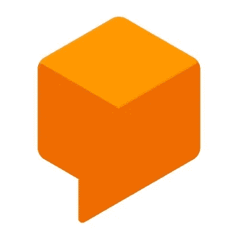
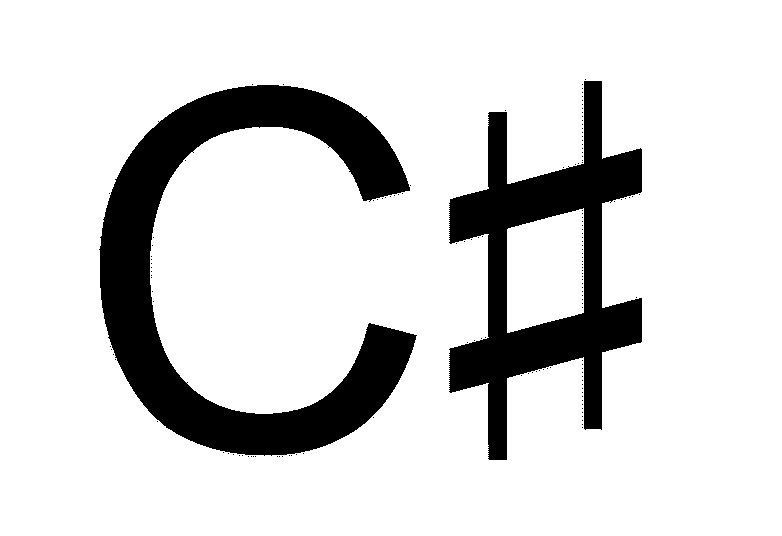
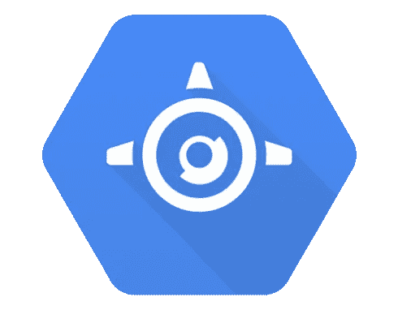
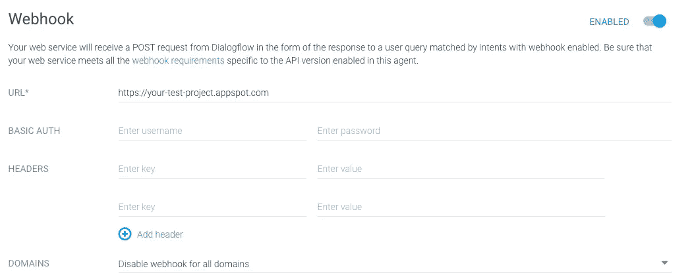
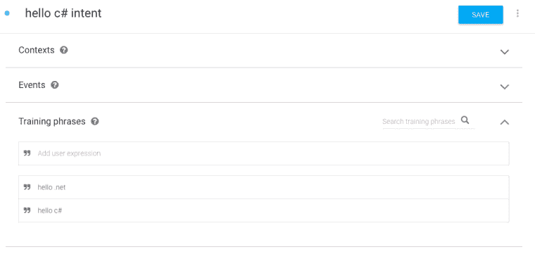
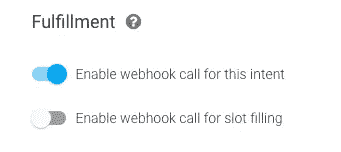
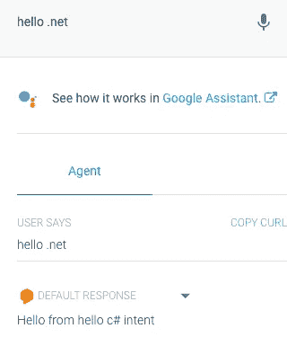

# 使用 C#和 App Engine 实现对话流

> 原文：<https://medium.com/google-cloud/dialogflow-fulfillment-with-c-and-app-engine-18eb7db071de?source=collection_archive---------1----------------------->



[Dialogflow](https://dialogflow.com/) 是一个开发者平台，用于在许多平台上构建基于语音或文本的对话应用，如 Google Assistant、Facebook Messenger、Twilio、Skype 等。今年早些时候，我们使用 Dialogflow 构建了一个谷歌助手应用程序，并将其扩展为使用谷歌云的功能。你可以在谷歌云博客[这里](https://cloud.google.com/blog/products/gcp/google-home-meets-net-containers-using-dialogflow)了解更多信息，在 GitHub [这里](https://github.com/GoogleCloudPlatform/dotnet-docs-samples/tree/master/applications/googlehome-meets-dotnetcontainers)查看应用代码，在这里[是我关于应用的一个视频。](https://youtu.be/dd19Gw4WDkU?list=PLQjaCpWNuxVmS_FV4q1aSrZMDuv5-U_FH)

Dialogflow 提供了开箱即用的特性，例如用于匹配用户输入和响应的[意图](https://dialogflow.com/docs/intents)，从对话中提取相关信息的[实体](https://dialogflow.com/docs/entities)，维护对话状态的[上下文](https://dialogflow.com/docs/contexts)。它还提供了一种通过[实现](https://dialogflow.com/docs/fulfillment)来扩展其功能的方法。

# 完成

实现是一个 HTTPS webhook，Dialogflow 可以将请求转发给它。从那时起，您的代码负责处理请求并生成响应。这对于定制逻辑或向应用程序引入更多智能/数据非常有用。在我们的应用程序中，我们使用 fulfillment 通过谷歌自定义搜索来搜索图像，使用 [Vision API](https://cloud.google.com/vision/) 通过机器学习来分析图像，并使用 [BigQuery](https://cloud.google.com/bigquery/) 执行丰富的数据分析。

实现 fulfillment webhook 的一个简单方法是通过 Dialogflow 控制台中的[内嵌编辑器](https://dialogflow.com/docs/getting-started/integrate-services-actions-on-google)。内联编辑器使您能够编写一个 Node.js 函数来处理 Dialogflow 请求，并使用 Firebase 将其部署到[云函数(详见](https://firebase.google.com/docs/functions/)[本代码实验室](https://codelabs.developers.google.com/codelabs/actions-1/))。虽然内联编辑器很简单，但它只允许一个 webhook，而且对开发人员不友好。理想情况下，您应该在本地开发代码，并使用某种版本控制。

您可以设置一个本地环境，并使用 Firebase 将该功能部署到云功能中。虽然这是一个更现实的设置，但它仍然受到云功能限制的约束，Node.js 是唯一可以使用的语言。

# 实现的应用程序引擎

在我们的应用中，我们采用了不同的方法来实现 webhook。我们决定使用 C#而不是 Node.js，并且为了更大的灵活性，我们将我们的应用程序容器化并部署到 App Engine。

由于它是一个容器，我们也可以部署到 Kubernetes 引擎，但我们选择了 App Engine，因为:

1.  App Engine 以最少的麻烦为我们提供了开箱即用的 HTTPS 端点，而 Kubernetes Engine HTTPS 设置并不简单。
2.  App Engine 中的版本控制允许我们轻松地更新和部署我们的应用程序，测试它，并在我们准备好的时候将所有流量转发到新版本。

# 用 C#实现 HelloWorld

为了让您了解如何使用 C#在 AppEngine 上编写 Dialogflow fulfillment，让我们编写一个 HelloWorld fulfillment webhook。

首先，您需要首先创建一个 ASP.NET 核心 web 应用程序:

```
dotnet new web -n fulfillment
```

并将 [Dialogflow NuGet 包](https://www.nuget.org/packages/Google.Cloud.Dialogflow.V2)添加到项目中。这个包将允许我们解析来自 Dialogflow 的请求并生成响应:

```
dotnet add package Google.Cloud.Dialogflow.V2 --version 1.0.0-beta02
```

现在，我们可以编辑 Startup.cs 文件并添加逻辑来处理 Dialogflow 请求。我们需要首先参考 Dialogflow NuGet 库及其一些依赖项:

```
using Google.Cloud.Dialogflow.V2;
using Google.Protobuf;
using System.IO;
```

然后，我们需要创建一个 Protobuf jsonParser，我们将使用它来解析 HTTP 请求的主体:

```
private static readonly JsonParser jsonParser = new JsonParser(JsonParser.Settings.Default.WithIgnoreUnknownFields(true));
```

最后，让我们更改 Configure 方法来解析来自 Dialogflow 的请求，并简单地回显一条带有目的名称的 Hello 消息:

```
app.Run(async (context) => { 
   WebhookRequest request; 
   using (var reader = new StreamReader(context.Request.Body))
   { 
      request = jsonParser.Parse<WebhookRequest>(reader); 
   }    var response = new WebhookResponse 
   { 
     FulfillmentText = "Hello from " + request.QueryResult.Intent.DisplayName 
    }; 

   await context.Response.WriteAsync(response.ToString()); 
});
```

注意 HTTP 请求体是如何被解析为 WebhookRequest 的。这是 Dialogflow 发送给我们的代码的请求。作为响应，我们用 FulfillmentText 创建一个 WebhookResponse 并发回。Dialogflow 将使用 FulfillmentText 来表达我们的要求。

# 部署到应用引擎

现在，我们准备将代码部署到 App Engine。我们需要先发布应用程序:

```
dotnet publish -c Release
```

这将在 bin/Release/netcoreapp2.0/publish/文件夹中创建一个 DLL。在此文件夹中，为 App Engine 创建一个 app.yaml 文件，内容如下:

```
env: flex
runtime: aspnetcore
```

这将告诉 App Engine 这是一个 ASP.NET 核心应用程序，它应该部署到 App Engine flex。

最后，部署到 App Engine，我们称这个初始版本为 v0:

```
gcloud app deploy --version v0
```

部署完成后，您将拥有一个形式为[https://your projectid](https://meteatamel.wordpress.com/2018/09/24/dialogflow-fulfillment-with-c-and-app-engine/%3Cyourprojectid&gt). appspot . com 的 HTTPS 端点，您可以在 Dialogflow 中使用 fulfillment webhook。

# 使用 Dialogflow 测试

我们终于准备好测试我们的实现 webhook 了。在对话流控制台中，指定实现 url:



然后，用一些训练短语创造一个意图:



最后，确保为意图启用了 fulfillment webhook:



我们可以使用 Dialogflow 控制台中的模拟器来测试其意图:



当我们说“你好。这触发了 webhook，我们的 webhook 代码简单地回显了 intent 名称，在本例中是“hello c# intent”。

显然，现实世界中的 webhook 不仅仅是简单的回复。例如，您需要跟踪用户会话，并根据这些会话获取或创建对话(参见 GitHub 上我们应用程序的 [DialogflowApp](https://github.com/GoogleCloudPlatform/dotnet-docs-samples/blob/master/applications/googlehome-meets-dotnetcontainers/GoogleHomeAspNetCoreDemoServer/Dialogflow/DialogflowApp.cs#L96) )。你还需要找到一种方法将意图与服务器上的处理程序相匹配(参见 GitHub 上我们应用程序的[对话](https://github.com/GoogleCloudPlatform/dotnet-docs-samples/blob/master/applications/googlehome-meets-dotnetcontainers/GoogleHomeAspNetCoreDemoServer/Dialogflow/Conversation.cs#L98))。

希望这篇博文提供了使用 C#和 App Engine 开始使用 fulfillment webhook 的基础知识。

*原载于 2018 年 9 月 24 日*[*meteatamel.wordpress.com*](https://meteatamel.wordpress.com/2018/09/24/dialogflow-fulfillment-with-c-and-app-engine/)*。*