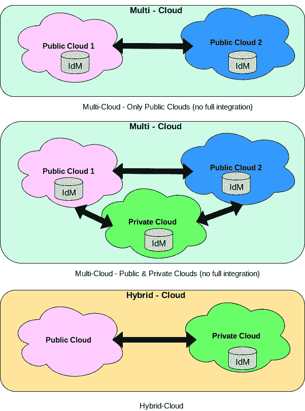
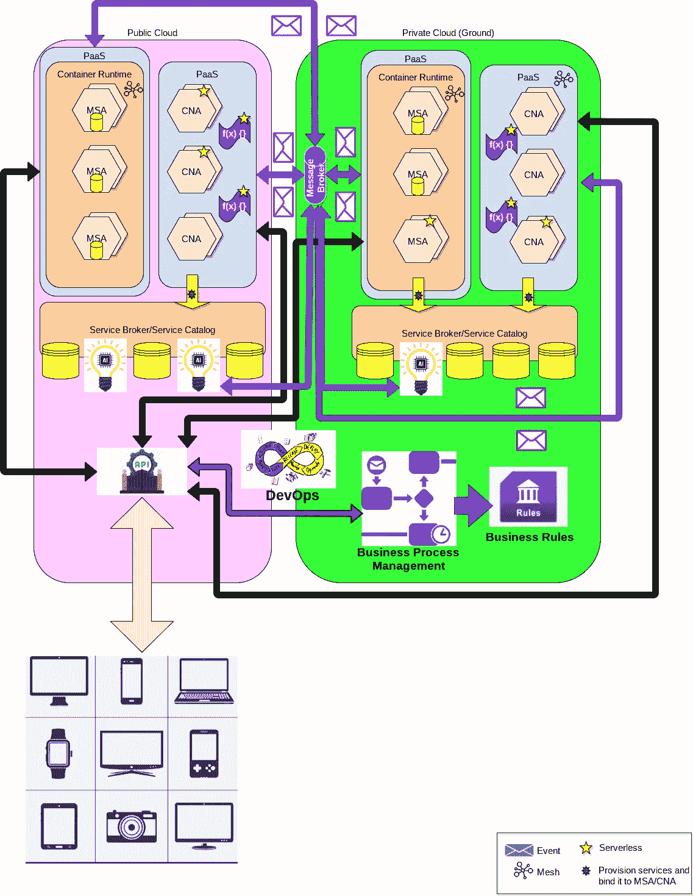
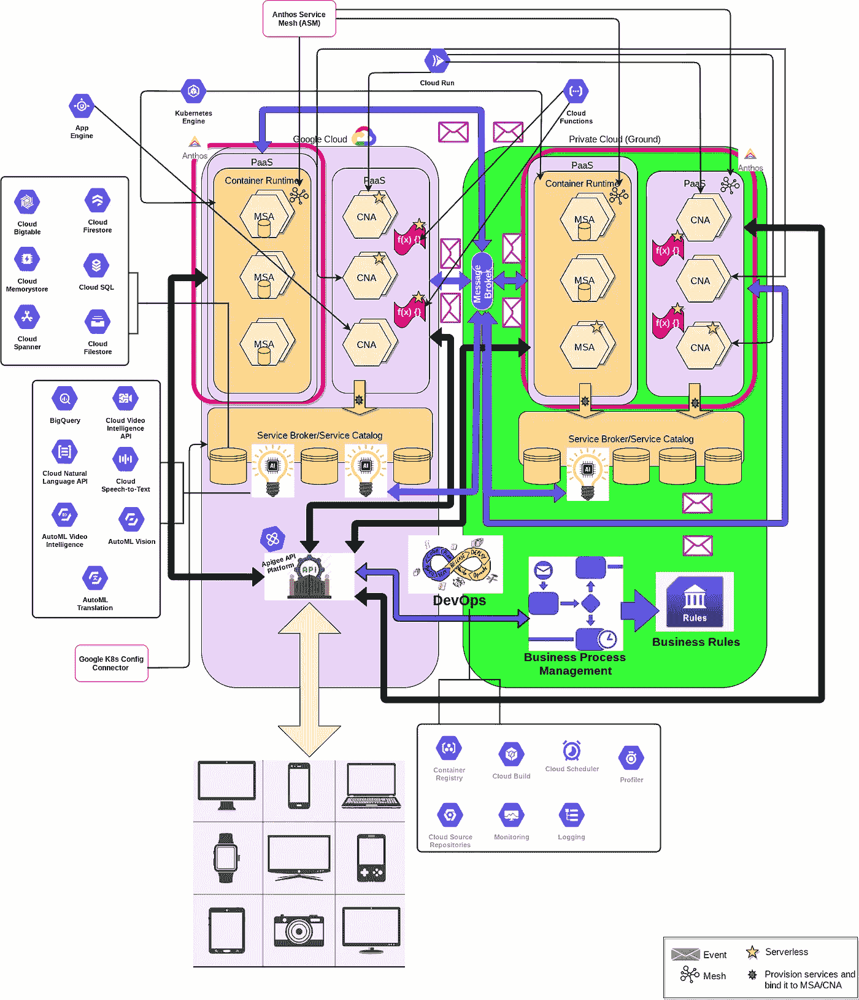

# 不同的微服务和云原生架构风格&谷歌云如何支持这些风格？

> 原文：<https://medium.com/google-cloud/different-microservices-cloud-native-architecture-flavors-how-google-cloud-supports-those-de2828fc7e4a?source=collection_archive---------0----------------------->

许多架构师和开发人员认为构建微服务架构(MSA)或云原生架构(CNA)只会考虑一种架构模式，尽管这是不正确的:)。恰恰相反；CNA/MSA 架构融合了多种架构模式，不仅仅是应用 CNA/MSA 模式那么简单。让我们从探索这些架构模式开始:

*   **事件驱动架构(EDA)** 是一种模式，支持服务通过事件为通信提供服务，并将数据更改作为事件进行处理。它高度支持松散耦合和自主设计原则。
*   **无服务器**，是一种无需运行和维护任何服务器或任何基础设施即可运行服务的模式。此外，它支持缩减到零个实例，从而支持高效的按需付费，因为付费是针对服务代码的精确执行、运行、调用和计算使用。
*   **容器化**，这种模式使得服务代码可以在一个容器内运行，支持运行时的一致性、服务的可移植性、简单高效的服务实例可伸缩性。
*   **Function as a Service (FaaS)** ，是在无服务器模式下运行代码片段作为功能的模式。它支持使用事件或直接 API 调用来触发函数。
*   **平台即服务(PaaS)** ，是使用通用平台支持多租户、支持自动扩展和自我修复的模式。通常，PaaS 以两种运行时模式提供，第一种模式是 PaaS 检测和维护服务代码运行时，而第二种模式是通过清单使用用户定义的运行时来运行服务代码，然后对其进行维护和编排。
*   **服务目录& Service Broker** 是支持提供后台服务的模式，在运行时将它们绑定到工作负载，无需停机或更改代码。此外，它还支持管理服务消费和定价。
*   **API 管理& API 网关**，是使用安全可控的平台公开服务的模式。它支持 API 货币化、API 集成模式(如企业集成模式(EIP))、API 策略实施以及 API 安全和屏蔽。
*   DevOps 是设计和实现自动化软件开发生命周期的 E2E 开发和操作过程的模式。它支持定义软件交付管道和阶段，考虑连续交付和连续集成。通常，它实现最高级别的自动化，即测试自动化、自我修复、资源消耗优化、自动供应和自动扩展。
*   **人工智能(AI)** ，是使用机器学习和数据科学来实施智能分析(包括预测和检测分析)的模式。它支持数字化商业智能。
*   **业务** **流程** **自动化**，是利用业务流程管理(bpmn)和业务规则(br)实现业务流程自动化的模式。它支持数字化商业智能。
*   **网格化**是一种模式，支持分布式跟踪、配置和服务质量(QoS)的外部化、指标和遥测收集、日志聚合、动态服务发现、流量管理、智能&灵活集成，包括断路器设计模式支持、自我修复、故障注入和策略执行。我始终认为，在实施 MSA/CNA 时，网格化是一个重要的模式，因为它淡化了 MSA/CNA 在集成和治理方面的复杂性和挑战，这就是为什么它是我最喜欢的主题之一:)。
*   **MSA** ，是基于业务领域服务设计微服务的模式，实现了 MSA 的设计原则，如状态管理、松耦合、去中心化、自治和弹性。
*   **CNA** ，是原生消费底层云基础设施并与之通信的模式，实现了云原生应用的设计原则，如无状态、可观察性和业务敏捷性。

现在我们已经讨论了 MSA/CNA 解决方案中最需要的主要模式，让我们来探讨一下多云和混合云的主题以及它们在构建 MSA/CNA 中的用途。

**首先，什么是多云，它与混合云有何不同？**

多云是跨多个云分布应用程序的模式，它可以是一组私有云和/或公共云，而混合云是跨私有云和公共云分布应用程序的模式。

好的，但是仍然有什么不同呢？

主要区别在于，混合云模式旨在从公共云和私有云/基础架构中构建一个同构的集成基础架构，消除公用设施、公共服务和服务质量(QoS)中的冗余，实施高度治理和控制，例如，使用一个单一身份管理(IdM)来控制整个基础架构中的身份认证和授权，因此它更具针对性，并实施基础架构和云无关性。 虽然多云是一个更广泛的概念，因为它不实施中央治理流程和消除冗余，所以它可能只涉及公共云，其中每个云都有自己的 IdM。

**多云和混合云**

**是的，但是多云和混合云如何帮助 CNA/MSA 解决方案呢？**

CNA & MSA 背后的想法是建立一个从业务和 IT 方面智能的应用程序。它适应业务和 It 中的任何变化，即使这种变化是意外的；这是一个更加反应式的架构，而不仅仅是一个响应式的架构。CNA/MSA 更关注业务，目标是基础架构和平台无关性。因此，对于不同基础设施和服务提供商(传统和现代)的扩展和采用来说，多云和混合云是重要的模式。在应用程序现代化和业务数字化的过程中，随着应用程序的各个部分被现代化并从一个平台或基础架构迁移到另一个平台或基础架构，增加了对多云和混合云的支持。

我们已经讨论了在构建 CNA/MSA 解决方案中使用的不同架构和设计模式，让我们尝试为 CNA/MSA 解决方案建立一个样本参考架构，将所有这些架构模式结合在一起，并解释其工作原理。

在典型的 MSA/CNA 解决方案中，使用的是混合云(公共云和私有云的组合，或者我们习惯称之为地面)，因此为了简单起见，在展示的示例参考体系结构中，我们将使用一个公共云和一个私有云(当然可以添加更多的云:)。

**CNA/MSA 参考架构示例**

上面的蓝图描绘了高级参考体系结构，让我们通过列出主要的体系结构原则来尝试和解释它:

*   公共云和私有云都托管两种风格(完全托管运行时和用户定义运行时)的 PaaS 产品
*   公共云和私有云都支持用户定义的运行时 PaaS 产品中的容器化工作负载(无状态和有状态 MSA)。
*   公共云和私有云都使用完全托管的运行时 PaaS 产品在无服务器模式下提供 FaaS。
*   DevOps 套件(工具和管道)以混合解决方案模式分布在公共云和私有云之间。
*   服务代理和服务目录用于在公共云和私有云(包括人工智能服务/工作负载)中实现各种支持服务的动态配置。
*   私有云托管一个消息代理，用于不同 MSAes 和 CNAes 之间的异步通信，从而支持 EDA 的实施。
*   公共云仅在用户定义的运行时 PaaS 产品中启用服务网格(这只是一个示例，说明可以在同一云中的一个 PaaS 上启用服务网格，而在另一个 PaaS 上禁用服务网格，这完全取决于需求:)。
*   私有云支持两种 PaaS 产品上的服务啮合。
*   一些部署的 CNAes 和 MSAes 以无服务器模式托管。
*   私有云托管业务规则和业务流程管理运行时，用于编排由实施的 CNAes 和 MSAes 提供的业务功能/步骤。
*   业务流程运行时使用 API 网关与 MSAes 和 CNAes 通信。
*   所有外部设备(手机、智能手表、平板电脑、笔记本电脑……)正在使用 API 网关与业务流程运行时和任何 MSA 或 CNA 进行通信。

现在，让我们使用 Google Cloud 来尝试和探索这个参考架构，看看 Google Cloud 如何帮助在公共云和私有云实现这些模式。

**CNA/MSA 参考架构示例—谷歌云**

在上面的蓝图中，我们可以看到 Google Cloud 为实现任何目标架构模式提供了一套备选方案，让我们深入探讨一下:)。

**Anthos 平台**是面向 CNA/MSA 和数字化转型解决方案的谷歌云产品的核心，Anthos 实现了混合和多云故事，它提供了运行、协调&管理跨不同基础设施分布的工作负载**的能力，提供了基础设施不可知原则** 。Anthos 还支持跨此类基础设施的治理，因此 QoS 不会受到任何影响，它使用其 **Anthos 配置管理** (ACM)和 **Anthos 服务网格** (ASM)来实现这一点。

通过 Google Anthos，可以供应、监控和控制 Kubernetes 集群。

在上面的蓝图中，我选择了**Google Kubernetes Engine**(GKE)作为私有云与 Google 云都使用的 K8s 发行版；但它是灵活的，你可以选择任何其他发行版。

至于托管 CNA 和 MSA 的平台即服务，除了 GKE，谷歌云还提供:

*   **Google App Engine** 是一个完全托管的无服务器 PaaS 它高度支持和启用所有 CNA 设计原则和最佳实践，如 12 个因素。
*   **Google Cloud Run** 基于 Knative，是一款 PaaS 产品，用于运行无服务器工作负载。它支持 EDA 模式和 FaaS 实现。
*   **Google Cloud Function** ，这是一款完全托管的无服务器 FaaS 产品，Google Cloud Functions 和 Google Cloud Run 的主要区别在于，前者在代码行数、工件大小和功能执行时间长度方面受限于 FaaS 的设计原则，而后者在这方面则非常灵活。

至于后台服务，Google 提供了大部分的 Google 云服务，可以使用 **K8s 配置连接器**进行动态配置，这有助于在 Google Cloud 中配置和管理服务，还可以在运行时将其绑定到工作负载。

通过 config connector 你可以动态配置数据库，比如 Google **云 SQL** ，Google **云扳手**和 AI 服务，比如云中的 Google **BigQuery** 。

至于 API 网关和 API 管理，Google Cloud 提供了 **APIGee** ，这是一个 SaaS 产品，用于管理和控制对分布在多云和混合云中的 msae/cnae 的访问。

在 DevOps 的世界里，Google Cloud 提供了一套服务，比如**云源码库**、**云构建**、 **Stackdriver 监控**等等。它还通过能够与大范围的 DevOps 工具和管道集成来支持混合故事。

最后，Anthos 与 APIGee 和 Google Cloud 完全集成，并支持在地面运行 GKE 和云，以提供最佳的混合解决方案，这同样与运行解决方案的基础架构和平台无关。

**总结一下**，CNA/MSA 解决方案架构融合了不同的架构和设计模式。CNA/MSA &数字化转型的主要目标是独立于基础设施和平台，换句话说:它不再是关于基础设施和运行时；它更多的是关于质量、敏捷性、灵活性、适应性和智能。这就是为什么 MSA/CNA 和数字化转型总是青睐混合云和多云的原因