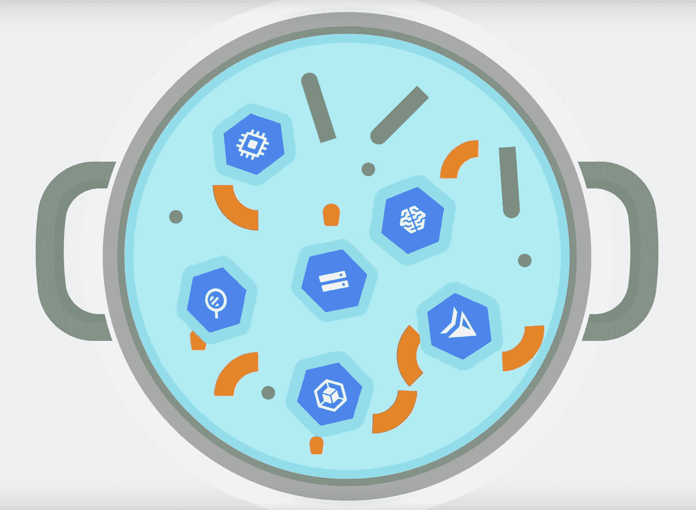

# Google Cloud 上的数据灾难恢复(第 1 部分)

> 原文：<https://medium.com/google-cloud/disaster-recovery-on-google-cloud-for-data-part-1-9cf08782bac9?source=collection_archive---------0----------------------->

## 在云中烹饪

# 介绍

*[***云上做饭***](/@pvergadia/get-cooking-in-cloud-an-introduction-5b3b90de534e)*是一个[博客](/@pvergadia/get-cooking-in-cloud-an-introduction-5b3b90de534e)和[视频](https://www.youtube.com/playlist?list=PLIivdWyY5sqIOyeovvRapCjXCZykZMLAe)系列，帮助企业和开发者在 Google Cloud 上构建商业解决方案。在这第二个迷你系列中，我将介绍 Google Cloud 上的灾难恢复。当你在网上的时候，灾难是很难处理的。在这些文章中，我们一直在阐述如何应对地震、停电、洪水、火灾等灾害。**

**以下是这部迷你剧的所有文章，供你查阅。**

1.  **[灾难恢复概述](/google-cloud/hosting-web-applications-on-google-cloud-an-overview-87d0962931a3)**
2.  **[基于谷歌云的本地应用冷灾难恢复](/@pvergadia/cold-disaster-recovery-on-google-cloud-for-applications-running-on-premises-114b31933d02)**
3.  **[针对内部部署应用程序的谷歌云热灾难恢复](/google-cloud/warm-disaster-recovery-on-google-cloud-for-applications-running-on-premises-7428b0f7db72)**
4.  **[基于 Google Cloud 的内部应用热灾难恢复](/google-cloud/hot-disaster-recovery-on-google-cloud-for-applications-running-on-premises-da7048d1a57b)**
5.  **[谷歌云中应用的冷灾难恢复](/google-cloud/cold-disaster-recovery-for-applications-in-google-cloud-5edeb32f2fc6)**
6.  **[谷歌云中应用的温灾恢复](/google-cloud/warm-disaster-recovery-for-applications-in-google-cloud-9165b4ea8e2f)**
7.  **[谷歌云中应用的热灾难恢复](https://medium.com/p/958efa292c5f/edit)**
8.  **Google Cloud 上的数据灾难恢复:第 1 部分**
9.  **Google Cloud 上的数据灾难恢复:第 2 部分**

**由于数据是任何应用程序恢复中最重要的部分，我认为专门讨论这一点是有意义的。因此，我将这篇文章和下一篇文章的重点放在数据灾难恢复上。在下一篇文章中，您将学习在生产环境位于 Google Cloud 上时规划数据恢复，而在这篇文章中，您将学习在生产环境位于本地或另一个云上时规划数据恢复。所以，继续读下去吧！**

# **你会学到什么**

*   **为什么数据备份很重要？**
*   **数据恢复需要什么？**
*   **数据备份和恢复**
*   **数据库备份和恢复**
*   **如果生产在另一个云中，则进行数据恢复**

# **先决条件**

*   **谷歌云的基本概念和结构，这样你就可以识别产品的名称。**
*   **阅读[概述文章](/google-cloud/hosting-web-applications-on-google-cloud-an-overview-87d0962931a3)了解灾难恢复相关定义。**

# **看看这个视频**

**在 Google Cloud 上对内部生产环境中的数据进行灾难恢复**

# **为什么数据备份很重要？**

****Mane-Street-Styl** e 是一家电子商务公司，其生产环境就在公司内部。想象一下，如果他们发现他们在一次灾难中丢失了所有最近的客户订单。如果订单没有完成，他们的生意将会遭受巨大的损失。由于数据是其应用程序的关键部分，让我们更深入地研究它，并帮助 Mane-Street-Style 使用一些策略来避免在灾难中丢失数据！**

# **“数据”恢复需要什么？**

**如果您在某个地方备份了数据，则只能恢复数据。但是对于数据来说，备份意味着什么呢？**

**术语“数据”备份涵盖两种情况:**

*   ****数据备份:**仅备份数据就需要将离散数量的数据从一个地方复制到另一个地方，以便从损坏或生产中断中恢复。**
*   ****数据库备份:**数据库备份稍微复杂一些，因为它们通常涉及到恢复到某个时间点。因此，我们不仅需要考虑备份数据库，还需要考虑备份事务日志，然后在恢复期间将它们应用于数据库备份。**

**现在，我们对灾难恢复的数据和数据库备份有了基本的了解，让我们考虑一下“Mane-Street-Style”的情形，以及他们如何专门为数据设置灾难恢复。**

# **数据备份和恢复**

**对于数据备份和恢复，有几个选项:**

*   **Mane-Street-Style 可以创建一个运行脚本或应用程序的计划任务，将数据传输到云存储中。或者，他们可以使用 [gsutil](https://cloud.google.com/storage/docs/gsutil) 命令行工具、Cloud Composer 或某个云存储[客户端库](https://cloud.google.com/storage/docs/reference/libraries)来自动化云存储的备份过程。**
*   **他们可以使用第三方解决方案。Mane-Street-Style 使用最常见的分层存储模式，在这种模式下，他们将最新的备份存储在速度更快的存储上，并将较旧的备份慢慢迁移到更便宜的存储上。当他们使用 Google Cloud 作为目标时，他们可以使用云存储 Nearline 或 Coldline 作为较慢层的等价物。一种方法是在本地存储和云存储之间使用合作伙伴网关。合作伙伴解决方案管理来自内部网络连接存储设备或存储区域网络的传输。**

****

**使用合作伙伴网关进行数据恢复**

# **数据库备份和恢复**

***Mane-Street-Style* 可以使用多种策略来实施将数据库系统从内部恢复到 Google Cloud 的过程。让我们看看两种最常见的解决方案。**

*   **使用 Google Cloud 上的恢复服务器进行备份和恢复**
*   **使用 Google Cloud 上的备用服务器进行复制。**

# **备份和恢复服务器方法:**

## **灾难“之前”应采取的步骤**

*   **使用数据库管理系统的内置备份机制创建数据库备份。这通常会在本地磁盘上创建备份。**
*   **然后[创建一个云存储桶](https://cloud.google.com/storage/docs/quickstart-gsutil#create)作为 Google Cloud 中数据备份的目标**
*   **使用 gsutil 或我们前面提到的合作伙伴网关解决方案将备份文件复制到云存储(GCS)。**
*   **因为这是 DB，所以将事务日志复制到 Google Cloud 上的恢复站点。备份事务日志有助于保持较小的 RPO 值。**
*   **使用云互联和云 VPN 配置到 Google Cloud 的连接**
*   **在 Google Cloud 上创建一个数据库服务器的[定制映像](https://cloud.google.com/compute/docs/images/create-delete-deprecate-private-images#creating_a_custom_image)，其配置与内部部署的完全相同。**
*   **[从定制映像](https://cloud.google.com/compute/docs/instances/create-start-instance#creating_an_instance_from_a_custom_image)启动一个最小大小的实例，并附加任何所需的永久磁盘。**
*   **将自动删除标志设置为 **no-auto-delete** ，这样我们的永久磁盘就不会被无意中删除，因为那将是一场灾难**

****

**数据库备份和恢复:灾难“之前”应采取的步骤**

## **灾难“期间”应采取的步骤**

**当需要将数据库恢复到 Google Cloud 上的灾难恢复站点时，Mane-street 风格很容易做到:**

*   **应用复制到云存储的最新备份文件和事务日志。**
*   **R [用能够接受生产流量的较大实例](https://cloud.google.com/compute/docs/instances/changing-machine-type-of-stopped-instance)替换最小实例。**
*   **最后，切换客户端，指向 Google Cloud 中恢复的数据库。**

****

**数据库备份和恢复:灾难“期间”要采取的步骤**

## **灾难发生后应采取的步骤**

**当本地生产环境启动并运行时，他们只需颠倒步骤即可:**

*   **备份运行在 Google Cloud 上的数据库和事务日志。**
*   **将这些备份文件复制到您的生产环境中。**
*   **将它们应用于生产数据库系统。**
*   **阻止客户端连接到 Google Cloud 中的数据库系统，这可以通过停止数据库系统服务来实现。从现在开始，在恢复到生产环境之前，应用程序将不可用。**
*   **最后，将客户机连接重定向到生产环境，就这样！**

****

**数据库备份和恢复:灾难“之后”要采取的步骤**

# **备用服务器方法:**

**另一种方法是在 Google Cloud 上设置一个备用服务器用于数据复制，这有助于实现非常小的 RTO 和 RPO 值，因为它实际上将数据和数据库状态实时复制到数据库服务器的热备用服务器。如果 Mane-street-style 要建立一个备用服务器，他们会这样做:**

*   **首先连接内部网络和 Google Cloud 网络。**
*   **然后在 Google Cloud 上创建一个数据库服务器的[定制映像](https://cloud.google.com/compute/docs/images/create-delete-deprecate-private-images#creating_a_custom_image)，其配置与内部部署的相同。**
*   **[从自定义映像](https://cloud.google.com/compute/docs/instances/create-start-instance#creating_an_instance_from_a_custom_image)启动一个实例，并附加任何需要的永久磁盘，将自动删除标志设置为 false。**
*   **然后在 Google Cloud 中配置本地数据库服务器和目标数据库服务器之间的复制。**
*   **在正常操作中，客户端被配置为指向本地数据库服务器。**

****

**备用服务器方法:灾难“之前”应采取的步骤**

*   **在配置了这个复制拓扑之后，他们必须将客户机切换到运行在 Google Cloud 网络中的备用服务器。**
*   **当本地生产数据库启动并运行时，他们只需将生产数据库服务器与 Google Cloud 数据库服务器重新同步，然后将客户端切换回生产环境。**

****

**备用服务器方法:“灾后”应采取的步骤**

# **如果生产在另一个云中呢？**

**在 *Mane-Street-Style 的情况下，*生产在内部进行。但是如果他们在 AWS 中建立了生产，他们可以使用 [GCS](https://cloud.google.com/storage/) 中的存储转移服务将对象从亚马逊 S3 转移到云存储中。**

**他们可以设置一个传输作业，使用基于文件创建日期、文件名过滤器和他们希望导入数据的时间的高级过滤器，安排从数据源到接收器的定期同步。他们也可以使用像[阿帕奇气流](https://airflow.apache.org/)这样的工具在云之间移动数据**

# **结论**

**如果您在本地或在另一个云中有一个生产应用程序，并且需要设置 ***数据*** 恢复，那么希望您已经学习了一些策略来完成这项工作！请继续关注下一篇文章，在那里您将了解如何为 Google Cloud 上的数据设置更多的灾难恢复。**

# **后续步骤**

*   **在[谷歌云平台媒体](https://medium.com/google-cloud)上关注这个博客系列。**
*   **参考[灾难恢复解决方案](https://cloud.google.com/solutions/dr-scenarios-planning-guide)。**
*   **关注[获取云端烹饪](https://www.youtube.com/watch?v=pxp7uYUjH_M)视频系列，订阅谷歌云平台 YouTube 频道**
*   **想要更多的故事？查看我的[媒体](/@pvergadia/)，[在 twitter 上关注我](https://twitter.com/pvergadia)。**
*   **请和我们一起欣赏这部迷你剧，并了解更多类似的谷歌云解决方案:)**