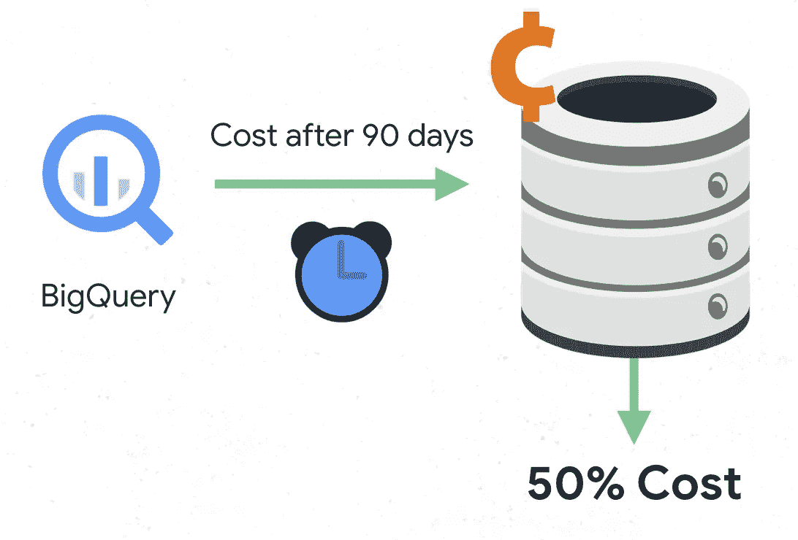
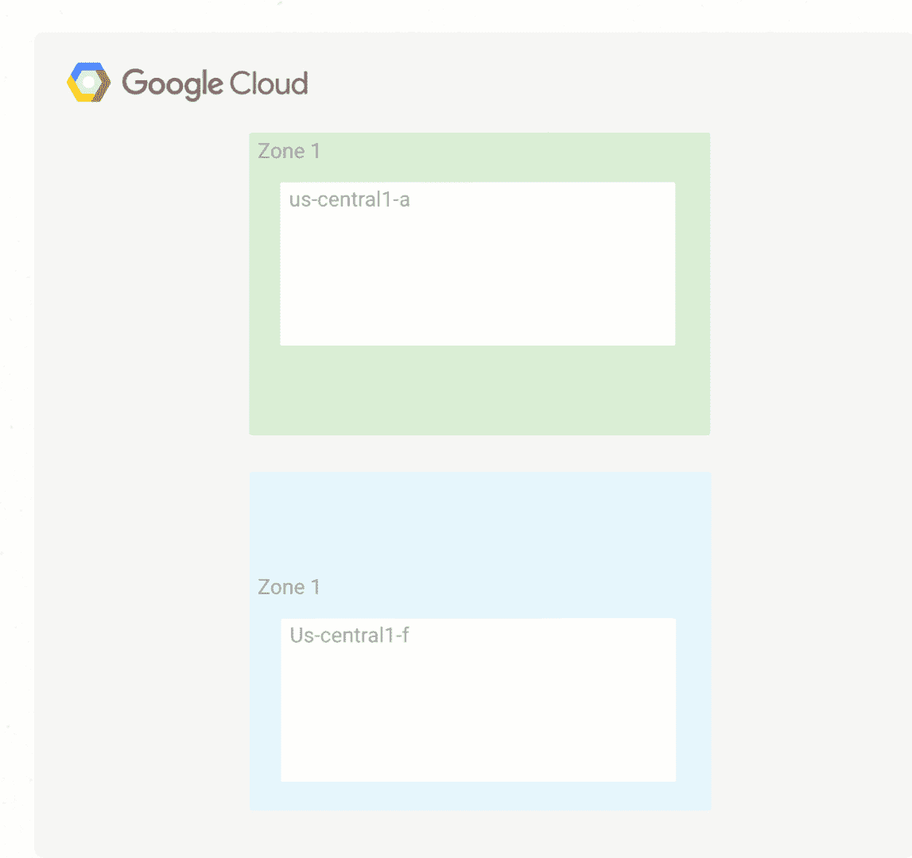

# Google Cloud 上的数据灾难恢复(第 2 部分)

> 原文：<https://medium.com/google-cloud/disaster-recovery-on-google-cloud-for-data-part-2-2523d862fbe1?source=collection_archive---------0----------------------->

## 在云中烹饪

# 介绍

*[***云上做饭***](/@pvergadia/get-cooking-in-cloud-an-introduction-5b3b90de534e)*是一个[博客](/@pvergadia/get-cooking-in-cloud-an-introduction-5b3b90de534e)和[视频](https://www.youtube.com/playlist?list=PLIivdWyY5sqIOyeovvRapCjXCZykZMLAe)系列，帮助企业和开发者在 Google Cloud 上构建商业解决方案。在这第二个迷你系列中，我将介绍 Google Cloud 上的灾难恢复。当你在网上时，灾难可能很难处理。在这些文章中，我们一直在阐述如何应对地震、停电、洪水、火灾等灾害。**

**以下是这部迷你剧的所有文章，供你查阅。**

1.  **[灾难恢复概述](/google-cloud/hosting-web-applications-on-google-cloud-an-overview-87d0962931a3)**
2.  **[基于谷歌云的本地应用冷灾难恢复](/@pvergadia/cold-disaster-recovery-on-google-cloud-for-applications-running-on-premises-114b31933d02)**
3.  **[针对内部部署应用程序的谷歌云热灾难恢复](/google-cloud/warm-disaster-recovery-on-google-cloud-for-applications-running-on-premises-7428b0f7db72)**
4.  **[基于 Google Cloud 的内部应用热灾难恢复](/google-cloud/hot-disaster-recovery-on-google-cloud-for-applications-running-on-premises-da7048d1a57b)**
5.  **[谷歌云中应用的冷灾难恢复](/google-cloud/cold-disaster-recovery-for-applications-in-google-cloud-5edeb32f2fc6)**
6.  **[谷歌云中应用的温灾恢复](/google-cloud/warm-disaster-recovery-for-applications-in-google-cloud-9165b4ea8e2f)**
7.  **[谷歌云中应用的热灾难恢复](https://medium.com/p/958efa292c5f/edit)**
8.  **[Google Cloud 上的数据灾难恢复:第 1 部分](/google-cloud/disaster-recovery-on-google-cloud-for-data-part-1-9cf08782bac9)**
9.  **Google Cloud 上的数据灾难恢复:第 2 部分**

**由于数据是任何应用程序恢复中最重要的部分，我认为专门讨论“数据”是有意义的。因此，我将最后两篇文章的重点放在数据灾难恢复上。在上一篇文章中，您了解了当生产环境是在本地还是在另一个云上时，如何规划[数据恢复。在本课程中，您将学习如何在生产环境位于 Google Cloud 上时规划数据恢复。所以，继续读下去吧！](/google-cloud/disaster-recovery-on-google-cloud-for-data-part-1-9cf08782bac9)**

# **你会学到什么**

*   **数据备份很重要**
*   **数据恢复需要什么？**
*   **数据备份和恢复**
*   **数据库备份和恢复**

# **先决条件**

*   **谷歌云的基本概念和结构，这样你就可以识别产品的名称。**
*   **阅读[概述文章](/google-cloud/hosting-web-applications-on-google-cloud-an-overview-87d0962931a3)了解灾难恢复的相关定义。**

# **看看这个视频**

**在 Google Cloud 上对 Google Cloud 生产环境中的数据进行灾难恢复**

# **数据备份很重要**

****

**Mane 活动策划**

**“ **Mane-Event-Planning** ”是一家电子商务活动策划公司，目前在谷歌云上运行他们的基础设施，因此灾难恢复环境也在谷歌云上运行。与任何其他在线业务数据一样，数据也是其应用程序的重要组成部分，让我们更深入地了解它，并通过一些策略来帮助大型活动规划，以避免在灾难中丢失数据！**

# **“数据”恢复需要什么？**

**如果您在某个地方备份了数据，则只能恢复数据。但是对于数据来说，备份意味着什么呢？**

**术语“数据”备份涵盖两种情况:**

*   ****数据备份:**仅备份数据就需要将离散数量的数据从一个地方复制到另一个地方，以便从损坏或生产中断中恢复。**
*   ****数据库备份:**数据库备份稍微复杂一些，因为它们通常涉及到恢复到某个时间点。因此，我们不仅需要考虑备份数据库，还需要考虑备份事务日志，然后在恢复期间将它们应用于数据库备份。**

**现在，我们已经对灾难恢复的数据和数据库备份有了基本的了解，让我们考虑一下“Mane-Event-Planning”场景，以及他们如何专门为数据设置灾难恢复。**

# **数据备份和恢复**

***Mane-Event-Planning* 在 Google Cloud 上有一个分层存储模式，持久磁盘连接到计算引擎。因此，数据备份很简单，他们只需将数据迁移到低成本层，如近线或冷线存储，因为访问备份数据的需求不太可能。**

****

**Google Cloud 中典型的分层存储模式**

# **数据库备份和恢复**

***Mane-Event-Planning* 可以使用多种策略来实施恢复 Google Cloud 中的数据库系统的流程。让我们看看他们现在使用什么数据库。他们有:**

*   **一个部署在计算引擎上的自我管理的 MySQL 数据库**
*   **云 **Bigtable** 和 **BigQuery** 是托管数据库。**

## **托管数据库**

**托管数据库专为扩展而设计，Bigtable 提供区域复制，这提供了比单个集群更高的可用性、额外的读取吞吐量，以及更高的耐用性和在区域故障情况下的弹性。**

**这里使用 BigQuery 来归档数据，对于长期而言，这是一种非常经济高效的存储，因为如果数据在 90 天内没有变化，存储价格会下降 50%。使用 BigQuery 最好的一点是它在默认情况下是可复制的，但是不要忘记这并不能避免错误更新造成的数据损坏。**

****

**如果数据保持不变，90 天后 BigQuery 存储成本会降低。**

**了解更多关于处理数据损坏的信息，或者如果你正在使用任何其他托管的谷歌云数据库，如云[扳手](https://cloud.google.com/spanner/)，云 C [组件](https://cloud.google.com/composer/)或云[数据存储](https://cloud.google.com/datastore/)。**

## **自我管理的数据库**

**现在，让我们谈谈 Mane-Event-Panning 在计算引擎上部署的一个自我管理的 MySql 数据库。**

## **灾难“之前”应采取的步骤**

*   **创建一个 VPC 网络**
*   **创建使用应用程序服务配置的自定义图像。作为映像的一部分，确保为正在处理的数据附加一个持久磁盘。**
*   **从连接的永久磁盘创建快照，并配置启动脚本以从最新的快照创建永久磁盘并装载该磁盘。**
*   **然后从我们刚刚创建的图像创建一个实例模板。**
*   **使用此实例模板，配置目标大小为 1 的区域托管实例组。**
*   **确保在受管实例组上配置了运行状况检查**
*   **使用区域托管实例组配置内部负载平衡**
*   **配置一个计划任务来创建持久性磁盘的常规快照。**

## **灾难“期间/之后”应采取的步骤**

**嗯，Mane-event-planning 不需要启动任何故障转移步骤，因为它们会自动发生。这是 Google cloud 中可用的默认 HA 特性中最好的部分。如果某个区域出现故障，区域实例组将在同一区域的不同区域中启动一个替换实例。从最新快照创建新的持久磁盘，并将其附加到新实例。**

****

**灾难发生前后应采取的步骤**

**如果需要替换数据库实例，此配置:**

*   **自动启动另一个正确版本的数据库服务器**
*   **连接包含最新备份和事务日志文件的永久磁盘**
*   **将重新配置与数据库服务器通信的客户端的需求降至最低**
*   **确保相同的 Google Cloud 安全控制(IAM 策略、防火墙设置)应用于恢复的数据库服务器。**

**要了解关于这些组件的更多信息，请查看[上一篇关于 Google Cloud](/google-cloud/cold-disaster-recovery-for-applications-in-google-cloud-5edeb32f2fc6) 上应用程序冷灾难恢复的文章。**

**好了，你知道了。如果您在 Google cloud 中部署了一个生产应用程序，并且需要设置数据恢复，那么希望您已经学习了一些在您的特定场景中应用的策略！**

# **结论**

**如果您在 Google Cloud 中部署了一个生产应用程序，并且需要设置 ***数据*** 恢复，那么希望您已经学会了一些策略！更多文章敬请关注[获取云端烹饪系列](/@pvergadia/get-cooking-in-cloud-an-introduction-5b3b90de534e)点击这里。**

# **后续步骤**

*   **在[谷歌云平台媒体](https://medium.com/google-cloud)上关注这个博客系列。**
*   **参考[灾难恢复解决方案](https://cloud.google.com/solutions/dr-scenarios-planning-guide)。**
*   **关注[获取云端烹饪](https://www.youtube.com/watch?v=pxp7uYUjH_M)视频系列，订阅谷歌云平台 YouTube 频道**
*   **想要更多的故事？查看我的[媒体](/@pvergadia/)，[在 twitter 上关注我](https://twitter.com/pvergadia)。**
*   **请和我们一起欣赏这部迷你剧，并了解更多类似的谷歌云解决方案:)**