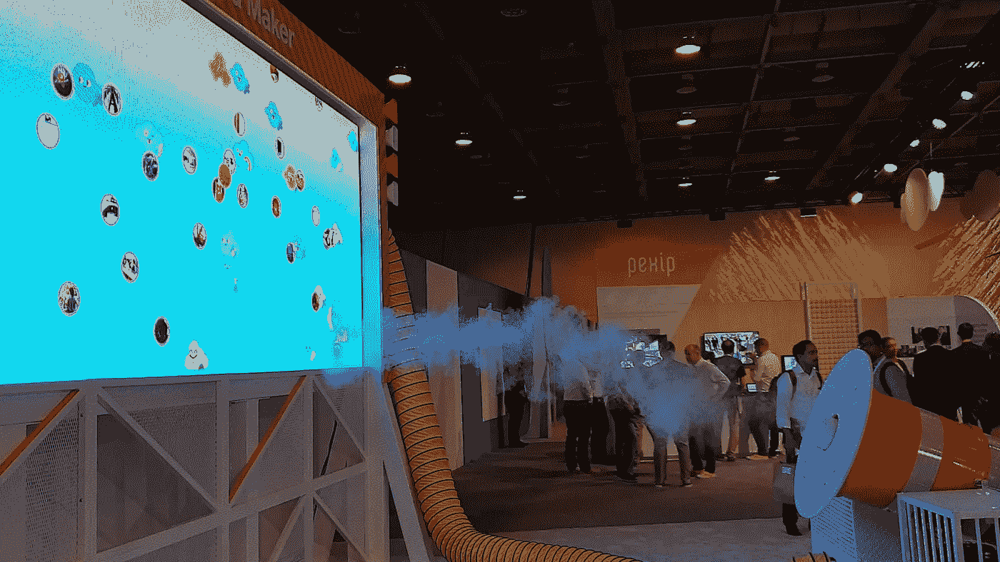

# 利用 Next’18 探索谷歌云平台

> 原文：<https://medium.com/google-cloud/discovering-google-cloud-platform-with-next-18-a41b049529f4?source=collection_archive---------1----------------------->

下一个 2018 年的纪念图片—这就是我们如何部署云功能；)见[动画](https://twitter.com/PicardParis/status/1022227697102073856)

2017 年之前，我对谷歌云平台知之甚少。一个偶然的机会，来自 Cloud Next’17 的几个视频引导我进入[并发现 GCP](/@PicardParis/discovering-google-cloud-platform-e621ea3200d7) 。谷歌公共云的开发者友好性和技术性能给我留下了深刻的印象，长话短说，我非常高兴加入这个团队。

一年后，我仍然觉得从开发人员的角度来看 Cloud Next 最有趣。这一谷歌云年度里程碑提供了 GCP 所处位置的广泛快照，也是其前进方向的一个好主意。

**TL；博士**

如果你只是想通过一个视频了解 GCP，特里的概述(40 分钟)是必看的:

**2018 年有什么新鲜事？**

*   cloud Next’18 本身显示了一定的可扩展性:25，000 名与会者，规模比 2017 年翻了一番。

 [## 谷歌云首席执行官黛安·格林:“我们在玩长线游戏”

### 谷歌本周将在旧金山举办年度云计算大会。有 25，000 名开发人员参加…

techcrunch.com](https://techcrunch.com/2018/07/24/google-cloud-wants-enterprises-to-think-beyond-infrastructure/) 

*   “云计算未来”2018 年发布了 100 多项产品。

 [## 多好的一周啊！来自 Google Cloud Next’18 的 105 项公告

### Google Cloud Next’18 太不可思议了！从精彩的主题演讲和炉边聊天到 GO-JEK 首席技术官 Ajey Gore 现身…

博客.谷歌](https://blog.google/products/google-cloud/100-plus-announcements-from-google-cloud-next-18/) 

*   Cloud Next’18 发生在谷歌云被公开披露是一项价值数十亿美元的业务后几个月。它现在经常被称为“增长最快”的公共云或“前三名”。

 [## 谷歌表示，其云现在每季度带来 10 亿美元的收入

### Alphabet 周四首次披露了谷歌云业务的收入。云是…

www.cnbc.com](https://www.cnbc.com/2018/02/01/google-cloud-revenue-passes-1-billion-per-quarter.html) 

**主题演讲**

如果您对主题演讲感兴趣，那么演示文稿将围绕 3 个主要主题演讲展开:

*   第 1 天— [为每个人构建云](https://youtu.be/vJ9OaAqfxo4?list=PLBgogxgQVM9v0xG0QTFQ5PTbNrj8uGSS-)(大多数公告)
*   第 2 天— [将云带给您](https://youtu.be/XiGBWpxc6Lc?list=PLBgogxgQVM9v0xG0QTFQ5PTbNrj8uGSS-)(合作伙伴、客户、使用案例)
*   第 3 天— [在此共同制造](https://youtu.be/JQPOPV_VH5w)(针对美国开发者)

**比我们能看到的更多的会话！**

总的来说，你可以在 [430 多个会议记录](https://www.youtube.com/playlist?list=PLBgogxgQVM9v0xG0QTFQ5PTbNrj8uGSS-)中挑选。以下是我的选择，基于用户和谷歌员工的评价:

> “当我说大规模时，我是认真的…我们正在迁移超过 300 PB 的数据…网络性能非常好，我们能够分离存储和计算。”
> 推特首席技术官帕拉格·阿格拉瓦尔

→ [把云带给你](https://youtu.be/XiGBWpxc6Lc?list=PLBgogxgQVM9v0xG0QTFQ5PTbNrj8uGSS-&t=3264)

> “说到底，选择谷歌的不是我。是我的工程师。”
> “谷歌云支撑着我们的速度和创新。它抽象了底层基础架构的所有复杂性……”
> Mike mcn amara—首席信息官，Target

→ [为所有人构建云](https://youtu.be/vJ9OaAqfxo4?list=PLBgogxgQVM9v0xG0QTFQ5PTbNrj8uGSS-&t=1040)
→ [谷歌云客户创新系列](http://youtu.be/auk83XHihA4?t=620&list=PLBgogxgQVM9v0xG0QTFQ5PTbNrj8uGSS-)

> “我们大多数人只是想和一个人说话。”
> Dan lei va——Ebay 客户服务部副总裁

→ [为所有人构建云](http://youtu.be/vJ9OaAqfxo4?t=5624&list=PLBgogxgQVM9v0xG0QTFQ5PTbNrj8uGSS-)

> “我们每月处理大约 400 PB 的数据。”
> 妮可·布沙尔——TPM，Spotify

→ [建设 Pb 级仓库](https://youtu.be/APBF9Z3uBCc?list=PLBgogxgQVM9v0xG0QTFQ5PTbNrj8uGSS-&t=580)

> “当你试图查询一个 32 亿行的表时，你可以听到 MySQL 痛苦地尖叫。”
> 帕万·瓦卢里——推特

→ [建设 Pb 级仓库](https://youtu.be/APBF9Z3uBCc?list=PLBgogxgQVM9v0xG0QTFQ5PTbNrj8uGSS-&t=2043)

> “我们今年关闭了数据中心……纽约时报在 1996 年就有网站了……它在网上存在的时间比谷歌还长。”
> 迪普·卡帕迪亚——纽约时报工程总监

→ [支持开发人员自治的转型](https://youtu.be/O62jAbz-4qA?list=PLBgogxgQVM9v0xG0QTFQ5PTbNrj8uGSS-&t=318)

> “我们实际上有超过 500 个 MySQL 集群……它们像蘑菇一样增长。”
> Kerry Munz——HubSpot 工程总监

→ [基础设施即代码:30 天内实现多云](https://youtu.be/eRb-nXns36I?list=PLBgogxgQVM9v0xG0QTFQ5PTbNrj8uGSS-&t=348)

> “他在一项工作中处理了 580，000 个内核…大约 300 个内核年的计算…改变了你对研究的整个看法…在几个小时而不是几个月内得到答案。”
> Wyatt Gorman——谷歌高性能计算专家&

→ [高性能计算简介](https://youtu.be/VviB3kxFe_0?list=PLBgogxgQVM9v0xG0QTFQ5PTbNrj8uGSS-&t=1820)

> “这个图是……2016 年‘口袋妖怪 Go’上线时每秒的交易……达到了实际流量的 50 倍。”
> Niniane Wang——Niantic 工程总监

→[Niantic 的经验教训:如何将实时系统迁移到新的数据库平台](https://youtu.be/TaO-GbvBonc?list=PLBgogxgQVM9v0xG0QTFQ5PTbNrj8uGSS-&t=287)

> “…每天 10 亿次下载，支持我们 1100 万用户…”
> NPM 首席技术官 C . J . Silverio

→ [这里一起制造](https://youtu.be/JQPOPV_VH5w?list=PLBgogxgQVM9v0xG0QTFQ5PTbNrj8uGSS-&t=5423)

> “…在谷歌工作了 4 年，第一次听到像 Pb 这样的术语…”
> Greg Wilson——谷歌云开发人员关系总监

→ [第 2 天主题演讲回顾](https://youtu.be/zZ57-_KvTXQ?list=PLBgogxgQVM9v0xG0QTFQ5PTbNrj8uGSS-&t=25)

> "到 2025 年将会有 163 兆字节的数据."
> sud hir has be——谷歌云数据分析总监

→ [重新思考大数据分析](https://youtu.be/-VBGZsSUKlg?list=PLBgogxgQVM9v0xG0QTFQ5PTbNrj8uGSS-&t=129)

> "我使用 Kubernetes 太久了，最终我还是进了一个容器."
> “好的程序员复制……伟大的程序员粘贴。”
> Kelsey Hightower——谷歌云开发倡导者

→ [这里一起制造](https://youtu.be/JQPOPV_VH5w?list=PLBgogxgQVM9v0xG0QTFQ5PTbNrj8uGSS-&t=1535)

> "这里有几个解决办法……拿一个地球大小的钱包，付钱吧."
> Bret mcg Owen——谷歌云开发倡导者

→ [一路无服务器:用计算、数据和 ML 构建无服务器系统](https://youtu.be/VSc8A003hnY?list=PLBgogxgQVM9v0xG0QTFQ5PTbNrj8uGSS-&t=320)

**3 个要点**

显然，可扩展性仍然是给我留下最深刻印象的，但以下是我对 2018 年的看法:

*   **无服务器变强**。从[云函数](http://youtu.be/iPQUdb0kssE?t=1065&list=PLBgogxgQVM9v0xG0QTFQ5PTbNrj8uGSS-)到[无服务器容器](http://youtu.be/iPQUdb0kssE?t=1625&list=PLBgogxgQVM9v0xG0QTFQ5PTbNrj8uGSS-)，有越来越多的方式让我们开发者专注于我们最热爱的事情(开发！).
*   **AI 无处不在**。机器学习为更多的产品(如 [AutoML](https://youtu.be/vJ9OaAqfxo4?list=PLBgogxgQVM9v0xG0QTFQ5PTbNrj8uGSS-&t=5128) )以及嵌入式功能(如 [BigQuery ML](https://youtu.be/Ml2aCTn7kFY?t=682) 或 [Gmail Smart Compose](https://youtu.be/vJ9OaAqfxo4?list=PLBgogxgQVM9v0xG0QTFQ5PTbNrj8uGSS-&t=3970) )带来了光明。
*   **云被大家采用**。大公司拥抱公共云，尽管其中一些已经/曾经拥有自己的数据中心。他们获得了敏捷性和执行速度，就像云原生创业公司、小公司和独立开发者一样。

该结束了。一年前我加入了这个团队，这让我越来越兴奋:每周都有新的可能性，看起来就像一个不断膨胀的宇宙。我希望你能感受到激情的一部分，也许能从一些视频中得到启发。

如果附近有谷歌云活动，不要错过。它可能会改变您设计解决方案的方式，或者只是改变您开发的方式:

*   [云下东京](https://cloud.withgoogle.com/next18/tokyo)—2018 年 9 月 19 日–20 日
*   [云下伦敦](https://cloud.withgoogle.com/next18/london)—2018 年 10 月 10 日至 11 日
*   [云峰会](https://cloudplatformonline.com/2018-Summit-Global.html)在超过 25 个城市举行:西雅图、多伦多、圣保罗、斯德哥尔摩、新加坡、悉尼……

最后但同样重要的是，敬请关注我们的[博客](https://cloud.google.com/blog/)或关注 [@GCPcloud](http://twitter.com/GCPcloud) (以及[我](https://twitter.com/PicardParis)；).一会儿见…