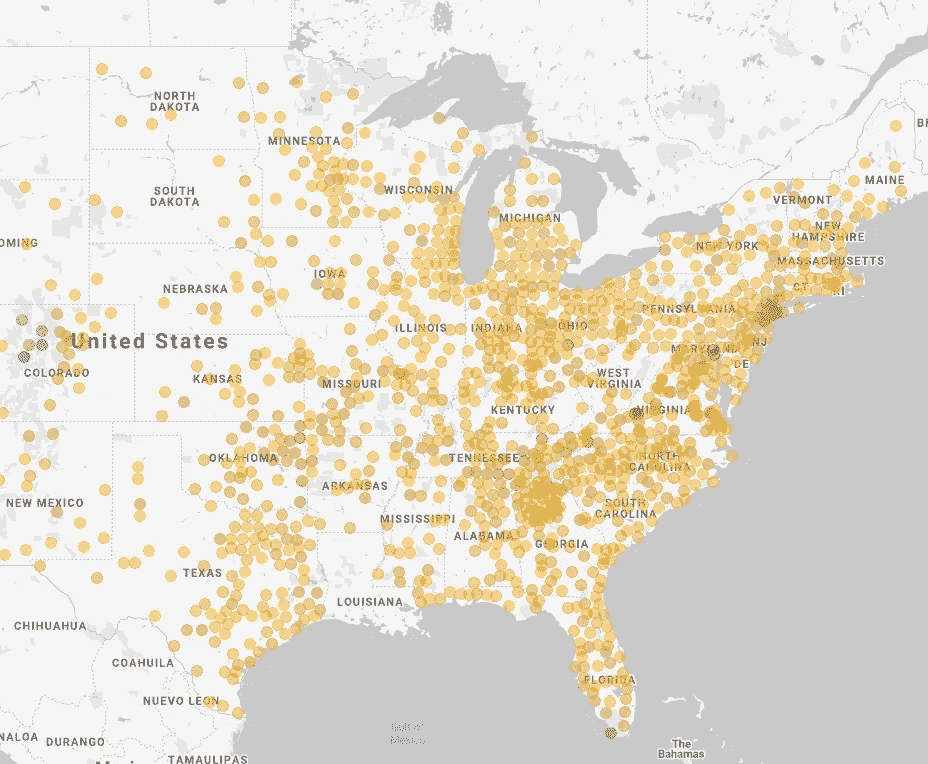
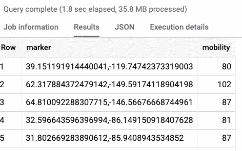
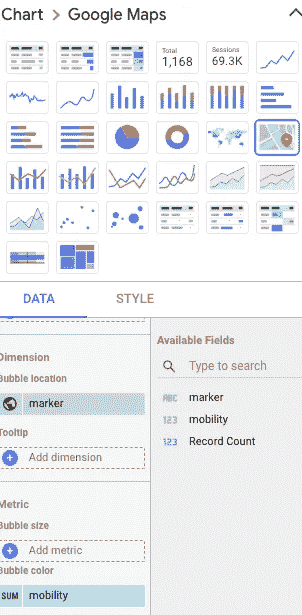
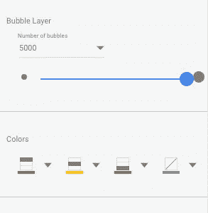
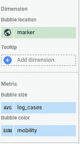
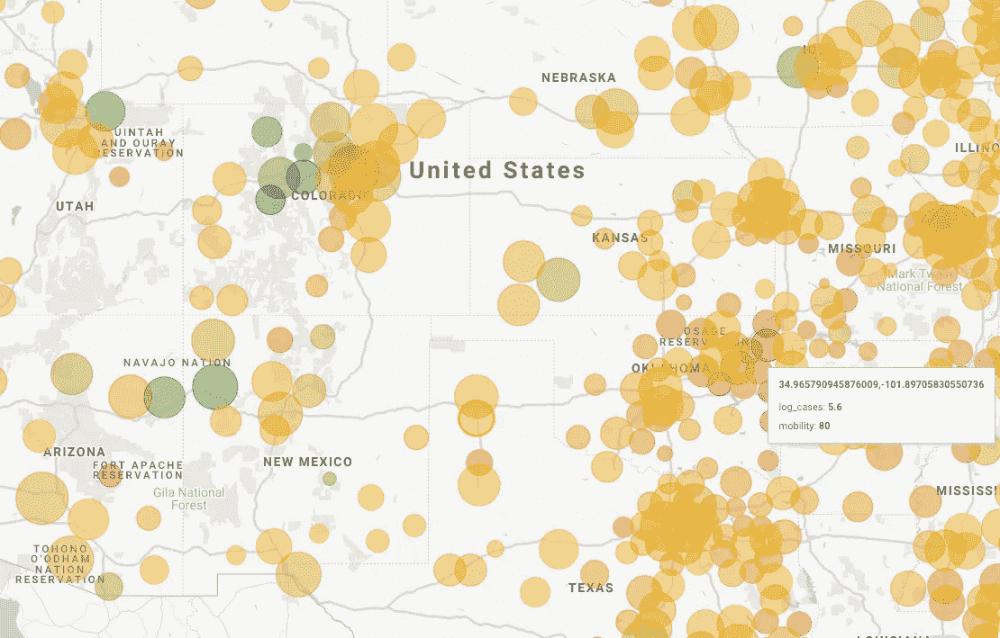

# 使用 Data Studio 在 Google Maps 上显示 BigQuery 结果

> 原文：<https://medium.com/google-cloud/displaying-bigquery-results-on-google-maps-using-data-studio-bded264bfd53?source=collection_archive---------0----------------------->

## 数据工作室有一个谷歌地图层

[谷歌移动报告](https://www.google.com/covid19/mobility/)提供了由于新冠肺炎相关问题和公共健康建议，零售和娱乐场所的访问量下降的程度。但是这些报告给你的是 pdf 或 CSV 格式的数据。

如果你想要一张这样的地图呢？



美国各地对零售和娱乐场所的访问是如何变化的。绿点表示游客数量大幅下降的县，红点表示游客数量基本持平的县。

## SQL 查询

移动性数据在 BigQuery 中作为公共数据集，因此转到 https://console.cloud.google.com/BigQuery 的[并运行以下查询:](https://console.cloud.google.com/BigQuery)

```
WITH agg AS (
SELECT 
  MAX(date) AS latest_date
FROM `bigquery-public-data.covid19_google_mobility.mobility_report`
),latest_data AS (
  SELECT
    country_region_code, sub_region_1, sub_region_2, retail_and_recreation_percent_change_from_baseline
  FROM `bigquery-public-data.covid19_google_mobility.mobility_report`, agg
  WHERE date = agg.latest_date AND country_region_code = 'US' 
  AND retail_and_recreation_percent_change_from_baseline IS NOT NULL
),with_state_fips AS (
  SELECT 
    state_fips_code AS sfc,
    TRIM(REPLACE(sub_region_2, 'County', '')) AS trimmed_county_name,
    retail_and_recreation_percent_change_from_baseline
  FROM latest_data
  JOIN `bigquery-public-data`.utility_us.us_states_area
  ON sub_region_1 = state_name
)SELECT 
    CONCAT(ST_Y(ST_CENTROID(county_geom)),',',ST_X(ST_CENTROID(county_geom))) AS marker,
    (100 + retail_and_recreation_percent_change_from_baseline) AS mobility
  FROM with_state_fips
  JOIN `bigquery-public-data`.utility_us.us_county_area
  ON trimmed_county_name = county_name AND sfc = state_fips_code
```

上面的查询由以下部分组成:

1.  查找流动报告可用的最晚日期
2.  获取美国每个州/县的最新数据。
3.  使用州名(例如，WA)获取州 FIPS 代码(例如，53)并修改县名(例如，King county)以去掉单词 County。
4.  根据县信息的公共数据集进行连接，以获得每个县的质心。

结果数据如下所示:



## 在 Data Studio 中查看

在 BigQuery web 控制台中，单击“浏览数据”按钮并选择 Data Studio。

选择谷歌地图层(见下图)



将气泡位置更改为“标记”，并将类型编辑为地理>纬度、经度。

去掉气泡尺寸——我们希望所有的点都一样大。

将气泡颜色字段更改为“移动性”。

然后，切换到样式选项卡。将气泡数增加到 5000。然后，改变颜色，使最大=红色，中等=黄色，最小=绿色，如下所示。



现在，您将拥有一个类似于本文开头的仪表板。现在让我们构建一个显示案例数量的仪表板。

## 新增确诊病例

使用此查询连接来自纽约时报的已确认病例数(它也是 BigQuery 中的公共数据集):

```
CREATE TEMPORARY FUNCTION trim_county(sub_region_2 STRING) 
AS (
TRIM(REPLACE(sub_region_2, 'County', ''))
);WITH agg AS (
SELECT 
  MAX(date) AS latest_date
FROM `bigquery-public-data.covid19_google_mobility.mobility_report`
),latest_data AS (
  SELECT
    country_region_code, 
    sub_region_1, 
    county AS trimmed_county_name,
    retail_and_recreation_percent_change_from_baseline,
    confirmed_cases
  FROM `bigquery-public-data`.covid19_google_mobility.mobility_report, agg
  JOIN `bigquery-public-data`.covid19_nyt.us_counties AS nyt
  ON sub_region_1 = state_name AND trim_county(sub_region_2) = county AND mobility_report.date = nyt.date
  WHERE nyt.date = agg.latest_date AND country_region_code = 'US' 
  AND retail_and_recreation_percent_change_from_baseline IS NOT NULL
),with_state_fips AS (
  SELECT 
    state_fips_code AS sfc,
    trimmed_county_name,
    retail_and_recreation_percent_change_from_baseline,
    confirmed_cases
  FROM latest_data
  JOIN `bigquery-public-data`.utility_us.us_states_area
  ON sub_region_1 = state_name
)SELECT 
    CONCAT(ST_Y(ST_CENTROID(county_geom)),',',ST_X(ST_CENTROID(county_geom))) AS marker,
    (100 + retail_and_recreation_percent_change_from_baseline) AS mobility,
    LOG(confirmed_cases) AS log_cases
  FROM with_state_fips
  JOIN `bigquery-public-data`.utility_us.us_county_area
  ON trimmed_county_name = county_name AND sfc = state_fips_code
```

设置 Data Studio 以显示基于 log_cases 的气泡大小:



结果将如下所示:



注意科罗拉多和德克萨斯在行为和结果上的差异…

## 共享

您可以像共享任何 Data Studio 仪表板一样共享此 Data Studio 仪表板。目前(感谢[费利佩·霍法](https://medium.com/u/279fe54c149a?source=post_page-----bded264bfd53--------------------------------)提供的信息)，嵌入地图是不可能的。

想看一步一步的教程？看看这个来自菲利普和玉峰的视频:

尽情享受吧！