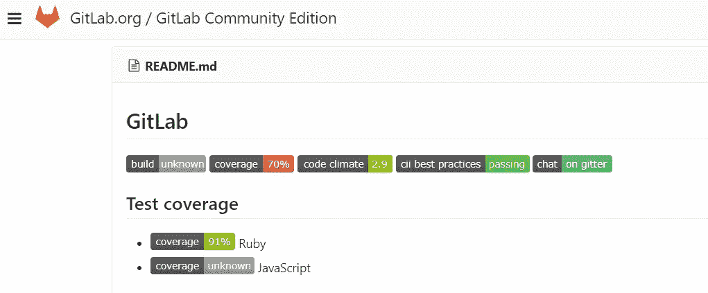

# 在您的自述文件中显示 Google Analytics 指标

> 原文：<https://medium.com/google-cloud/displaying-google-analytics-metrics-in-your-readme-2ce45fb7ea76?source=collection_archive---------0----------------------->

## 带有 shields.io 和 Google Cloud 功能的定制动态存储库徽章

如果你在 GitHub(或其他在线代码托管服务)上浏览过开源代码，你可能以前见过这些库徽章:


GitHub 上的 TensorFlow 构建状态徽章


GitHub 上的 Node.js 请求代码覆盖徽章



在 GitLab 上…


…还有 BitBucket。

# 什么是存储库徽章？

存储库徽章最普遍的形式是 shields 风格，上面截图中的大多数徽章都代表了这种风格。还有其他形式的徽章，例如请求存储库中精心制作的 npm 徽章。

资源库徽章通常用于显示关于资源库的信息，例如持续集成构建状态和代码覆盖率，但也可以是到文档或讨论的链接，显示库的最新版本和下载次数，或者基本上是您想要在资源库上显示的任何内容。

你可以通过在浏览代码时留意它们，向下滚动[https://shields.io/](https://shields.io/)并查看那里的许多例子，或者看一看[这个描述我遇到的库徽章的自述文件](https://github.com/dwyl/repo-badges)来找到更多关于徽章的信息。

# 在徽章上显示每周用户

我对显示一段时间内的活动(如每周下载次数或在线用户数)的徽章感兴趣，并希望在我的 [Bus Eta Bot 存储库](https://github.com/yi-jiayu/bus-eta-bot)中放置一个徽章，以显示过去一周使用我的 Bot 的独立用户的数量，这是我已经用 Google Analytics 跟踪的指标。最终结果如下所示:


本周 51 个用户！

首先，我们可以使用 shields.io 创建定制的 shields 风格的存储库徽章。

# shields.io

shields.io 是一种服务，它从以下形式的 URL 生成自定义 svg shields 徽章:

```
https://img.shields.io/badge/<SUBJECT>-<STATUS>-<COLOR>.svg
```

将解析为带有`<COLOR>`背景的左侧为`<SUBJECT>`右侧为`<STATUS>`的徽章。然后，您可以将该 URL 嵌入您的自述文件中，以在您的存储库页面上显示徽章。例如，h[ttps://img . shields . io/badge/Godoc-reference-blue . SVG](https://img.shields.io/badge/godoc-reference-blue.svg)生成通常用于链接到 Godoc for Go 库文档的徽章:


但是，将 shields.io 链接直接放入您的自述文件会创建一个静态标记，它只能通过新的提交进行更改。为了显示动态信息，徽章本身必须动态生成。

事实上，正如我在写这篇文章时才发现的，shields.io 还可以为某些常见的统计数据动态生成徽章，例如:

*   不同软件包管理器的最新版本和下载，例如 npm、PyPI、crates.io
*   最新的 GitHub 版本，标记甚至提交，因为一个特定的标记
*   Discord 上的在线用户数量

你可以在 [shields.io 网站](https://shields.io/)上找到详尽的列表。

除此之外，还有许多其他的服务为您生成库徽章，包括大多数持续集成和代码覆盖提供者。然而，对于真正定制的或非公开的信息，我们必须自己生成。虽然我们可以运行自己的 web 服务器来实现这一点，但在这种情况下，利用 Google Cloud 的无服务器计算功能似乎更实际。

# 谷歌云功能

注意:我决定使用谷歌云功能，因为我的机器人已经是谷歌云平台(GCP)上的一个项目，我将从谷歌分析中提取数据，但总的来说，没有什么可以阻止你使用 AWS Lambda 或任何其他功能即服务(FaaS)提供商。

[谷歌云功能](https://cloud.google.com/functions/)是谷歌的 FaaS 产品，类似于 AWS Lambda，允许你编写响应 HTTP 请求或由其他 GCP 服务事件触发的功能。目前，云函数仅使用 JavaScript 编写，并在 Node.js 6.9.1 运行时运行，因此我们将使用 JavaScript 来编写我们的函数。

我们想要的是一个 HTTP 函数，当它被调用时，从某个地方获取一些信息，然后构建一个自定义的 shields.io 链接并返回一个 302 重定向到它。然后，我们可以将这个函数的端点嵌入到我们的 README 中，这样，每次它被触发时，都会用我们的最新数据动态生成一个屏蔽。在我的例子中，我想从 Google Analytics 属性中获取这些数据。

# 谷歌分析报告 API

[谷歌分析报告 API v4](https://developers.google.com/analytics/devguides/reporting/core/v4/) 是分析报告 API 的最新版本，是“在谷歌分析中访问报告数据的最先进的编程方法”。我们将使用它来获得一个单一的数字:过去 7 天的独立用户的数量，尽管您可以将其更改为您想要的任何指标。您可以在[维度&指标浏览器](https://developers.google.com/analytics/devguides/reporting/core/dimsmets)中找到所有可用的指标。

## 证明

不幸的是，分析报告 API v4 仅支持 OAuth 2.0 认证，而不是在同一个 GCP 项目内“仅仅工作”，这可能是因为谷歌分析是一项独立于谷歌云平台的服务。

相反，为了访问我们的数据，我们将不得不使用我们的 GCP 项目的服务帐户，该帐户已经在我们的谷歌分析帐户中获得了必要的权限。

首先，我们需要创建一个服务帐户，并获取其私钥文件，我们将使用该文件向分析报告 API 验证我们自己。你可以按照谷歌文档中“创建服务账户”一节下的说明在这里:[使用 OAuth 2.0 进行服务器对服务器的应用](https://developers.google.com/identity/protocols/OAuth2ServiceAccount#creatinganaccount)。一旦安全地下载了私钥文件，就可以继续下一步了。

接下来，我们需要授予服务帐户对 Google Analytics 帐户的读取权限。您可以在“用户管理”部分的管理部分[下点击](https://analytics.google.com/analytics/web/#management/Settings/)。

# 使用 Node.js 查询分析报告 API

一旦我们获得了一组服务帐户凭据，并授予了您的服务帐户读取您的 Google Analytics 数据的权限，我们就可以使用一个简短的 Node.js 程序来测试一切是否正常，该程序使用 [Google APIs Node.js 客户端](http://Google APIs Node.js Client)来查询分析报告 API:

```
"use strict";**const** google = require('googleapis');

**const** key = require('./credentials.json');
**const** viewId = 'YOUR_VIEW_ID';

**function** getUsers(key, viewId) {
    // https://github.com/google/google-api-nodejs-client#using-jwt-service-tokens
    **const** jwtClient = **new** google.auth.JWT(
        key.client_email,
        **null**,
        key.private_key,
        ['https://www.googleapis.com/auth/analytics.readonly'],
        **null** );

    **return new** Promise((resolve, reject) => {
        jwtClient.authorize(err => {
            **if** (err) {
                console.log(err);
                **return**;
            }

            // based on https://github.com/google/google-api-nodejs-client/issues/561
            **const** analytics = google.analyticsreporting('v4');
            analytics.reports.batchGet({
                auth: jwtClient,
                resource: {
                    reportRequests: [
                        {
                            viewId: viewId,
                            dateRanges: [
                                {
                                    startDate: '7daysAgo',
                                    endDate: 'today'
                                }
                            ],
                            metrics: [
                                {
                                    expression: 'ga:users'
                                }
                            ]
                        }
                    ]
                }
            }, (err, data) => {
                **if** (err) {
                    **return** reject(err);
                } **else** {
                    **return** resolve(data);
                }
            });
        });
    });
}

getUsers(key, viewId)
    .then(data => console.log(JSON.stringify(data)))
    .catch(console.error);
```

在上面的代码中，`./credentials.json`应该是您的服务帐户凭证文件的路径，您需要用您正在使用的视图 ID 替换`YOUR_VIEW_ID`。运行这个文件，我们应该看到一个 JSON blob，其中包含我们感兴趣的指标(在下面的输出中是 47):

```
PS> node .\test.js
{"reports":[{"columnHeader":{"metricHeader":{"metricHeaderEntries":[{"name":"ga:users","type":"INTEGER"}]}},"data":{"row
s":[{"metrics":[{"values":["47"]}]}],"totals":[{"values":["47"]}],"rowCount":1,"minimums":[{"values":["47"]}],"maximums"
:[{"values":["47"]}]}}]}
```

虽然看起来有点乱，但实际值本身可以用`.reports[0].data.totals[0].values[0]`提取出来。

太好了！我们能够以编程的方式从 Google Analytics 获得指标的值。现在我们只需要编写一个云函数，它构建一个自定义的 shields.io 链接并重定向到它。

# 编写我们的云函数

HTTP 触发的云函数实际上只是一个 Express.js 路由处理程序，如果您以前使用过 Express，应该会很熟悉。它只是一个接受请求上下文和响应上下文的函数:通过请求上下文访问关于传入请求的细节，并使用响应上下文上的方法进行响应。

对于实际操作的介绍，您可以按照云函数文档上的 [HTTP 教程](https://cloud.google.com/functions/docs/tutorials/http)来创建一个 Hello World 云函数，它用一些文本来响应任何传入的 HTTP 请求。

以前，我们设法从 Google Analytics 获得我们的指标值。使用 shields.io URL，我们可以创建包含它的自定义徽章:

```
[https://img.shields.io/badge/weekly%20users-51-yellow.svg](https://img.shields.io/badge/weekly%20users-51-yellow.svg)
```

成为


我们现在需要做的就是修改上面的代码，导出一个 HTTP 处理程序，该处理程序返回一个重定向到 shields.io URL 的消息，其中包含我们度量的最新值，而不仅仅是将该值打印到标准输出中。

替换

```
getUsers(key, viewId)
    .then(data => console.log(JSON.stringify(data)))
    .catch(console.error);
```

随着

```
exports.function = **function** (req, res) {
    return getUsers(key, viewId)
        .then(data => {
            **const** value = data.reports[0].data.totals[0].values[0];
            **return** res.redirect(302, `https://img.shields.io/badge/users-${value}%2Fweek-yellow.svg`);
        })
        .catch(err => {
            console.error(err);
            **return** res.sendStatus(500);
        });
};
```

上面的代码使用了模板文字，这是一个相对较新的 JavaScript 特性，但是我们所做的只是将度量值插入到一个 URL 字符串中。

现在我们已经编写了云函数，我们可以部署它来测试它是否工作。假设您有以下文件夹结构:

```
|- credentials.js
|- index.js
|- package.json
```

您可以使用`gcloud`命令部署您的功能:

```
gcloud --project [YOUR_PROJECT_ID] beta functions deploy [YOUR_FUNCTION_NAME] --stage-bucket [YOUR_STAGING_BUCKET_NAME] --trigger-http --memory 128MB
```

在上面的命令中，`YOUR_PROJECT_ID`是您的 GCP 项目的 ID，`YOUR_STAGING_BUCKET_NAME`是存储您的函数代码的云存储桶，`YOUR_FUNCTION_NAME`是您为函数选择的名称。我们在`package.json`中的`main`值被设置为`index.js`，而我们导出的 HTTP 处理程序被称为`function`，这是云函数寻找的默认值。我们还将为我们的函数分配的内存设置为最小值 128MB，而不是默认的 256MB，因为我们可能不需要太多的内存。在 [Cloud SDK 文档](https://cloud.google.com/sdk/gcloud/reference/beta/functions/deploy)中可以找到`gcloud beta functions deploy`选项的完整列表。

成功部署函数后，在输出中应该会看到函数端点的 URL:

```
...
httpsTrigger:
  url: https://us-central1-YOUR_PROJECT_ID.cloudfunctions.net/YOUR_FUNCTION_NAME
...
```

如果你访问这个网址，你应该从上面看到同样的徽章，但现在它是动态的！是时候将它添加到我们的自述文件中了。

# 将徽章嵌入您的自述文件

这是最简单的一步，尤其是如果您的自述文件中已经有了其他徽章。为了在 Markdown 中做到这一点，我们就像其他图像一样:

```

```

这将我们的新徽章嵌入到我们的自述文件中，并为它添加了一些替代文本。

## 关于缓存的说明

存储库主机可能会缓存您的工卡。例如，GitHub 通过其 camo 缓存代理用户图像([公告](https://github.com/blog/1766-proxying-user-images))，而[问题](https://github.com/github/markup/issues/224)之前已经提出过关于陈旧的存储库徽章。GitHub 说他们尊重`Cache-Control`和`ETag`头，shields.io 设置`cache-control: max-age=86400`，所以有可能我们的徽章会被缓存 24 小时。

然而，由于在这种情况下，我显示的是每周用户计数，每天只更新一次，所以 24 小时的缓存时间不是很重要，我没有太注意它。根据您的使用情况，您可能需要找到一种方法来保持您的徽章新鲜。

# 摘要

在本帖中，我们

1.  使用 shields.io 创建自定义存储库徽章，
2.  使用分析报告 API v4 检索 Google 分析属性值，
3.  创建了一个云函数，它使用 shields.io 生成一个自定义的存储库徽章，包含我们的 Google Analytics 属性的实时值，以及
4.  将生成的徽章嵌入我们的自述文件。

你可以在[https://gist . github . com/yi-Jiayu/E1 fccd 54 a3 ef 7 a 4 eed 6 C2 a 999420 b 50 c](https://gist.github.com/yi-jiayu/e1fccd54a3ef7a4eed6c2a999420b50c)找到上面云函数的源代码。

虽然我的具体用例涉及 Google Analytics，并且我使用了 Google Cloud 函数，但本文中使用的所有技术都可以推广到其他用途，例如从 Google Analytics 中提取数据供自己使用，或者使用 AWS Lambda 从其他数据源创建自定义存储库徽章。

感谢您的阅读，和往常一样，如果您在新加坡并且经常乘坐公交车，请务必查看我的电报机器人 [@BusEtaBot](https://t.me/BusEtaBot) 查看公交 eta！