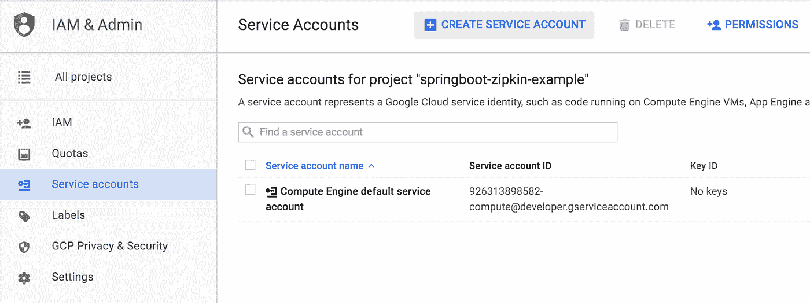
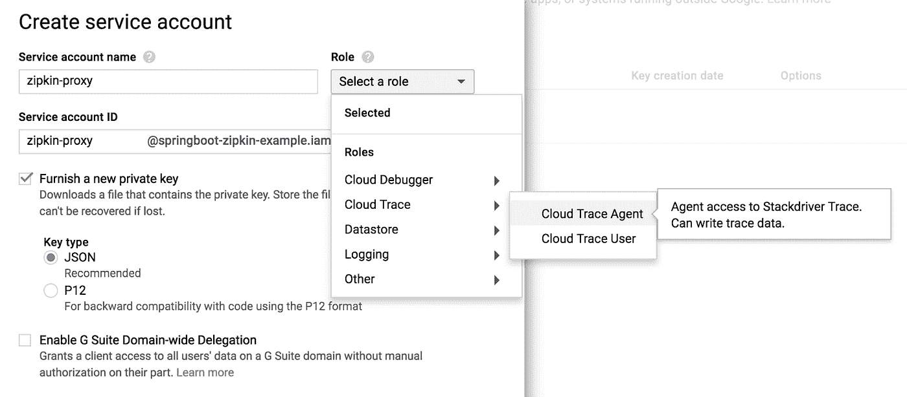
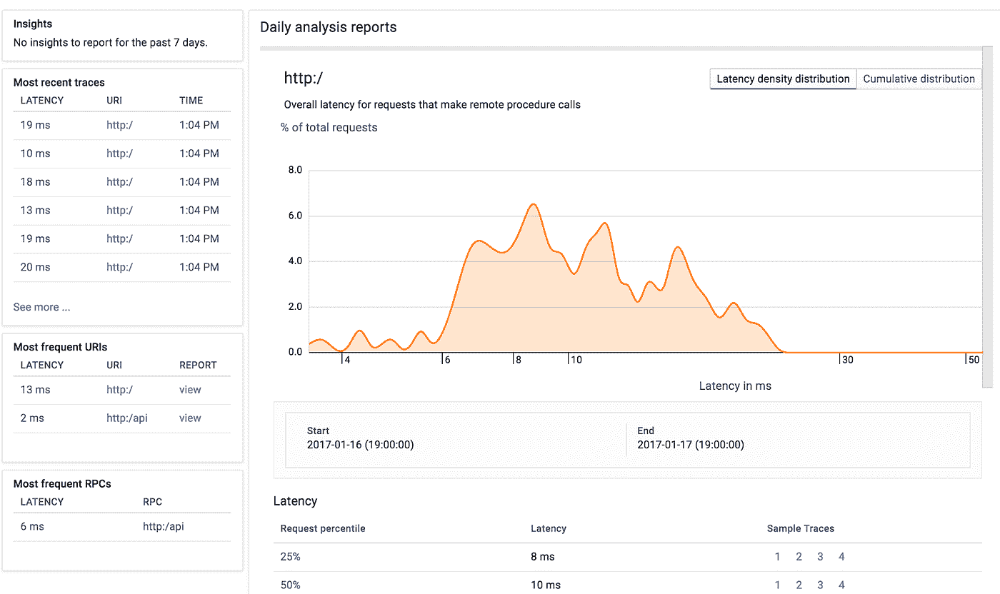
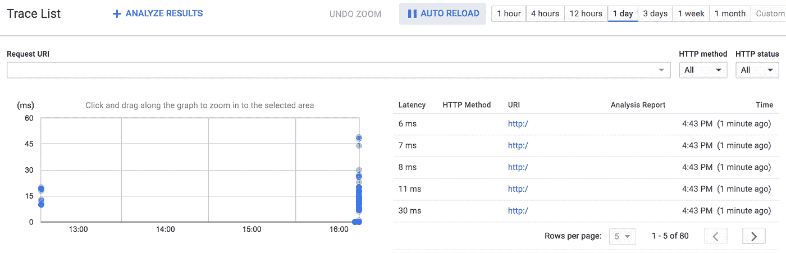
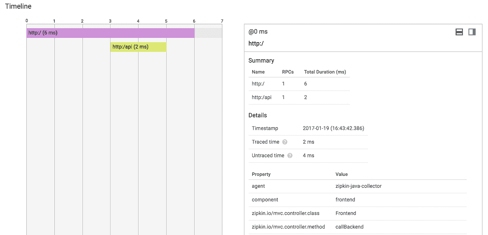
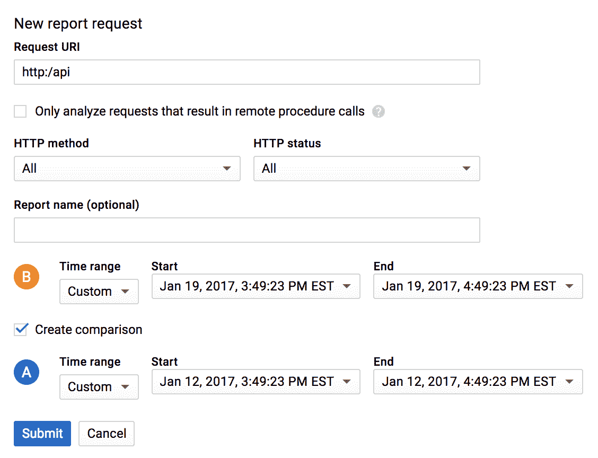

# 使用 Stackdriver Trace 的分布式跟踪 Spring Boot 微服务

> 原文：<https://medium.com/google-cloud/distributed-tracing-spring-boot-microservices-with-stackdriver-trace-7fe42c6de3f3?source=collection_archive---------0----------------------->

大约在 2006 年，我在一家咨询公司工作，被指派为一家公用事业客户的集成解决方案架构师，负责实现面向服务的架构。我记得我的经理当时坚持让我们开发一个框架，这个框架将生成一个请求 ID，并将相同的请求 ID 传播给所有后续的服务调用。经理还坚持记录服务调用持续时间，并将它们绑定到同一个请求 ID。目标是能够:

1.  在复杂的服务世界中确定一连串的呼叫。
2.  调试请求并找出哪个服务导致了服务调用链中的错误。
3.  确定服务在延迟/性能方面是否符合服务级别协议。

一晃 10 多年过去了，我意识到我们实现的实际上是一种分布式跟踪。在微服务领域，我们比以往任何时候都更需要分布式跟踪。

# 堆栈驱动程序跟踪

谷歌云平台有一个分布式追踪解决方案，叫做 [Stackdriver Trace](https://cloud.google.com/trace/) 。Stackdriver Trace 是一项托管服务，因此您无需自己管理服务器组件或复杂的存储。Stackdriver Trace 公开了一个 API，这样无论你是在 Google 云平台还是其他任何地方运行服务，你都可以发送跟踪信息。

我不想编写定制代码来直接使用 [Google Cloud Trace API](https://docs.google.com/document/d/1CzzNcfAAfzTerYJCWlpf1iOnUhdxoPxoo3TIQzGmpzI/edit#) ，而是想使用现成的组件和*事实上的*标准，这样我就可以有一个可移植的应用程序，避免供应商锁定(我也有点懒:)。

## Stackdriver Trace 已经准备好了

好消息是已经有了 Stackdriver Trace 的 Zipkin 代理。我可以专注于用优秀的框架(比如 Spring Boot 和 Spring Cloud)编写我的应用程序，我可以记录和存储分布式跟踪数据，而不必担心基础设施。

代理可以作为 JAR 文件或 Docker 容器运行。配置它们的方式是相同的。

**更新 2017 年 4 月 6 日**:*stack driver Trace Zipkin Proxy 现移至*[*openzipkin/Zipkin-GCP*](https://github.com/openzipkin/zipkin-gcp)*资源库！另外，如果你使用的是 Spring Boot，可以使用与春云 Sleuth 无缝集成的* [*春云 GCP 痕迹启动器*](https://docs.spring.io/spring-cloud-gcp/docs/1.0.0.M2/reference/htmlsingle/#_spring_cloud_sleuth) *。*

您可以在 [Stackdriver Trace Maven 资源库](https://mvnrepository.com/artifact/com.google.cloud.trace.adapters.zipkin/collector)中找到可执行文件 Zipkin proxy JAR 的最新版本，或者下载最新版本:

```
$ wget -O zipkin-stackdriver-collector.jar \ '[https://search.maven.org/remote_content?g=com.google.cloud.trace.adapters.zipkin&a=collector&v=LATEST](https://search.maven.org/remote_content?g=com.google.cloud.trace.adapters.zipkin&a=collector&v=LATEST')'
```

有几种方法可以将此代理配置为与 Stackdriver Trace 进行安全通信:

1.  如果您安装了 [gcloud SDK](https://cloud.google.com/sdk/) ，它将使用来自 gcloud SDK 的凭证，无需额外配置。
2.  如果你在谷歌云平台虚拟机或应用引擎上运行它，它将能够使用机器凭证，而无需额外配置。
3.  如果您想使用一致的凭证在任何地方运行它，您可以通过环境变量将其配置为使用服务帐户。

## 服务帐户

我喜欢便携，所以我选择使用服务帐户。如果您不想使用服务帐户，请参阅下一节。要创建服务帐户，请导航至**IAM&Admin**>**服务帐户**，然后单击**创建服务帐户**:



确保为该服务帐户添加**云跟踪代理**角色，并选择**提供一个新的私钥**和 **JSON 密钥类型**:



最后，点击**创建**创建服务账户。这还会提示您下载服务帐户 JSON 文件。安全地存储此文件；这是将用于发送和存储跟踪数据的凭据。如果此凭据被破坏，您可以使密钥失效并提供新的密钥。因为此服务帐户仅具有云跟踪代理角色，所以凭据将无法读取任何跟踪数据，也无法针对任何其他 Google 云平台 API 进行操作。如果您的应用程序需要使用多个 Google Cloud Platform APIs，您可以使用同一个服务帐户启用多个角色。

## 在本地运行 Zipkin 代理

让我们用一些环境变量来启动代理，以指向 Google Cloud 项目和之前创建的服务帐户:

```
$ PROJECT_ID=springboot-zipkin-example \
  GOOGLE_APPLICATION_CREDENTIALS=/path/to/service/account.json \
  java -jar zipkin-stackdriver-collector.jar
```

一旦启动，它将在默认端口(9411)上接受 Zipkin 跟踪数据。

如果您不使用服务帐户，但在本地安装了 gcloud SDK(并经过鉴定)，则无需任何额外配置即可启动它:

```
java -jar zipkin-stackdriver-collector.jar
```

在幕后，Zipkin 代理将把 Zipkin 请求翻译成 Stackdriver 跟踪请求，然后通过高性能 gRPC API 把请求发送给 Stackdriver。该代理还预先配置了 netty-tcnative 组件，这是安全 gRPC 访问所必需的。

# Spring Boot 和《春云探案》

Spring Cloud Sleuth 是一个 Spring Boot 组件，可以轻松地绑定到 Spring Boot 微服务框架中，并拦截服务调用以记录跟踪事件。Sleuth 标配 Zipkin 适配器。如果您有自己的 Spring Boot 应用程序，只需添加 Spring Cloud Sleuth 依赖项:

```
<dependencies>
...
  <dependency>
    <groupId>org.springframework.cloud</groupId>
    <artifactId>spring-cloud-starter-sleuth</artifactId
  </dependency>
  <dependency>
    <groupId>org.springframework.cloud</groupId>
    <artifactId>spring-cloud-sleuth-zipkin</artifactId>
  </dependency>
...
</dependencies>
```

我在 GitHub 上找到了一个有用的例子，我将把它作为我的试金石:【https://github.com/openzipkin/sleuth-webmvc-example。

首先，克隆这个例子:

```
$ git clone [https://github.com/openzipkin/sleuth-webmvc-example](https://github.com/openzipkin/sleuth-webmvc-example)
$ cd sleuth-webmvc-example
```

默认情况下，Sleuth 不会为每个请求发送跟踪数据。您可能也不想跟踪每一个请求。可以通过配置 spring . sleuth . sampler . percentage 属性来调整跟踪采样率。

出于演示目的，我将把采样率提高到 100%:

```
$ echo “spring.sleuth.sampler.percentage=1.0” >> src/main/resources/application.properties
```

一切就绪。我可以编译代码，启动后端，然后启动前端:

```
$ ./mvnw compile
$ ./mvnw exec:java -Dexec.mainClass=sleuth.webmvc.Backend
$ ./mvnw exec:java -Dexec.mainClass=sleuth.webmvc.Frontend
```

如果你没有使用 Spring Boot，不用担心。Zipkin 代理可以接受来自任何 Zipkin 兼容客户端的请求。例如， [Brave](https://github.com/openzipkin/brave) Zipkin 客户端可以和 gRPC、JAX-RS、Jersey、RestEasy 等等一起使用。

## 测试一下

到目前为止一切顺利！后端运行在端口 9000，前端运行在端口 8081。大约需要 100 个请求才能分析汇总的跟踪指标。我使用 Apache Benchmark 来生成请求:

```
$ ab -n 100 -c 10 [http://localhost:8081/](http://localhost:8081/)
```

# 看数据

目前，Zipkin 代理只能接收跟踪数据，但不能用于可视化或分析数据。但是可以直接在 Stackdriver Trace 中看到数据。

导航到谷歌云平台控制台中的 **Trace** 查看数据。有了足够的数据，您可以看到汇总的摘要，显示延迟密度分布、百分位数、最近的跟踪、最频繁的 URIs 等等。



延迟分布概述



查看跟踪列表



详细查看痕迹

我不仅可以看到不同请求之间的时间分布，还可以看到额外的属性，比如 Spring 组件名和 Spring 控制器类名和方法。那有用！

## 检测性能回归

我发现 Stackdriver Trace 最吸引人的地方是能够比较和对比两个不同时间段的数据。

假设您运行应用程序的 1.0 版一个月，明天升级到 1.1 版。即使是小改版升级，怎么知道有没有性能回归？在 Stackdriver Trace 中，只需选择两个不同的时间范围来比较延迟分布:



# 试一试

如果你想试一试，你可以注册[谷歌云平台免费试用](https://cloud.google.com/freetrial)。参见[将 Stackdriver Trace 与 Zipkin](https://cloud.google.com/trace/docs/zipkin#how_to_configure_zipkin_tracers) 一起使用，了解更多使用示例和常见问题。我也想听听你的反馈和想法。