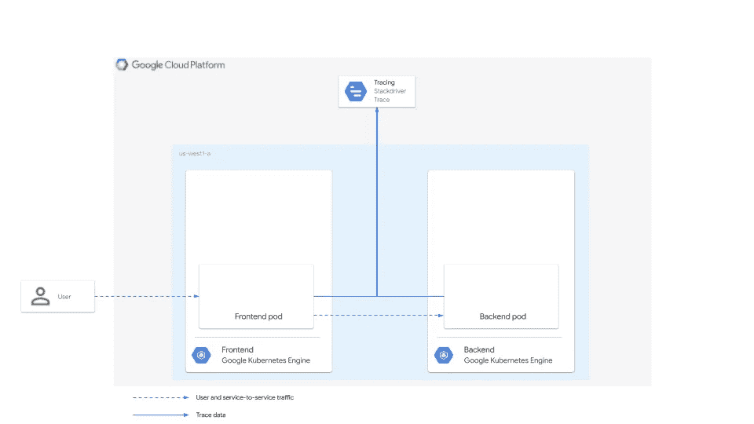
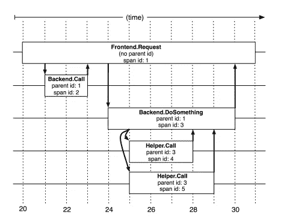
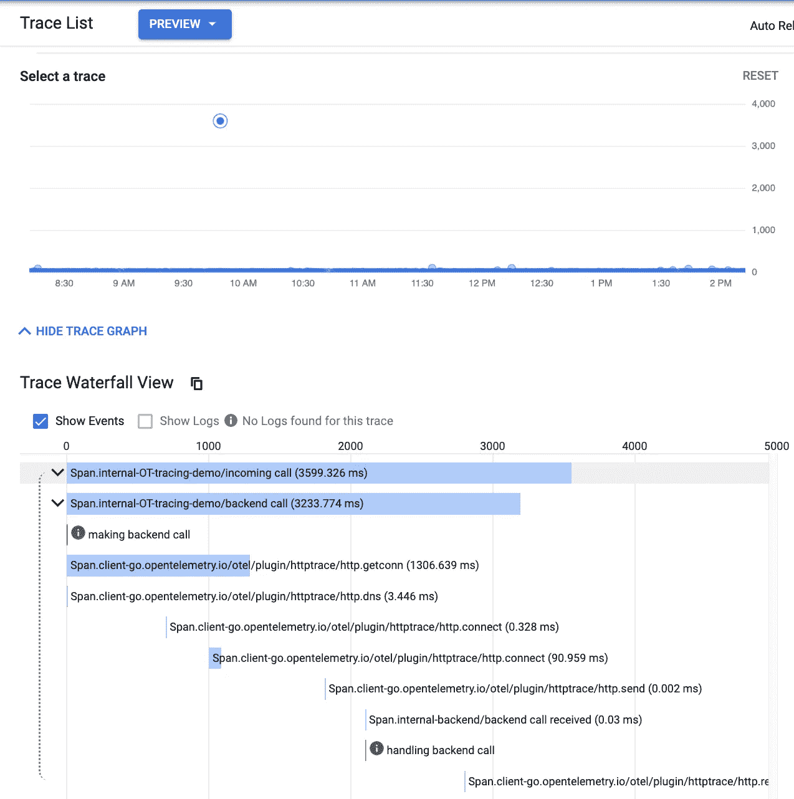

# 开放式遥测分布式跟踪

> 原文：<https://medium.com/google-cloud/distributed-tracing-with-opentelemetry-c0215ef38203?source=collection_archive---------1----------------------->

去年年底，我有幸出版了关于使用 OpenCensus 进行分布式追踪的参考指南。在这篇文章中，我介绍了分布式跟踪的基础知识，比如跟踪、跨度和上下文传播，并演示了如何使用 OpenCensus 来检测一对用 Go 编写的简单的前端/后端服务。从那以后，OpenCensus 和 OpenTracing 项目合并成了 [OpenTelemetry](https://opentelemetry.io) ，这是一套“API、库、代理和收集器服务，用于从您的应用程序中捕获分布式跟踪和指标。”我想尝试用新项目重现我在 OpenCensus 中的工作，看看有多少变化。

# 目标

对于这个练习，我构建了一个简单的[演示](https://github.com/yuriatgoogle/stack-doctor/opentelemetry-tracing-demo)。它由两个服务组成。前端服务接收传入的请求，并向后端发出请求。后端接收请求并返回响应。我们的目标是跟踪这种交互，以确定总体响应延迟，并理解这两种服务以及它们之间的网络连接如何影响总体延迟。

在最初的指南中，这两个服务被部署在两个独立的 GKE 集群中，但是这实际上对于演示分布式跟踪是不必要的。在本练习中，我们将简单地在本地运行这两个服务。

虽然基本概念在参考指南中有所涉及，并且在 Google Dapper research [论文](https://research.google.com/archive/papers/dapper-2010-1.pdf)中有更详细的内容，但是仍然有必要在这里简要介绍一下，这样我们就可以理解它们是如何在代码中实现的。

来自参考指南:

> 一条跟踪*是描述分布式系统如何响应用户请求的全部信息。跟踪由*跨度*组成，其中每个跨度代表服务用户请求所涉及的特定请求和响应对。*父*跨度描述终端用户观察到的延迟。每个*子*跨度描述了分布式系统中的特定服务是如何被调用和响应的，以及为每个服务捕获的延迟信息。*

这在前面提到的研究论文中用这个图表很好地说明了:

让我们看看如何使用 OpenTelemetry 在前端/后端服务对中实现分布式跟踪。

> ***注意*** *这大部分是从 OpenTelemetry 发布的***样本中选取的【Github】***【回购】。我做了相对较小的改动，添加了定制的 spans 并使用了 Mux 路由器，而不仅仅是基本的 HTTP 处理。***

# **前端代码**

**我们先来回顾一下前端[代码](https://github.com/yuriatgoogle/stack-doctor/blob/master/opentelemetry-tracing-demo/go/frontend/frontend.go)。**

# **进口**

**首先，进口:**

**在这一点上，我们主要使用各种各样的 OpenTelemetry 库。我们还将使用 [Mux](https://github.com/gorilla/mux) 路由器来处理 HTTP 请求(我主要使用它，因为它似乎类似于 Node.js 中的 Express)。**

# **主要功能**

**接下来，让我们看看我们服务的`main()`函数:**

**如你所见，这是一条直路。我们从一开始就初始化跟踪，并使用 Mux 路由器来处理对`/`的请求的单个路由。然后，我们在端口 8080 上启动服务器。我添加了一个环境变量来检查我是否在本地运行代码，以绕过 MacOS 提示，按照这些[指令](/@leeprovoost/suppressing-accept-incoming-network-connections-warnings-on-osx-7665b33927ca)允许入站网络连接。**

# **初始化跟踪**

**接下来，我们来看看`initTracer()`功能:**

**这里，我们只是实例化 Stackdriver 导出器，并设置采样参数来捕获每个跟踪。**

# **处理请求**

**最后，让我们看看被调用来处理对`/`的请求的`mainHandler()`函数。**

**这里，我们将跟踪器的名称设置为“OT-tracing-demo ”,并启动一个标记为“incoming call”的根 span。然后，我们创建一个标记为“后端调用”的子跨度，并将上下文传递给它。然后，我们向后端服务器创建一个请求，其位置在一个 env 变量中定义，并将我们的上下文注入到该请求中——稍后我们将看到如何在后端使用该上下文。最后，我们发出请求，获取状态代码，并输出确认消息。相当简单！**

**有几件事需要进一步注意:**

*   **我显式地关闭子跨度，而不是使用`defer`来控制计时器停止的确切时间。**
*   **我将事件添加到跨度中，以获得更清晰的标签。**

**现在，让我们看看我们的[后端](https://github.com/yuriatgoogle/stack-doctor/blob/master/opentelemetry-tracing-demo/go/backend/backend.go)。**

# **后端代码**

**这里的大部分代码与前端非常相似——我们使用完全相同的`main()`和`initTracer()`函数来运行服务器和初始化跟踪。**

# **主处理器**

**`mainHandler()`函数看起来确实很不一样。这里，我们从传入的请求中提取 span 上下文，使用该上下文创建一个新的请求对象，并使用该请求上下文创建一个新的 span。我们还将一个事件添加到我们的 span 中进行显式标记。最后，我们向调用者返回“OK”并关闭我们的 span。同样，我可以使用`defer span.End()`而不是显式地这样做。**

> *****注意****span 上下文和 request 上下文的区别。当接受传入的上下文并使用它来创建子跨度时，这一点尤其重要。关于这两个的进一步探索，可以看看来自 OpenTracing 的相关* [*文档*](https://opentracing.io/docs/best-practices/) *。***

**既然我们已经看到了如何在我们的代码中实现跟踪工具，让我们看看这个工具产生了什么。在为前端和后端设置了相关的环境变量并使用`gcloud auth login`登录 Google Cloud 后，我们可以在本地运行前端和后端。一旦我们这样做了，我们就可以点击前端的 http://localhost:8080 并发出一些请求。这应该会立即导致跟踪被写入 Stackdriver:**

****

**您可以看到我们在代码中指定的 span 名称，以及我们为了更清楚地标记而添加的事件。另一件让我惊喜的事情是，OpenTelemetry 明确地添加了 HTTP/networking 栈的步骤，包括 DNS、连接、发送和接收数据。**

**我非常喜欢尝试用 OpenTelemetry 重现我在 OpenCensus 中所做的工作，并最终发现它可以理解和清晰，尤其是当我被指向 tracer 时。Start()方法来创建子跨度。下次当我尝试使用 OpenTelemetry 的 stats 特性来创建自定义指标时，请回来。直到那时！**

**【http://github.com】原载于**。****