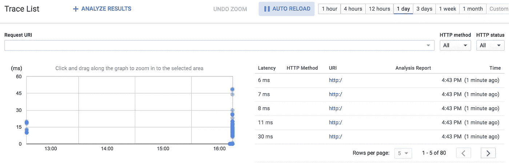

# 在 Kubernetes 中使用 Zipkin、Stackdriver Trace 进行分布式追踪

> 原文：<https://medium.com/google-cloud/distributed-tracing-with-zipkin-stackdriver-trace-in-kubernetes-86f572e63d46?source=collection_archive---------1----------------------->

在[上一篇文章](/google-cloud/distributed-tracing-spring-boot-microservices-with-stackdriver-trace-7fe42c6de3f3#.abeuxfnw4)中，我为 Stackdriver trace 配置了一个 Zipkin 代理，通过 Spring Cloud Sleuth 从 Spring Boot 微服务中捕获跟踪信息。

您可以在任何地方运行 Zipkin 代理——在您的本地笔记本电脑上、在您自己的数据中心、在虚拟机中或在容器中。本文将在 Kubernetes 中部署 Zipkin 代理(使用 [Google 容器引擎](https://cloud.google.com/container-engine/))，然后部署微服务向该代理发送跟踪信息。

# 创建新的 Kubernetes 集群

首先，使用 Google 容器引擎和 [gcloud SDK](https://cloud.google.com/sdk/downloads) 创建一个新的 Kubernetes 集群:

```
$ gcloud container clusters create mycluster --scopes default
```

这将创建一个新的 Kubernetes 集群，并将 Kubernetes 凭证下载到您的本地机器上。指定 scopes 参数很重要。此作用域将启用经常使用的权限，如创建新的跟踪记录。您部署到此群集中的任何容器都将能够继承此权限。通过指定 [trace.append](https://cloud.google.com/trace/docs/reference/v1/rest/v1/projects/patchTraces) 作用域，您可以对作用域进行细粒度的控制。

# 部署 Zipkin 代理

Stackdriver Trace 的 Zipkin 代理已经容器化了。它可以直接从命令行轻松部署到 Kubernetes 中:

```
$ kubectl run stackdriver-zipkin \
  --image=gcr.io/stackdriver-trace-docker/zipkin-collector:v0.2.0 \
  --expose --port=9411
```

这将把 Zipkin 代理容器的一个实例部署到 Kubernetes 集群中，并将其公开为一个服务，可以从集群内部通过 URL http://stack driver-Zipkin:9411/访问该服务。

# 部署 Sleuth 示例

我还将 Sleuth WebMVC 示例封装到了一个容器中。我还可以将前端和后端都部署到 Kubernetes 中。此外，我想对它们进行配置，以便它们在适当的端点而不是从本地主机消费服务。

要部署后端:

```
$ kubectl run sleuth-example-backend \
  --env="SPRING_ZIPKIN_BASEURL=[http://stackdriver-zipkin:9411](http://stackdriver-zipkin:9411)" \
  --env="SPRING_SLEUTH_SAMPLER_PERCENTAGE=1.0" \
  --image=saturnism/sleuth-webmvc-example \
  --expose --port=9000 \
  -- -Dexec.mainClass=sleuth.webmvc.Backend
```

这将直接从环境变量中配置几个 application.properties 条目。特别是，我希望确保后端将跟踪数据发送到 Kubernetes 集群中的 Zipkin 代理，而不是 http://localhost:9411。

这也将后端公开为一个内部服务，可以通过 http://sleuth-example-back end:9000 从 Kubernetes 集群内部访问。

类似地，要部署前端:

```
$ kubectl run sleuth-example-frontend \
  --env="SPRING_ZIPKIN_BASEURL=http://stackdriver-zipkin:9411" \
  --env="SPRING_SLEUTH_SAMPLER_PERCENTAGE=1.0" \
  --env="BACKEND_HOST=sleuth-example-backend" \
  --image=saturnism/sleuth-webmvc-example \
  -- -Dexec.mainClass=sleuth.webmvc.Frontend
```

该命令还通过环境变量配置后端主机名。

最后，我希望将前端公开为外部服务，以便可以通过公共 IP 访问它:

```
$ kubectl expose deployment sleuth-example-frontend \
  --port=8081 \
  --target-port=8081 \
  --type=LoadBalancer
```

这将创建一个 [Google Cloud Platform 网络负载平衡器](https://cloud.google.com/compute/docs/load-balancing/network/)，它将能够将流量从公共 IP 路由到任何前端实例(目前只有一个实例)。

您需要运行以下命令来检查公共 IP 是否已分配:

```
$ kubectl get svc sleuth-example-frontend
NAME                      CLUSTER-IP      EXTERNAL-IP       PORT(S)          AGE
sleuth-example-frontend   10.15.249.158   AAA.BBB.CCC.DDD   8081:30674/TCP   30s
```

寻找外部 IP，然后通过 http://AAA.BBB.CCC.DDD:8081/[和](http://AAA.BBB.CCC.DDD:8081/)访问前端

# 生成请求

我使用 Apache Bench 针对新创建的端点生成请求:

```
$ ab -n 1000 -c 10 http://AAA.BBB.CCC.DDD:8081/
```

如果工作正常，您应该在 Stackdriver 跟踪控制台中看到跟踪细节:



## 试一试

参见[使用带有 Zipkin 的 Stackdriver Trace】获取更多示例和常见问题，了解如何使用代理。我也想听听你的反馈和想法。](https://cloud.google.com/trace/docs/zipkin#how_to_configure_zipkin_tracers)

您可以在我的 GitHub 上找到更多示例:

[](https://github.com/saturnism/spring-boot-docker/tree/master/examples-java/kubernetes) [## 土星主义/弹簧靴码头

### 在 GitHub 上创建一个帐户，为 spring-boot-docker 的开发做出贡献。

github.com](https://github.com/saturnism/spring-boot-docker/tree/master/examples-java/kubernetes)