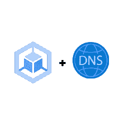

# GKE 域名系统:你需要知道的一切

> 原文：<https://medium.com/google-cloud/dns-on-gke-everything-you-need-to-know-b961303f9153?source=collection_archive---------0----------------------->

哇，另一篇关于 Kubernetes/GKE 域名系统的文章，互联网上已经有足够多的域名了吗？是的，有，但我写这篇文章是作为我在试图理解 DNS 的一切时所学内容的恢复版本。所以我主要是为自己写的，如果你觉得有用，一切都会赢:)

这篇文章试图回答一个简单的问题:当决定如何使用 DNS 与 GKE…