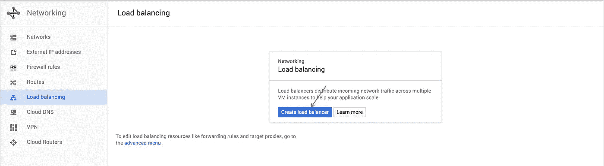
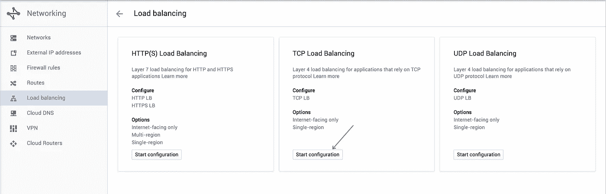
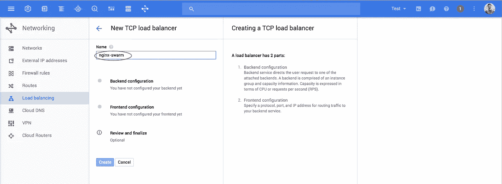
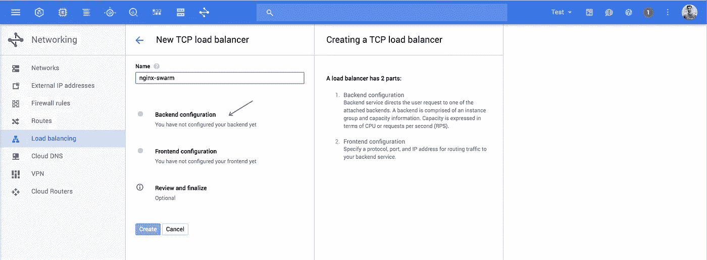
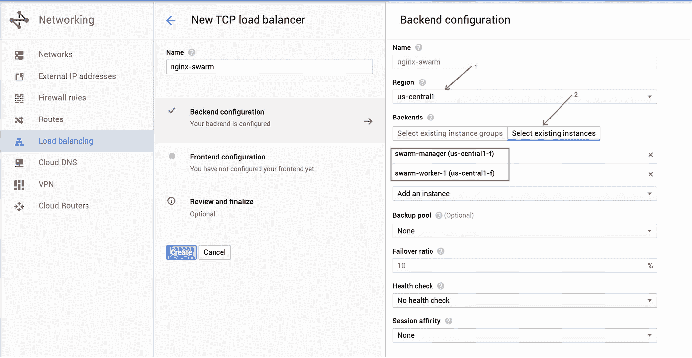
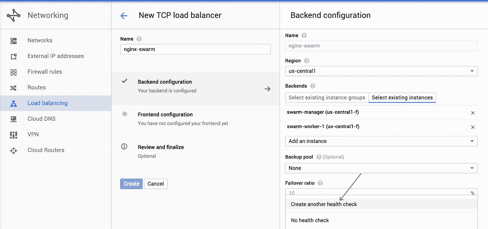
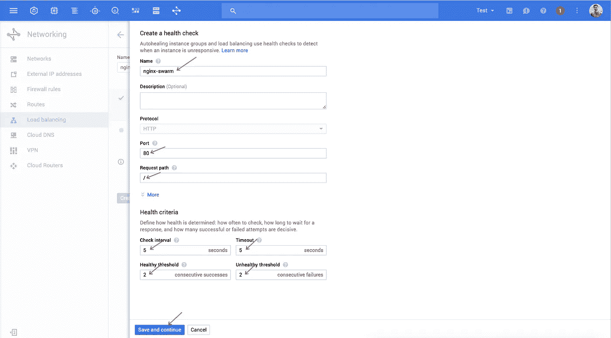
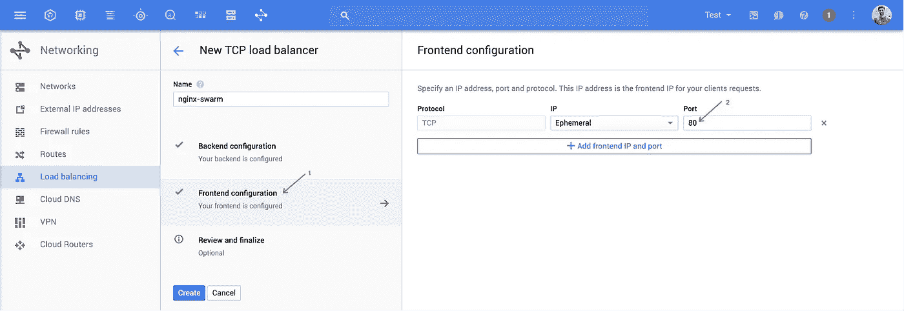

# 谷歌云平台上的 Docker Swarm

> 原文：<https://medium.com/google-cloud/docker-swarm-on-google-cloud-platform-c9925bd7863c?source=collection_archive---------0----------------------->

新的 [Docker 1.12 版本](https://blog.docker.com/2016/06/docker-1-12-built-in-orchestration/)发生了一些有趣的事情。Docker 正在将 Swarm 捆绑到 Docker 本身，同时用更成熟的容器编排能力升级 Swarm。

Swarm 现在加入了 [Kubernetes](http://kubernetes.io) 、 [Mesos](http://mesos.apache.org/) 和 [Nomad](https://www.nomadproject.io/) 的行列，成为一个成熟的编排引擎。有了这些新的编排能力，我想再看看 Swarm。我也喜欢“虫群”这个名字；)

Swarm 在谷歌云上还没有现成的选项。希望这很快被添加，但在此之前，让我们看看如何在 Google 云平台上手动设置一个 Swarm 集群。

**总而言之，您应该在大约 15 分钟内拥有一个全功能的 Swarm 集群！**

事实上，Google Compute Engine 在配置虚拟机方面非常快，如果您并行运行节点创建和设置，您可以在大约五分钟内创建一个集群！疯狂的快！

> [**使用此脚本进行全自动安装**](https://github.com/thesandlord/google-cloud-swarm) **！**

***注:*** *Swarm 1.12 还很年轻。文档很少，并且仍在发展。我希望情况很快会好转。*

# 先决条件

你需要 Docker 1.12 来获得升级的 Swarm 特性。以下是我所知道的:

```
$ docker -v
Docker version 1.12.0-rc2, build 906eacd, experimental$ docker-machine -v
docker-machine version 0.8.0-rc1, build fffa6c9
```

你还需要安装[谷歌云 SDK](http://cloud.google.com/sdk) ，以及一个[谷歌云项目](http://console.cloud.google.com/project)。完成后，请确保登录:

```
$ gcloud init
```

# 创造蜂群

第一步是创建群节点。

理想情况下，您将使用一个[托管实例组](https://cloud.google.com/compute/docs/instance-groups/)，但是我将把它留到另一个教程中。

让我们创建一个管理节点和一个工作节点。

## 管理器节点设置

使用 docker-machine 创建管理器节点:

```
$ docker-machine create swarm-manager \
    --engine-install-url experimental.docker.com \
    -d google \
    --google-machine-type n1-standard-1 \
    --google-zone us-central1-f \
    --google-disk-size "500" \
    --google-tags swarm-cluster \
    --google-project <YOUR_PROJECT_ID>
```

用您的项目 ID 替换<your_project_id>。还可以随意更改区域、机器类型和磁盘大小。要做的重要事情是用“swarm-cluster”标记这个实例，这将让我们稍后打开防火墙端口。</your_project_id>

大约五分钟后，管理器将被创建。

现在我们需要将这台机器设置为群组管理器

```
$ eval $(docker-machine env swarm-manager)
$ docker swarm init
```

您的经理现已创建！

## 工作节点设置

以与管理器相同的方式创建一个工作节点:

```
$ docker-machine create swarm-worker-1 \
    --engine-install-url experimental.docker.com \
    -d google \
    --google-machine-type n1-standard-1 \
    --google-zone us-central1-f \
    --google-disk-size "500" \
    --google-tags swarm-cluster \
    --google-project <YOUR_PROJECT_ID>
```

现在，我们需要获得经理的 IP 地址，这样我们就可以加入群。

```
$ gcloud compute instances list
NAME           ZONE          MACHINE_TYPE  INTERNAL_IP EXTERNAL_IP
swarm-manager  us-central1-f n1-standard-1 10.240.0.0  130.x.x.x
swarm-worker-1 us-central1-f n1-standard-1 10.240.0.1  104.x.x.x 
```

使用群管理器的内部 IP 将您的工人连接到群。默认网络设置会打开内部子网上的所有端口，这样您就不必扰乱防火墙规则。

```
$ eval $(docker-machine env swarm-worker-1)
$ docker swarm join <SWARM_MANAGER_INTERNAL_IP>:2377
```

重复这些步骤，将更多的工人添加到群体中。

重新登录群管理器，开始执行命令。

```
$ eval $(docker-machine env swarm-manager)
```

例如，您可以看到群中的所有节点:

```
$ docker node ls
ID    NAME           MEMBERSHIP STATUS AVAILABILITY MANAGER STATUS
xxx * swarm-manager  Accepted   Ready  Active       Leader
yyy   swarm-worker-1 Accepted   Ready  Active
```

集群设置已经完成！

# 创建服务

创建服务很简单。这基本上和你在普通 Docker 中使用的命令是一样的。

例如，要在端口 80 上启动一台 nginx 服务器，请运行:

```
$ docker service create --replicas 1 -p 80:80/tcp --name nginx nginx
```

我们可以看到这个过程在运行。

```
$ docker service ls
ID            NAME   REPLICAS  IMAGE  COMMAND
2umwwwc6tu9d  nginx  1/1       nginx
```

Swarm 将确保副本始终运行。我们还可以使用一个命令来增加或减少副本的数量:

```
$ docker service scale nginx=10
```

很酷的东西！您可以做更复杂的事情，但是文档很少。[发布博文](https://blog.docker.com/2016/06/docker-1-12-built-in-orchestration/)拥有迄今为止最好的信息。

# 公开服务

现在你有 nginx 在你的群中运行，你必须向外界开放它。默认情况下，Swarm 将在 Swarm 中的每个节点上的指定端口上公开服务。这非常类似于用 NodePort 在 Kubernetes 中创建一个[服务。我们需要暴露这个端口！](http://kubernetes.io/docs/user-guide/services/#type-nodeport)

*补充说明:我真的希望 Docker 增加对谷歌云平台的本地支持，这样这些东西就可以自动运行，就像它们在 Kubernetes 中的功能一样。*

## 选项 1 —公开单个节点:

最简单的方法是打开一个节点上的端口，并为您的网站或服务使用该节点的 IP 地址。

对于只有一个经理和几个工人的小型集群，我会使用这个选项。

打开 Swarm 实例上的端口

```
$ gcloud compute firewall-rules create nginx-swarm \
  --allow tcp:80 \
  --description "nginx swarm service" \
  --target-tags swarm-cluster
```

现在获取节点的外部 IP 地址。

```
$ gcloud compute instances list
NAME           ZONE          MACHINE_TYPE  INTERNAL_IP EXTERNAL_IP
swarm-manager  us-central1-f n1-standard-1 10.240.0.0  130.x.x.x
swarm-worker-1 us-central1-f n1-standard-1 10.240.0.1  104.x.x.x
```

使用其中一个节点的外部 IP 来访问您的服务。我建议使用经理的 IP 地址。

## 选项 2—循环域名系统:

使用与选项一相同的步骤，您可以将*所有*外部 IP 地址与[循环 DNS](https://en.wikipedia.org/wiki/Round-robin_DNS) 一起使用。这基本上给了你一种免费的负载平衡形式！唯一的问题是，如果您开始在集群中删除或添加节点，每次都需要更新 DNS 设置。DNS 客户端也大量缓存，因此如果您缩小规模，您的用户可能会遇到不再存在的节点。

**如果您有多个管理器，我会使用这种方法来提供一种简单的负载平衡和容错形式。**

## 选项 3— Google 云负载平衡器:

这是最健壮的，但也是最复杂的公开服务的方法。当你创建一个网络负载平衡器时，你得到一个单一的 IP 地址，但是流量被发送到集群中的所有节点。此外，您可以设置运行状况检查，以便在某个节点出现故障时，不会向其发送流量。

如果您想要最好的可靠性，或者拥有可能分布在多个区域以实现高可用性的较大集群，我推荐这个选项。

我将设置一个 [TCP 负载均衡器](https://cloud.google.com/compute/docs/load-balancing/network/)。如果适合您的服务，您还可以设置一个更强大的 [HTTPS 负载平衡器](https://cloud.google.com/compute/docs/load-balancing/http/)。

虽然你可以在命令行上这样做，但我觉得用户界面更直观。

打开[负载平衡器页面](http://console.cloud.google.com/networking/loadbalancing/list)。

单击“创建负载平衡器”



现在，单击 TCP 负载平衡器的“开始配置”



为您的负载平衡器命名



现在点击“后端配置”



选择你的群所在的区域，然后点击“选择现有实例”添加所有的群节点。



现在创建一个健康检查。



给你的健康检查一个名字，并配置你认为合适的数字。我使用了默认值。我们将每 5 秒钟 ping 端口 nginx 服务所在的位置),以确保节点是健康的。保存并继续。



现在转到前端配置，并为您的 Swarm 服务指定端口。



最后，单击“Create”，负载平衡器将在几分钟后启动。

您可以使用以下命令获取负载平衡器的 IP 地址:

```
$ gcloud compute forwarding-rules list
NAME        REGION      IP_ADDRESS      IP_PROTOCOL TARGET
nginx-swarm us-central1 104.xxx.xxx.xxx TCP         xxx
```

# 结论

有了 Docker 的 1.12 新版本，Swarm 非常容易安装和使用。一旦正式发布，那就更轻松了。Docker 团队做得很好！

我希望 Docker 添加更多的文档和示例，我真的希望他们添加对原生 Google Cloud 特性的支持，这样人们就不需要去摆弄防火墙和负载平衡器了！

我还计划在 Swarm 和 Kubernetes 之间做一个比较。我发现有很多不同和相似之处。敬请关注！