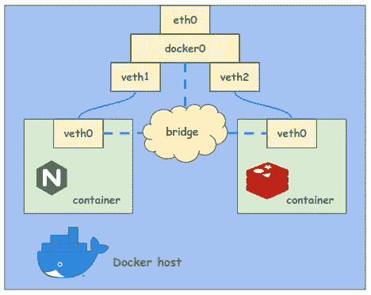
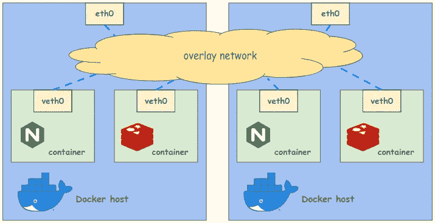
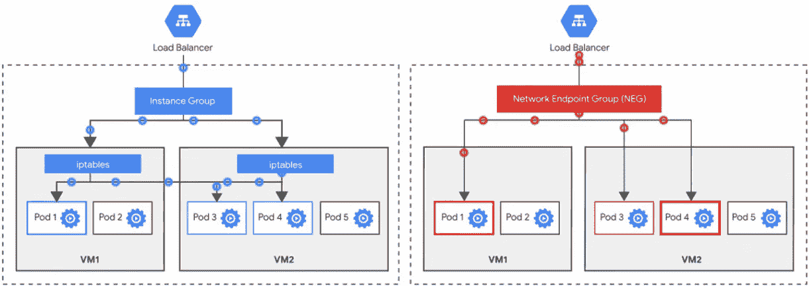
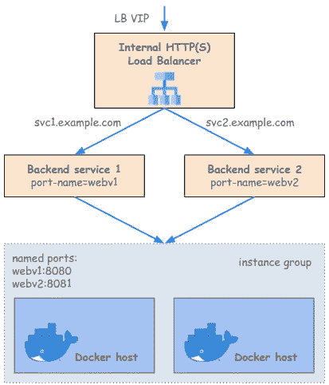
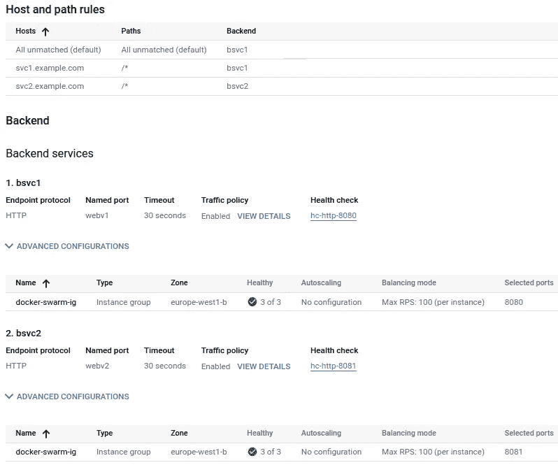

# GCP 的码头工人群体服务

> 原文：<https://medium.com/google-cloud/docker-swarm-services-in-gcp-edcaa14913f8?source=collection_archive---------1----------------------->


在这篇文章中，我描述了如何在 GCP 运行时公开 Docker 集群中的服务。我还分析了 Docker Swarm 和 GKE 在这方面的一些差异。

# 背景

Docker Swarm 是一个容器编排系统，用于管理部署在多个主机上的多个容器。很可能，这个定义让读者想起了非常流行的 Kubernetes。Swarm 和 Kubernetes 之间有一场战争，Swarm [声称使用起来更简单](https://www.mirantis.com/cloud-native-concepts/understanding-docker-swarm/what-is-docker-swarm/#section-3)而 Kubernetes 更强大，但我不会卷入这场战争。

如今 Kubernetes 或其任何风格(像 [*谷歌 Kubernetes 引擎*](https://cloud.google.com/kubernetes-engine) *-* GKE -在 GCP)似乎主导了云，但事实是 Docker Swarm 仍被许多公司使用。当将工作负载迁移到云时，并不是每个人都从他们选择的流程编排平台迁移。所以我认为了解如何在 GCP 运营 Docker Swarm 服务是很有用的。

我将主要关注网络部分。当我在 Swarm 中查看如何到达容器时，我意识到它的网络使用了一种不同于我更习惯的 GKE 的方法。GKE 集群是 GCP 的一等公民，因此集装箱和服务整合得非常好。正如你将看到的，Docker Swarm 需要做更多的工作。不要担心，我不会进入所有的细节，只需要最少的。

但是在继续之前，先说一下术语“*服务*”。一个 *Kubernetes 服务*指的是抽象和公开一组 pods 容器的网络结构。例如，*负载平衡器*就是一种服务。这就是我通常所指的意思。相比之下，Docker Swarm *服务*是一个容器，它的所有配置都以运行它的副本数量来表示。我希望从上下文中可以清楚我指的是什么。

# 遮掩

Docker 有三种基本的网络类型: ***桥*** ， ***主机*** 和*无* 。我只描述第一个。基本上，*桥*网络是主机上的私有内部网络，容器通常在这里运行。如果容器需要从外部访问，其端口可以在 Docker 主机上*发布* ( `--publish`标志)。

桥接网络是在 Linux 中实现的，带有一个虚拟桥接设备、 *docker0* 和一对用于容器的 *veth* (虚拟以太网)设备。一般来说，这类似于 Kubernetes 所做的，尽管实现可能有所不同。



在这种设置中，主机中的容器可以相互通信。然而，当您有一个由多个主机组成的集群时，跨主机的容器没有办法通信，这时您可能需要使用 Docker Swarm。它使用 ***覆盖网络*** 实现跨工作节点的 Docker 服务(记住，Docker 服务=容器)之间的通信。覆盖网络是建立在另一个网络之上的网络，它允许系统在没有直接连接时就像直接连接一样。



当你初始化 swarm 时，一个名为*入口*(以及其他组件)的覆盖网络就为你创建了。它跨越所有工作节点，允许容器之间的通信，如果您发布了它们，就可以从外部访问它们，还提供了内部负载平衡机制。这种负载平衡的工作方式是，可以在集群的任何节点上接收请求，并将其转发给在任何节点上运行的任何容器实例。

这个负载均衡部分听起来类似于 Kubernetes 的 [*NodePort 服务*](https://kubernetes.io/docs/concepts/services-networking/service/#type-nodeport) 。作为 Kubernetes 的一部分，你可能希望它也适用于 GKE。嗯，有一些差异，但肯定是这样，但是 GKE 有更好的方法来做负载平衡，特别是公开 HTTP 服务。这就是差异成为关键的地方。我将在这里强调与我们的目的更相关的两个问题。

首先，正如我提到的，Swarm 使用一个覆盖层，特别是一个 VXLAN 网络。这意味着由容器发送的以太网帧在被发送出 Docker 主机之前被封装在 UDP 包中。因此，在主机外部看不到容器 IP，只能在内部覆盖网络中看到。相比之下，GKE 可以使用 [*别名 IP*](https://cloud.google.com/blog/products/networking/understanding-native-container-routing-with-alias-ips)*，这允许在运行容器的虚拟机上配置辅助 IP，并以本机方式将流量路由到它们。这实现了更有效的负载平衡，其中外部负载平衡器可以不针对节点，而是针对提供服务的特定容器(pod)。*

**

*上图显示了两个配置不同的 GKE 集群:*

*   *在左侧，在典型的 Kubernetes 部署中，pod 使用 NodePort 服务，因此负载平衡器将流量分配给节点，第二层负载平衡将流量转发给容器，该容器可能在同一节点中，也可能不在同一节点中。通常不会，这会增加延迟，尤其是因为节点可能位于不同的云区域。*
*   *在右侧，有一个使用别名 IPs 和 [*网络端点组*](https://cloud.google.com/load-balancing/docs/negs) *的 GKE 集群。*负载均衡器直接以 pod 端点而不是节点为目标，避免了多次跳跃。*

*第二个区别是，即使 Docker Swarm 想要使用路由网络模型而不是封装网络模型，IP 到容器的分配也是随容器的部署而定，而不是随节点。别名 IP 和路由网络模型需要知道哪些 IP 子范围将被分配给节点。*

*简而言之，对于 Docker Swarm，我们将需要使用与左边类似的设置，其中后端是节点。*

# *实际案例*

*让我们部署一个场景来付诸实践。这个场景将由一些运行在 Docker 群服务/容器上的 HTTP 服务组成。*

## *一大群*

*我将使用三个码头主机，一个经理和两个工人。你可以按照像[这些](https://docs.docker.com/engine/install/debian/)这样的安装说明在你的 Linux 机器上安装 Docker，或者简单地输入:*

```
*$ curl -fsSL https://get.docker.com -o get-docker.sh
$ sudo sh get-docker.sh*
```

*在管理器主机上，初始化 swarm:*

```
*manager:~$ sudo docker swarm init
...
    docker swarm join --token <xxxxx> 10.132.0.2:2377
...*
```

*该命令的输出告诉您如何使用安全令牌并指向管理器的 IP 地址和用于集群管理的端口 2377，向集群添加一个 worker。将该行内容一字不差地粘贴到其他主机上，使其成为工作主机:*

```
*worker1:~$ sudo docker swarm join --token <xxxxx> 10.132.0.2:2377worker2:~$ sudo docker swarm join --token <xxxxx> 10.132.0.2:2377*
```

## *一些服务*

*我将在端口 8080 上部署一个简单 web 服务器应用程序的几个副本:*

```
*manager:~$ sudo docker service create --name my-web --replicas 3 -p 8080:8080 gcr.io/google-samples/hello-app:1.0*
```

*您可以在同一个网络中部署一个客户端虚拟机来测试对该 web 服务器的访问。我的节点具有从 10.132.0.2 到. 4 的 IP，因此这些节点现在都应该在端口 8080 上响应:*

```
*client:~$ watch -tn1 curl -s 10.132.0.3:8080*
```

*如果您观察几秒钟，您会看到不同的容器在响应，您可以从主机名看出这一点:*

```
*Hello, world!
Version: 1.0.0
Hostname: 78f61208d8c3*
```

*接下来，我将部署另一个类似的 web 服务器，版本 2。容器也将在端口 8080 上侦听，但是由于我们现在不能再映射到节点上的那个端口，所以我将使用 8081:*

```
*manager:~$ sudo docker service create --name my-web-v2 --replicas 3 -p 8081:8080 gcr.io/google-samples/hello-app:2.0client:~$ watch -tn1 curl -s 10.132.0.2:8081
Hello, world!
Version: 2.0.0
Hostname: 1ba54c792d62*
```

*现在我们已经部署了几个容器，如果您查看入口覆盖网络的详细信息，您可以看到分配给它们的 IP。遗憾的是，看起来你需要一个节点一个节点地进行，因为每个节点只会显示运行在其上的容器(或者至少我不知道更好的方法):*

```
*manager:~$ sudo docker network inspect ingress
...
  "Containers": {
    "1ba54c...": {
      "Name": "my-web-v2.3.ngz...",
      "IPv4Address": "10.0.0.29/24",
    },
    "a8cbe5...": {
      "Name": "my-web.3.5x2...",
      "IPv4Address": "10.0.0.25/24",worker1:~$ sudo docker network inspect ingress
...
      "IPv4Address": "10.0.0.27/24",
      ...
      "IPv4Address": "10.0.0.23/24",worker2:~$ sudo docker network inspect ingress
...
      "IPv4Address": "10.0.0.28/24",
      ...
      "IPv4Address": "10.0.0.24/24",*
```

*正如我提到的，Docker Swarm 不会为节点中的容器预先分配 IP 子范围，因此 IP 分配不是连续的。*

## *一个统治他们所有人的要人*

*访问节点 IPs 不太方便，也不能在请求中指定服务发布在哪个端口上。让我们部署一个 [*内部 HTTP(S)负载平衡器*](https://cloud.google.com/load-balancing/docs/l7-internal) 来提供一个 *VIP:port* 来访问服务。我将在这里画出架构，让读者自己去做。*

**

*我将 Docker 虚拟机作为一个 [*非托管实例组*](https://cloud.google.com/compute/docs/instance-groups) 的成员，并将这个组作为两个后端服务的后端。成员通过他们的虚拟机名称来识别，而不是通过 IP，因此*在 GCP 部署集群不需要您跟踪您的工作 IP！**

*实例组有两个 [*命名端口*](https://cloud.google.com/load-balancing/docs/backend-service#named_ports) 、‘*web v1:8080’*和’*web v2:8081’*，LB 的 URL 映射将请求路由到到后端服务的“*SVC 1 . example . com’*和“*SVC 2 . example . com’*。我们已经对用户隐藏了端口！*

**

*最后，我配置了云 DNS 来将这些域指向 LB VIP。我们可以从客户端虚拟机测试它的工作情况:*

```
*client:~$ watch -tn1 curl -s svc1.example.com
Hello, world!
Version: 1.0.0
Hostname: a8cbe5510a9c
...
client:~$ watch -tn1 curl -s svc2.example.com
Hello, world!
Version: 2.0.0
Hostname: 399d05d4d0ef*
```

*万岁！*

# *最终注释*

*有些事情我还没有提到，但我想提一下，哪怕只是简单地提一下:*

*   ***运行状况检查:**运行状况检查机制在此部署上不是最佳的。由于涉及到双重负载平衡，健康检查探测器通常不会检查实例上服务的健康状况。我建议在每个节点上部署一个简单的守护进程来检查实例的健康状况。*
*   ***TCP/UDP 服务:**您可以使用同一个实例组作为多个后端服务的后端，包括 TCP/UDP 负载平衡器的后端。*
*   ***添加新服务:**如果在第一次部署后出现了一个新服务，您可以创建所有需要的部分，如果需要的话*更新实例组的命名端口*。请注意，更新将替换内容，因此您的命名端口列表应该包括现有的和新的端口。*
*   ***节点自动伸缩:** Docker Swarm 不支持开箱即用的自动伸缩。您可以利用*托管实例组*根据 CPU 利用率等参数自动创建新的工作节点，并在引导时使用`docker swarm join`将它们加入集群。在这种情况下，您应该更加关注健康检查主题，因为被认为不健康的实例将被重新创建。*

# *结论*

*在 GCP 运行 Docker Swarm 带来了一些非常好的优势。它不像运行 GKE 那样流畅，但也没有那么复杂，这是一个快速将 docker 工作负载转移到云的机会。当然，我建议你看一看 GKE，看看它是否更适合你的用例；)*