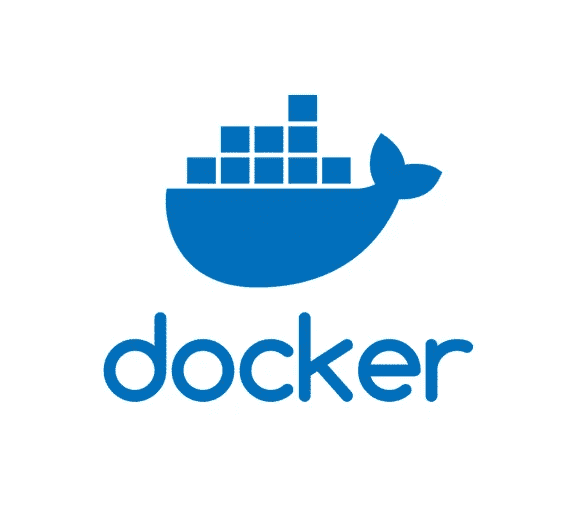

# 带有云 SDK 和环境变量的 Docker

> 原文：<https://medium.com/google-cloud/docker-with-cloud-sdk-environment-variables-adf1310bd5cc?source=collection_archive---------1----------------------->



又见面了。我正在分享我最近在 Docker 工作时学到的一些东西。要点是如何传入环境变量，在 Docker 中设置 Google Cloud SDK，开启调试。

因为我以前没有写过关于 Docker 的文章，所以我提供了 Docker 的一个简要概述，以给出我的指针的背景和基础。我建议做更多的挖掘，以了解其他地方的更多信息，特别是考虑到有许多其他资源，如这个 [Docker 概述](https://docs.docker.com/get-started/overview/)。

# 什么是 Docker

这是一种在隔离环境中构建和部署软件和应用程序的方式。您可以将构建和运行软件及其所有依赖项的代码打包到一个容器中，该容器实际上可以在任何有能力的计算环境或服务器上运行。它基本上创建了一个计算泡泡来构建和运行你的代码。

需要了解一些关键概念

## Dockerfile 文件

Dockerfile 文件保存了如何创建一个可以在 Docker 平台上运行的容器的指令。它打包应用程序，指令驱动它运行的服务器配置。

## Docker 图像

Docker 文件是您用来构建 Docker 映像的基础。Docker 映像是不可变的指令集，您可以运行它来创建 Docker 容器，您的软件将最终在该容器中运行和部署。

Docker file = > Docker image = > Docker Container = >独立的代码运行

使用此命令构建 Docker 映像。

```
docker build -t [*REGISTRY &/OR IMAGE NAME*] .
```

您可以在本地创建图像或将其发布到注册表。如果是本地的，就给它一个名字，如果是注册表的，就包括注册表路径和映像的名字。例如，如果我在本地构建它，那么我会用类似于 ***my-docker-image*** 的东西替换 IMAGE，但是如果我发布到注册表，那么我会用类似于***gcr.io/myprojectid/my-docker-image***的东西替换它

使用“.”也就是说使用当前目录来构建映像。你可以改变。如果文件位于其他位置，则指向一个路径。Dockerfile 需要在那个目录中，以及它运行时将加载到容器中的任何文件。

## Docker 注册表

Docker 注册表是您可以存储 Docker 图像的地方，尤其是当您想要公开共享它们时。您可以使用几个注册表来存储图像，它们可以是公共的，也可以是私有的。几个例子包括 [Docker Hub](https://hub.docker.com/search/?type=edition&offering=community) 和 [Google 容器注册表](https://cloud.google.com/container-registry) (gcr.io)。

使用此命令将图像上传到注册表。

```
docker push [*REGISTRY & IMAGE NAME*]
```

当开始使用 Docker 时，我发现的常见指导是重用已经构建的图像，以避免重新创建轮子，可以说，在不同的公共注册表中有很多可供选择的图像。

## 码头集装箱

这是您使用映像启动容器并运行代码的最终目的地。注意，它必须在安装了 Docker 平台的服务器上运行。

使用此命令运行 Docker 映像并创建一个容器。

```
docker run [*REGISTRY &/OR IMAGE NAME*]
```

# 添加环境变量

当我创建一个容器时，我想传入我的环境变量来增加安全性，并给这些变量一些灵活性。这一步介绍了如何做到这一点。

在 docker 文件中为每个变量添加这样一行。

```
ENV *[ENV VAR CONTAINER NAME] [ENV VAR NAME PASSED IN]*
```

*环境变量容器名称*是将在 Docker 容器中使用的环境变量名称，而中传递的*环境变量名称是您传递并分配给该变量的内容。*

特定变量名的示例。

```
ENV PROJECTID $PROJECT_ID
```

运行 Docker 映像时，将环境变量传递到 Docker 映像中，如下所示。

```
docker run -p 8080:8080 -e PROJECT_ID*=[PROJECT ID]* [*IMAGE*]
```

其中*项目 ID* 是本地 bash 环境变量的实际值，而 *IMAGE* 是 Docker 映像名称和/或您在构建它时给出的注册表路径和名称。

# 安装谷歌云 SDK

将以下指令添加到 docker 文件中，以安装 Google Cloud SDK。

```
RUN curl -sSL https://sdk.cloud.google.com | bash
```

我发现这一个衬垫作为[堆栈溢出答案](https://stackoverflow.com/questions/28372328/how-to-install-the-google-cloud-sdk-in-a-docker-image)。它将确保在您构建 Docker 映像和运行 Docker 容器时安装 Google Cloud SDK。

有关 SDK 映像的更多信息，尤其是那些已经存在的映像，请查看[安装云 SDK Docker 映像](https://cloud.google.com/sdk/docs/downloads-docker)。

# Docker 调试

我在使用 Docker 容器时遇到的最大挑战是，当代码失败并且没有像我预期的那样工作时，如何深入了解问题所在。

运行 Docker 时应用-D 来打开调试模式。

```
docker -D run [*REGISTRY &/OR IMAGE NAME*]
```

使用 debug 可以在我的终端中记录结果，并允许我获得消息，帮助我查明容器中的问题。因此，当您刚开始使用容器时，一定要使用它。

# 包裹

这篇文章的主要目的是分享我从使用 Docker 容器中学到的一些东西。主要内容包括如何导入环境变量、如何安装 Google Cloud SDK 以及如何调试。为了帮助提供这些指针的上下文，我给出了 Docker 是什么的概述。

这无疑使我更容易根据需要使用图像在不同的服务器上运行代码。有许多类型设置的图像可以帮助您快速启动和运行服务器。如果你不想花太多时间配置服务器，找到一个 Docker 镜像来使用或创建一个是值得的。