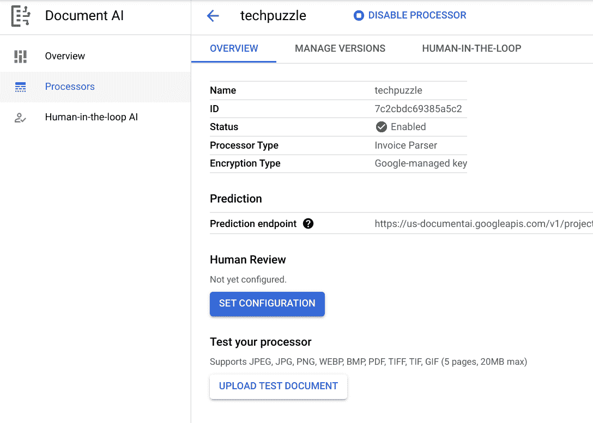
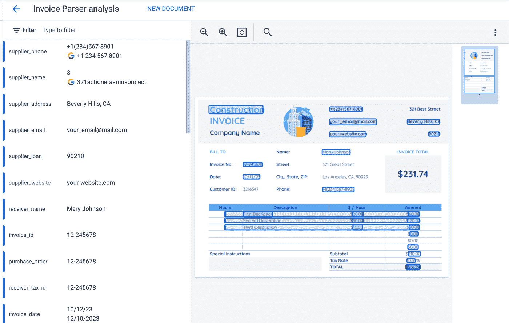
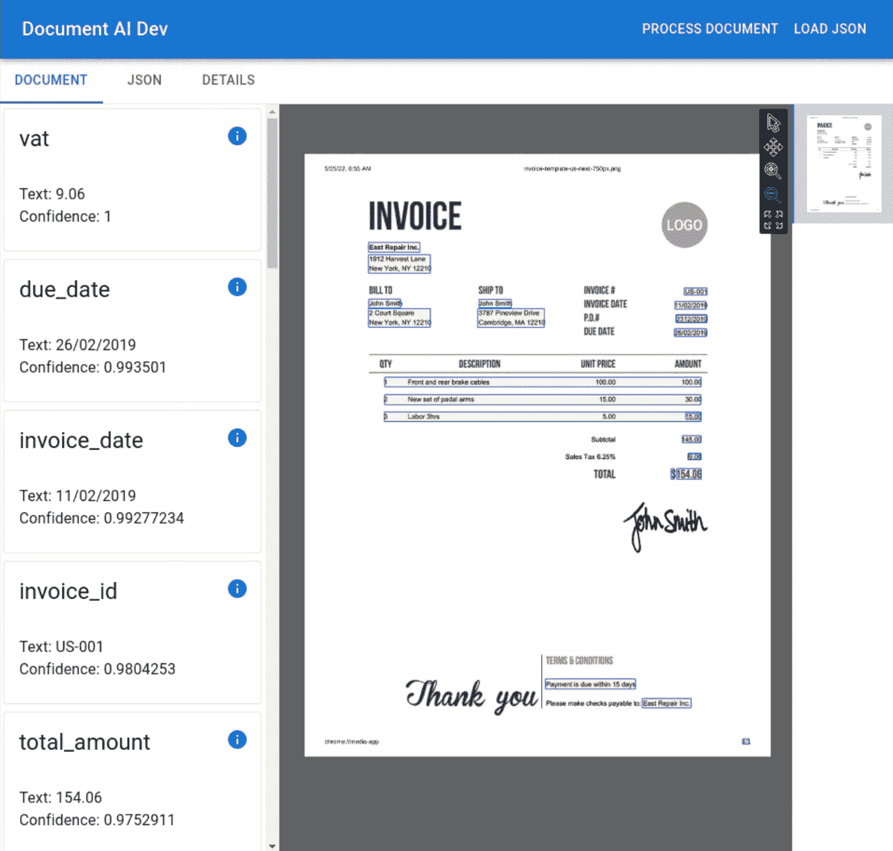

# 文档 AI JSON 工具

> 原文：<https://medium.com/google-cloud/document-ai-json-tool-ab8084aed89a?source=collection_archive---------0----------------------->


文档 AI 的最高级概念是，可以将文档作为扫描或捕获的图形图像或 PDF 发送，返回的是其中包含的信息的表示。返回的数据是一个 JSON 结构，其中包含大量关于所发现内容的细节。这将包括离散提取的信息片段，文档 AI 称之为“实体”。与“简单的”光学字符识别(OCR)形成对比，在“简单的”光学字符识别中，返回的只是与文档包含的内容相对应的文本块，而没有解释。

使用简单的 OCR，您可能会得到:

```
Bob Smith\nPoodle Cuts\n123 Elm Street\nDallas\nTexas\n555–123–4567\n$1,000\n$50\n6.25%\n12–3456\nxyzzy
```

你不知道什么是名字，什么是电话号码，什么是总金额，什么是发票号码。数据没有上下文。通过 Document AI，Google 已经开发了基于 ML 的“解析器”,这些解析器已经在大量的文档上进行了训练。当您将文档提交给 Document AI 进行处理时，您得到的是数据的上下文表示:

*   付款人:鲍勃·史密斯
*   公司:贵宾犬切割
*   账单地址:德克萨斯州达拉斯市榆树街 123 号
*   公司电话:555–123–4567
*   总额:1000 美元
*   运费:50 美元
*   税率:6.25%
*   采购订单:12–3456
*   发票编号:xyzzy

很明显，我们可以看到这比纯文本有用得多。

文档 AI 作为我们可以调用的 API 服务呈现给我们。我们向它发送一个文档，它返回一个 JSON 结构。

到目前为止一切顺利。现在让我们戴上程序员的帽子，考虑实际使用文档人工智能。当我们开始阅读关于 API 的文档时，我们很快发现调用服务的响应正如我们所料是一个 JSON 结构。然而，我们也发现它不是一个微不足道的结构。它包含了大量的信息，这样一个 JSON 的例子可以运行到数千个字段。如果我们试图在 JSON 编辑器中打开它，我们会很快迷失方向。毫无疑问，我们将开始阅读 JSON 的 Google 文档，并开始理解其中不同的组件和类别。然而不幸的是，如果我们遇到诸如不包含预期值的字段之类的难题，尝试调试和关联这些问题可能会成为一个挑战。

本文的剩余部分描述了一个示例开源工具，它是为了尝试理解文档 AI JSON 而创建的。

首先，让我们看看谷歌提供给我们的开箱即用。当我们在控制台中创建一个文档 AI 处理器时，有一个标记为“上传测试文档”的按钮



当我们点击它并上传一个文档时，我们可能会得到如下结果:



这很好。在左边我们看到了检测到的实体，在右边我们看到了在文档中找到实体的位置。非常好。但是，它有一些限制:

*   我们不知道这如何映射到我们将要工作的 JSON 结构
*   我们没有看到各种其他字段，如置信度得分
*   我们必须解析文档才能看到这个结果；不支持保存解析或加载批量解析

这就把我们带到了我们的示例工具。此工具在浏览器中本地运行。我们从磁盘驱动器中加载一个 JSON 文档，这是文档 AI 处理的捕获结果。然后，该工具向我们显示文档人工智能处理的结果(类似于上面的 Google 版本)，但接着允许我们深入到其他方面，例如任何特定选择的实体的 JSON 数据。



从这里，我们可以单击每个找到的实体的信息图标，并显示对该实体有贡献的确切的 JSON。其他选项卡包括 JSON 和 details，在 JSON 中，我们可以看到 JSON 文档的整体，在 DETAILS 中，我们以表格的形式看到文档的整体细节。

剩下的工作是让我们描述如何生成 JSON。本文不打算讨论文档 AI APIsGoogle 关于使用 Document AI 的文档已经足够了。但是，这里有一个示例 Makefile，可用于执行请求:

```
LOCATION=us
PROJECT_ID=<YOUR PROJECT ID>
PROCESSOR_ID=<YOUR PROCESSOR ID>
IMAGE_FILE=<YOUR IMAGE FILE>
IMAGE_MIME=image/pngsubmit:
 echo -n '{"document": {"mimeType": "$(IMAGE_MIME)","content": "' > docai_request.json
 base64 --wrap=0 $(IMAGE_FILE) >> docai_request.json
 echo -n '"}}' >> docai_request.json
 curl -X POST \
  -H "Authorization: Bearer "$(shell gcloud auth application-default print-access-token) \
  -H "Content-Type: application/json; charset=utf-8" \
  -d [@docai_request](http://twitter.com/docai_request).json \
  [https://$(LOCATION)-documentai.googleapis.com/v1beta3/projects/$(PROJECT_ID)/locations/$(LOCATION)/processors/$(PROCESSOR_ID):process](https://$(LOCATION)-documentai.googleapis.com/v1beta3/projects/$(PROJECT_ID)/locations/$(LOCATION)/processors/$(PROCESSOR_ID):process) > result.json
 rm -f docai_request.json
 echo "See result.json for results"
```

如果您不熟悉 Makefiles，那么这里有一个等效的 shell 脚本:

```
#!/bin/bash
LOCATION=us
PROJECT_ID=<YOUR PROJECT ID>
PROCESSOR_ID=<YOUR PROCESSOR ID>
IMAGE_FILE=<YOUR IMAGE FILE>
IMAGE_MIME=image/png
echo -n "{\"document\": {\"mimeType\": \"${IMAGE_MIME}\",\"content\": \"" > docai_request.json
base64 --wrap=0 "${IMAGE_FILE}" >> docai_request.json
echo -n '"}}' >> docai_request.json
curl -X POST \
 -H "Authorization: Bearer "$(gcloud auth application-default print-access-token) \
 -H "Content-Type: application/json; charset=utf-8" \
 -d [@docai_request](http://twitter.com/docai_request).json \
 [https://${LOCATION}-documentai.googleapis.com/v1beta3/projects/${PROJECT_ID}/locations/${LOCATION}/processors/${PROCESSOR_ID}:process](https://${LOCATION}-documentai.googleapis.com/v1beta3/projects/${PROJECT_ID}/locations/${LOCATION}/processors/${PROCESSOR_ID}:process) > result.json
rm -f docai_request.json
echo "See result.json for results"
```

运行其中任何一个都会生成一个`result.json`文件，该文件包含将图像发送到文档 AI 处理器的 JSON 输出。这里的关键是我们有一个可以使用的文件(`result.json`)。

您可以从这里直接运行示例应用程序:

https://kolban-google.github.io/docai-dev/

该应用程序只在您的浏览器中运行，不会将任何数据发送到您的本地环境之外。项目的来源也是有的。

最后……一个演示该工具运行的短片……

# 参考

*   [Github:kolban-Google/docai-dev](https://github.com/kolban-google/docai-dev)—项目来源
*   [准备运行部署](https://github.com/kolban-google/docai-dev)
*   [文档 AI 概述|谷歌云](https://cloud.google.com/document-ai/docs/basics)
*   演职员表:[ebbele 的搅拌机工具](https://www.blendswap.com/blend/9712)