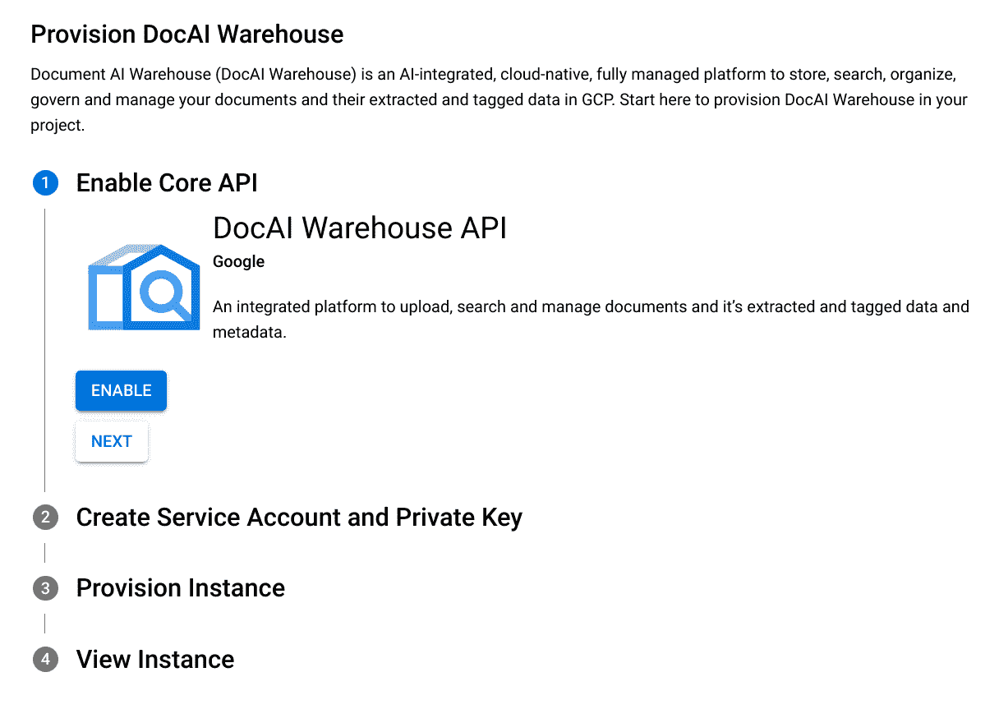
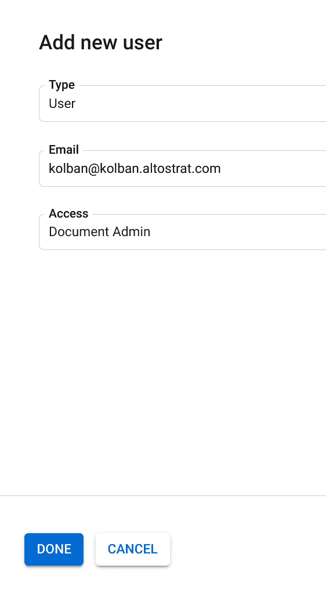
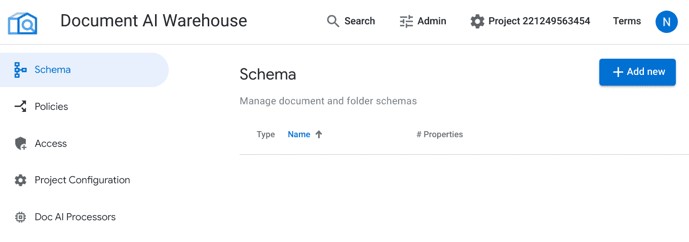
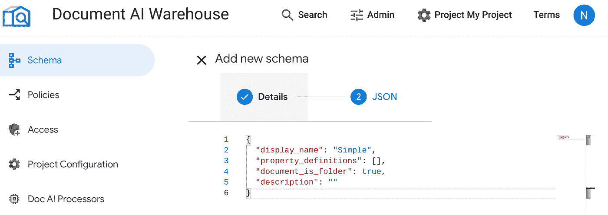

# 文档 AI 仓库

> 原文：<https://medium.com/google-cloud/document-ai-warehouse-a63d5a21bb47?source=collection_archive---------0----------------------->


Document AI Warehouse 是一款用于摄取和管理文档的 Google 产品。本文将带我们了解如何建立并运行一个环境，并执行许多最重要的任务。

**【想了解更多关于文档 AI 的功能？阅读** [**文档 AI:在**](http://bit.ly/3JtHZaD) [**谷歌云博客**](http://bit.ly/GoogleCloudBlogHome) **上为您的文档处理需求提供统一的 AI 代理** **。】**

# 配置

要进行设置，我们需要创建一个新项目。

接下来我们转到文档 AI 仓库 Google 云控制台页面:



在这里，我们通过点击`ENABLE`按钮来启用服务。

接下来，我们创建文档 AI 仓库需要的服务帐户。


这将是:

`dw-ui-service-account@[PROJECT_ID].iam.gserviceaccount.com`

接下来将要求我们授予权限:


接下来，我们将调配实例:


配置步骤需要几分钟时间来运行。耐心地停留在页面上，直到完成。

最后你会得到一个总结:


这包括到文档 AI 仓库 UI 的链接。

当我们第一次访问 UI 时，我们看到:


然后，系统会提示我们输入服务帐户和私钥。


目前，没有人有权处理任何文档。我们必须设置一些初始访问权限。启动 UI，转到 Admin 选项卡，然后单击 Access。


单击“添加新项”按钮，输入您的身份信息:



我们会发现我们的用户现在有权限处理文档:


# 创建模式

我们将从创建一个模式开始。模式是一类文档的模板。在我们的示例中，我们将假设我们正在接收发票文档，因此我们希望创建一个表示发票实例的模式。

我们的逻辑发票将包含:

*   付款人
*   收款人
*   发票 ID
*   发票日期
*   数量

我们将创建一个模式，其中包含代表这些属性的属性。当我们将发票文档接收到文档 AI 仓库中时，我们会将该模式与文档相关联，并提供值。

要创建一个模式，我们需要给它一个显示名称并定义它的属性。定义是通过构建描述模式的 JSON，然后将其作为输入传递给创建模式定义的文档 AI Warehouse API 调用来执行的。执行之后，文档 AI Warehouse 为模式生成一个惟一的身份(名称),我们随后可以使用它来引用它。

我们将使用 UI 创建模式，稍后使用 API 再次创建它。

单击管理菜单项，然后单击架构:



单击“添加新项”按钮，并提供发票的显示名称:


在模式定义中，我们必须提供 JSON。已经提供了一个名为`schema-create-invoice-underscore.json`的样本文件。我们可以将其复制并粘贴到输入字段中:


创建之后，我们会发现我们的模式列表中有一个模式。


这里需要注意的一个重要事项是，文档 AI Warehouse 已经为我们的模式生成了一个惟一的标识符。在上面的例子中是`5ud7pggqji0ko`。我们将重复使用该模式的值，以确保您知道如何找到它。是*这个*身份被文档所知，而不是我们可能提供的任何形式的文本/符号名称。

对于每个模式，我们可以深入研究:


从那里，我们可以看到它的细节，删除它，创建它的副本，并查看其结构的 JSON 描述。

# 创建文档

有了模式的定义，我们现在可以把注意力转向文档的摄取。我们将假设我们已经收到了一个描述发票的 PDF，并且想要接收它。我们一开始会“笨拙地”这样做，然后随着我们的进展，看看更好的解决方案。

在 UI 中，单击“添加新项”按钮创建文档。


向导的第一页允许我们指定要上传的文件或 GCS 上文件的路径。我们将上传我们的一个样本 pdf。

选择`SampleInvoice1.pdf`，然后我们可以进入下一页:


现在，系统会提示我们选择一个与文档相关联的模式。必须选择一个架构；我们不能在没有指定模式的情况下接收文档。我们将选择我们的发票模式。请注意，一旦选择了模式，我们在模式中定义的属性现在就可以为该文档实例提供值了。


我们将在这里输入值。您可能会想知道这些值是从哪里来的…我们稍后会谈到这一点。

现在，这里是 PDF 的截图:


使用此选项，我们输入属性值并单击“创建”按钮:


创建完成后，我们将在文档列表中看到我们的文档。单击搜索按钮查看这些内容:


然后，我们可以深入文档，查看其详细信息。点击文档名称:


切换到属性选项卡很有用:


我们可以看到文档的所有属性。

**注意**:有一个 bug 阻止了日期值显示在 UI 上，但是日期是通过 API 存储和检索的。

在这个页面中可以看到的最重要的东西之一是文档 ID。这是一个生成的唯一值，是对文档实例的引用。在本例中是`3sa60tng1h6ro`。我们将广泛使用它来处理文档。

# 切换到 API

到目前为止，我们一直在专门使用 UI 来执行我们的任务，然而，Google 提供的 UI 并不打算成为当前使用文档 AI 仓库的主要界面。而是将产品标注为“API 优先”。这意味着它的预期接口是通过应用程序逻辑实现的。该产品提供了一个基于 REST 的 API 来执行我们可能需要的所有任务，谷歌将提供各种语言绑定(如 Python，Java，Javascript …)，这些绑定建立在 REST API 的基础上，但对开发人员隐藏了底层接口。我们将在本文的剩余部分使用 REST 调用来演示松散耦合。

我们将再次启动并执行与之前手动执行的任务完全相同的任务，但这次是通过 API。我们将从删除文档和模式开始，让我们回到一个空的环境。删除我们刚刚创建的文档，然后删除模式。如果不先删除使用该模式的文档，我们就不能删除它。

我们提供了一个包含 Makefile 的示例 Git 项目，该 Makefile 包含我们想要执行的命令。在使用它之前，编辑 Makefile 并更改以下内容:

*   PROJECT_ID —更改为您创建的项目的项目 ID。
*   用户——作为电子邮件地址的 Google 身份

我们将从创建一个模式开始。

我们创建一个 JSON 文件，其中包含我们的模式描述。看起来像是:

`schema-create-invoice.json`

```
{
    "displayName": "Invoice",
    "propertyDefinitions": [
        {
            "name": "payee",
            "displayName": "Payee",
            "isFilterable": true,
            "isSearchable": true,
            "isMetadata": true,
            "isRequired": true,
            "textTypeOptions": {}
        },
        {
            "name": "payer",
            "displayName": "Payer",
            "isFilterable": true,
            "isMetadata": true,
            "isRequired": true,
            "textTypeOptions": {}
        },
        {
            "name": "amount",
            "displayName": "Amount",
            "isMetadata": true,
            "isFilterable": true,
            "floatTypeOptions": {}
        },
        {
            "name": "id",
            "displayName": "Invoice ID",
            "isMetadata": true,
            "isFilterable": true,
            "textTypeOptions": {}
        },
        {
            "name": "date",
            "displayName": "Date",
            "isMetadata": true,
            "isFilterable": true,
            "dateTimeTypeOptions": {}
        }
    ]
}
```

我们运行“`make schema-create`”，它调用[这个](https://cloud.google.com/document-warehouse/docs/reference/rest/v1/projects.locations.documentSchemas/create) REST API。如果我们现在查看 UI，我们会看到模式现在已经存在。复制模式的标识并再次编辑 Makefile，这次设置以下值:

*   SCHEMA_ID —我们正在使用的模式标识符。

我们还可以通过运行“`make schema-list`”来列出模式，它运行[这个](https://cloud.google.com/document-warehouse/docs/reference/rest/v1/projects.locations.documentSchemas/list) REST API。

现在我们可以使用 API 创建一个文档。我们首先为 REST 请求创建一个 JSON 有效负载。有效载荷看起来像:

```
{
  "document": {
    "name": "",
    "displayName": "Invoice GCS 1",
    "title": "My Invoice 1",
    "documentSchemaName": "projects/[PROJECT_NUMBER]/locations/us/documentSchemas/[SCHEMA_ID]",
    "rawDocumentFileType": "RAW_DOCUMENT_FILE_TYPE_PDF",
    "rawDocumentPath": "gs://[BUCKET_NAME/SampleInvoice1.pdf",
    "properties": [
      {
        "name": "payee",
        "textValues": {"values": ["Developer Company"]}
      },
      {
        "name": "payer",
        "textValues": {"values": ["Buyer Company"]}
      },
      {
        "name": "amount",
        "floatValues": {"values": [335]}
      },
      {
        "name": "id",
        "textValues": {"values": ["12-545678"]}
      },
      {
        "name": "date",
        "dateTimeValues": {
          "values": [
            {
              "year": 2022,
              "month": 12,
              "day": 12,
              "utcOffset": "0s"
            }
          ]
        }
      }
    ],
    "textExtractionDisabled": true
  },

  "requestMetadata": {
    "user_info": {
      "id": "user:kolban@kolban.altostrat.com",
      "group_ids": []
    }
  }
}
```

我想让你们看看这个物体的核心部分是:

1.  `documentSchemaName` —这是我们希望与文档相关联的模式的标识。
2.  `rawDocumentPath` —这是存储在 Google 云存储中的一个文件的路径，该文件包含我们将被摄取到文档仓库中的文档。除了将数据保存在 GCS 中，我们还有其他选择。
3.  `properties` —我们选择提供的属性的值。
4.  `requestMetadata` —我们提交请求以进行授权检查的人员的身份。

运行“`make prep-data`”。这个命令的作用是构建新的 JSON 数据文件，其中包含各种变量的值。

下次运行:

```
make set-project
make bucket
make copy-data-files
```

这些命令的作用是为`gcloud`和`mb`命令设置项目，创建一个名为`gs://[PROJECT_ID]-data`的桶，并将一些示例 PDF 和 PNG 文件复制到桶中。

我们可以通过执行“`make document-create`来运行我们的文档创建任务，它运行[这个](https://cloud.google.com/document-warehouse/docs/reference/rest/v1/projects.locations.documents/create) REST API。

如果我们现在访问我们的 UI，我们将看到呈现给我们的文档。我们可以使用“`make document-create-all`”命令加载更多的文档。

# 搜索

在将一些文档加载到文档 AI 仓库后，我们可以开始运行一些搜索。

我们的文档有一个名为`Invoice ID`的属性。看看能不能找到 ID 为`12–345678`的发票。

在 UI 中，在搜索栏中输入`12–345678`:


那很容易。然而，该搜索在我们的搜索数据中的任何地方寻找特定值*并且可能返回比我们预期的更多的值。相反，我们知道该属性是特定于“`Invoice ID`”属性的，因此我们可以只过滤:*


在这里，我们显式地过滤结果，只包含我们的特定发票。

我们可以使用我们在模式中公开的任何属性来执行这种搜索/过滤。

现在让我们使用 API 重复这些测试。首先，我们将运行:

`make document-search-1`

这将运行一个 API 搜索，该搜索将运行一个简单的“查询”，在所有文档中查找字符串“`12–345678`”。它会找到我们在 UI 搜索中找到的那个。

接下来，我们将运行:

`make document-search-2`

这将运行一个 API 搜索，查找具有名为“`Invoice ID`”且值设置为“`12–345678`”的属性的特定文档。

搜索表达式可以是复合的，比简单的等式查询更丰富。首先，我们可以使用 AND 和 OR 来组合表达式，以匹配多个或异或结果。接下来，支持的表达式包括:

*   = —平等
*   ！= —不等式
*   < — Less than
*   > —大于
*   <= — Less than or equal to
*   > = —大于或等于
*   ~~ — Like(仅适用于文本值)
*   LOWER( *propertyName* ) —将值转换为小写
*   EMPTY( *propertyName* ) —如果未提供属性，则为 True。
*   基于创建和更新的时间过滤器。

# 文件夹

我们现在已经看到了如何创建模式、创建文档和执行搜索。现在让我们把注意力转向如何管理我们的文件。目前，我们的文件仅仅是一个无序的集合。没有分组。文件 AI 仓库提供了一个文件夹的概念。可以把文件夹想象成一个可以存放文档和其他文件夹的容器。当我们创建一个新文档时，我们需要指定一个与该文档相关联的模式。文件夹也是如此。当我们创建一个文件夹时，必须有一个与之相关联的模式。

让我们看看如何创建这样一个面向文件夹的模式。首先，我们将使用用户界面。

我们转到“管理”选项卡并选择“模式”:


接下来我们点击`Add New`。

我们为我们的模式命名("`Simple`")，并选择模式类型为 Folder。


我们将保持属性不变。这为我们没有特殊属性的文件夹提供了一个简单的模板。



点击`DONE`。

结果将是一个新的模式。请注意，文档模式的图标不同于文件夹模式的图标。


创建了文件夹模式后，我们现在可以根据该模式创建文件夹的实例。

在主搜索页面上，选择“创建新文件夹”


创建两个文件夹。一个叫`Paid`，一个叫`Unpaid`:


现在我们来谈谈文件夹的语义。你可能习惯于文件系统中的文件夹，就像 Windows 中的文件夹(其他操作系统中的目录)。这些文件夹包含文件，文件*位于文件夹*中。文档 AI 仓库文件夹不一样。将文件夹想象成包含对文档的引用，而不是文档本身的内容。这意味着如果我们有多个文件夹，每个文件夹都可以包含一个对同一个文档的引用。说文档归文件夹所有是不正确的。相反，可以将文档想象为由文件夹引用。不严格地说，我们可以说一个文档包含在一个文件夹中，但是如果我们删除了这个文件夹，这个文档仍然存在。如果我们删除该文件夹，将丢失的只是文件夹本身以及它对该文件夹所指向的文档的引用。这个概念的好处是一个单独的文档可以在多个文件夹中找到。想象一下，我们有一个用于高价值客户的文件夹和另一个用于已付发票的文件夹。如果我们现在有一个已经支付发票的高价值客户的文档，我们可以在两个文件夹下链接该文档。

我们可以向文件夹中添加文档。

选择“所有单据”标签，然后选择“发票 GCS 1”。

单击文件夹选项卡。


点击添加新的，并选择所有文件下的付费文件夹。


对其余文档重复此操作。将奇数编号的文件添加到`Paid`，将偶数编号的文件添加到`Unpaid`。

如果我们现在选择所有单据>已付文件夹，我们将看到所有已付发票:


现在让我们将发票#2 标记为已付，这将改变它的位置。转到未付文件夹并选择发票#2。

转到“文件夹”标签，点击“删除”图标，将其从“未付”中删除。


将文档添加到付费文件夹:


列出付费和未付费文件夹，并看到文档#2 现在在付费文件夹中。

从 API 的角度来看，我们可以通过执行搜索来找到一个文件夹中的所有文档。其中一个搜索属性叫做`folderNameFilter`。它将文件夹的标识作为参数，并返回该文件夹中包含的所有文档。下面是一个 JSON 搜索的例子，它返回文件夹中的文档:

```
{
  "documentQuery": {
    "folderNameFilter": "projects/[PROJECT_NUMBER]/locations/us/documents/[DOCUMENT_ID]"
  },
  "requestMetadata": {
    "user_info": {
      "id": "user:[USER]",
      "group_ids": []
    }
  }
}
```

注意，就像文档一样，文件夹的标识是其完全限定的`DOCUMENT_ID`标识。

**注意**:不幸的是，用户界面似乎没有显示文件夹的身份。这意味着如果我们需要它的值，我们需要执行一个 API 查询来了解它的身份。

# 安全性

由于 Document AI Warehouse 充当了所有文档的容器，所以您需要确保安全性。这意味着只有经过适当授权的人员才能执行任务。

我们要做的第一件事是尝试使用 API 创建一个文档，提供一个不被允许的身份。我们会发现:

```
{
  "error": {
    "code": 403,
    "message": "End user user:user1@kolban.altostrat.com does not have permission contentwarehouse.documents.create.",
    "status": "PERMISSION_DENIED"
  }
}
```

当我们提供文档 AI 仓库的实例时，我们可以选择如何应用安全性。核心是两种模式。第一种叫做“普遍准入”。当我们利用 Universal Access 时，处理文档的能力由与这些文档交互的用户所拥有的 IAM 权限控制。

以下是可用的 IAM 权限:

*   角色/内容仓库.文档创建者
*   角色/content warehouse . document editor
*   roles/content warehouse . document admin
*   角色/content warehouse . document viewer
*   角色/content warehouse . documentschemaviewer

使用通用访问模型时，用户被授予文档 AI 仓库的*整体*的这些角色。这意味着我们不能限制用户查看某些文档而不查看其他文档。要么全有，要么全无。

第二种模式称为“文档级访问”。使用这种技术，我们假设调用应用程序拥有使用文档 AI Warehouse 的全部特权，并且作为请求的*有效负载*的一部分，应用程序运行所代表的用户的身份被传输。例如，谷歌为文档人工智能仓库提供的用户界面*就是*一个用户与之交互的基于网络的应用程序。该应用程序以文档 AI 仓库特权身份运行。当实际用户与应用程序交互时，假设应用程序已经(向自己)证明了用户就是他们所声称的那个人。当应用程序向文档 AI Warehouse 发出创建文档或列出文档或获取文档内容的请求时，应用程序会将用户的身份作为请求的一部分发送出去。实际上，用户身份是请求的一个参数。文件 AI 仓库现在根据自己的决定决定是否允许这个请求。

使用这种技术，我们可以逐个文档地指定明确的权限。允许的权限包括:

*   文档编辑器
*   文档管理
*   文档查看器

我们可以为整个文档 AI 仓库(项目级)的用户授予这些权限，或者逐个文档地授予这些权限。

还有一个额外的权限…文档创建者。这只能在项目级别设置。

现在让我们看一个例子。考虑两个新用户(用户 1 和用户 2)。用户 1 应该能够创建文档，用户 2 应该能够查看文档。最初，两个用户都没有任何权限。如果任一用户尝试创建文档，我们将看到:


在文档 AI Warehouse admin 选项卡中，我们可以切换到 Access 并为 user1 创建项目级权限。


注意:更改权限后，可能需要几分钟时间将更改传播到所有后端服务器。

当用户创建文档时，他们会立即被授予对该文档的文档管理权限:


这意味着一旦创建，他们就可以编辑、查看和删除它。

如果我们现在看用户 2，我们会发现他们什么也看不见。这是意料之中的，因为他们没有任何权限。我们可以明确授予他们查看文档的权限。


之后，他们可以查看文档:


如果他们试图编辑文档的属性，他们将被拒绝，因为他们没有被授予编辑权限。


从 API 的角度来看，我们可以使用[这个](https://cloud.google.com/document-warehouse/docs/reference/rest/v1/projects/fetchAcl) API 在项目级别或者为特定文档检索 ACL。类似地，我们有[另一个](https://cloud.google.com/document-warehouse/docs/reference/rest/v1/projects/setAcl) API 来设置 ACL。

# 与 DocAI 集成

文档的价值在于，我们作为人，可以阅读它并从中提取信息。例如，如果我给你看这张发票:


你能告诉我:

*   应支付的金额？
*   发票是什么时候开的？
*   供应商如何识别发票？
*   谁提供服务/产品？

答案应该是肯定的，对你个人来说很简单，但对计算机程序来说，一张发票的图像只是像素，或者充其量是一串单词和数字。如果我们回顾一下我们所知道的关于文档 AI Warehouse 的知识，我们会发现我们可以使用文档的属性值来搜索文档。这些属性(到目前为止)是在文档被摄取时由用户提供的。现在，我们将看到一个附加功能，它允许文档 AI Warehouse 自动填充属性，并解锁使用文档本身的文本作为搜索内容的功能。

这是通过将文档人工智能仓库与谷歌云中的文档人工智能功能配对来实现的。Document AI (DocAI)是一种服务，它将文档作为输入，并返回其内容的结构化表示(JSON)。DocAI 使用一个*解析器*来解释文档的内容并提取找到的字段。这与简单的光学字符识别(OCR)截然不同，OCR 仅仅返回找到的文本斑点。相反，结构化文档包含键/值对，其中键与文档相关，值是在文档中检测到的。例如:

*   应付金额:335.00 美元
*   发行日期:2022 年 12 月 12 日
*   发票编号:12–545678
*   提供商:开发商公司

然后，这些提取的实体可以用作搜索的属性。

总之，一个摄取了*而没有*与文档 AI 配对的文档允许我们只搜索摄取文档时提供的属性值。

为了将 DocAI 和 Document AI Warehouse 配对在一起，我们首先通过 DocAI 传递文档，DocAI 返回文档的结构化(JSON)表示。接下来，当我们将文档接收到文档 AI 仓库中时，我们*另外*提供 DocAI 的输出。Document AI Warehouse 现在将看到 DocAI 输出的文档、属性*和*，并允许我们进行更深入的搜索。

让我们结合上下文来看这个问题:


1.  -应用程序读取文档并将其发送到文档 AI 进行处理。
2.  - Document AI 解析文档并提取结构化表示，然后返回给应用程序。
3.  -应用程序调用文档 AI 仓库来摄取文档**和**，还提供从文档 AI 返回的结构化表示。

此时，文档仓库已经有了文档**和**关于文档内容的大量知识。

现在我们将注意力转向如何完成这些任务的实际*机制*。为了使用 Document AI，我们需要提供一个知道如何解析特定类别文档的解析器。一个例子是 Google 提供的发票解析器。这将返回一个解析器标识符。

从那里，我们可以调用[方法:processors . process | Document AI | Google Cloud](https://cloud.google.com/document-ai/docs/reference/rest/v1/projects.locations.processors/process)。

这将把原始文档作为输入，并返回给我们一个表示文档解析的 JSON 对象。接下来，我们可以将此插入到文档 AI 仓库中的文档创建中。文档 AI 仓库提供[方法:projects . locations . documents . create |文档 AI 仓库| Google Cloud](https://cloud.google.com/document-warehouse/docs/reference/rest/v1/projects.locations.documents/create) 。如果我们仔细查看可以传递给这个 API 调用的参数，我们会发现一个名为`document.cloudAiDocument`的参数。这个字段*正是*文档 AI 的输出。

下面显示了我们创建文档 AI 仓库的输入参数


蓝色区域表示文档 AI 仓库参数，其中包括黄色区域，但该组数据是嵌入在文档 AI 仓库请求中的文档 AI 的直接输出。

当 Doc AI 解析器输出附加到摄取的文档时，我们可以启用“AI 视图”滑块。这显示了 Doc AI 输出结果的可视化。我们看到了被发现的 Doc AI 实体以及它们在原始文档中的位置。


最重要的是，在文档中发现的所有文本现在都符合搜索条件。

现在我们将使用 UI 浏览一个示例。

首先，我们必须做一点设置。在 GCP 控制台中，转到 Doc AI 页面:


单击资源管理器处理器。可能会要求您启用云文档 AI API:


在一组可用的单据 AI 处理器中，找到发票处理器:


点击它并创建一个新的处理器。将其命名为“发票”:


在结果中，我们将创建一个解析器。注意它的 ID 值:


上例中是`40f6e41d583a90d1`。

回到文档人工智能仓库界面，访问管理界面，点击文档人工智能处理器。

添加新内容时的时钟:


在出现的屏幕中，我们输入模式 ID、处理器名称和处理器 ID 的值:


我们现在设置好了。返回主页(搜索)并添加新的发票文档:


请注意，我们现在可以选择一个 Doc AI 处理器。

现在我们可以查看文档并切换其“人工智能视图”滑块:


…文档 AI 仓库和文档 AI 就是这样集成的。

现在让我们看看文档 AI 仓库文档上的 DocAI 提取实体和属性之间的关系。当我们用 DocAI 解析文档时，实体被从文档中提取出来并以 JSON 结构返回。这些实体的名称是固定的，取决于所使用的解析器的类型。例如，发票解析器知道被称为:

*   供应商名称
*   发票标识
*   发票日期
*   供应商 _ 电子邮件
*   …更多

当我们定义一个文档 AI 仓库模式时，我们在该模式上定义了充当文档元数据的属性。文档 AI 仓库不使用 DocAI 解析输出中提供的实体。例如，如果一个 DocAI 解析产生了一个 supplier_name 实体的值(例如“Developer Company”)，那么这个值对于文档 AI Warehouse 来说就不是特别清楚了。我们必须做的是将 DocAI 实体值的值复制到一个文档 AI 仓库文档属性中。只有这样，它才会变得有用。当我们的应用程序接收文档时，我们可以通过从 DocAI 返回的 JSON 中提取实体值并将其复制到文档的所需属性中来手动执行这项任务。然而，还有更好的方法。当我们接收一个文档时，我们可以提供以下参数:

*   cloudaidocumentoption . enableentitiesconvertions
*   cloudaidocumentoption . customizedentitiesproperties conversions

**注**:在和开发的聊天中，他们告诉我这些是要弃用的。

# 参考

*   本文的 GIT 项目可以在[这里](https://github.com/kolban-google/doc-ai-warehouse)找到。
*   [文档艾仓库首页](https://cloud.google.com/document-ai-warehouse)

# 信用

*   Blender image: [pujiyanto](https://www.blendswap.com/blend/25187)