# 文档人工智能工作台

> 原文：<https://medium.com/google-cloud/document-ai-workbench-53728a6c5622?source=collection_archive---------1----------------------->


Google Document AI (DocAI)服务提供了摄取包括 PDF 和图像在内的各种格式的文档的能力。然后，DocAI 将解析文档并提取数据的结构化表示。让我们更详细地分析一下。

[这里的](https://www.kaggle.com/datasets/mcvishnu1/fake-w2-us-tax-form-dataset)是 Kaggle 上的一个数据集，其中包含伪造的美国 W2 表格的图像。W2 是一种由美国雇主发布的表格，用于申报员工的收入和扣缴的税款。年末，W2 以纸质或电子格式(如 PDF)发送给员工。那个人会把它作为他们纳税申报表的一部分提交。

如果我们看一个 W2 表单的例子，我们会发现它包含了很多信息。

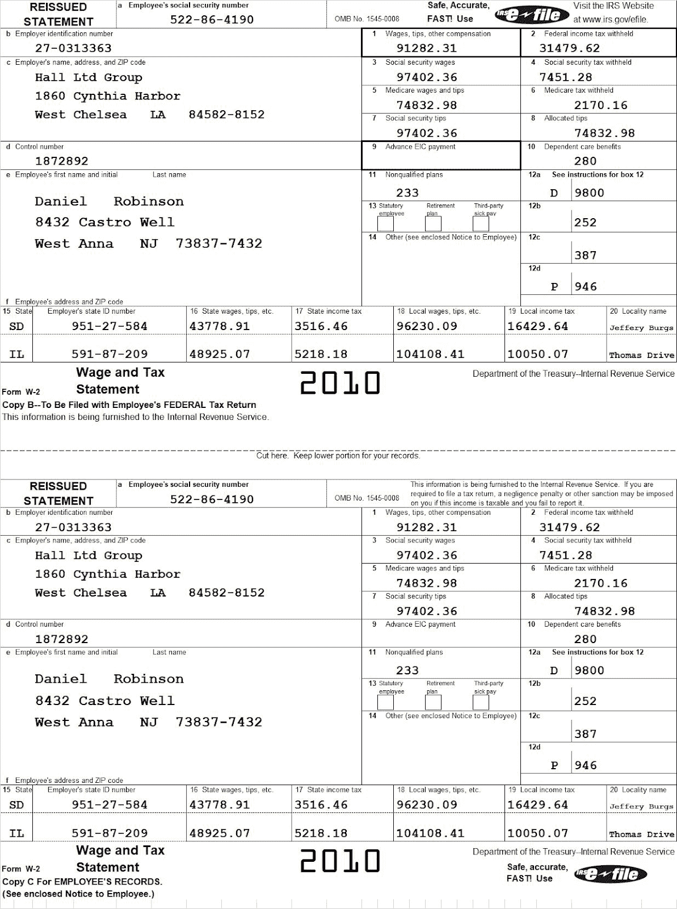

我们的示例实例(如上图)显示它包含许多*期望的*字段。例如:

*   员工社会保险号(522–86–4190)
*   雇主(霍尔有限公司集团)
*   员工(丹尼尔·罗宾逊)
*   工资(91 282.31 美元)
*   预扣所得税(31，479.62 美元)
*   …更多

作为一个人，我们可以看看这个表格，提取我们需要的信息。我们使用标签、位置和其他线索来确定这一点。如果我让你把上面的 W2 转录成一个 JSON 文档，我相信你可以编码成:

```
{
  "employe_ssn": "522-86-4190",
  "employer_name": "Hall Ltd Group",
  "employee": "Daniel Robinson",
  "wages": 91282.31,
  "income_tax_wh": 91282.31,
  …
}
```

这个(假设的)JSON 文档表示包含在文档中的相同数据的机器可读的结构化表示(PDF/Image)。DocAI 所能做的就是通过将一个表单(图像)作为输入并生成一个 JSON 结构化文档作为输出来自动化这个过程。DocAI 能够智能地检测文档中预期字段的值。

到目前为止，我们一直在看我们的 W2 表格，但这些仅仅是一类文件的例子。DocAI 可以处理大量其他文档类型，包括收据、发票、公用事业账单、其他政府文档等等。当我们将一个文档提交给 DocAI 进行处理时，我们指定一个*解析器*，这个解析器*知道*如何解释该类文档。通常，我们使用 Google 预先提供的解析器。

然而，如果我们需要处理一种新类型的文档，而 Google 没有合适的解析器，或者如果我们开始发现我们的*文档中有一些字段没有被正确识别，该怎么办？这是我们可以构建自己的解析器或者改进 Google 提供的解析器的地方。这个概念是本文剩余部分将关注的内容。*

让我们考虑一份抽象文件。在该文档中，我们希望提取信息并将该信息与特定的概念相关联。例如，在 W2 中，社会保险号或雇员姓名。如果我向您展示这样一个文档的例子，您可能会识别出这些项目。

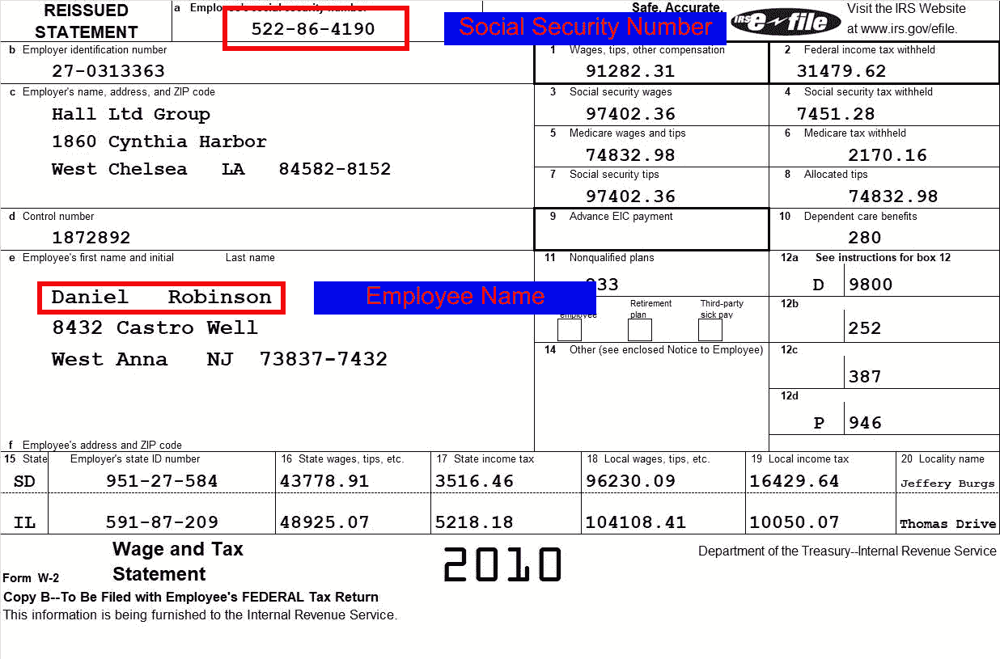

为了构建我们自己的解析器，我们首先列出我们希望从任意文档中提取的所有不同的 T2 条目。DocAI 称这些*实体为*。一旦我们有了实体列表，我们就用它们来创建一个*模式*，它基本上是我们希望提取的多个*事物*的描述。每个实体都有一个名称和一个数据类型(字符串、数字、日期等)。

现在有趣的部分来了。我们为自己找到一组我们想要的类的示例文档，并且对于*每个*文档，遍历它并且*标记*我们想要从文档中提取的每个实体。这种标记活动是手动执行的。标记是寻找(手动)我们想要的实体并在文档图像中识别它们的过程。不严格地说，想象在实体数据周围画一个方框，并说“这是社会保险号的数据”或“这是雇员姓名的数据”。我们对尽可能多的样本文档重复这一过程，直到我们有时间手动标记。最后，我们有一个带标签的数据集…一个文档集合*和*它们手动识别的实体。

有了这个数据集，Google DocAI 的魔力就发挥出来了。我们将这个数据集提交给 DocAI 来执行一个名为 *training* 的活动。DocAI 检查我们手动标记的数据，并通过机器学习算法，*学习*如何识别未来文档中的实体。通常在计算中，当我们进行计算时，答案不是对就是错。在机器学习领域，我们进入了一个由灰色阴影组成的世界。当一个新文档提交给 DocAI 时，它会预测哪些数据对应于哪些实体。这些预测通常伴随着置信度值，这意味着 DocAI 绝对确定(1.0)该值是正确的，或者更有可能的是，*相信*该值在置信度水平(例如 0.75)下是正确的。显然，我们希望预测尽可能准确。我们提高准确性的方法是用更多正确标记文档的例子来训练解析器。

到目前为止，我们所有的讨论都是概念性的。现在我们将注意力转向 DocAI 的实际现实，看看如何实现我们的任务。DocAI 内部有一个组件叫做 Document AI Workbench (workbench)。Workbench 是 DocAI 的一个区域，在这里我们可以引入样本文档，标记这些文档，执行培训并检查结果。

我们从一个谷歌云项目和访问 DocAI 页面开始。

主页看起来像这样:

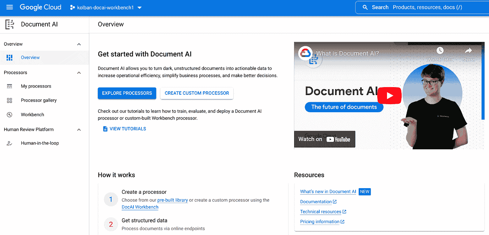

在左边，我们看到`Workbench`。继续点击它。第一次使用 DocAI 时，我们必须在项目中启用它。

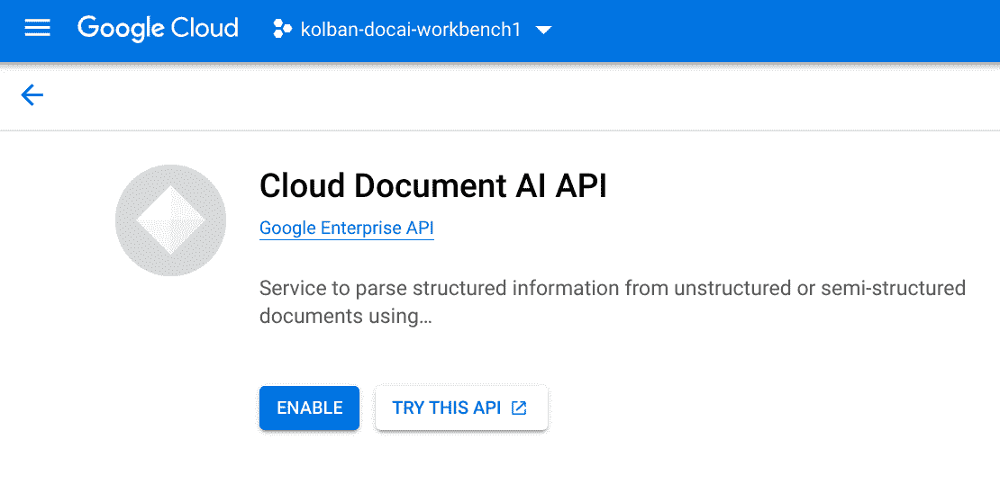

启用后，我们将到达工作台页面:

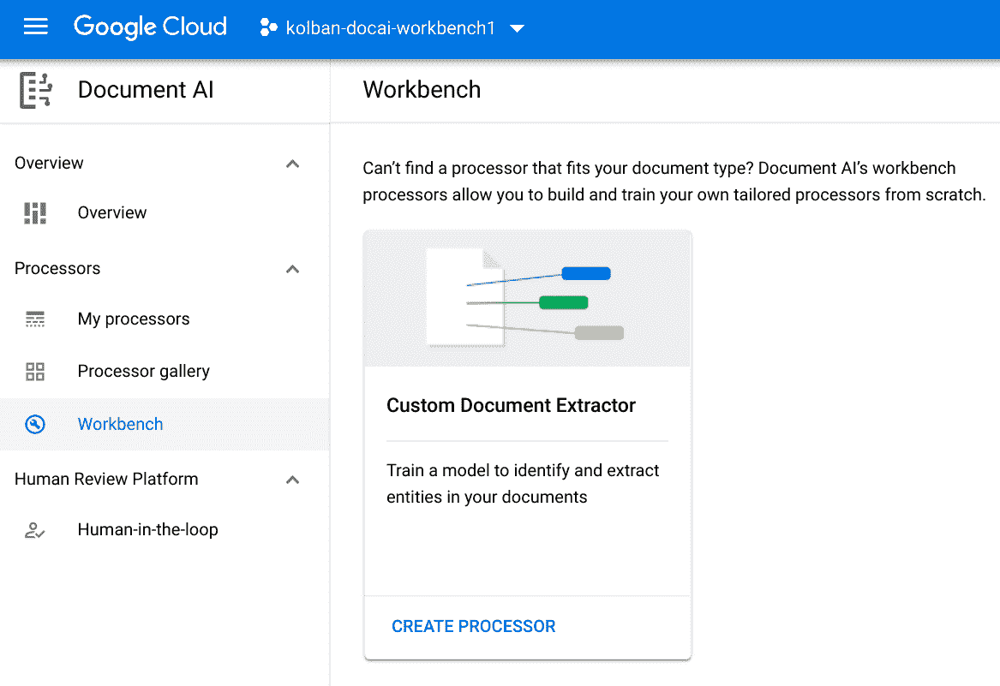

点击`CREATE PROCESSOR`。

我们现在被要求给它一个名字:

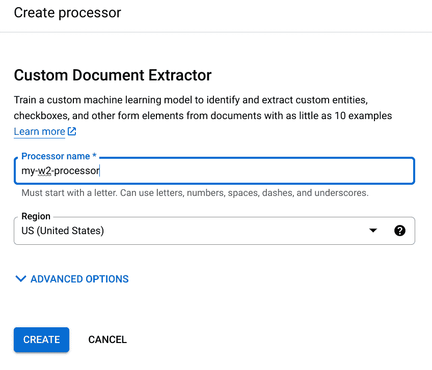

命名我们的处理器后，我们会看到它存在的细节。花点时间看看屏幕:

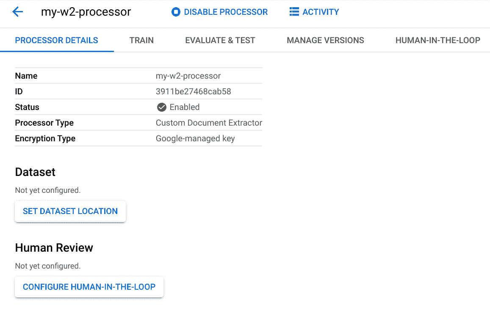

需要注意的重要事项:

*   `Name` —这是处理器的显示名称。它不是唯一的，只是作为一个视觉辅助。
*   `ID` —这是处理器的*实际*标识符。当我们提交最终文档进行处理时，我们最终将使用该值。

我们的处理器将需要样本标记的文件进行训练和测试。这些数据由处理器拥有，需要在某个地方存储它们。我们需要做的下一件事是告诉处理器*我们想让它在哪里存储数据。Workbench 使用 Google 云存储作为文档的后备存储。*

点击`SET DATASET LOCATION`按钮。

接下来，我们有机会指定(或创建)一个用于存储的 Google 云存储空间(和可选文件夹):

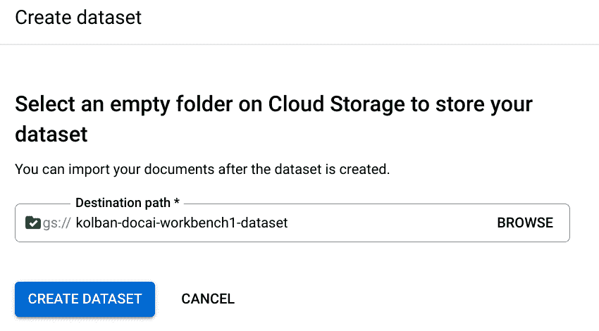

点击`CREATE DATASET`按钮后，稍等片刻，屏幕将变为:

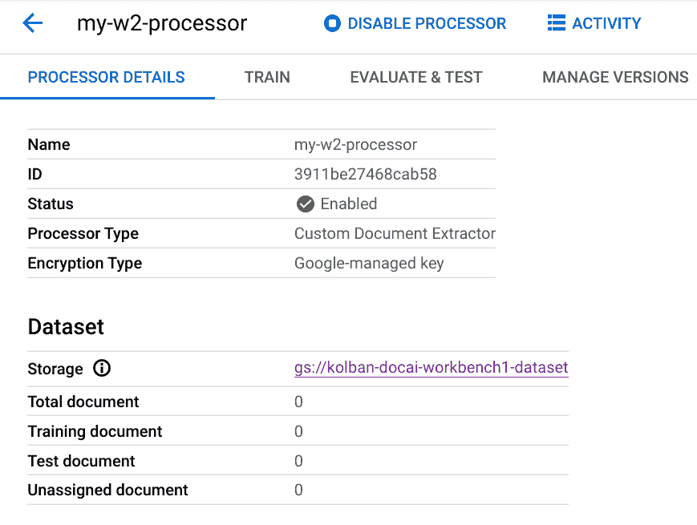

请注意，现在数据集正在跟踪文档。现在让我们看看这意味着什么。当我们将一个带标签的文档交给 Workbench 时，它会将该文档用于两个目的之一。它要么将它用作训练的例子，要么将它用作测试的例子。培训是 DocAI 学习*如何*从文档中提取实体(通过示例)的练习，而测试是 DocAI 对测试文档进行预测，并将其预测值与实际/预期值进行比较，看看它的表现如何。当我们向 workbench 提供文档时，该文档可能不会被分配给测试或培训组，并且被视为*未分配*，既不用于培训也不用于测试。该页面显示了我们所有文档的摘要。

现在让我们带来第一份文件。要将文档引入 workbench，它最初应该存在于 Google 云存储中的某个位置。Google 已经创建了一些在正式文档中使用的样本文档，我们将在这里重用它们。

有一个谷歌云存储桶/文件夹叫做:

`cloud-samples-data/documentai/Custom/W2/PDF`

如果我们跑:

`gsutil ls gs://cloud-samples-data/documentai/Custom/W2/PDF`

要列出文件夹的内容，我们会发现:

`gs://cloud-samples-data/documentai/Custom/W2/PDF/W2_XL_input_clean_2950.pdf`

换句话说，在这个位置有一个单独的 PDF 文件，如果我们下载并查看，我们会发现它包含一个 W2 表单。

我们现在切换到工作台上的`TRAIN`选项卡:

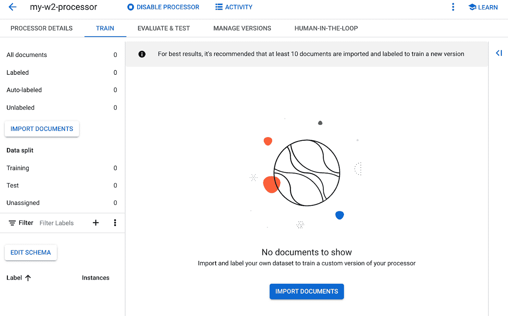

并点击`IMPORT DOCUMENTS`:

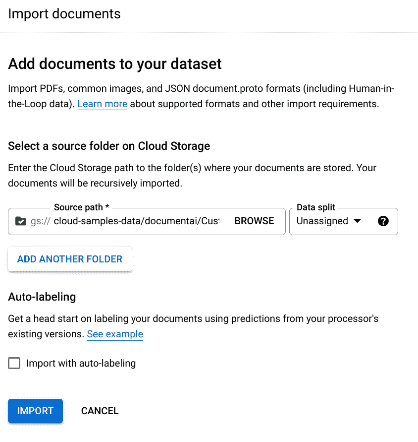

输入样本文档的路径(`cloud-samples-data/documentai/Custom/W2/PDF`)，并为数据分割选择 Unassigned。点击`IMPORT`。

现在发生的是 DocAI 正在处理文档。虽然 DocAI 主要用于从文档中提取结构化数据，但它也提供一般的光学字符识别(OCR)功能。OCR 是从图像中识别单词/数字并确定它们在图像上的位置以及它们由什么字符串组成的过程。将此与实体提取区分开来。实体提取是 OCR 结合语义。实体提取是“我在图像中找到了这个文本**和**它与一个特定的概念如社会安全号相关联”。导入我们的单个文档后，屏幕将变为:

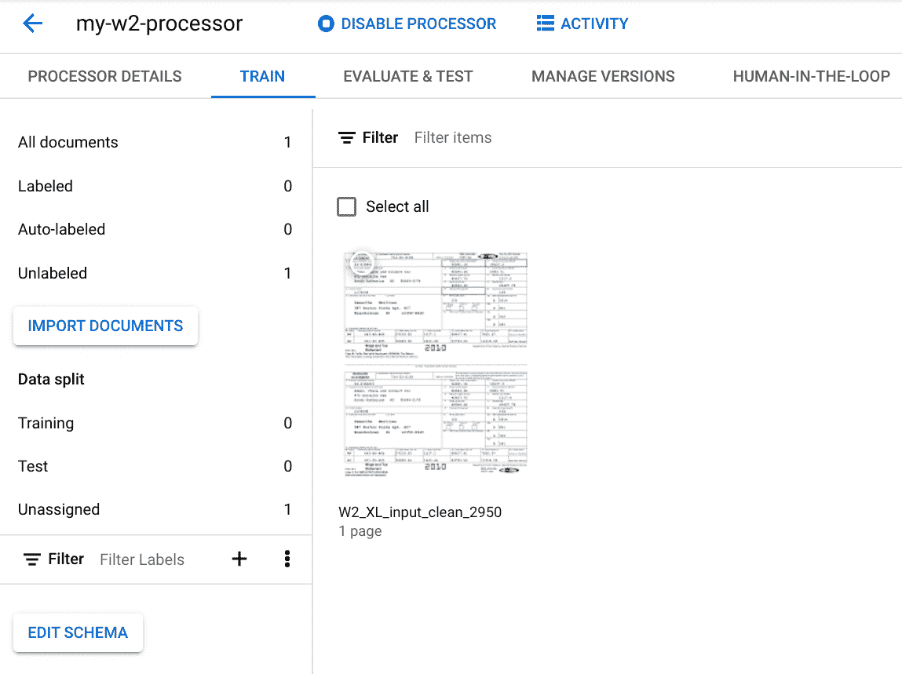

我们现在看到我们的数据集中有一个文档，并且这个文档是未标记的。所谓未标记，我们是指工作台知道有一个文档，但是我们没有告诉它我们希望处理的实体在文档中的什么位置。它还没有做好训练或测试的准备。

如果我们查看为工作台数据集创建的 Google 云存储桶，我们会发现已经创建了与新导入的文档相对应的新文件和文件夹。这些应该*而不是*直接检查。它们是处理器的状态，只有工作台知道它们的存在和格式。

请记住，我们在这里使用 W2 表单仅仅是为了方便起见。此时，我们的新处理器不知道任何*实体的存在。它看到的只是一个文档，不知道我们可能有兴趣提取什么。现在我们开始描述我们的模式，该模式描述了我们希望在这样的文档中潜在地找到什么。*

点击`EDIT SCHEMA`按钮:

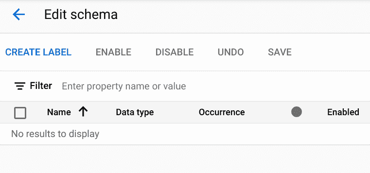

这里是我们描述我们实体的存在和本质的地方。Workbench 使用短语“标签”来指代实体。标签在机器学习中是一个合适的术语，但出于我们的目的，我们将互换使用。

点击`CREATE LABEL`按钮创建我们的第一个实体定义:

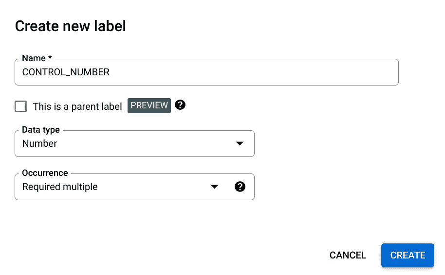

这里我们指定:

*   我们实体的名称(`CONTROL_NUMBER`)
*   我们实体的数据类型(`Number`)
*   我们如何期望它在我们的文档中出现(它是必需的，可能会多次出现)

重复创建以下实体:

*   SSN EMPL，纯文本，需要多个
*   EMPLR_ID_NUMBER，纯文本，必需的倍数
*   EMPLR_NAME_ADDRESS，ADDRESS，必需的倍数
*   联邦 _ 所得税 _WH，货币，必需的倍数
*   SS_TAX_WH，货币，必需的倍数
*   SS _ 工资，货币，所需倍数
*   WAGES_TIPS_OTHER_COMP，Money，必选倍数

最后，我们将拥有:

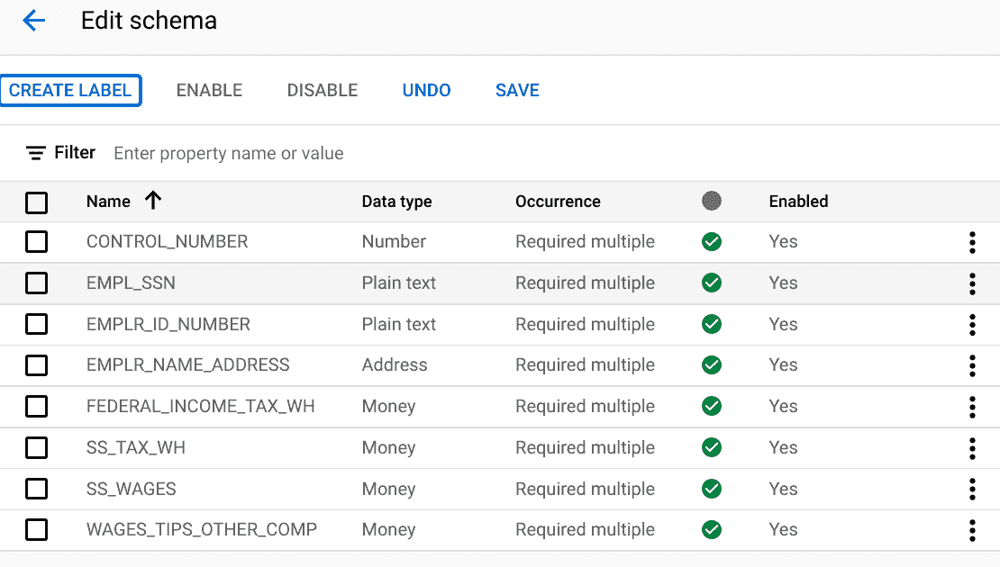

点击`SAVE`保存我们的工作。

当我们返回到主处理器页面时，我们会看到相关的模式出现了:

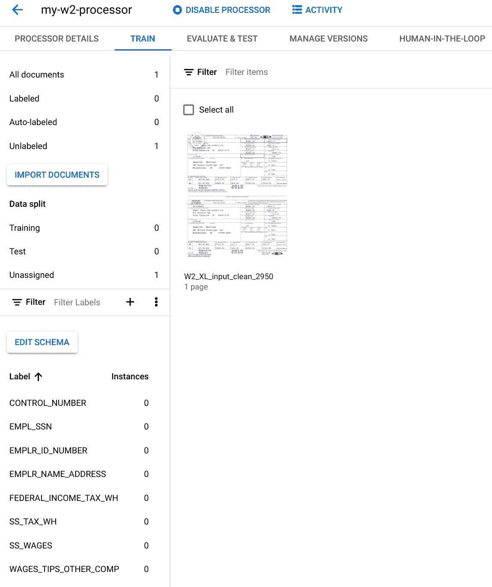

对于每个标签(实体)，我们将看到在我们的数据中存在多少实例(目前为 0)。现在我们已经告诉 workbench 我们希望*检测哪些实体，我们可以标记我们的文档来告诉 workbench(对于这个文档实例)这些实体在这个文档中的什么地方。单击我们文档的图像，我们将看到一个新页面出现:*

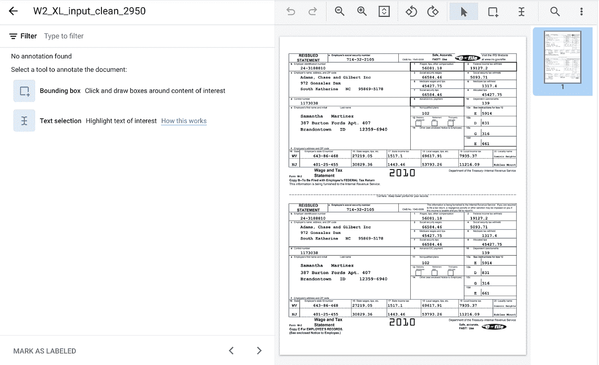

现在，我们将经历在页面上定位数据并将其标记为正确实体的过程。单击菜单栏上的边界框选择图标，然后选择雇主标识号值。从弹出菜单中选择`EMPLR_ID_NUMBER`。您现在已经执行了您的第一个实体标记。

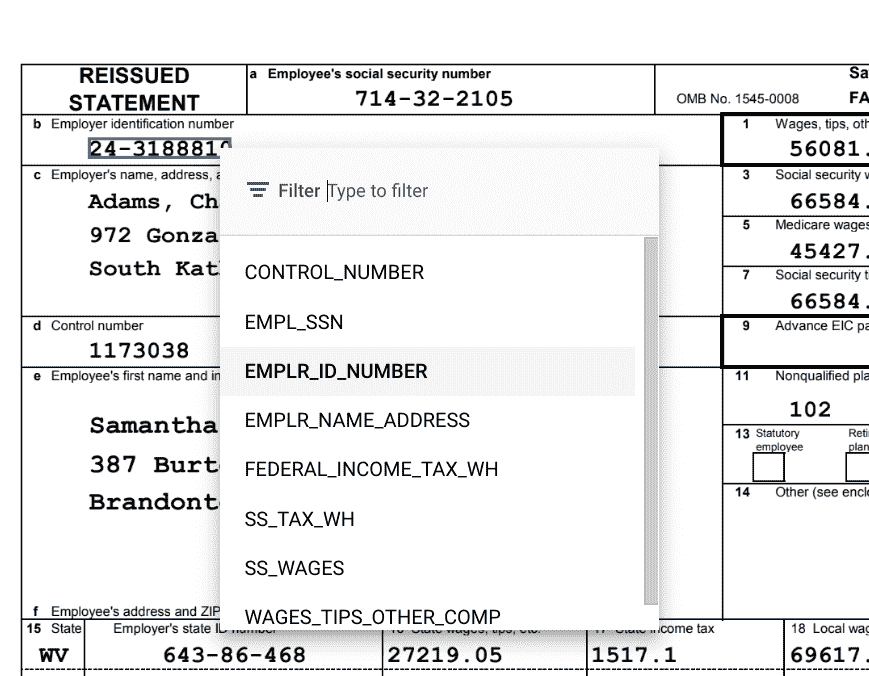

对您想要设置的任意多个其他实体重复此过程:

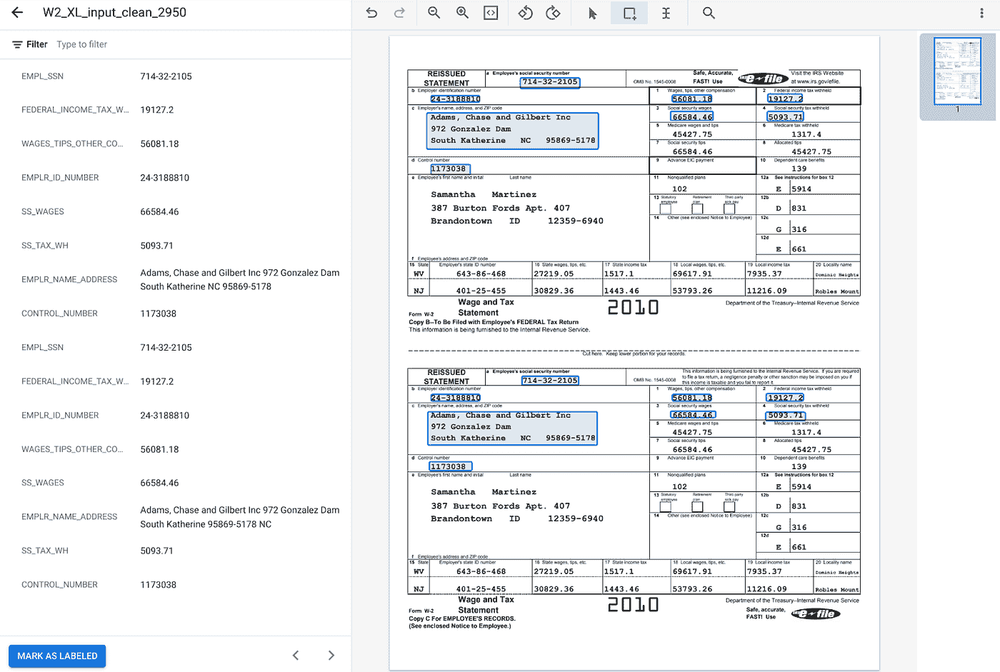

最后，您的页面可能会如上所示。请注意，实体与其值的配对显示在左侧面板中。当您将鼠标悬停在文档上时，您还会看到与标记值相关联的实体。

我们现在已经成功地标记了这个文档，点击`MARK AS LABELED`按钮。

我们的摘要屏幕变为:

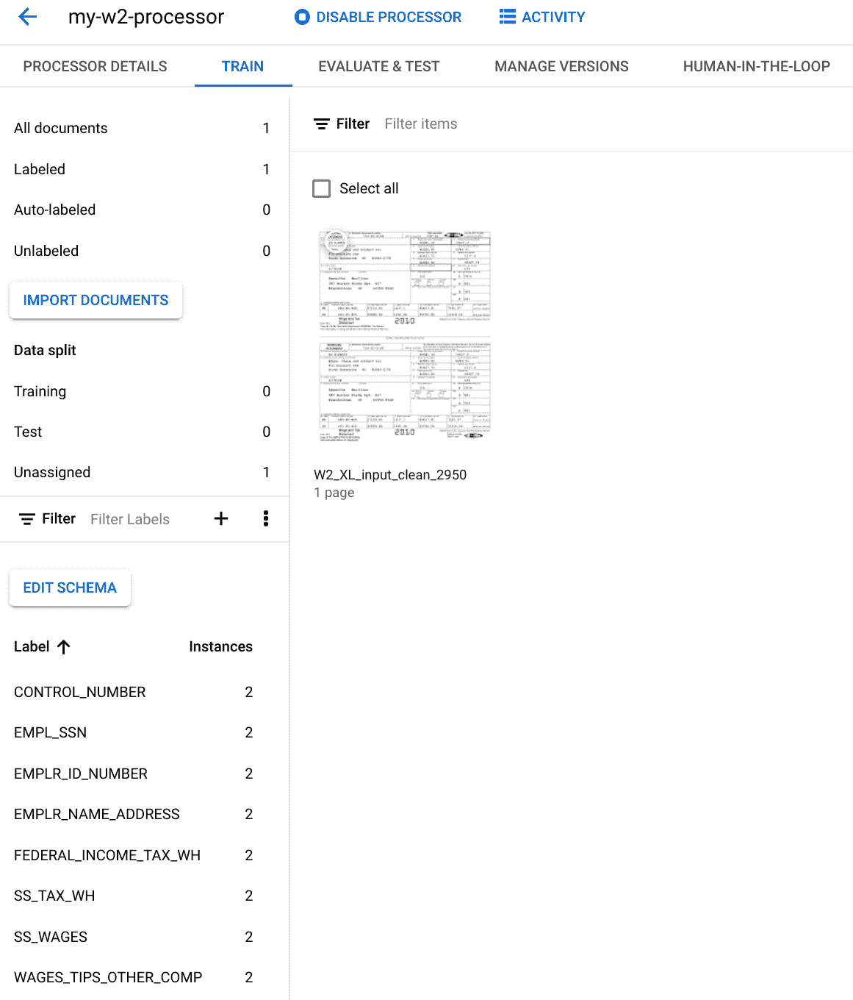

请注意，我们现在有一个带标签的文档，我们可以看到我们有与文档相关联的实体的实例。现在，我们将文档分配给我们的训练数据。点击文档上的复选框，在`ASSIGN TO SET`下选择`Training`。

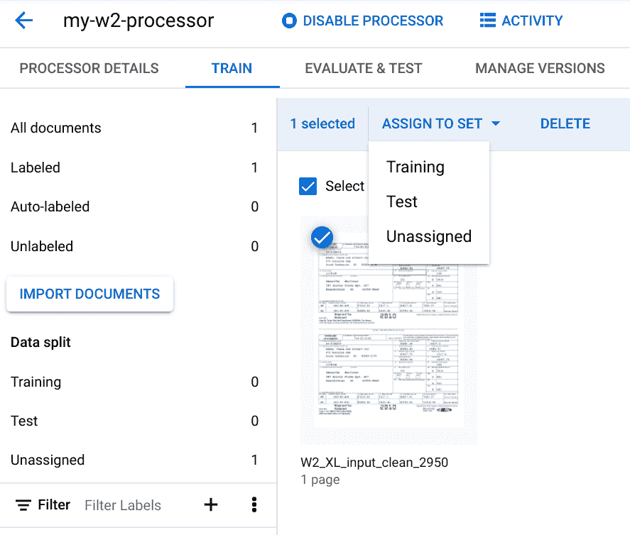

我们进展顺利。我们现在有一个单独的文档，它已经被标记并与我们的培训文档相关联。然而，我们还没有准备好实际训练我们的解析器。工作台*要求*你至少有*10 个文档用于培训，10 个文档用于测试，即使这样也是难以置信的轻。您标记和提供的文档越多，结果就越好(越准确)。如果您正在为自己的文档构建一个生产解析器，那么您应该准备好提供和标记数百个文档。对于我们的文章，我们庆幸没有这样做。我们的示例数据中有一组预先标记的文档，我们将导入这些文档。*

点击`IMPORT DOCUMENTS`，提供`cloud-samples-data/documentai/Custom/W2/JSON`作为数据的源路径，并将数据分割设置为`auto-split`。指定自动分割意味着 80%的文档将用于培训，20%用于测试。

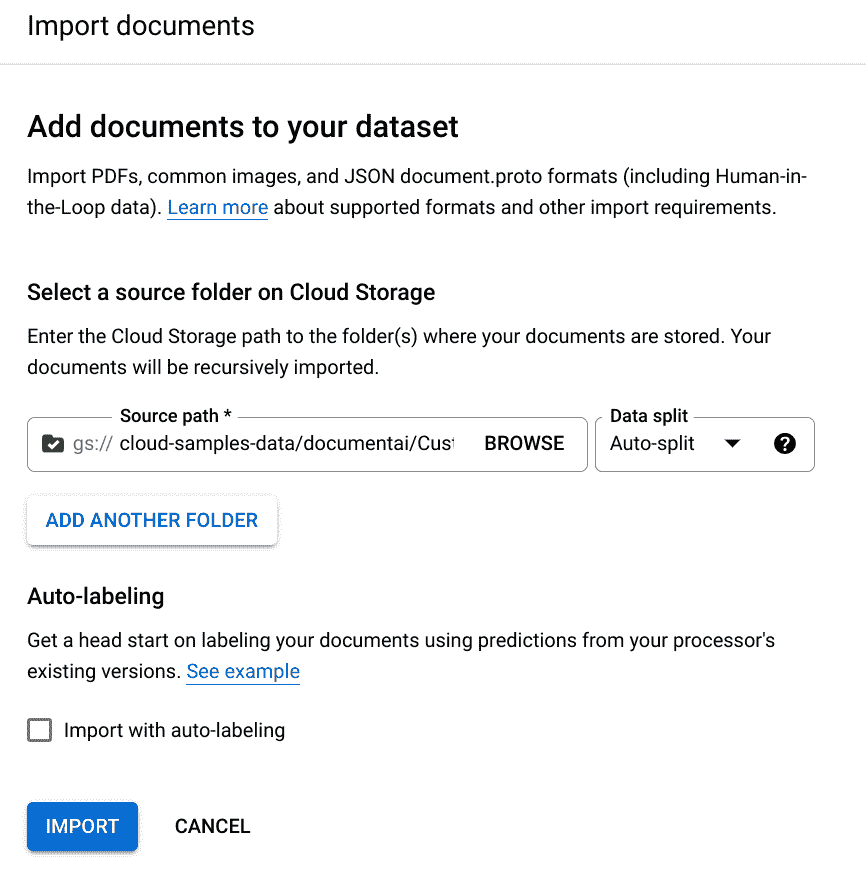

这将需要几分钟时间来运行。在这段时间里，让我们考虑正在发生的事情。如果我们跑:

`gsutil ls gs://cloud-samples-data/documentai/Custom/W2/JSON`

我们会发现桶里有 50 个 JSON 文件。这些文件中的每一个都代表一个已经附加了标签的文档*。回想一下我们手动标记文档的活动。为此，我们有一个基础图像(我们的源文档),然后识别实体的文本在文档中的位置。Google 已经发明了一个 JSON 表示，其中包含图像(Base 64 编码)和标签信息(例如，在图像中的给定矩形处，文本以某个值存在，并且应该与命名实体相关联)。我们的样本桶中的 50 个 JSON 文件代表已经完成的标记，并通过导出提供给我们。*

完成导入后，我们可能会看到如下屏幕:

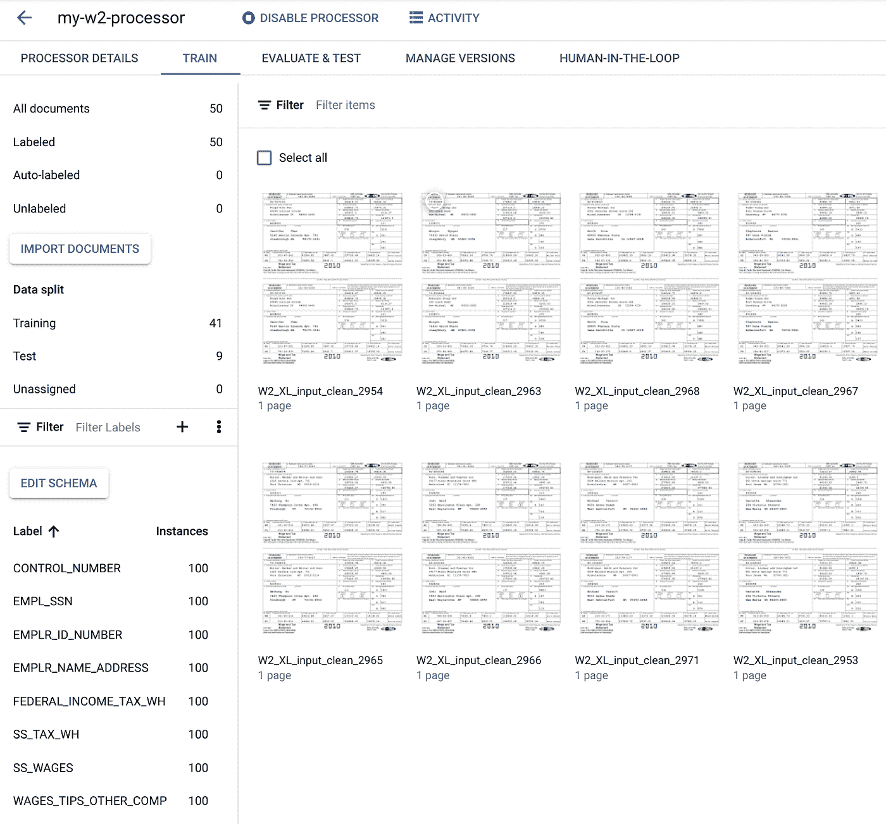

这里我们看到了 50 个导入的文档，其中 41 个被分配给培训，9 个被分配给测试。选择一个随机的文档并点击它，可以看到它已经被标记了(就像我们手工处理我们自己的单个文档一样)。

在我们继续之前，我们需要纠正一个问题。谷歌要求至少有 10 份文件可供测试。如果我们看我们的例子，我们只看到 9。这可能是因为随机选择 50(正好 10)中的 20%会导致 9、10 或 11 个实例。为了解决这个问题，我们将把我们的一个文档从训练集中移到测试集中。

单击`Training`类别上的复选框(我们将只显示标记为培训的文档),然后单击第一个文档并将其移动到 Test:


我们现在将有 40 个文档用于培训，10 个文档用于测试。

我们现在准备好进行训练了。点击`TRAIN NEW VERSION`按钮:

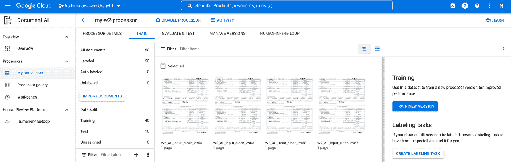

给出版本和名称并点击`START TRAINING`:

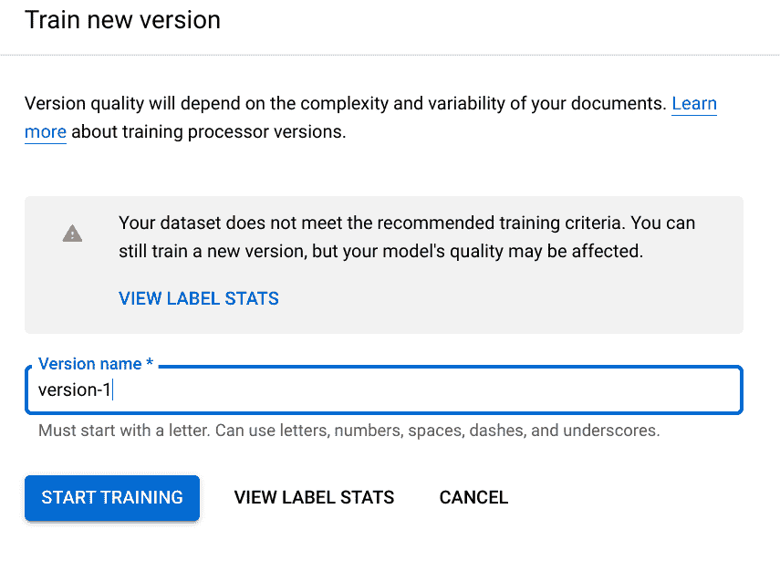

训练现在开始。谷歌没有说培训需要多长时间。使用该示例的经验表明，完成该操作大约需要一个小时。去吃午饭或者明天再来。

注意:在撰写本文时(2022–11)，培训作业的运行可能会在头 5 分钟内失败，并出现*内部*错误:

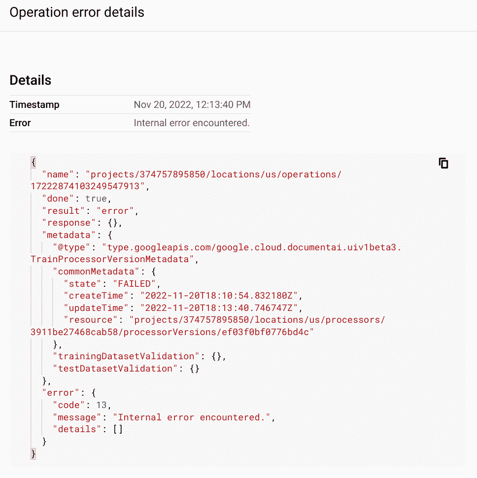

如果发生这种情况，只需重试列车运行。此时，DocAI 工作台被标记为“预览”(beta)。

有了训练有素的解析器，我们现在就可以部署它了。在`MANAGE VERSION`选项卡中找到处理器，并从上下文菜单中执行一个“`Deploy version`”请求:


将显示一个确认对话框:

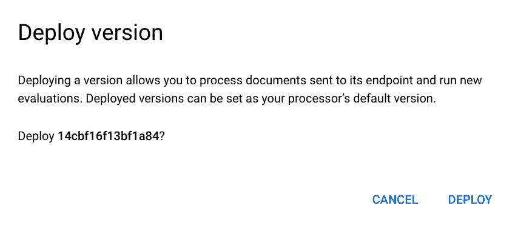

此操作可能需要 10 分钟或更长时间才能完成。请耐心等待。

现在是测试的时候了。我们可以从以下网址下载一份以前未见过的文件:

[https://storage . Google APIs . com/cloud-samples-data/documentai/lending docai/W2 parser/W2 _ XL _ input _ clean _ 1000 . pdf](https://storage.googleapis.com/cloud-samples-data/documentai/LendingDocAI/W2Parser/W2_XL_input_clean_1000.pdf)

我们现在访问`EVALUATE & TEST`页面:

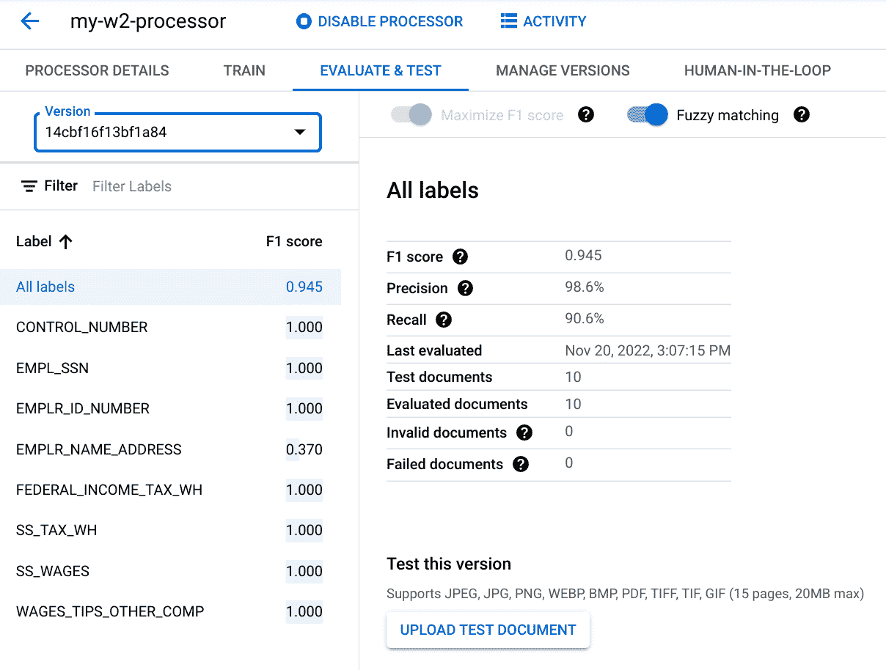

并点击`UPLOAD TEST DOCUMENT`。提供我们下载的 PDF 文件。该过程需要一些时间，将显示类似于以下内容的结果:

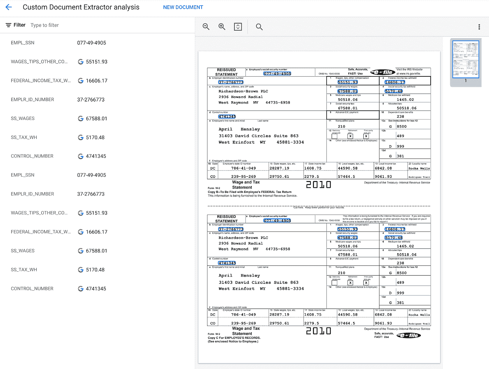

这是完美的！！！我们现在能够向 DocAI 提交 W2 文档，DocAI 将解析和提取结构化数据。

有了一个基本的解析器，我们可以用它来构建一个更好的版本，使用一个叫做 bootstrapping 的过程。我们知道，我们可以接收新文档，给它们贴上标签，然后进行再培训。然而，一旦我们有了一个基本的解析器，我们就可以用它来解析新的文档，进行第一次标记。然后，我们应该使用 staff 来检查这个输出的结果，以验证正确性，并且非常重要的是，纠正任何错误。有了这组经过审查的新文档，我们可以将这些文档添加到我们的训练文档集中并进行重新训练。使用解析器解析用于训练的新文档的好处是，它将进行第一遍/最佳猜测，这(希望)将减少工作人员的工作量。注意要仔细检查文档，因为早期解析器引入的错误如果不被纠正，将会被消极地强化。

我们可以通过转到`TRAIN`选项卡并单击 Import Documents 来导入一些新文档来演示这一点。将出现一个对话框:

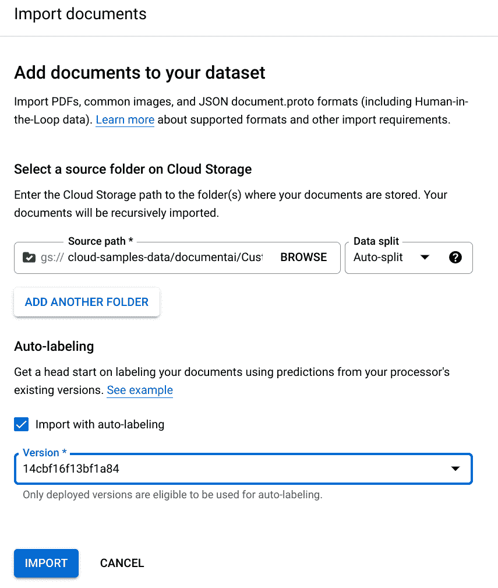

对于源路径，指定:`cloud-samples-data/documentai/Custom/W2/AutoLabel`，这是 Google 提供的桶/文件夹，包含另外 5 个看不见的文档。

对于数据分割，指定`Unassigned`。

勾选“`Import with auto labeling`”，选择我们最新部署的版本。

`Click IMPORT`。

在 Google 云存储位置找到的文档将被加载到 Document AI 中，并让解析器针对它们运行，以生成一组默认的标签。

我们将看到现在有 5 个文档被自动标记。选择每个自动标记的文档，一次一个，并检查其正确性:

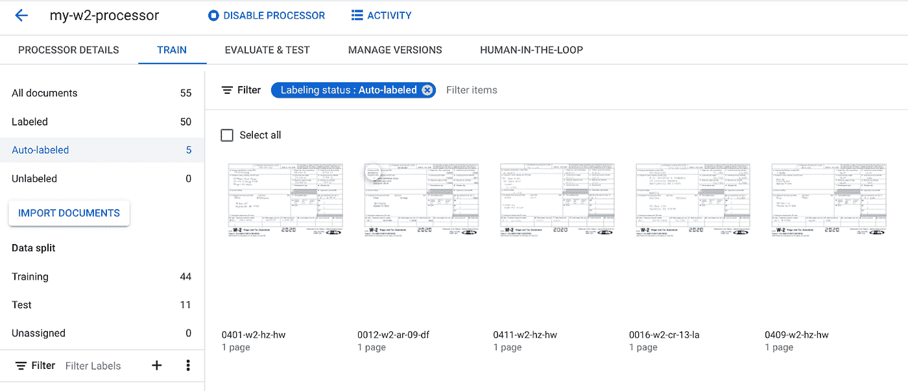

一旦文档被纠正/审核，将其标记为标签。我们现在有机会对我们的数据进行再训练。每次我们用更多的数据重新训练时，我们应该期望准确性会提高。

本文中使用的例子摘自 Google [入门](https://cloud.google.com/document-ai/docs/workbench/build-custom-processor)文章。

下面的视频是本文的演练:

# 词汇表:

*   **自定义文档提取器** —一个新的 DocAI 解析器，可以在运行时用来从文档中提取实体。
*   **实体** —文档中我们希望提取成结构化格式的字段。
*   **uptraining**——增强谷歌提供的 DocAI 解析器，以识别新实体或改进现有实体。
*   **解析器** —一个经过训练的模型，可以被 DocAI 用来确定文档中的实体。
*   **处理器** —解析器的同义词。

学分:

*   [纸堆— 3D 模型— ArthurBoni](https://sketchfab.com/3d-models/paper-pile-pilha-de-papeis-7ad13bc9bf57467b95f5d51ba965284b)
*   [在云控制台中创建自定义文档提取器](https://cloud.google.com/document-ai/docs/workbench/build-custom-processor)——Google Docs 中的一篇文章，本文的大部分内容都基于该文章。

# 另请参见:

*   [在云控制台| Document AI | Google Cloud 中创建自定义文档提取器](https://cloud.google.com/document-ai/docs/workbench/build-custom-processor)
*   [处理器培训和评估概述|文档 AI |谷歌云](https://cloud.google.com/document-ai/docs/workbench/training-overview)