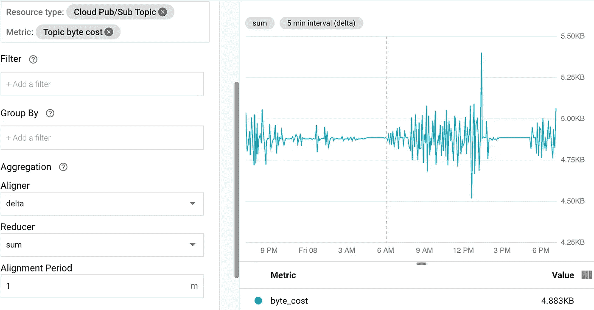
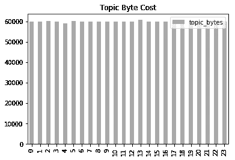

# 缩减采样和导出 Google 云监控数据

> 原文：<https://medium.com/google-cloud/downsampling-and-exporting-stackdriver-monitoring-data-c3483e88a352?source=collection_archive---------1----------------------->

更新:此帖子已经更新，包括自首次发布以来对平台的更改:

1.  Stackdriver 更名为谷歌云监控。
2.  云监控 Python API 出现了突破性的变化。更多详情参见[迁移指南](https://github.com/googleapis/python-monitoring/blob/master/UPGRADING.md)。

谷歌云监控包含大量关于云资源使用的信息，包括谷歌云平台(GCP)和其他来源。这篇文章将解释如何使用云监控 API 来读取、缩减采样和导出数据到 BigQuery。发布/订阅指标将用于演示这一点。您可以将指标更改为与您更相关的类型，或者按照[发布/订阅快速入门](【https://cloud.google.com/pubsub/docs/quickstart-cli】T2)生成此处示例中使用的指标类型。

出于多种原因，您可能希望导出监控数据，包括

*   对数据的即席查询，比如对时间序列进行转换和比较，或者在时间之外的维度上分析数据。这对于识别浪费尤其有用，例如虚拟机 CPU 占用率低、磁盘空间浪费或数据从未被访问。或者您可能对应用程序进行了更改，并希望比较效率和性能。
*   将指标数据保留的时间长于标准的[保留期](https://cloud.google.com/monitoring/quotas#data_retention_policy)。这篇文章还将解释如何对时间序列数据进行缩减采样，以将旧数据量从云监控使用的默认 1 分钟间隔减少到 1 小时间隔。下采样降低了数据存储成本。长期数据可用于长期预测或分析长期趋势。您可能希望覆盖外部数据，如经济状况或季节性事件。
*   保存特殊事件的数据，如性能测试或营销发布

Colab 是 Google 提供的 iPython 的变体。Colab 是实现我们目标的理想工具，因为它允许使用 Python 客户端 API 编写脚本来实验和探索数据。Colab 还内置了许多 for Google APIs，并支持执行一些 shell 命令。当您在 Colab 中导出数据时，您可能希望将它转移到由 cron 或 [Google Cloud Scheduler](https://cloud.google.com/scheduler/) 驱动的常规作业中。

首先，使用命令将[monitoring _ v3 API](https://cloud.google.com/monitoring/api/ref_v3/rpc/google.monitoring.v3)导入到 Colab 中

```
!pip install --upgrade google-cloud-monitoring
```

该命令使用 Colab！指令来执行 shell 命令。

使用 Python 语句向 GCP 进行身份验证

```
from google.colab import auth
auth.authenticate_user()
```

这将打开一个新的浏览器窗口进行身份验证。

导入监视 API，并使用以下语句创建一个客户端对象

```
from google.cloud import monitoring_v3
client = monitoring_v3.MetricServiceClient()
```

让我们设置一些变量来保存输入值:

```
import datetimetarget_project = '[Your project]'
start = datetime.datetime(2019,3,5, 0, 0, 0, 0)
end = datetime.datetime(2019,3,6, 0, 0, 0, 0)
topic_bytes = 'pubsub.googleapis.com/topic/byte_cost'
```

我们将从目标项目收集为期一天的数据，从 2020 年 11 月 10 日凌晨 1:00 开始，到 2020 年 11 月 10 日世界协调时凌晨 2:00 结束。假设我们有许多项目，那么我们可以更改 target_project 的值，并将数据导出到一个 home 项目中。这将允许从许多项目中收集度量数据到一个中心位置。

我们将导出的发布/订阅指标之一是主题/字节成本。还有更多 [GCP 指标](https://cloud.google.com/monitoring/api/metrics_gcp)可供选择，还有其他云和开源指标。

我们可以通过下面的函数来了解这些指标

```
def list_metric_descriptors(client, project_resource, metric):
  resource_descriptors = client.list_metric_descriptors(
      project_resource,
      'metric.type="{}"'.format(metric))
  for descriptor in resource_descriptors:
    print(descriptor)
```

这将给出度量种类(本例中为 DELTA)、值类型(int64)、描述和其他细节。如果我们在监控仪表板中查看指标，我们会看到类似于下图的低流量应用程序:



主题字节增量度量类型图表

从该图中我们可以看到，每 5 分钟通过发布/订阅服务发送的数据量约为 4.88 KB。

我们可以用下面的函数对时间序列进行下采样

```
from google.cloud.monitoring_v3.types.metric_service import ListTimeSeriesRequest
from google.protobuf import duration_pb2 as duration
from google.protobuf import timestamp_pb2 as timestampdef to_csv_delta_metric(client, project_resource, filter, start, end, frequency, colname): """Exports downsampled metrics to a string buffer in CSV format
  Exports the timeseries created between start and end with given
  frequency in seconds to a string buffer in comma separated
  variable format
  """
  end_time = timestamp.Timestamp(seconds=int(end.timestamp()))
  start_time = timestamp.Timestamp(seconds=int(start.timestamp()))
  interval = monitoring_v3.types.TimeInterval(end_time=end_time,
                                              start_time=start_time)
  aggregation = monitoring_v3.types.Aggregation(
      alignment_period = duration.Duration(seconds=frequency),
      per_series_aligner =   
        monitoring_v3.Aggregation.Aligner.ALIGN_DELTA,
      cross_series_reducer =
        monitoring_v3.Aggregation.Reducer.REDUCE_SUM
  )
  req = ListTimeSeriesRequest(
      name = project_resource,
      filter = filter,
      interval = interval,
      view = monitoring_v3.ListTimeSeriesRequest.TimeSeriesView.FULL
  )
  results = client.list_time_series(req)
  csv = '{0},{1}\n'.format('time', colname)
  t = int(start.timestamp())
  ts_array = []
  for ts in results:
    ts_array.append(ts)
    if len(ts_array) > 0:
      ts = ts_array[0]
      for p in ts.points:
        t += frequency
        v = p.value.int64_value
        csv += '{0},{1}\n'.format(t, v)
      return csv
    else:
      print('Did not get any results back') 
```

一个[过滤器](https://cloud.google.com/monitoring/api/v3/filters)被应用于选择相关的度量，因此可以检索多个时间序列。这种下采样功能适用于“增量”型指标。有关 delta 和其他度量种类的详细信息，请参见[度量种类](https://cloud.google.com/monitoring/api/v3/metrics-details)。该系列与 delta 减压器对齐。Delta 类型的度量通常是相加的，这就是我们对上面的聚合对象所做的。结果以逗号分隔的形式放在一个字符串缓冲区中，我们将把它加载到下面的 Google 云存储(GCS)中。

可以使用函数将缓冲区上传到 GCS

```
def upload_gcs(bucket, buf, filename):
  fname = '/tmp/{}'.format(filename)
  with open(fname, 'w') as f:
    f.write(buf)
  print('head {}:'.format(fname))
  !gsutil cp {fname} gs://{bucket}/
```

这些函数可以用下面的代码调用

```
metric_names = ['topic/byte_cost',
    'subscription/byte_cost',
    'topic/send_request_count',
    'topic/message_sizes']
colnames = ['topic_bytes',
    'sub_bytes',
    'send_request_count',
    'message_sizes']
frequency = 3600 # 1 hour
for i in range(len(metric_names)):
  filter =  'metric.type="pubsub.googleapis.com/{0}"'.format(metric_names[i])
  filename = '{0}.csv'.format(colnames[i])
  csv_buffer = to_csv_delta_metric(client,
      project_resource,
      filter,
      start,
      end,
      frequency,
      colnames[i])
  upload_gcs(bucket, csv_buffer, filename)
```

这将导出四个发布/订阅指标的时间序列，假设缩减采样间隔为一小时。要了解更多关于使用 monitoring_v3 API 提取指标的信息，请参见[读取指标数据](https://cloud.google.com/monitoring/custom-metrics/reading-metrics)。

可以用下面的语句将数据装载到 BigQuery 中

```
for i in range(len(colnames)):
  filename = '{0}.csv'.format(colnames[i])
  tablename = colnames[i]
  !bq --project_id={home_project_id} \
      --location=US load \
      --autodetect \
      --source_format=CSV {dataset}.{tablename} \
      gs://{bucket}/{filename}
```

一旦数据被加载到 BigQuery 中，我们就可以对其进行查询。在从上面的 Stackdriver 中读取时间序列后，我们可以在上面对它进行查询，但是，一般来说，我们希望定期将数据加载到 BigQuery 中，然后过一段时间再回来对它进行特别查询。

让我们做一个简单的查询来验证下采样是正确的。可以使用 BigQuery 客户端 API 从 Colab 中的 BigQuery 查询数据。

```
from google.cloud import bigquerybq_client = bigquery.Client(project=home_project_id)
df = bq_client.query('''
    SELECT
      time, topic_bytes
    FROM `{0}.topic_bytes`'''.format(dataset)).to_dataframe()print(df)
```

来自查询的数据被读入 Pandas 数据帧 df。

可以使用 Python 图形实用程序(如 matplotlib)查看数据。熊猫也可以用来创建一个简单的图表与以下声明

```
df.plot.bar(y='topic_bytes',
            title='Topic Byte Cost',
            color=['darkgrey'])
```

这导致了图表



降采样数据(x 轴是时间，y 轴是字节)

让我们检查我们的数学。请注意，我们在一天的总时间间隔内以一小时的频率进行下采样。上图中有 24 根棒线，所以时间加起来就是原来的周期。目测每小时的平均值略低于 60，000 字节。根据上面的图表，我们在 5 分钟的时间间隔内有 4.88 kB。12 * 4.88 = 58.56 kB 小时，接近预期值(那是解脱)。