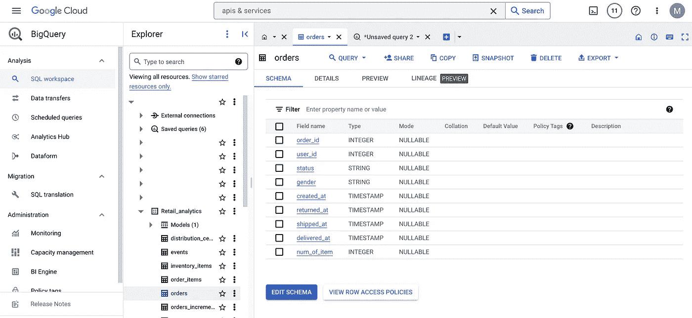
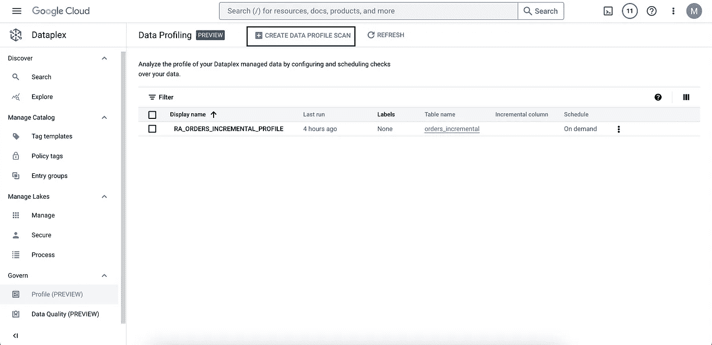
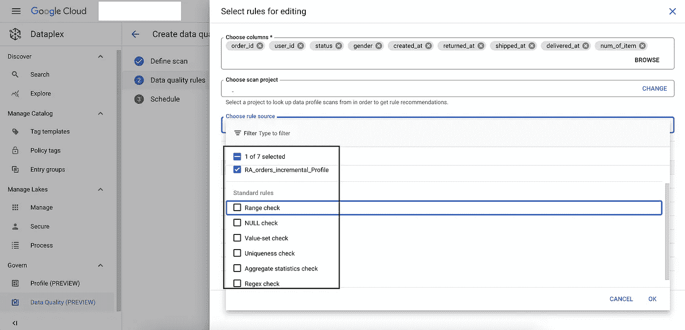

# 使用 Dataplex 进行数据治理——最新产品发布的一个亮点

> 原文：<https://medium.com/google-cloud/dq-with-dataplex-c1f42195435d?source=collection_archive---------2----------------------->

来源: [Gartner](https://www.gartner.com/smarterwithgartner/how-to-improve-your-data-quality)

数据质量差的挑战并不新鲜。它从遗留数据仓库(DWH)时代就已经存在，并随着现代数据湖的发展而发展。虽然组织已经获得了云上 DWH /数据湖的好处，但由于各种因素，数据质量(DQ)的挑战仍然存在，这些因素包括**战略、技术、成本**等。

所以问题是我们如何以简单有效的方式解决这个问题？

陈述显而易见的事实——如果你不能检测到它，你就不能修复它！在这篇博客中，我们将重点关注**检测**部分。

***案例:***

让我们考虑一个场景，一家零售公司已经在 Google Cloud 上实现了他们的数据湖/ DWH。该公司非常注意**治理**方面，并且已经实现了 [Dataplex](https://cloud.google.com/dataplex) 来解决这些问题。

零售分析数据湖中的原始数据区和精选数据区

该公司从定制订单管理应用程序接收订单/交易数据。

订单表的说明性模式

数据治理主管怀疑 orders 表中的数据从质量角度来看不是最好的，这需要进一步调查。

***解决方案:***

现在，调查部分有两个主要组成部分:A —配置文件(预览)和 B—数据质量(预览)

**A .简介**

**步骤 A1:** 点击谷歌云控制台>Data plex>Govern>Profile 内的“创建数据配置文件扫描”

**步骤 A2:** 选择需要进行质量问题扫描的可疑 BigQuery 表。在这里，我们选择订单表。扫描范围可以是完全扫描，也可以是增量扫描(基于特定的日期列)。

**步骤 A3:** 扫描可以按需触发，也可以按照特定的时间表触发。

**步骤 A4:** 分析产生数据的标准结果，例如空值、唯一百分比和其他统计数据。

在上面的示例中，从 DQ 的角度来看，34%的空统计值可能对正在进行的检查有意义。原因是具有空的 shipped_at 时间戳会导致诸如传输持续时间之类的度量的不正确计算。

这让我们进入调查的第二部分——持续检查 **> B .数据质量**

**步骤 B1:** 点击谷歌云控制台> Dataplex >内的“创建数据质量扫描”来管理>数据质量

**步骤 B2:** 用表格等信息定义扫描，增量/完全。这里的下一步是定义验证的 DQ 规则，这里有多个选项。

**步骤 B3:** 与标准的 DQ 检查(如范围、空值、值集等)一起，也可以根据数据分析步骤的建议进行选择。

**步骤 B4:** 查看以下所有从分析任务中得到的建议。对于我们的例子，我们将选择一个标准的，即零检查 DQ 验证。

**步骤 B5:** 我们已经触发了按需扫描，作业已经成功完成。验证导致完整性失败。这表明测试数据的 shipped_at 列确实有空值，即使是在持续的基础上。

根据上面的结果，可以定义 ETL 管道中的 DQ 操作。既然我们知道 shipped_at 列可以持续为空，我们可以在数据流或数据融合或 BQ 过程中附加一个步骤，处理对该数据的 ETL 操作。

**总之，**

使用 Dataplex 上的新功能**Profile**(Preview)**和 **Data Quality** (Preview)，可以通过几个简单的步骤对数据湖中的数据进行**分析和验证。对于需要持续执行的检查，剖析步骤尤其直观。基于 DQ 检查，可以在数据处理解决方案组件中确定和定义用于清洗的校正动作。****