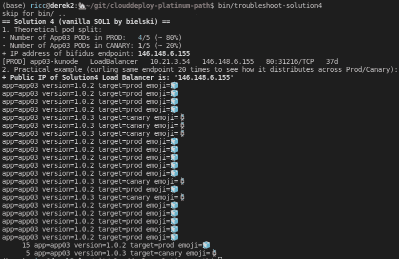

# 🐤部署云的 GCP 金丝雀部署

> 原文：<https://medium.com/google-cloud/draft-canarying-on-gcp-with-cloud-deploy-91b3e4d0ee9a?source=collection_archive---------1----------------------->

在过去的几个月里，我一直在为金丝雀开发一个有点“复杂”的解决方案🐤多应用的部署(💎🐍️🧊)知识库，试图回答这个问题:我如何通过几个阶段将 *N* 个应用程序投入生产，并确保(过于简化)**最终用户得到 n 个和 N-1 个版本的组合，**比如说 **90%的生产**流量/ **10%的金丝雀**流量？我如何让代码[变干](https://en.wikipedia.org/wiki/Don%27t_repeat_yourself)以便让我的下一个应用变得超级简单？

*不耐烦？参见*[*【https://github.com/palladius/clouddeploy-platinum-path】*](https://github.com/palladius/clouddeploy-platinum-path)*(*[*视频*](https://www.youtube.com/watch?v=0GfV5iMGG64) *)*


真正的金丝雀在 [Cripta Rasponi](https://goo.gl/maps/4cgTQJfDonHi5XFN9) (意大利拉韦纳圣方济各广场)

# 问题是

许多谷歌云用户指出了如何使用[云构建](https://cloud.google.com/build) + [云部署](https://cloud.google.com/deploy)来执行部署策略的愿望。虽然云构建和云部署一直在发展，但我想展示一下 Google Cloud 的 CI/CD 工具*今天*能做些什么。

在本文中，我将演示如何构建一个**多应用交付管道**，它有四个目标，并使用两种构建策略(纯构建，以及通过单元测试后的提升)。更重要的是，我们将展示如何使用两种不同的全新技术(**网关 API** 和**基于 Envoy 的 HTTP 负载平衡器**)来实现 **canary/prod** **流量分流**。

# 什么是…🐤金丝雀部署？蓝色怎么样🔵/🟢green？

> 🐤Canary deployment 是让你的新版本只对有限的用户开放的实践，目的是在推送错误的情况下能够快速失败/回滚，同时让大多数用户满意。这可以通过多种方式实现(5%的客户端浏览器，美国用户对欧洲用户，..).

等等——这不是和蓝绿色一样吗？

在**蓝**的情况下🔵-🟢 **绿色部署**，当一个新版本的环境(绿色)被部署时，流量进入一个生产环境(蓝色)。然后将测试(绿色)的新版本。一旦情况稳定下来，用户将被推到绿色环境，而蓝色环境则保持待命状态，以防出现任何问题。如果出现问题，用户可以被推回到蓝色版本，确保无缝过渡和最大限度的正常运行时间，而没有人会注意到。


谷歌苏黎世典型的蓝绿色部署

因此，虽然 blue/green 在任何时候都有两个版本 N 和版本 N-1 的环境，并且能够在它们之间切换，但 canary 更多的是两个版本之间随着时间推移的“淡化机制”。

**哪个好？**答案一如既往的是“*看情况*”。不过我的理解是，在 Kubernetes ( `Deployments` + `RollingUpdates`)出来之前，蓝/绿是做流量分流的老办法。如果两者都可以，你可能会选择金丝雀，除非一个强大的隔离成本约 2 倍的价格对你更好。

# 两个金丝雀解决方案

## 简单的解决方案(A): GKE 单一集群，分离式

第一个解决方案非常简单，kubernetes-native。


简单的解决方案:kubernetes-原生荚果分裂

属性:

*   **单簇**
*   K8s 本机(服务/部署/pod)
*   **金丝雀**通过荚果分裂
*   最大努力:80/20
*   App:【仅 (节点。JS)

这个解决方案非常简单:prod 中的 4 个[吊舱](https://kubernetes.io/docs/concepts/workloads/pods/)和 canary 中的 1 个[吊舱](https://kubernetes.io/docs/concepts/workloads/pods/)。在这里，Cloud Deploy 帮助您构建和部署您的第 N 个和第 N+1 个版本到交付管道，


针对 4 个目标的 4 个版本

..GKE 负载平衡器将始终以 80/20 的比例指向您最近部署的两个版本。这种解决方案不是很复杂，因为它依赖于 5 个吊舱是活着的并且具有相似的负载，这可能并不总是真实的。如果您想要 90%/10%的比率，您需要安排 9/1 pod 或 18/2、27/3、..几乎没有灵活性。

## 复杂解决方案(B):基于 Envoy 的 GXLB、双 GKE 单集群、网关 API、流量分离


该解决方案在更高层引入了适当的流量分流，而不仅仅是 pod。为了实现这一点，我们使用最新的 [**网关 API**](https://gateway-api.sigs.k8s.io/) (绿色香蕉将超越并取代棕色香蕉[入口 API](https://kubernetes.io/docs/concepts/services-networking/ingress/) )

属性:

*   **多集群**
*   技术:GKE/GCP/网关 API/NEGs。
*   通过适当的流量分流
*   应用:`app01` (python)和`app02` (ruby)

增加一些复杂性([更大的图像](https://github.com/palladius/clouddeploy-platinum-path/blob/main/doc/Ricc%20Canary%20deployment%202022.png?raw=true)):


黄色部分是“GCP ”,左边是中间的 GKE 星团。

因此，一方面，我们的开发人员将发布推送到云部署，云部署又将它们推送到我们的三个 GKE 集群，另一方面，我们有两个基于 HTTP(s) [Envoy](https://www.envoyproxy.io/) 的外部(*)负载平衡器，它们将流量分流到两个[后端服务](https://cloud.google.com/load-balancing/docs/backend-service)，后端服务通过 [**网络端点组**](https://cloud.google.com/load-balancing/docs/negs) (对于朋友来说是 **NEGs** )将流量路由到适当选择的 pod。NEG 是一个神奇的实体，它允许您将一个网络对象链接到另一个对象(我将其视为云中的黄色虚拟 CAT-6 电缆)，这些对象可以是负载平衡器或 pod 选择器。在我们的例子中，需要 neg 将某个后端服务(例如“App01 canary”)连接到匹配某个 pod 选择器的 pod(在我的例子中是`ricc-awesome-selector: canary-or-prod`)。


这个解决方案最复杂的部分是 AppX/StageY 和它的 pod 之间的 NEGs 的编织。一般来说，对于 Google Kubernetes 引擎集群，每个组合都有三个 neg，因为我们通常每个集群有三个区域，每个区域一个，我们使用的是区域 neg。

为此，我们将:

*   使用`kubectl`获取附加到“svcneg/XXX”对象的 3 个负数。
*   使用一些`[jq](https://stedolan.github.io/jq/)`喷火提取三个对象
*   使用`gcloud`将它们连接到我想要的*后端服务*。

如果你想头疼，看看这个意大利面条代码:


这是库贝奈特人的沃贡诗歌:)

→阅读更多关于[全球外部负载平衡器](https://cloud.google.com/load-balancing/docs/https#HTTP2-limitations)和[特使](https://www.envoyproxy.io/)的信息。

# 高层建筑

这是一个高层次的解决方案。这都是由谷歌云平台技术实现的(作为一名谷歌人，我坚持己见)😃)，利用这些技术:

*   Google**Cloud Build**for Build 在 git 代码更改时触发。
*   Google **Cloud Deploy (** 包括 **Skaffold)** 习惯性地管理多个管道、多个版本和工件，然后很容易部署/回滚到 GKE。


*   Google **Kubernetes 引擎**来运行我们的服务。
*   Google**Artifact Registry**安全地保存我们的图像及其版本。
*   一些谷歌云**负载平衡**资源，使金丝雀解决方案 2 发生(见下面的[金丝雀解决方案](https://docs.google.com/document/d/1ZiMLBvAu5iXjFt2xE7KRHA1SJQKz-KPMHMdtKCnydKs/edit?resourcekey=0-9XoJqN8fbOgQl3fE3CzlgA#bookmark=id.ykizmocnuze0))。我们正在利用全新的基于 **Envoy 的负载均衡器:**这是一个全局负载均衡器，在 Google 前端(GFEs)上作为托管服务实现。它使用开源的 Envoy 代理来支持高级流量管理功能，如流量镜像、基于权重的流量分割、基于请求/响应的报头转换等。
*   [**Skaffold**](https://skaffold.dev/) 在这里表现最好:它讲述了如何**构建**应用程序，何时需要重新构建它( [**filesync**](https://skaffold.dev/docs/pipeline-stages/filesync/) )，以及如何**部署**应用程序，所有这些都在一个 YAML 中完成。我们的版本大量使用了 Kustomize:


这是 App02 的“ska ffold . YAML ”( Ruby)

*   [](https://kustomize.io/)**。我们选择采用 Kustomize 将配置“干燥”成一个基本版本和 4 个小补丁(覆盖)。如果你不是 kustomize 专家，只是想剪切粘贴结果，你可以做:`cd apps ; make kustomize`。这将呈现 12 个 YAMLs 个应用程序 x 4 个目标):**

****

**(*) Envoy 是一种开源代理服务，它允许实现神奇的行为，如“将 3.14%的流量路由到此端点，将剩余流量路由到另一个端点”(流量分流)。**

# **先决条件**

**要运行此代码，您需要:**

*   **使项目 id 启用计费。参见 [**GCP 入门**](https://cloud.google.com/docs/get-started) 。你实际上可以获得 300 美元的免费试用，这应该让你在几分钟内开始运行。**
*   **使用 bash v5+支持数组的本地环境(任何 Linux 发行版都支持，对于 Mac，您可能需要`brew install bash)`**
*   **带有其他常用工具的本地环境，如`kubectl`、`jq`、`kustomize`(见下文)**

**注意，这段代码已经在 [**云壳**](https://cloud.google.com/shell) 上进行了广泛的测试，所以云壳会解决你所有的本地 env 依赖。**

## **装置**

**为了保持这篇博客的简短，我鼓励你按照回购 [**README.md**](https://github.com/palladius/clouddeploy-platinum-path/) 进行说明。我没有偷懒，这么做主要也是为了变更管理。只是一些小技巧。**

****问:为什么我没有使用 Terraform** ？**

**我和许多专家谈过，他们说服我不要使用 Terraform。为什么？每个 bash 脚本都旋转出一个主要组件(GKE，云构建，云部署，..)而这种依赖关系树可能隐藏在 TF 脚本中。我的代码中并不是所有的东西都可以是 terraform，为了达到最终的结果，我需要一些本地的 exec。我的下一步将是🧹代码，允许我 90%的声明性和 10%的命令性。**

**问:这些 bash 代码是什么？**

**你可能已经注意到了，我喜欢我的狂欢。有些事情需要解释:**

*   **`.env.sh.dist`包含供您复制的配置。前 4 行是你需要修改的，其余的都应该没问题。**
*   **包含我所有的库代码。**
*   **`XX-blah-blah.sh`:该代码必须按数字顺序运行(00- > 01- > 02- > 03)..).所有的脚本都有一个共同点:它们在开始时导入 shell 脚本，失败或成功返回，接触一个隐藏文件，这将允许回顾并查看哪些脚本失败了。**

****你如何确保代码在正确的时间内得到执行？****

**很高兴你问了。我依靠两种机制:(1)“set-e”在第一个错误时退出，以及(2)我创建的这个愚蠢的脚本:`proceed_if_error_matches .` 它将捕获一个非常简单的错误 regex:如果类似“cluster 已经存在”的东西，我将把它解释为退出 0，即使它是一个错误。这允许我在反复试验的情况下继续按顺序执行代码，直到代码结束。**

## **检查它是否工作**

**这是通过`curl`相同的 IP(解决方案 A)或 DNS(解决方案 B)实现的，并按阶段查看后端请求的百分比。**

****简单解法(一)举例。****

**`$ bin/troubleshoot-solution4`:**

****

**我们将同一个 IP 卷了 20 次，得到了 15/5，接近我们预期的 16/4。**

****复杂解(B)例。****

**手动卷曲一旦你知道 IP:**

```
for i in $(seq 1 20) ; do
   curl -H "host: [www.example.io](http://www.example.io)" [http://35.244.160.220/statusz](http://35.244.160.220/statusz)
done
```

****

**如果你喜欢手工卷发**

**漂亮的包装脚本:`./16-solution2-test-by-curling-N-times.sh app01`:**

****

**如果你喜欢漂亮的包装纸。这里我们得到了 17/3，而不是期望的 16/4。**

## **结论**

**我展示了一个在 GCP 多阶段部署金丝雀的工作框架。不仅如此，我还展示了 Skaffold 和 Kustomize 如何在它们之间以及与云构建/云部署配合得很好。**

**虽然开始时学习曲线可能有点陡峭，但我相信您会有很多代码可以在 Google Cloud 上的 CI/CD 体验的“第二天”重用。**

****

**我在谷歌阿姆斯特丹办公室拍的照片**