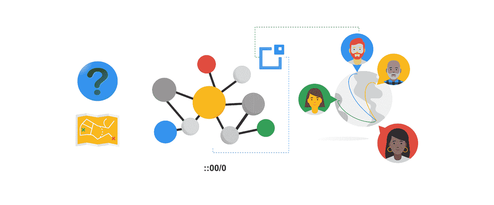
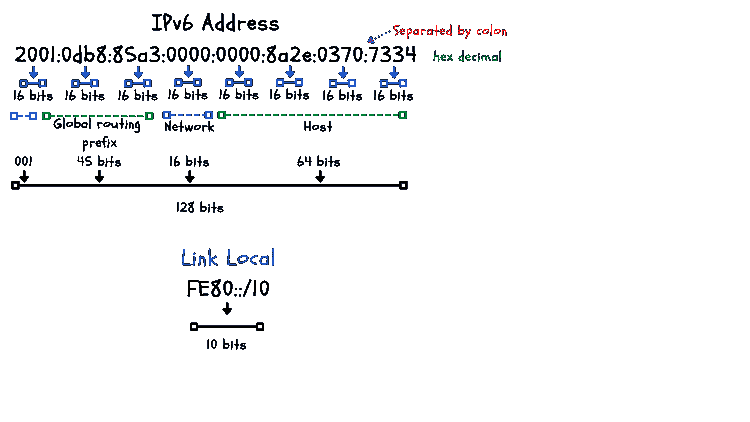
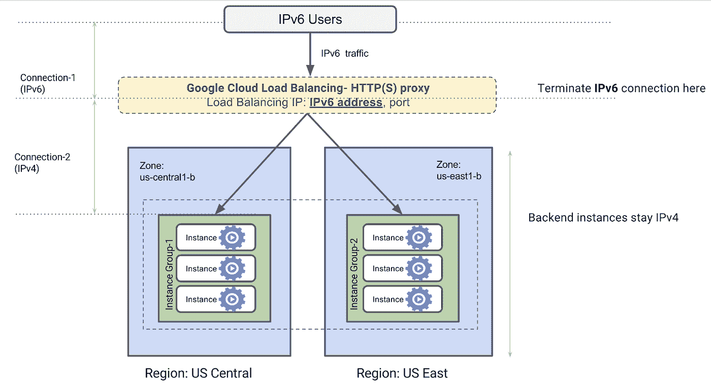

# Google Cloud 中的双栈网络 IPv4 和 IPv6

> 原文：<https://medium.com/google-cloud/dual-stack-networks-ipv4-and-ipv6-in-google-cloud-914778b2f32d?source=collection_archive---------1----------------------->



IP 地址是网络和主机的唯一标识符。IPv6 地址的创建是为了解决 IPv4 地址耗尽的问题。IPv4 是一个 32 位地址，其最大地址容量为 2(32)次方= [4，294，967，296](https://www.ripe.net/about-us/press-centre/understanding-ip-addressing#:~:text=Both%20IPv4%20and%20IPv6%20addresses,size%2C%20containing%20340%2C282%2C366%2C920%2C938%2C463%2C463%2C374%2C607%2C431%2C768%2C211%2C456%20IPv6%20addresses.) 。

IPV6 地址由 128 位组成，分为 16 位十六进制字段。该地址的最大地址容量为 2(128)次方= [340，282，366，920，938，463，463，374，607，431，768，211，456](https://www.ripe.net/about-us/press-centre/understanding-ip-addressing#:~:text=Both%20IPv4%20and%20IPv6%20addresses,size%2C%20containing%20340%2C282%2C366%2C920%2C938%2C463%2C463%2C374%2C607%2C431%2C768%2C211%2C456%20IPv6%20addresses.)

IPv6 地址格式的示例如下图 1 所示。



在上面的例子中，我们有一个全球 IPV6 地址。该地址被子网分成网络和主机两部分。

*   **网络部分** —这代表大的单个识别块空间。把它想象成一条街道。这条街道可以容纳一所或多所房子，这取决于街道的大小。共同的因素是街道的名称，以区别于其他街道。
*   **主机部分** —这代表网络上的端点。为主机分配唯一的地址以避免冲突非常重要。想象一下，试图给一个收件人送一封信，但是当投递人到达该位置所在的街道时，有两栋门牌号相同的房子。这对发送者和接收者来说都是一种混乱的体验。

# 虚拟私有云

虚拟私有云是一种全局结构，在逻辑上代表一个本地数据中心。在您的 VPC 中，您可以为您的环境调配网络、安全、计算和存储资源。VPC 被附加到一个项目。创建项目时，会创建一个默认的 VPC。

**VPC 的子网** 子网是区域性的，每个子网必须有一个唯一的 IP 地址范围。自动模式网络(如默认网络和您可以创建的网络)预先填充了每个地区的 IPv4 专用地址范围。您还可以创建推荐用于生产的自定义 VPC，因为您可以控制分配的地址。可以在您的自定义模式 VPC 上启用 IPv6 以允许通信。IPv6 目前在双栈模式下运行，我们将在本博客的后面进行更详细的讨论。

**在 Google Cloud 支持 IPv6 的地方** IPv6 可以分配给

*   虚拟机
*   负载平衡器

# Google Cloud 中 IPv6 地址的类型

在 Google Cloud 中，您可以为您的子网配置两种 IPv6 **访问类型**模式。子网只能是其中之一，不能同时是两者。

*   [全球单播地址(gua)](https://cloud.google.com/vpc/docs/subnets#external-ipv6)—如果选择**外部访问**子网，则会分配 gua。这些允许内部和外部通信。
*   [唯一本地地址(ula)](https://cloud.google.com/vpc/docs/subnets#internal-ipv6)—如果选择**内部访问**子网，则会分配 ula。这些只允许内部通信。

Google Cloud 中有几个与 IPv6 寻址相关的细节。您可以查看[范围分配文档](https://cloud.google.com/vpc/docs/subnets#ipv6-assign)了解更多信息。

# 在子网上启用双栈

启用双栈 IPv4/IPv6。

*   使用[双堆栈子网](https://cloud.google.com/vpc/docs/create-modify-vpc-networks#create-network-dual)创建自定义 VPC。

```
gcloud compute networks create ***NETWORK*** \
    --subnet-mode=custom \
    [ --enable-ula-internal-ipv6 [ --internal-ipv6-range=ULA_IPV6_RANGE ]] \
    --bgp-routing-mode=DYNAMIC_ROUTING_MODE \
    --mtu=MTU
```

*   或者您可以在现有的自定义模式 VPC 上启用双堆栈。[在子网](https://cloud.google.com/vpc/docs/create-modify-vpc-networks#subnet-enable-ipv6)上启用 IPv6。

```
gcloud compute networks subnets update ***SUBNET*** \
    --stack-type=IPV4_IPV6 \
    --ipv6-access-type=***IPv6_ACCESS_TYPE*** \
    --region=***REGION***
```

*   接下来，您[在现有虚拟机上创建一个双堆栈虚拟机](https://cloud.google.com/compute/docs/ip-addresses/configure-ipv6-address#create-vm-ipv6)或[将堆栈类型更改为 IPv6](https://cloud.google.com/compute/docs/ip-addresses/configure-ipv6-address#update-vm-ipv6)
*   您也可以创建实例模板

```
gcloud compute instance-templates create ***TEMPLATE_NAME*** \
    --subnet=***SUBNET*** \
    --stack-type=IPV4_IPV6
    --ipv6-network-tier=PREMIUM \
    --region=***REGION***
    --tags=***TAGS***
    --image=***IMAGE***
```

# 在负载平衡器上启用 IPv6

负载平衡器向可用资源公开服务和负载平衡流量。除了 IPv4，您还可以在外部负载平衡器上使用 IPv6 IPs。



IPv6 负载平衡器终止

文档“[外部 HTTP、SSL 代理和外部 TCP 代理负载平衡的 IPv6 终止](https://cloud.google.com/load-balancing/docs/ipv6)”为您提供了有关该过程的更多详细信息。

要查看 IPv6 的配置，请查看[请求路由到多区域外部 HTTPS 负载平衡器](https://cloud.google.com/load-balancing/docs/https/setting-up-https)文档。

**要了解有关谷歌云 IP 地址的更多信息，请查看以下链接:**

*   [文档:IP 寻址](https://cloud.google.com/compute/docs/ip-addresses)
*   博客:[谷歌云的 IP 地址选项:网络基础知识](https://cloud.google.com/blog/topics/developers-practitioners/ip-addressing-options-google-cloud-networking-basics)

想问一个问题，了解更多或分享一个想法？请在 [Twitter](https://twitter.com/ammettw) 或 [Linkedin](https://www.linkedin.com/in/ammett/) 上与我联系，并给我发消息。