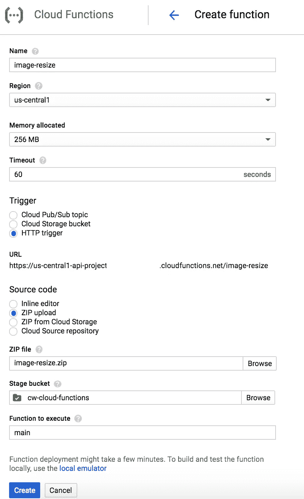

# 使用谷歌云功能动态调整图像大小

> 原文：<https://medium.com/google-cloud/dynamic-image-resizing-with-google-cloud-functions-2fcdf935d8ce?source=collection_archive---------2----------------------->

对于一个小项目，我需要动态调整图像大小，这意味着我会调用一个 url 中的图像，附加一些参数来调整大小并返回一个更小的图像，所以类似于`example.com/image.jpg?w=50&h=50`。现在有几个开源项目能够做到这一点，最著名的是 [Thumbor](https://github.com/thumbor/thumbor) 。

然而，我想尝试一些新的东西。我最近尝试了一下谷歌云功能，它看起来是个不错的选择。然而，我担心函数的初始旋转时间可能会有问题。尽管如此，我还是想尝试一下，以后再处理这个问题。

首先，我已经有一个谷歌云存储桶，里面有原始图像。如前所述，我希望调整大小是动态的。因此，对请求的响应是调整了大小的图像。我希望 resizer 输出 50×50 像素的图像，这样我们就可以得到一些很好的图片大小的图像。

我们将从编写云函数开始。首先是一些设置步骤。

```
mkdir image-serve 
cd image-serve 
git init . yarn init # Press enter on all the steps 
yarn add @google-cloud/storage gm
```

我们设置了一个 git 存储库，并使用 yarn 来设置项目。然后我们添加两个依赖项， [Google 云存储 api 客户端](https://github.com/GoogleCloudPlatform/google-cloud-node#cloud-storage-ga)和 [gm 包](http://aheckmann.github.io/gm/)，一个 imagemagick/graphicsmagick 的包装器。

接下来是实际云函数的编写。用以下内容创建一个`index.js`文件。

```
//index.jsconst storage = require('@google-cloud/storage')()
const gm = require('gm').subClass({imageMagick: true})const bucket = "source-bucket-name"
const width = 50
const height = 50
const option = "!"
const quality = 90exports.main = (req, res) => { const filename = req.query.f if(!filename) {
        res.sendStatus(500).send("No file specified");
        return;
    } const file = storage.bucket(bucket).file(filename); let stream = file.createReadStream() stream.on('error', function(err) {
        console.error(err);
        res.sendStatus(err.code).end(err);
    }); gm(stream)
    .resize(width, height, option)
    .quality(quality)
    .stream()
    .pipe(res); console.log('Served: ' + filename );
}
```

那么这里发生了什么？首先，我们需要依赖关系，并设置一些常数，如图像输出的尺寸和质量。我们还在这里设置了一个源桶，供 Google Cloud 客户端查询。我们还子类化了`gm`库，以使用已经存在于云函数环境中的`imagemagick`二进制文件。

接下来是主函数。它接受两个参数，一个请求(req)和一个响应(res)。该功能类似于[快速框架](http://expressjs.com/en/api.html#req)中的功能。我们在 url 中寻找一个文件名，如果没有设置，就会触发一个错误。

之后，我们从 Google 云存储文件中获取一个读取流(假设你的文件是可公开访问的)，将这个流传递给`gm`库，使用给定的选项调整它的大小，并将输出写入响应流和日志文件名。这就是云函数的编写。现在我们需要部署它。首先我们压缩我们的代码。

```
zip -r image-resize.zip .
```

现在，在谷歌云控制台的侧边栏中，有一个指向云功能的链接。这将为您提供功能概述。点击创建功能。填写表单，它应该是这样的:



我们将在 HTTP 触发器上创建一个云函数，这样就可以通过 GET 请求访问它。注意，执行`main`的函数指的是代码中的`main`函数。此外，您可能需要为要在其中部署的功能创建一个云存储空间。点击创建，你就完成了。

现在你可以进入`https://us-central1-YOUR_PROJECT_ID.cloudfunctions.net/image-resize?f=filename.jpg`，它会将你的源桶中的`filename.jpg`-文件的大小调整为 50×50 像素。请注意，它非常慢，我将在另一个时间写关于缓存响应的内容。

Github 上有代码:(【https://github.com/maartenvanvliet/image-resize】T4)

*原载于 2017 年 7 月 29 日*[*maartenvanvliet . nl*](https://maartenvanvliet.nl/2017/07/29/dynamic-image-resizing-with-google-cloud-function/)*。*