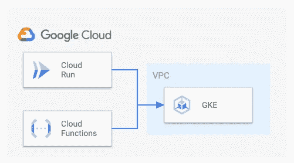

# 用于从群集外部连接的 GKE 配置发现

> 原文：<https://medium.com/google-cloud/dynamic-kubernetes-configuration-for-gke-b249afb92017?source=collection_archive---------0----------------------->

有时，您希望从集群外部更改或检查 GKE 集群上的资源。例如，您可能有一个简单的云功能或云运行服务，它会为您安排一个 Pod。挑战可能在于正确设置配置以连接到 Kubernetes 主 API。



这个代码的高级设置可能是有用的

一种方法是将 K8S 配置文件放入容器或函数代码中，但这意味着您有一个特定于环境的容器或函数。这并不是我们真正想要的，因为它限制了我们可部署的可移植性。

在我看来，更好的方法是使用 GKE API 从集群中发现我们需要的信息。第一步是加载 GKE 集群信息，为此我们可以使用 gcloud sdk for Golang:

```
func getClusterFromGkeApi(clusterName string) (*containerpb.Cluster, error) {
 ctx := context.Background()
 c, err := container.NewClusterManagerClient(ctx)
 if err != nil {
  return nil, err
 }
 req := &containerpb.GetClusterRequest{
  Name: clusterName,
 }
 cluster, err := c.GetCluster(ctx, req)
 if err != nil {
  return nil, err
 }
 defer c.Close()
 return cluster, err
}
```

`clusterName`是集群的全限定名称，形状为`projects/<project_id>/locations/<zone or region>/clusters/<cluster_name>`。接下来，我们使用群集创建 K8S 配置:

```
func autoDiscoverGkeConfig() (*clientcmdapi.Config, error) {
 cluster, err := getClusterFromGkeApi(*gkeClusterName)
 if err != nil {
 log.Printf(“Failed retrieving cluster via API %v”, err)
 return nil, fmt.Errorf(“unable to retrieve cluster”)
 }
 config, err := createKubeConfig(cluster.Endpoint, cluster.MasterAuth.ClusterCaCertificate)
 if err != nil {
 log.Printf(“Failed creating cluster config %v”, err)
 return nil, fmt.Errorf(“unable to create config”)
 }
 return config, nil
}
```

你可以在下面完整的例子中找到`createKubeConfig`函数，它只是为我们生成配置结构。我们现在可以在创建 K8S 客户端时使用`autoDiscoverGkeConfig`:

```
config, err = clientcmd.BuildConfigFromKubeconfigGetter(“”, autoDiscoverGkeConfig)
 if err != nil {
 log.Fatalf(“failed creating k8s client via autodiscovery %v”, err.Error())
 }clientset, err := kubernetes.NewForConfig(config)
 if err != nil {
 log.Fatalf(“failed creating the clientset %v”, err.Error())
 }
```

这是一个完整的例子，我在它周围添加了一些方便的功能，使它成为一个更好的独立例子。在不提供任何配置的情况下，它将在您的用户家中尝试您的“普通”kubeconfig 文件。但是当通过`gke_cluster_name`标志提供 GKE 集群名称时，它将使用上述发现机制，这使得配置机制可以在整个环境中移植。