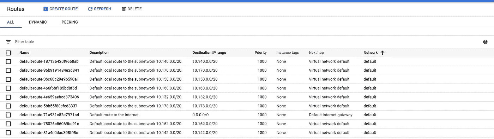
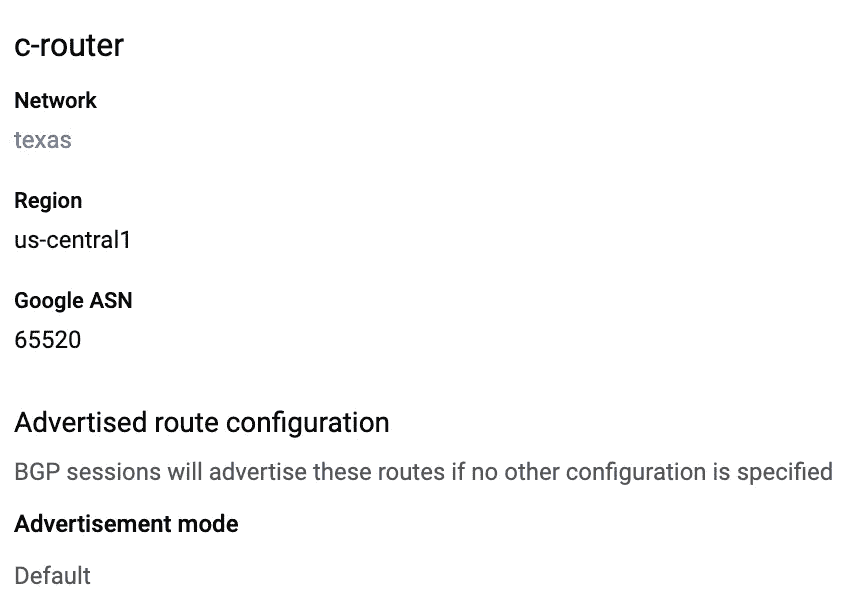

# 云路由器的动态路由

> 原文：<https://medium.com/google-cloud/dynamic-routing-with-cloud-router-9ff5c362d833?source=collection_archive---------0----------------------->

## 动态路由如何将你从传呼机任务中解救出来，以及如何在 Google Cloud 上设置它(使用 VPN)

外出是互联网的基础。你在这台电脑、手机或平板电脑上阅读的文字正通过数百万个路由器提供给你[寻找最佳数据路径](/google-cloud/define-new-paths-with-routing-39a7d8eb4356?source=friends_link&sk=c489738044d2a73104886dcae18dbb96)让数据包从源到目的地，从一个网络到另一个网络。

当然，在云环境中，路由对于连接网络同样重要，但也有不同类型的路由最适合于控制或灵活性。静态路由意味着路由表由您手动创建、维护和更新。这意味着需要在每台路由器上配置从一个资源到另一个资源的静态路由，以实现完全连接。虽然这听起来很乏味(这是可能的),但这给了您粒度控制，并且在较小的网络上完全可以管理。它非常适合执行简单的路由任务，如网络分段。在 Google Cloud 上，你可以在子网之间设置静态路由来实现连接。例如，VPC 中的[默认网络](https://cloud.google.com/vpc/docs/vpc#default-network)会自动在所有子网之间创建静态路由。

# 静态路由的不足之处

静态路由的最大缺陷是它们不能容错。对路由基础架构的任何更改，如失败的虚拟机或重新架构，都意味着手动干预。如果路由器完全是静态的，当链路不可用时，它们无法选择更好的路由。它们没有办法在彼此之间智能地共享信息来通告替代路由。简而言之，静态路由非常适合不会改变的稳定网络。

但是让我们现实一点——你可能希望建立一个更加宽容和灵活的云网络，可以处理变化，而不会让你承担传呼机的责任。假设您从一个子网中有多个虚拟机的 VPC 开始。每个虚拟机的流量都通过静态路由定向到云 VPN 网关，对进出本地网络的流量进行加密。这是可行的，但是在本地添加另一个网络意味着在 Google Cloud 中手动添加静态路由，这会扩展每个 VMs 路由表以包括本地的新网络路径。此外，您需要在两端重新配置您的 VPN，这将导致它掉线并重新建立— *我听到了愤怒的最终用户吗？这一点都不好玩，尤其是对于大型组织来说，他们一周会出现几次新的测试网络，甚至更多。*

# 动态路由

幸运的是，动态路由可以减轻一些压力。[自 20 世纪 80 年代末](http://teachweb.milin.cc/datacommunicatie/routing_switching/dynamic_routing.htm)以来，随着网络的发展和变得更加复杂，动态路由协议一直被用来适应网络的增长。

动态路由器向其它路由器通告它们的路由，而不是静态路由表，这意味着它们交换信息。它允许网络上的路由器智能地决定哪条路径是将数据发送到子网/目的地的最佳路径。动态路由表由路由器上运行的路由协议(如 BGP)创建、维护和更新。这使得路由器可以在路由基础设施发生变化时(如链路出现故障时)动态选择不同(或更好)的路径。这就像当你当前的路线被交通堵塞或发生事故时，谷歌地图如何重新计算出一条新的最佳路径。云路由器基于几个标准做出决定，包括网络质量、链路开启/关闭、流量拥塞等。这里的主要好处是**冗余。**如果网络上的一条路径消失，动态路由将调整该路径周围的路由，无需人工干预。

# 谷歌云路由器

在谷歌云上，可以使用[云路由器](https://cloud.google.com/router/docs/concepts/overview)建立动态路由。它通过[边界网关协议(BGP)](https://en.wikipedia.org/wiki/Border_Gateway_Protocol) 交换网络拓扑信息。云路由器通过 BGP 从其 VPC 网络向另一个路由器或网关通告子网。这非常适合在云和本地之间设置 VPN，因为拓扑变化*会自动*传播，无需手动干预，并为您的系统提供更高的冗余。

您现在有:

*   发现远程网络
*   维护最新的路由信息
*   选择到达目的网络的最佳路径
*   如果当前路径不再可用，能够找到新的最佳路径

一个很大的副作用是降低延迟，因为云路由器通过 BGP 学习路由，允许最佳数据路径到达其目的地，无论是另一个网络还是内部的 VPN 网关。云路由器也是[专用互连](https://cloud.google.com/interconnect/docs/concepts/dedicated-overview)在云 VPC 和对等的本地数据中心之间为您提供 10 gbp/s 带宽的方式。

# 云路由器设置

让我们看一下云路由器的设置。我们将在不同的区域建立 2 个 VPC，每个区域有一个云路由器，在网络之间建立一个 VPN 隧道，最后在两个路由器之间建立一个 BGP 会话。

## 创建 2 个云路由器

1.  首先看看[我之前的文章](/google-cloud/define-new-paths-with-routing-39a7d8eb4356?source=friends_link&sk=c489738044d2a73104886dcae18dbb96)在美国中部和美国东部的 2 个不同的虚拟专用网络中设置云虚拟专用网络。不需要设置 VPN 隧道，因为我们将在每个区域创建一个云路由器，使用 BGP 建立一个隧道来通告路由器之间的路由。
2.  接下来，转到云路由器页面，在美国中部创建一个动态路由器。
3.  给它起个名字( **c 路由器**)。
4.  选择包含您想要到达的实例的 VPC 网络(**德克萨斯**)。
5.  选择您想要放置云路由器的地区—选择我们俄亥俄州 VPC 所在的同一地区(**美国中部 1)** 。它会通告所在区域的所有子网。
6.  选择一个[私人谷歌 ASN](https://cloud.google.com/router/docs/how-to/creating-routers) 你没有在你的网络中的其他地方使用( **65520)** 。ASN 为 BGP 会话唯一地标识互联网上的每个网络。
7.  将通告路由保留为默认，这将通告云路由器可见的所有子网，而不是创建自定义路由。

8.接下来，在俄亥俄州 VPC 创建另一个云路由器( **us-east1** )，并为其分配一个新的私有 ASN ( **64512** )。

## 创建中央到东部的 VPN 隧道

1.  接下来，在 VPN 隧道页面上创建一个从中央到东部的 VPN 隧道。给它起个名字( **cvpn-tunnel-1** )。
2.  从云 vpn 网关页面复制 **evpn 网关公共 IP** 地址，并将其添加为 cvpn-tunnel-1 远程对等 IP。
3.  生成一个共享密钥并记下来，因为您还将在下一个 VPN 隧道中使用它。
4.  让路由选项保持动态。
5.  选择 **c 路由器**作为动态路由器。

## 创建中央 BGP 会话

1.  单击编辑图标创建 BGP 会话。
2.  为 BGP 会话命名( **c-bgp** )。
3.  将 e 路由器 ASN 编号指定为对等 ASN ( **64512** )。
4.  手动分配云路由器 BGP IP 和 BGP 对等 IP。这些需要是属于来自 169.254.0.0/16 块的公共/30 CIDR 的[链路本地地址](https://en.wikipedia.org/wiki/Link-local_address)。在这种情况下，我使用了 **169.254.254.1** (本地)和 **169.254.254.2** (对等)。
5.  将通告路由保留为默认路由。

## 创建东到中央的 VPN 隧道

1.  接下来创建另一个从东部到中部的 VPN 隧道，使用 **cvpn 网关公共 IP** 作为远程对等 IP 地址。
2.  粘贴您在之前的隧道中使用的*相同的共享秘密*。
3.  选择 **e 路由器**作为动态路由器。

## 创建东部 BGP 会话

1.  单击编辑图标创建新的 BGP 会话。使用 c-路由器的 ASN 号( **65520** )作为对等 ASN，使用云路由器的*倒数*和我们之前的 BGP 会话中的对等 IP 地址，创建一个包含以下详细信息的 BGP 会话。

几分钟后，您应该在 VPN 隧道页面上看到 VPN 隧道建立，然后 BGP 会话“等待对等”在两个云路由器之间建立，并带有绿色复选标记进行确认。

> 恭喜你！您只需通过两台 Google Cloud 路由器之间的 BGP 会话设置动态路由。

您可以使用本教程来帮助您在内部部署、[高可用性 VPN(用于 99.99% SLA](https://cloud.google.com/router/docs/how-to/configuring-bgp) )和直接互连的 [VPN 网关上设置云路由器。准备好把自己从令人头痛的管理中解放出来。借助云路由器和 VPN，您可以:](https://cloud.google.com/vpn/docs/how-to/creating-vpn-dynamic-routes)

*   自动路由表更新
*   SDN 可扩展性
*   更新期间没有停机时间

云路由器是本地和云之间流量的指挥，因此您可以使用 VPN 和云互联无缝扩展。即使面对失败，它也能帮助您扩展网络，以动态扩展和适应您不断变化的需求。

# 现在怎么办？

1.  在此深入探讨云路由器[。](https://cloud.google.com/router/docs)
2.  订阅 [GCP Youtube 频道](https://www.youtube.com/user/googlecloudplatform)并关注我的视频系列[端到端联网](https://www.youtube.com/playlist?list=PLIivdWyY5sqJ0oXcnZYqOnuNRsLF9H48u)。
3.  查看[网络 102](https://www.youtube.com/watch?v=jQc9P7xA_wU) ，在那里我与网络专家 Ryan Pryzbl 讨论了动态路由。
4.  想要更多内容？在[推特](https://twitter.com/swongful) @swongful 上关注我。
5.  看看你身边的[谷歌云事件](https://cloud.google.com/events/)。

请继续关注本系列的更多内容，并感谢您和我一起参与这场揭开云网络神秘面纱的狂野之旅！