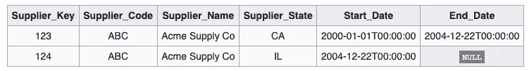
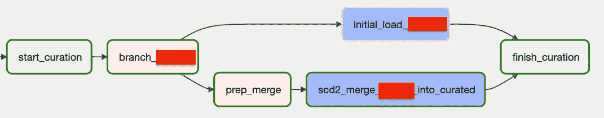

# 使用 Composer 动态处理 BigQuery 中的 SCD2 合并

> 原文：<https://medium.com/google-cloud/dynamically-handle-scd2-merges-in-bigquery-with-composer-f6860e4ba99b?source=collection_archive---------0----------------------->

在这篇博文中，您可以了解如何使用 Composer 和 Airflow 创建参数化/动态管道来自动处理 BigQuery 中任何表的 SCD2 更新。

渐变维度(SCD)类型 2 是数据仓库中处理维度表中的变化的常用技术。

如果您正在从遗留数据库迁移数据集市，您可能会注意到，在 BigQuery 中，逐行处理 SCD2 的旧方法并不是一种有效的方法。

> 游标也不是在遗留数据库中处理 SCD2 的最佳方式。

下图显示了 SCD2 行的外观；



> 如何有效地管理 BigQuery 中的数据变更？
> 
> 分批思考！

Merge 语句是处理 BigQuery 中 SCD2 更改的一种很好的方式，这样您可以一次处理许多记录，提高性能并降低成本。

典型的 SCD2 merge 语句如下所示:

这个语句中发生了什么？

1-用 current_date 作为结束日期更新旧的/已更改的记录。(第 11 行)

2-生成并插入具有任意延迟结束日期的新记录(“9999–12–31 23:59:59”)。(第 5、13、14 行)

这个 merge 语句可以用作合并任何表的通用模式。它需要临时和目标维度表、键列和其他列作为变量。因此您可以 ***创建一个动态管道来处理不同维度表*** 的 SCD2 合并。

这篇博文的其余部分将向你展示；**如何使用 composer 和 airflow 构建动态 DAG 来处理 SCD2 合并**。

下面是动态 DAG 的截图，将在本帖中详细解释；



这个动态 DAG 有一个分支操作符，可以基于输入变量进行初始加载或 SCD2 合并。请阅读我之前的博客文章，了解更多关于分支任务和有条件初始或增量加载表的信息。

**首先**您需要为策展表进行特殊的初始加载，为 SCD2 表设置 end_dates。我们需要一个 BigQueryOperator，它从 staging 表中选择所有列，并添加 end_date 作为任意的大日期。下面是能做到这一点的任务；

**其次**您需要创建一个 merge 语句，该语句可以将 table_name、schema 和 key 字段作为输入。那么您需要一个 python 操作符来调用这个函数。merge 语句需要作为 xcom 变量发布，以便 BigQueryOperator 可以在后面的任务中使用它。下面是创建 merge 语句的 python 函数和 python 运算符；

最后使用 BigQueryOperator 运行 merge 语句；

这些都是使用 Composer 动态处理 SCD2 管道的关键组件。请注意，在 GCP 还有其他平台和工具，如 Dataform 或 Datafusion，可以实现同样的功能。我希望在接下来的博客文章中涵盖这些内容。

请在评论中让我知道你的想法。

您可以在下面找到完整的 DAG 和参数:

以下是调用此 DAG 进行初始加载或将 SCD2 合并到维度表的参数；

```
INITAL:
{
    "TargetTable":"table_name",
    "SourceCSV":"table_name.csv",
    "P_MODE":"INITIAL",
    "TableSchema" : {
            "KEY1":"INTEGER",
            "KEY2":"STRING",
            "COL1":"STRING",
            "COL2":"STRING"
        },
    "TableKeys":["KEY1","KEY2"]
}
DELTA:
{
    "TargetTable":"tablename",
    "SourceCSV":"source.csv",
    "P_MODE":"DELTA",
    "P_DATE_FIELD":"30NOV2021",
    "TableSchema" : {
            "KEY1":"INTEGER",
            "KEY2":"STRING",
            "COL1":"STRING",
            "COL2":"STRING"
        },
    "TableKeys":["KEY1","KEY2"]
}
```

您可能会注意到，有一个加载特定日期的额外功能。如果只是需要合并某一天的更改，您可以将 P_DATE_FIELD 设置为该天。