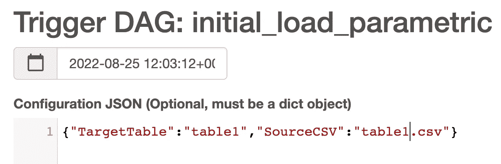

# 从 GCS 向任何 BigQuery 表动态加载数据

> 原文：<https://medium.com/google-cloud/dynamically-load-data-to-any-bigquery-table-from-gcs-835a6525afef?source=collection_archive---------0----------------------->

如何将数百个表从 GCS 加载到 BigQuery？

也许，你会使用一些 python 脚本，像 Dataflow 或 Cloud DataFusion 这样的 ETL 工具。

在这篇文章中，你会发现；如何使用 Composer 和一个动态 DAG 从 GCS 加载任何 BQ 表:


> 在进入细节之前，下面是只使用 Composer 和 BQ Load 加载表的一些好处:
> 
> 1- BQ 加载是免费的——如果您使用数据流/云数据融合或任何 ETL 工具将数据原样加载到 BigQuery，您需要为计算付费。搜索 ETL vs ELT，如果你觉得在加载的时候需要一些转换。
> 
> 2-它是快速和并行的—它是完全管理的，您不需要担心调整您的管道。
> 
> 3- Composer 非常灵活——您拥有 python 的灵活性和大量开源气流操作器，同时还拥有监控和控制管道所需的许多企业功能。此外，您还可以与其他平台(如数据流、数据融合、基本上任何 API)协调和组合任务。

我们需要气流的两个关键能力来构建我们的动态管道；

1-参数和触发 DAG w/ config

2- XCOM 在任务间共享数据

首先，我们需要获得源 CSV 文件和目标 BigQuery 表作为参数。您可以使用 python 运算符和 python 函数来获取这些变量。然后您需要将这些放入 xcom 变量中，以便 BigQuery 加载任务可以使用它们。

它看起来是这样的:

接下来我们需要使用 GoogleCloudStorageToBigQueryOperator 来调用 bqload。这里我们将把 xcom 变量传递给 source_objects 和 destination _ project _ dataset _ table 输入。它看起来是这样的:

您可能会注意到，我们使用环境变量{{var.value.X}}来定义存储桶和数据集。使用环境变量来配置开发、测试和生产环境是很重要的，因此您不需要为每个环境更改代码。

您可以在 Airflow UI 中的管理>变量下定义环境变量:


这就是了，现在你所需要做的就是触发你的管道配置；

```
 {"TargetTable":"table1","SourceCSV":"table1.csv"}
```

可以通过 gcloud cmd 来做；

```
gcloud composer environments run composer-name --location=europe-west3 dags trigger -- initial_load_parametric \--conf '{"TargetTable":"table1","SourceCSV":"table1.csv"}
```

或者通过气流 UI；



以下是这个 DAG 的完整源代码:


我希望你觉得它有用，请让我知道你的想法，以及你如何在评论中加载你的 BigQuery 表。