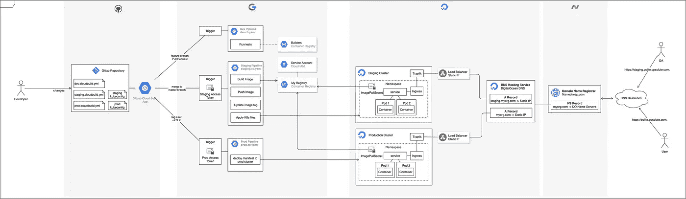
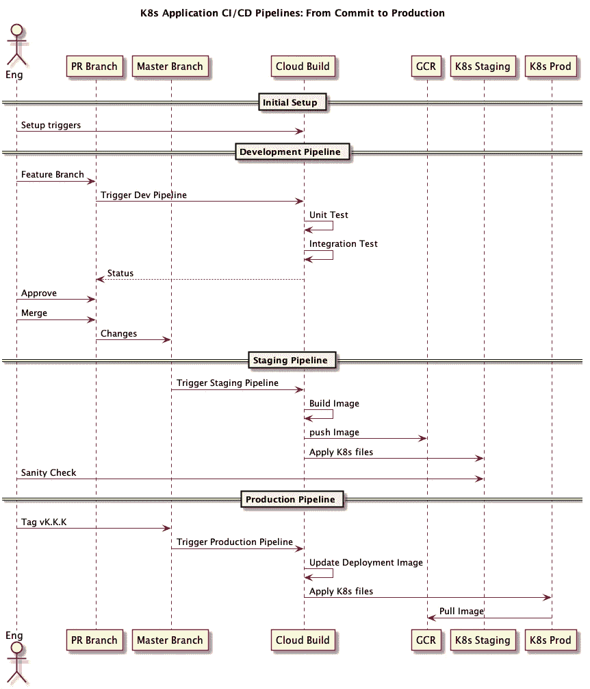

# E2E Kubernetes CI/CD 和 Google Cloud Build

> 原文：<https://medium.com/google-cloud/e2e-kubernetes-ci-cd-with-google-cloud-build-6339c0a22290?source=collection_archive---------0----------------------->

Google Cloud Build 是一项服务，用于提供构建代理来运行*持续集成和部署(CI/CD)* 任务[1]。上图是用于部署 Kubernetes 应用程序的 CI/CD 管道的架构。本文总结了设置这个基于云构建的 CI/CD 管道所涉及的所有组件和操作。**它提供了一个 1000 英尺的视角，无需深入任何一个具体任务的逐步细节**。

有很多文章都是关于如何完成特定任务的，但是我很少看到描述建立端到端解决方案需要什么的文章。我相信，如果你了解你正在建立什么，它会变得更容易来源个别部分…而不是相反。

在我们继续之前，我将介绍 Kubernetes、基础设施安全和 DNS 等中高级概念。所以我假设你对这些概念很熟悉，或者你可以在以后阅读它们。整个基础设施都配备了*terra form*【2】，所有源代码都可以在 Github 上获得【3】。让我们开始吧。

 [## eyeezzi/k8s-cloud-build-cicd

### 使用 Google Cloud Build-eye ezzi/k8s-Cloud-Build-cicd 为 Kubernetes 应用程序设置 CI/CD 管道

github.com](https://github.com/eyeezzi/k8s-cloud-build-cicd) 

# 关于多云架构的说明

请注意，该系统分为 4 个部分，每个部分在不同的云提供商上提供，如下所示: **Github** 用于源代码存储库； **Google 云平台**用于构建代理和容器注册；**数字海洋**为 Kubernetes 星团；和 DNS 的 **Namecheap** 。

将各种组件分散在不同的提供商之间会使互操作变得更具挑战性，但它也提供了一些好处，如为特定服务使用最具成本效益的提供商，避免供应商锁定，以及更深入地了解各种组件如何组合在一起。后者是我以这种方式设计架构的主要原因。

# 变革管理流程

所有 CI/CD 管道都旨在解决一个核心问题:如何让开发人员在不破坏用户体验的情况下增量更新他们的软件。

一个常见的想法是首先将变更部署到*试运行*环境，然后*将变更升级到*生产*环境。在我的例子中，将变更从一个环境转移到另一个环境的触发器是 Git 操作(比如合并一个 Pull 请求)…一个被称为 *GitOps* [4]的原则。*

下图显示了我们的系统如何将变更从提交传播到生产。

1.  首先，开发人员在云构建上创建 3 个*触发器*，每个管道一个。
2.  创建一个 Pull 请求会触发*开发管道*，它运行测试并向 Github 报告提交状态。假设所有测试都通过，请购单被批准并合并到 ***主*** 。
3.  更改 ***master*** 触发*登台管道*，该管道构建 Docker 映像，将映像推送到 Google 容器注册表，并将应用程序部署到登台集群(通过应用其 K8s YAML 文件)。然后，开发人员可以对运行在 Staging 上的应用程序进行全面检查。
4.  如果被认为是正确的，运行在 Staging 上的***master***commit 可以被标记为类似于 *v1.1.2* 的版本。这个动作触发了*生产流水线*，它将 K8s 文件应用到生产集群。

至此，让我们来看一下实现管道的每一部分。

# 设置 Github 存储库

该库包含 3 个 Cloudbuild YAML 文件:***app/dev . cloud build . YAML***、***app/staging . cloud build . YAML***和***app/prod . cloud build . YAML***【5】。每一个都指定了分别由开发、试运行和生产管道执行的步骤。

此外，我们还提交了两个 *KUBECONFIG* 文件:***app/k8s/Staging . kube config . YAML***和***app/k8s/prod . kube config . YAML***【6】，它们分别包含了访问临时集群和生产集群的连接参数。相应的管道使用每个文件将应用程序部署到集群。重要的是，*用户令牌*从 *KUBECONFIG* 文件中移除，并作为环境变量提供给每个云构建管道。因此，将这些文件提交给源代码控制是安全的。

# 设置 Google 云构建

从 GCP 控制台，我们通过 OAuth 流程将云构建连接到我们的 Github 存储库，OAuth 流程安装并授权*云构建 Github 应用*来观察和报告我们的存储库的变化【7】。或者，我们可以将 Github 存储库镜像到一个*云源代码存储库*，让 Cloud Build 监视镜像……但是这既复杂又缓慢。

然后，我们创建 3 个触发器，每个触发器被配置为运行我们的 3 个管道之一[9]:

1.  ***特性分支*** 触发器:观察拉取请求，运行*app/dev . cloud build . YAML*中的步骤。
2.  ***部署到 Staging*** 触发器:监视 ***master*** 分支，运行*app/Staging . cloud build . YAML*中的步骤。
3.  ***部署到 Prod*** 触发器:监视 ***v1.2.3*** 形式的标签，运行*app/Prod . cloud build . YAML*中的步骤。

此外，您可以配置一个触发器，将某些环境变量暴露给管道进程[10]。因此，我们在*部署到暂存*和*部署到生产*触发器中设置环境变量`_DEPLOYER_TOKEN=<*User Token>*`。

最后，云构建附带了一个默认的服务帐户，该帐户被授权将映像推送到同一项目的 GCR 注册中心[11]。然而，我们的数字海洋集群缺乏从注册表中提取图像的授权。因此，我们在 GCP 项目上创建了一个专用的 GCP IAM 服务帐户，具有 ***存储对象查看者*** 角色。然后，我们为该服务帐户下载一个 JSON 密钥[12]…稍后，该文件将用于在暂存集群和生产集群中创建一个 *ImagePullSecret* ，以便从注册表中提取映像。

# 建立 Kubernetes 集群

我们分别为试运行和生产环境建立了两个 Kubernetes 集群[13]。每个应用程序都将被部署到它自己的*命名空间*…实际上将它与该环境中的其他应用程序隔离开来。描述应用程序的所有资源— *部署*、*服务*和*入口、*等—都将被部署到该名称空间。

当一个*部署*在一个名称空间中创建时， *Kubelet* 需要授权从 GCR 获取映像。因此，我们从之前下载的 GCP 服务帐户密钥创建一个***ImagePullSecret***。然后将这个秘密作为一个***imagePullSecret***添加到集群名称空间【14】中的*默认服务帐户*。因此，该名称空间中的每个*部署*都可以从 GCR 获取映像。

最后，我们在每个集群中运行一个反向代理，将传入请求负载平衡到适当的应用程序服务。 ***Traefik*** 就是这样一个反向代理，支持自动提供 Letsencrypt TLS 证书[15]。重要的是，Traefik 作为一个*负载平衡器类型的* K8s 服务运行，因此云提供商(在本例中为 DigitalOcean)提供了一个具有公共静态 IP 地址的实际负载平衡器设备[16]。然后，您可以通过该 IP 地址访问集群，进而访问您的应用程序。

# 设置 DNS

用一个 IP 地址访问你的服务是不切实际的，所以从像 Name price 这样的提供商那里购买一个域名——为了这个项目，我购买了***opsolute.com。*** 带有该后缀的域名的 DNS 查询将被发送到廉价域名服务器。

为了将此类请求重定向到我们的数字海洋集群，我们将 ***NS 记录*** 添加到 Namecheap 帐户，以将查询解析委托给数字海洋名称服务器【17】。然后，我们创建 2 个 ***A 记录*** ，分别映射到我们的临时集群和生产集群的静态 IP 地址。

1.  ***opsolute.com。*** →数字海洋域名服务器
2.  数字海洋一记:***polite.opsolute.com。→137.13.55.5*** (生产集群 Traefik 负载平衡器 IP) →应用程序
3.  数字海洋一记:***staging.polite.opsolute.com。→157.38.29.13***(暂存集群 Traefik 负载平衡器 IP) →应用程序

# 测试整个设置

我们的示例应用程序是一个名为`polite`的 Go 服务器，它在`/`路线上返回问候，在`/health`路线上返回健康状态。您可以通过在部署文件[18]中设置`--greeting`标志来自定义问候语。我们将用不同的消息将应用程序的不同版本部署到登台和生产环境中。按照下面的步骤测试整个管道。

1.  编辑部署文件来设置`--greeting="Bonjour!"`。对此变更提出一个 Pull 请求，并观察云构建开发管道的启动，以运行测试并报告成功状态。然后批准并合并请购单。
2.  在合并到主服务器时，临时管道应该激活，以构建应用程序映像并将其部署到临时集群。
3.  从你的浏览器访问升级网址**https://staging.polite.opsolute.com**，你应该会看到问候 ***你好！*** 。
4.  现在将*主*分支标记如下:`git tag v1.0.0 origin/master && git push --tags`。这应该会触发*部署到生产管道*，该管道会将映像部署到生产集群。访问网址**https://polite.opsolute.com**，你会看到问候 ***你好！*** 。

我们现在有一个版本的应用程序同时运行在试运行和生产环境中。接下来，我们引入一个使我们的西班牙语化的更改，然后将该更改部署到 Staging。

1.  重复上面的步骤 1 和 2，但这次设置`--greeting=”Hola!”`。
2.  参观**https://staging.polite.opsolute.com**，你应该会看到**T4【你好！T6。不过制作网址**https://polite.opsolute.com**应该还是会返回 ***Bonjour！*** 。**

就是这样！我们的管道可以将不同的版本部署到试运行和生产中。

# 我面临的挑战

我喜欢在这个项目上工作，但也有不少挫折。一些我将在下面简要描述。

*   每次部署 K8s 负载平衡器服务时，DigitalOcean 都会为负载平衡器提供一个随机的公共静态 IP 地址。所以你需要更新你的 DNS 记录来指向这个新的 IP 地址。这很不方便。解决方案是购买他们所谓的浮动 IP(与您的服务具有不同生命周期的静态 IP ),并将其指定为您的服务的 LoadBalancerIP 的值……但遗憾的是这不受支持[19]。
*   云构建不支持在 Github 拉合并分支上触发。每当您发出一个 Pull 请求时，Github 都会在一个名为`refs/pull/ID/merge`的分支中模拟源分支和目的分支的合并结果。因此，您可以测试并构建合并 PR 的结果，而无需实际合并它。遗憾的是，GCP 云构建不支持这一点[20]。
*   我尝试使用 Kubernetes 提供程序和 Helm 提供程序来管理 Terraform 中的 Kubernetes 资源。目的是以声明的方式管理重要的集群资源，如名称空间和 Traefik 入口控制器作为代码的*基础设施。然而，这些提供者对 Kubernetes 对象规范的支持很差，并且存在资源依赖性问题。所以现在，最好把 Kubernetes 的东西放在 Terraform 之外，直到这些提供商变得更加成熟。*

总的来说，我发现 Cloud Build 非常适合为 Kubernetes 应用程序快速建立 CI/CD 管道。

[1]:云构建—持续集成的自动化构建|云构建|谷歌云
https://cloud.google.com/cloud-build/

[2]:https://www.terraform.io/哈希公司的 terra form

[3]:eye ezzi/k8s-cloud-build-cicd
eye ezzi—[https://github.com/eyeezzi/k8s-cloud-build-cicd](https://github.com/eyeezzi/k8s-cloud-build-cicd)

[4]: GitOps 你需要知道的事情
https://www.weave.works/technologies/gitops/

[5]:eye ezzi/k8s-cloud-build-cicd
T22【https://github . com/eye ezzi/k8s-cloud-build-cicd/tree/master/app

[6]:eye ezzi/k8s-cloud-build-cicd
[https://github . com/eye ezzi/k8s-cloud-build-cicd/tree/master/app/k8s](https://github.com/eyeezzi/k8s-cloud-build-cicd/tree/master/app/k8s)

[7]:使用 GitHub 检查运行构建|云构建文档| Google Cloud
https://Cloud . Google . com/Cloud-Build/docs/run-builds-with-GitHub-Checks

[8]:镜像 GitHub 存储库|云源存储库文档| Google Cloud
https://Cloud . Google . com/Source-Repositories/docs/Mirroring-a-GitHub-repository

[9]:使用云构建自动化构建|云源代码库文档|谷歌云
https://Cloud . Google . com/Source-Repositories/docs/integrating-with-Cloud-Build # create _ a _ Build _ trigger

[10]:代入变量值| Cloud Build | Google Cloud
https://Cloud . Google . com/Cloud-Build/docs/configuring-builds/substitute-variable-values

[11]:设置服务帐户权限|云构建|谷歌云
https://Cloud . Google . com/Cloud-Build/docs/securing-builds/set-service-account-permissions

[12]:创建和管理服务帐户密钥| Cloud IAM 文档| Google Cloud
[https://Cloud . Google . com/IAM/docs/Creating-managing-service-account-keys # Creating _ service _ account _ keys](https://cloud.google.com/iam/docs/creating-managing-service-account-keys#creating_service_account_keys)

[13]:如何使用控制面板创建 Kubernetes 集群
[https://www . digital ocean . com/docs/Kubernetes/How-to/Create-Clusters/](https://www.digitalocean.com/docs/kubernetes/how-to/create-clusters/)

[14]:带外部 Kubernetes 的 Google Cloud Registry(GCR)
http://docs . hep TiO . com/content/private-registries/pr-gcr . html

[15]:让我们加密
containo . us—[https://docs.traefik.io/https/acme/](https://docs.traefik.io/https/acme/)

[16]:如何向 Kubernetes 集群添加负载平衡器
https://www . digital ocean . com/docs/Kubernetes/How-to/Add-Load-Balancers/

[17]:如何指向通用域名注册商的数字海洋域名服务器
数字海洋—[https://www . digital ocean . com/community/tutorials/How-To-Point-To-digital ocean-name servers-From-Common-Domain-Registrars](https://www.digitalocean.com/community/tutorials/how-to-point-to-digitalocean-nameservers-from-common-domain-registrars)

[18]:eye ezzi/k8s-cloud-build-cicd
[https://github . com/eye ezzi/k8s-cloud-build-cicd/blob/master/app/k8s/staging-deployment . YAML](https://github.com/eyeezzi/k8s-cloud-build-cicd/blob/master/app/k8s/staging-deployment.yaml)

[19]:如何在 Kubernetes 中设置负载平衡器的静态 IP？
数字海洋—[https://www . digital ocean . com/community/questions/how-to-set-static-IP-for-load balancer-in-kubernetes](https://www.digitalocean.com/community/questions/how-to-set-static-ip-for-loadbalancer-in-kubernetes)

[20]:[https://issuetracker.google.com/issues/119662038](https://issuetracker.google.com/issues/119662038)