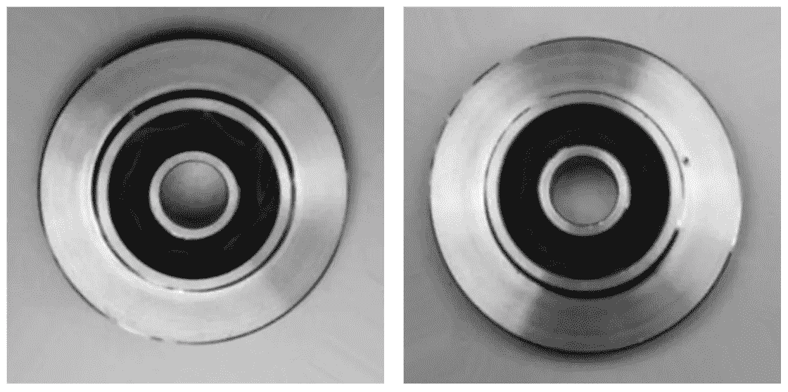
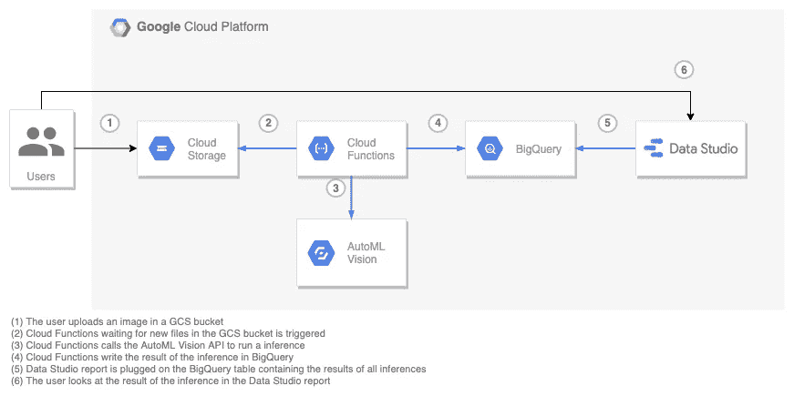
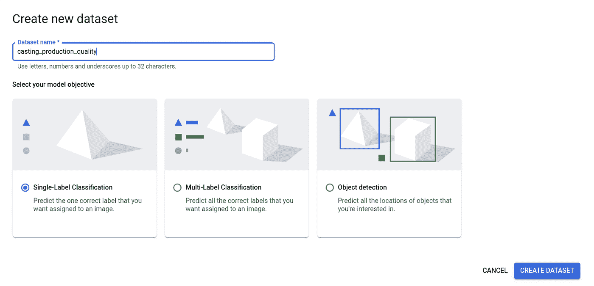
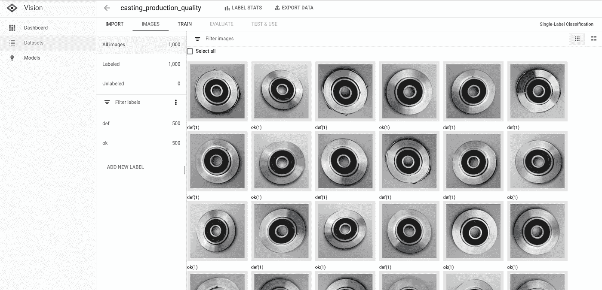
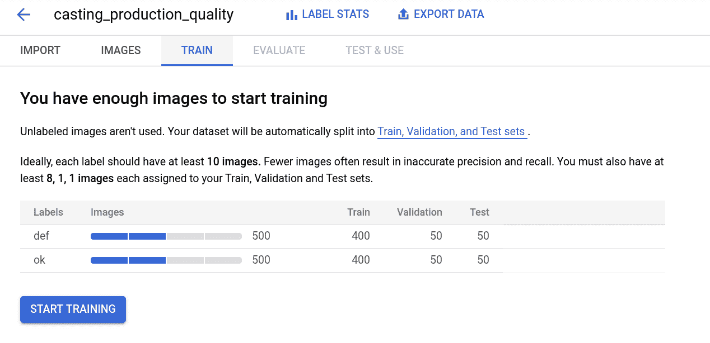
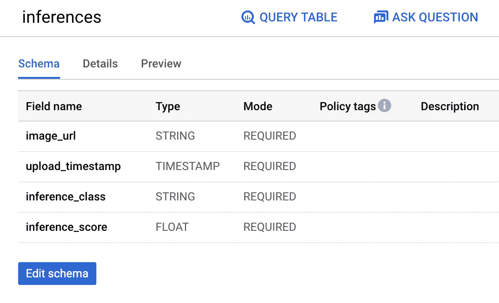
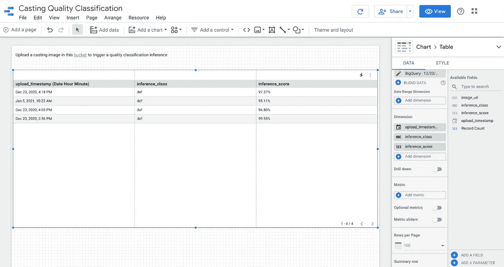

# 在 GCS 中上传文件后，轻松快速地自动执行 Google Cloud AutoML 视觉预测(用于制造质量检查)

> 原文：<https://medium.com/google-cloud/easily-and-quickly-automate-google-cloud-automl-vision-predictions-upon-file-uploads-in-gcs-for-1a259ba7ce4d?source=collection_archive---------3----------------------->

# 介绍

在这篇文章中，我提出了一个 GCP (Google Cloud Platform)架构的例子，用于在用户上传图像到 GCS (Google Cloud Storage)桶时，快速而轻松地自动进行自动视觉推理。

我的灵感来自一组选角作品的图片，这些图片可以在 [Kaggle](https://www.kaggle.com/ravirajsinh45/real-life-industrial-dataset-of-casting-product) 上找到。



左边是没有质量问题的铸件；右边是一个有生产缺陷的铸件(我们可以看到一个小划痕)。由[拉维拉吉辛·达比](https://www.kaggle.com/ravirajsinh45)拍摄的图片。

从那里我想象了以下(虚构的？)用例:一个数据科学团队想要(I)快速地为业务用户提供一个预测转换质量的工具，以及(ii)为他们提供一个使用这个模型的简单方法。

第(一)点通过使用 AutoML Vision 来确保，而第(二)点通过实施以下工作流程来解决:

*   用户将在生产线末端拍摄的金属铸件图像放入 GCS 桶中；
*   在后端，云函数触发自动视觉推理，并将结果存储在 BigQuery 中；
*   用户刷新 DataStudio 报告以获得存储在 BigQuery 中的预测结果。



GCP 建筑

*注意:
我曾计划用 AutoML 表来演示这个工作流，以对结构化数据执行批量预测，因为我认为这是最有可能的情况。对于产品质量的预测，人们宁愿寻求流式传输图像，而不经历由用户完成的手动步骤，而更可能的是，用户需要对他拥有的数据文件进行预测。但是这种类型的产品图像在公共领域很少见，所以这是我展示使用 AutoML Vision 创建视觉模型的简易性和速度的一个机会(我希望您原谅我这个小技巧……)。*

最后，*我想指出的是，这篇文章的代码提供了使工作流工作的基本构建模块，但是对于在生产中运行的应用程序来说，当然值得改进(例如适当的错误处理)。*

# 自动视觉模型

在此下载可用的[铸造图像，并将它们存储在 GCS 桶中。](https://www.kaggle.com/ravirajsinh45/real-life-industrial-dataset-of-casting-product)

```
gsutil -m cp -r dir gs://my-bucket
```

*提示 1:在撰写本文时，AutoML 服务已经地区化，在美国中部 1(爱荷华州)可用，因此我创建了包含相同地区图像的 GCS 桶。*

*提示 2:如果您有大量文件要传输(这里就是这种情况)，您可以使用顶级 gsutil -m 选项执行并行多线程/多处理复制。*

在 AutoML Vision 中，创建新数据集以创建单标签分类模型:



因为我们将使用一定数量的图像，所以使用 CSV 文件方法导入图像用于模型训练。CSV 文件应该是图像的 GCS 路径列表(图像可以是 JPG、PNG、GIF、BMP 或 ICO 格式，并且您可以选择指定训练、验证或测试分割，但我们不会在这里):

```
[set,]image_path[,label]
TRAIN,gs://My_Bucket/sample1.jpg,cat
TEST,gs://My_Bucket/sample2.jpg,dog
```

为没有缺陷的图像创建列表文件:

```
gsutil ls gs://My_Bucket/ok* | head -50 | sed 's/$/,ok/' > file_paths.csv
```

为有缺陷的图像创建列表文件:

```
gsutil ls gs://My_Bucket/def* | head -50 | sed 's/$/,def/' >> file_paths.csv
```

导入后，您应该会看到类似的内容:



现在，转到“Train”选项卡，使用云托管模型训练您的模型，并设置节点小时预算(这里我坚持推荐:16 节点小时)。



一旦您的模型训练成功，您将收到一封电子邮件。为了能够使用它，不要忘记部署它！

# 文件上传的 GCS 存储桶

创建一个专用于图像上传的存储桶:

*   *名称* : my_upload_bucket(这个名称在 GCP 应该是唯一的，所以使用一个更自定义的名称)
*   *地点*:地区/美国东部 1(南卡罗来纳州)
*   *类*:标准
*   *门禁*:统一
*   *高级*:谷歌管理的密钥

这就是我为演示创建 bucket 的方式，当然，您可以决定对它进行不同的配置。

# BigQuery 表

如前所述，AutoML Vision 推理的结果将存储在 BigQuery 中，以便在 Data Studio 中轻松而完美地报告。

为此，在 BigQuery 中创建一个表，如下所示:



我将这个表命名为*推论*，并将其放在 us-east1 中。

以下是关于这些字段的一些附加信息:

*   *image_url* 用于存储上传到 GCS 中的图片的 url(以防我们希望给用户看到它的可能性)；
*   *upload_timestamp* 是为了方便用户在报表中找到自己的推断，按照日期&时间对推断进行排序；
*   *推理 _ 类*是自动视觉推理返回的分类:ok 或 def(表示缺陷)；
*   *推理得分*是 AutoML 视觉返回的推理的置信度。

# 云函数

[Google Cloud Functions](https://cloud.google.com/functions/) 是可扩展的现收现付功能，即服务(FaaS)，无需服务器管理即可运行您的代码，用于构建和连接云服务。使用云函数，您可以编写简单、单一用途的函数，这些函数附加到从您的云基础架构和服务发出的事件上。当被监视的事件被触发时，您的函数被触发，比如 GCS 事件(我们将在用例中使用它)、发布/订阅消息、HTTP 请求等。

如前所述，我们希望构建一个 Cloud 函数，当一个演员的图像被上传到 GCS bucket 中时就会触发这个函数，我们希望这个函数做两件事:

1.  使用此图像对我们之前创建的模型运行 AutoML 推理；
2.  将这个推理的结果存储在 BigQuery 中，然后能够在 Data Studio 中显示结果。

为此，我写了一个 Node.js [代码 sampl](https://gitlab.com/mastronaut/gcs-trigger-on-file-upload-with-google-cloud-functions/) e，我将在继续之前对其进行评论。

您的代码必须导出一个或多个函数。在这个例子中，我把它简化了，它是位于我的函数根目录中的一个单独的`index.js`，它导出一个名为`triggerOnGCSUpload`的函数:

`exports.triggerOnGCSUpload = async (file, context) => { ... }`

这个函数将在我们的 GCS bucket 上的*Google . storage . object . finalize*事件上被触发(我们稍后将讨论这一点),并将接收一个包含文件元数据的 *file* 对象。这一职能反过来将依赖于三个职能:

*   *downloadUploadedFile* 在本地临时文件夹中下载图像；
*   *请求推理*使用本地下载的图像运行 AutoML 推理；
*   *insertInferenceInBigQuery*在 BigQuery 中插入推理的结果。

现在，我们可以使用以下命令行在 Google Cloud Functions 上部署该功能:

```
gcloud functions deploy triggerInferenceOnGCSUpload \
 — runtime nodejs10 \
 — trigger-resource gs://my_upload_bucket \
 — trigger-event google.storage.object.finalize
```

一些解释:

*   *nodejs10* 是我们要用的 Node.js 的运行时版本；
*   *triggerInferenceOnGCSUpload*是我为我的云函数选择的名称(该名称将显示在 GCP 控制台、日志等中。);
*   *gs://my_upload_bucket* 是您希望您的业务用户上传演职人员图像的 GCS 存储桶，因此您希望在该存储桶上设置触发器。

最后，如前所述，您可以看到我们指定了*Google . storage . object . finalize*作为函数的触发事件。当在存储桶中创建新对象(或覆盖现有对象，并创建该对象的新一代对象)时，会发送此事件。还有其他可用于触发云功能的 GCS 事件，在[公共文档](https://cloud.google.com/functions/docs/calling/storage#event_types)中有所描述。

# 数据工作室报告

虽然 BigQuery 易于使用，但您可能希望以业务用户更熟悉的形式(如报表)向他们公开预测结果。为此，你可以使用谷歌数据工作室(Google Data Studio)来构建交互式仪表盘和报告。很好用，而且免费。但是你也可以决定使用其他的报告工具，比如 Looker 或者 Tableau。

所以回到数据工作室；使用之前在 BigQuery 中创建的*推论*表创建一个报告。报告可以像下面这样简单:



您可以使用 AutoML Vision 测试您的端到端预测工作流了！

# 总结

让我们总结一下，看看我们在这篇文章中都提到了什么！

因此，我们讨论了如何:

*   为质量分类(合格或有缺陷)建立一个 AutoML 视觉单标签模型，以及如何使用 AutoML API 运行推理(针对 node . js)；
*   当上传图像时，在给定的 GCS 桶上使用云函数触发器来运行一系列动作；
*   使用 BigQuery API (for Node.js)在表中插入推理结果；
*   在 BigQuery 上构建一个免费的 Data Studio 报告。

我希望你觉得这篇文章有用，并在 GCP 玩得开心！