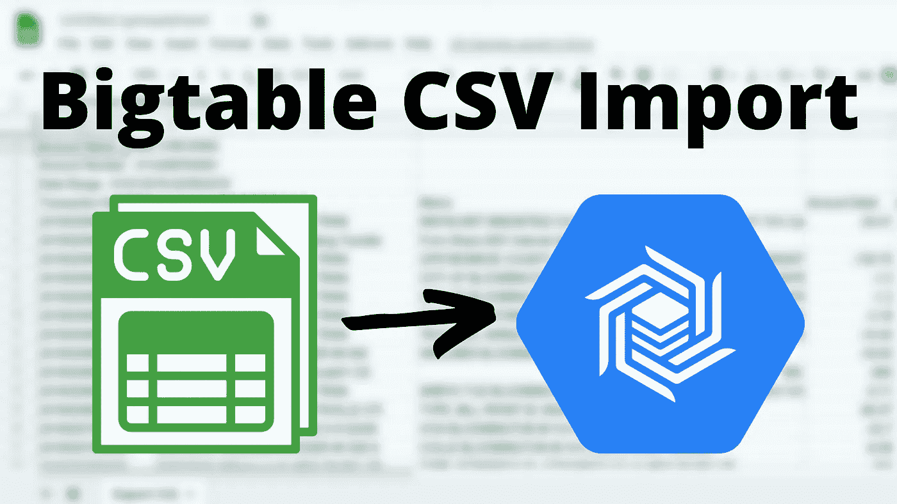
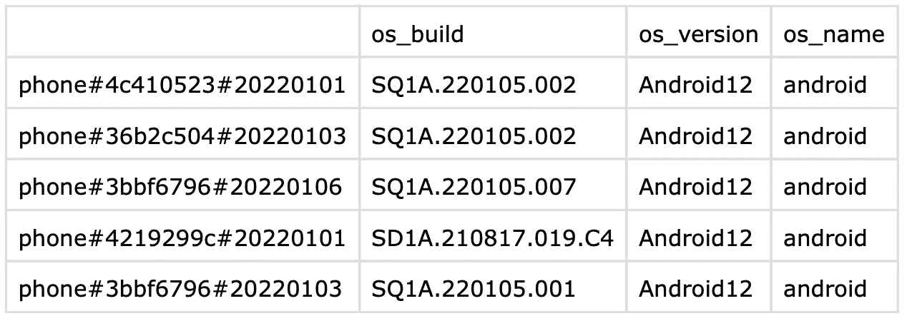
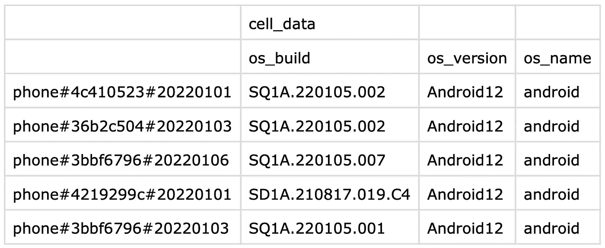

# 轻松将 CSV 导入云 Bigtable

> 原文：<https://medium.com/google-cloud/easy-csv-importing-into-cloud-bigtable-ed3f62139b89?source=collection_archive---------1----------------------->



如果你想学习一个新的数据库，你会想通过加载一些数据或者做一两个查询来尝试一下。Cloud Bigtable 是一个强大的数据库服务，支持规模和吞吐量，由于其 NoSQL 特性，它在存储数据方面非常灵活。因为 Bigtable 是大规模工作的，所以您用来读写它的工具对于大型数据集来说是很棒的，但是对于仅仅试用半个小时来说就不是那么好了。几年前，我试图通过编写一个关于使用数据流作业导入 CSV 文件的[教程来解决这个问题，但这需要启动几个虚拟机，这可能需要一些时间。](https://cloud.google.com/community/tutorials/cbt-import-csv)

在 Bigtable 团队中，我们看到 CSV 导入教程是一个非常受欢迎的示例，尽管需要创建虚拟机，我们也听到了人们的反馈，他们希望有一种更快的方法来深入学习。因此，现在我们很高兴在 cbt CLI 工具中为 Bigtable 推出 CSV 导入程序。新的导入器获取一个本地文件，然后使用 Go 客户端库快速导入数据，而无需启动任何虚拟机或构建任何代码。

# 装置

如果你已经安装了带有 cbt 工具的 gcloud，你只需要通过运行`gcloud components upgrade`来确保它是最新的。否则，你可以[安装包含 cbt 工具的 gcloud](https://cloud.google.com/sdk/docs/install) 。

如果你无法在你的机器上安装这些工具，你也可以通过谷歌云控制台中的云外壳来访问它们。

# 导入数据

我有一个 csv 文件，其中包含公共 Bigtable 存储桶中的一些时间序列数据，所以我将用它作为例子。你也可以自己下载来试用这个工具。注意，这些步骤假设您已经创建了一个 Google Cloud 项目和一个 [Cloud Bigtable 实例](https://cloud.google.com/bigtable/docs/creating-instance)。

```
gsutil cp gs://[cloud-bigtable-public-datasets/csv-import-blog-data.csv](https://storage.googleapis.com/cloud-bigtable-public-datasets/csv-import-blog-data.csv) .
```

您需要为导入准备好一个表，所以使用以下命令创建一个表:

```
cbt createtable mobile-time-series families="cell_data"
```

然后，使用新的`cbt import`命令导入数据:

```
cbt import mobile-time-series csv-import-blog-data.csv column-family=cell_data
```

您将看到一些输出，表明数据正在被导入。完成后，您可以使用 cbt 从表中读取几行:

```
cbt read mobile-time-series
```

如果您正在跟进，请确保在完成后删除该表。

```
cbt deletetable mobile-time-series
```

# 逗号分隔值（csv）文件格式



不带柱族的 CSV 文件



带柱族的 CSV 文件

CSV 文件使用一行指定列限定符的标题和一个空白的行键。可以为柱族添加额外的一行标题，然后从导入命令中删除柱族参数。

我希望这个工具能帮助您熟悉 Bigtable，并能让您更容易地使用它。请继续关注使用这个新工具的更多数据集和教程！