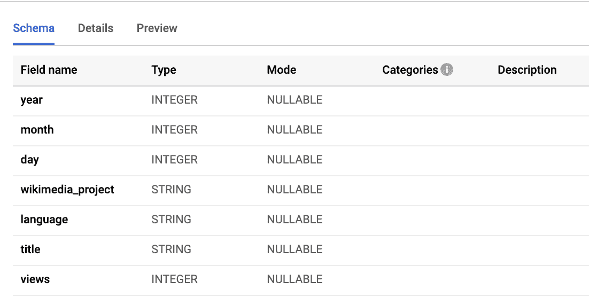
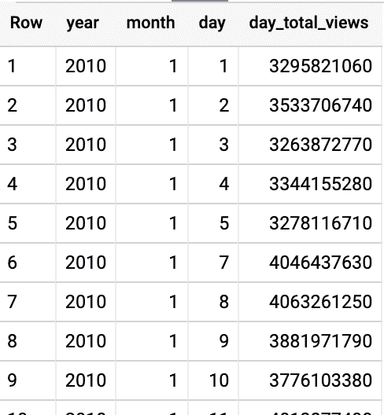
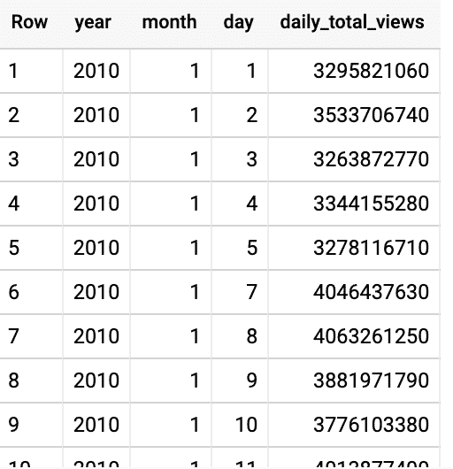
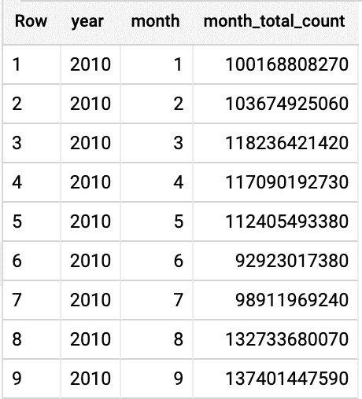
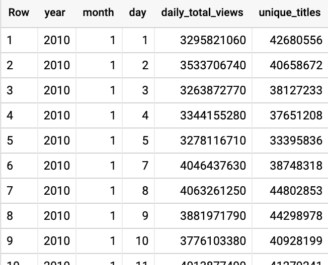
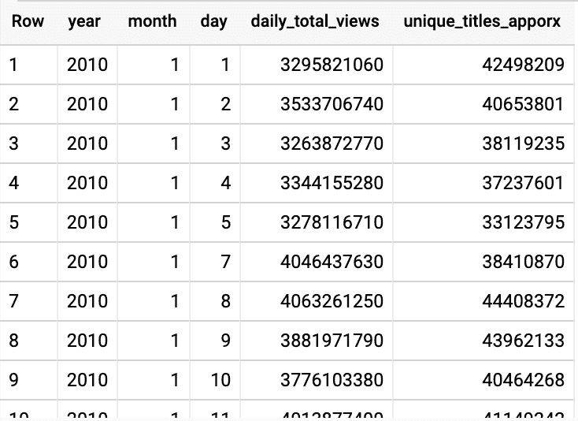
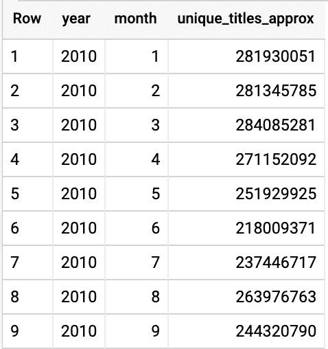

# 使用 BigQuery HyperLogLog++函数进行高效聚合和汇总

> 原文：<https://medium.com/google-cloud/efficient-aggregation-roll-ups-with-bigquery-hyperloglog-functions-80d408a046f4?source=collection_archive---------0----------------------->

增量处理的概念会对数据分析管道的设计产生重大影响。增量处理大量数据带来了资源效率、更快的处理时间和固有的降低的处理成本。然而，并不是所有的分析函数都具有增量性质。一个常见的例子是 **count distinct** 函数。在这篇文章中，我想谈谈使用 BigQuery 的 HyperLogLog++函数的增量计数非重复处理，以及它们如何提供快速、可伸缩的增量处理属性。

我一直着迷于代数概念如何极大地影响我们处理大规模数据的方式。例如，交换和结合性质一直是有趣的研究。简而言之，这些特性允许我们并行和增量地执行计算。例如，SUM()是一个交换和关联函数，我可以在不同的位置(线程、虚拟机等)分别计算 1 + 2 + 3，结果总是 6。例如，我可以在一个虚拟机中计算(2+3)并将结果添加到另一个虚拟机中的(1)，结果与在一个虚拟机中计算(1+2)并将结果添加到另一个虚拟机中的 3 是相同的。

除了并行处理之外，交换和关联函数允许我们逐步应用更高级的函数，如 SUM()和 COUNT()。让我在下面的例子中演示一下增量处理的强大功能。我还将提供一个例子，说明增量处理不是一个选项，以及 BigQuery 的 HyperLogLog++如何提供帮助。为了让读者能够理解这个例子，我使用了一个 [BigQuery 公共数据集](https://cloud.google.com/bigquery/public-data/):big query-samples . Wikipedia _ benchmark。Wiki100B:



假设我们被要求使用下面的查询来计算 Wikimedia 数据集的总日浏览量。

```
SELECT year,month,day, SUM(views) day_total_views FROM `bigquery-samples.wikipedia_benchmark.Wiki100B` GROUP BY 1,2,3 ORDER BY 1,2,3
```

结果:



*执行时间:~37 秒*

然而，运行该查询需要大约 37 秒才能完成，我们希望它能更快。我们希望我们的报告是交互式的，响应时间为个位数秒。为了加快查询速度，我们将创建一个类似于以下示例的预聚合表，并在预聚合表上编写查询:

```
CREATE OR REPLACE TABLE `your_project.demo.wiki_daily_agg` AS SELECT year,month,day, SUM(views) daily_total_views FROM `bigquery-samples.wikipedia_benchmark.Wiki100B` GROUP BY 1,2,3SELECT year, month, day, daily_total_views FROM `your_project.demo.wiki_daily_agg` ORDER BY 1,2,3
```

结果:



*执行时间:~1 秒*

这种方法将我们的查询时间减少到大约 1 秒钟(创建预聚合表需要大约 30 秒钟，可以使用 BigQuery [计划查询](https://cloud.google.com/bigquery/docs/scheduling-queries)或 [Cloud Composer](https://cloud.google.com/composer/) 自动完成)

现在，如果我们想查看每月的总浏览量，而不是每天的总浏览量，会怎么样呢？有趣的是，同一个预聚合表可以回答不同的聚合问题。例如，要生成每月总视图，我们只需在预聚合表上运行以下查询:

```
SELECT year, month, SUM(daily_total_views) month_total_count FROM `your_project.demo.wiki_daily_agg`GROUP BY 1,2 ORDER BY 1,2
```

结果:



*执行时间:~1 秒*

让我们能够从预聚集的表中计算每月的视图数的是 SUM()的增量处理能力，这要归功于它的关联和交换属性。可以想象，这是一个强大的概念，可以应用于许多分析查询。但是，并非所有函数都提供增量处理特性。例如，如果我们想找到每日不同标题的数量，该怎么办？为了实现这一点，我们可以调整预聚合表，如下所示:

```
CREATE OR REPLACE TABLE `your_project.demo.wiki_daily_agg_distinct` AS SELECT year,month,day, SUM(views) daily_total_views, **COUNT(DISTINCT title)** unique_titles FROM `bigquery-samples.wikipedia_benchmark.Wiki100B` GROUP BY 1,2,3SELECT year, month, day, daily_total_views, unique_titles FROM `your_project.demo.wiki_daily_agg_distinct`ORDER BY 1,2,3
```

结果:



*执行时间:~10 分钟*

虽然该查询生成了每日不同的标题，但它引入了两个挑战:

1.  通过添加 DISTINCT 子句，生成预聚合表需要相当长的时间(大约 10 分钟)，因为 DISTINCT 函数需要更多的内存资源。
2.  我们不再能够使用相同的预汇总表格来计算每月的唯一书目。换句话说，以下查询将不起作用(该查询将运行，但将显示不正确的结果):

```
SELECT year,month, SUM(unique_titles) FROM `your_project.demo.wiki_daily_agg_distinct` GROUP BY 1,2
```

与 SUM()和 COUNT()不同，DISTINCT()函数没有增量属性，因此我们不能对每天的 DISTINCT 结果进行增量求和来获得每月的数字。为了计算每月不同的标题，我们必须在整个数据集上运行我们的查询。这在性能和成本方面都是低效的。具体来说，在整个数据集上运行 DISTINCT 需要与数据集的基数成比例的内存。当处理大型数据集时，这可能会导致更高的内存使用率。对于 BigQuery，这可能意味着需要更多的槽来计算结果。除了更大数量的槽之外，我们还需要扫描整个表，这导致了更高的查询成本。

这就是 [BigQuery 的 HyperLogLog++函数](https://cloud.google.com/bigquery/docs/reference/standard-sql/hll_functions)发挥作用的地方。在这篇文章中，我们不需要深入了解 HLL 函数是如何工作的，我们只需要知道 HLL 是一种概率计数算法，它使用较少的内存，但只能提供一个近似的答案。由于内存占用更小，不同值的计算速度更快。HLL 算法的另一个巨大优势是它的增量属性，允许我们递增地添加/合并两个单独的值，就像上面的 SUM()例子一样。

让我们将 HLL 应用到上面的场景中:

首先，我们将创建一个类似的预聚合表，但这次我们将使用 BigQuery 的 HLL 计数。INIT()函数。这个函数创建了一个输出，通常被称为 HLL 草图，一个二进制输出，记录我们不同的值。

```
CREATE OR REPLACE TABLE `your_project.demo.wiki_daily_agg_hll` AS SELECT year,month,day, SUM(views) daily_total_views, HLL_COUNT.INIT(title) unique_titles_sketch FROM `bigquery-samples.wikipedia_benchmark.Wiki100B` GROUP BY 1,2,3
```

*执行时间:~ 2 分钟*

现在，为了获得给定一天中不同标题的近似值，我们将使用 HLL 计数。EXTRACT()函数获取标量值:

```
SELECT year,month,day,daily_total_views, HLL_COUNT.EXTRACT(unique_titles_sketch) unique_titles_apporx FROM `your_project.demo.wiki_daily_agg_hll` ORDER BY 1,2,3
```



*执行时间:~ 2 秒*

如果我们想得到每月不同标题的数量呢？我们可以简单地使用 HLL 计数添加每日 HLL 素描。MERGE()函数:

```
SELECT year,month, HLL_COUNT.MERGE(unique_titles_sketch) unique_titles_approx FROM `your_project.demo.wiki_daily_agg_hll` GROUP BY 1,2 ORDER BY 1,2
```



*执行时间:~ 2 秒*

使用 BigQuery 的 HLL 函数，我们能够实现两件事:

1.  在预聚集表的查询执行方面有更好的查询性能(大约 10 分钟**分钟**到大约 2 分钟**分钟**)
2.  HLL 函数的增量处理特性避免了数据的重复处理，降低了查询的成本

需要记住的一点是，HLL 是一个概率函数。换句话说，我们使用上述 HLL 函数的不同视图的结果并不是 100%准确的。默认情况下，在 99%的置信区间内，BigQuery HLL 函数的精度为 0.86%(参见此处的表格[)。如果您想要更高的精确度，可以通过向 HLL 计数传递一个更高精度的数字来降低错误率。INIT()函数。例如:HLL 伯爵。INIT(title，20)在 99%的置信区间将有 0.20%的误差。](https://cloud.google.com/bigquery/docs/reference/standard-sql/hll_functions)

如上所述，超对数函数是计算给定数据集中不同值的更具性能和成本效益的方法。性能和成本优势源于内存占用的减少以及 HLL 函数的增量特性。因此，如果您的用例涉及到寻找不同的值，并且可以容忍小程度的不准确性，那么请给出