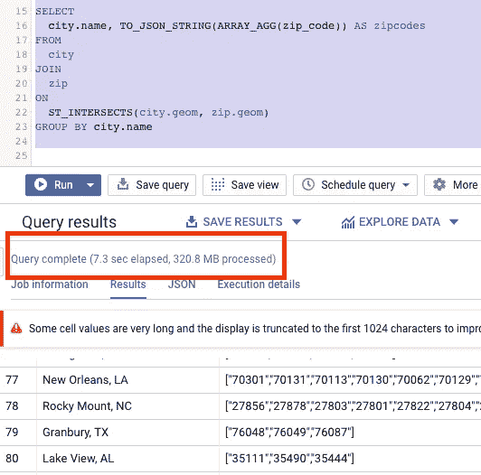

# BigQuery 中高效的空间匹配

> 原文：<https://medium.com/google-cloud/efficient-spatial-matching-in-bigquery-c4ddc6fb9f69?source=collection_archive---------1----------------------->

## 使用空间连接-带有 ST_*条件的 SQL 连接

这是一个问题(适当匿名):

“我有一个巨大的点数据集和另一个巨大的多边形数据集。我必须一个接一个地遍历多边形，找到每个多边形内部的所有点。BigQuery 能做到这一点吗？”

答案？是的，BigQuery 可以做到这一点，但您不必遍历多边形。如果您的经验主要是函数式/面向对象编程，SQL 可能看起来很奇怪。这是一种用空间连接执行起来非常有效的事情。


BigQuery 中的连接是根据空间范围关联两个实体的有效方式。 [kgrkz](https://unsplash.com/@pepitaphotos?utm_source=unsplash&utm_medium=referral&utm_content=creditCopyText) 在 [Unsplash](https://unsplash.com/search/photos/association?utm_source=unsplash&utm_medium=referral&utm_content=creditCopyText) 上拍照

空间连接适用于任意两个几何和各种空间函数。例如，让我们查找覆盖一个城市区域的所有邮政编码:

```
WITH city AS (
SELECT
  name,
  urban_area_geom AS geom
FROM `bigquery-public-data`.geo_us_boundaries.urban_areas
),zip AS (
SELECT
  zip_code,
  zcta_geom AS geom
FROM `bigquery-public-data`.geo_us_boundaries.zip_codes
)SELECT
  city.name, TO_JSON_STRING(ARRAY_AGG(zip_code)) AS zipcodes
**FROM
  city
JOIN
  zip
ON
  ST_INTERSECTS(city.geom, zip.geom)**
GROUP BY city.name
```

关键的一点是，在城市几何与邮政编码几何相交的情况下，我们将城市表连接到邮政编码表。

当然，您还可以使用其他功能。您可以检查点与面的距离是否小于 100 km。或者一个地理位置完全包含另一个地理位置。

在 BigQuery 中尝试一下吧！



我的许多博客帖子来自客户的问题，即使我并不总是提到促使帖子的对话。因此，如果你有关于在 GCP 做数据分析或 ML 的问题，请发推特给我，地址是@lak_gcp。