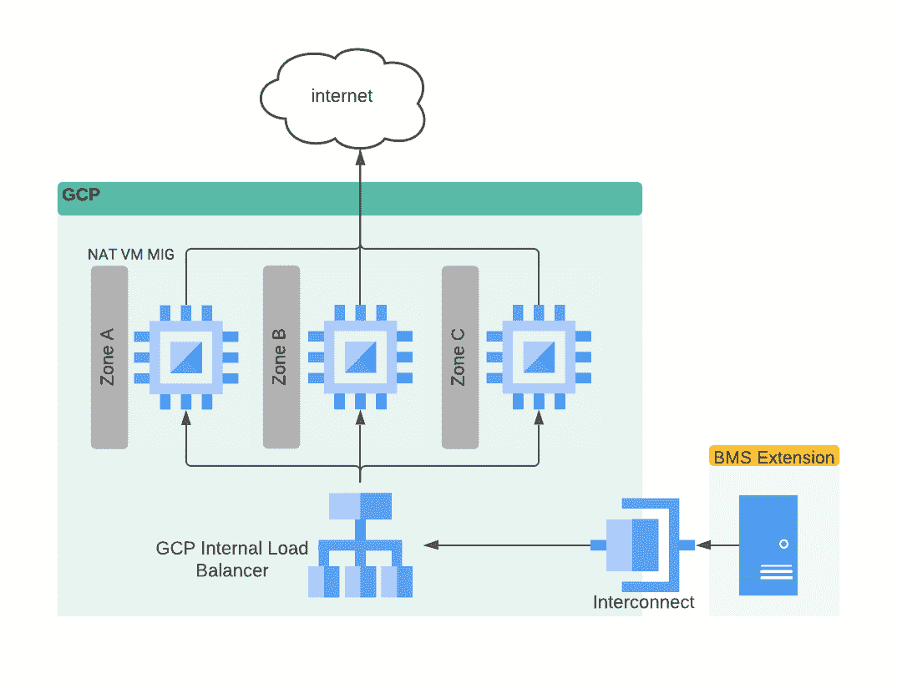

# 退出谷歌裸机解决方案

> 原文：<https://medium.com/google-cloud/egressing-from-google-bare-metal-solution-aa459389436c?source=collection_archive---------0----------------------->

# 介绍

谷歌云裸机解决方案(BMS)在设计上并不附带对谷歌云服务、网络服务或互联网的访问，这可确保关键工作负载(如 Oracle 工作负载)尽可能安全。

这样做的缺点是，通常需要一部分应用程序出口到 internet。通常在 GCP，我们会使用云 NAT 解决此类问题，但是 BMS 与云 NAT 不兼容，因为流量不是来自虚拟专用云(VPC)。

访问互联网的一些选项包括:

*   通过运行在 GCE 上的 NAT 网关路由输出流量
*   通过充当代理服务器的计算引擎虚拟机路由流量
*   通过云 VPN 或专用互连将流量路由到内部网关，再到互联网

本文涵盖了上述第一种选择，即使用 NAT 网关将流量路由到互联网。考虑中的其他选项已在[这里](https://lendleasegroup.atlassian.net/wiki/spaces/GCP21/pages/222915101099/BMS+Egress+Routing+Options?focusedCommentId=222915167087#comment-222915167087)列出。本文档假设您具备 GCP 和网络方面的工作知识。

# 解决方案 GCE 上的 NAT 网关

使用网络地址转换(NAT)将任何内部 IP 转换为公共 IP 可以通过使用 iptables 对流量进行 NAT 来完成。

GCE 上的简单 NAT

现在，如果我们在 BMS 上运行关键工作负载，拥有单个 GCE 实例会产生单点故障，为了能够承受区域故障，运行托管实例组(MIG ),并在该 MIG 前配备内部负载平衡器(ILB ),可以实现高度可用的解决方案，能够应对区域故障。

GCE 上的 NAT 管理的实例组

下一步是为该流量配置路由，在 GCP 这很简单，我们可以创建一个标记，但是由于 BMS 流量不是来自 VPC，所以我们不能这样做。我们在这里可以应用的解决方法是标记 VPC 中的所有其他流量(如下所示为“已标记”)，并通过负载平衡器和 NAT VM 解决方案为未标记的流量创建一条路由。

NAT MIG 的标记

这种解决方案的唯一缺点是，任何未标记的流量都需要通过这种解决方案流出，这带来了 3 个问题:

1.  标记非常耗时，而且要确保所有未来的资源在创建时都被标记
2.  整个 VPC 未标记的任何流量都将通过此解决方案流出，这包括来自其他地区的流量，会产生延迟和成本
3.  即使 BMS 故障转移到 DR 区域，也需要更新路由，以便未标记的流量通过不同的 ILB 流出

# 解决方案 GCE 上的代理

使用在 GCE 上运行的代理(如 Squid 代理)也是可行的，这需要在任何在 BMS 扩展中运行的服务器上设置 http_proxy，但是这个选项使标记和路由更简单。

GCE 上的 Squid 代理

同样，不希望出现单点故障，但如上所述，使用米格和 ILB 可以解决这个问题，如下所示:

ILB GCE MIG 上的 Squid 代理

这种方法的缺点是要确保在 BMS 中的每个虚拟机上都设置了代理配置，并且任何应用程序都支持使用代理。