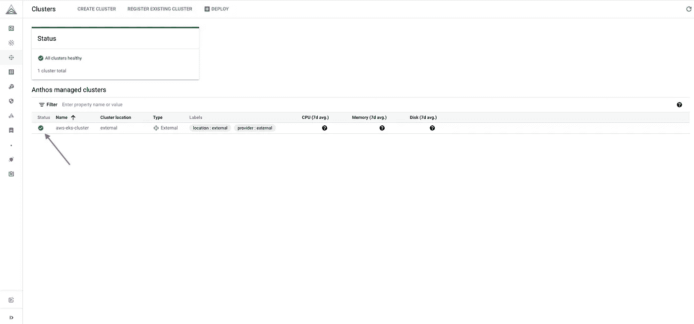

# GCP·安索斯管理的 EKS 集群

> 原文：<https://medium.com/google-cloud/eks-cluster-managed-by-gcp-anthos-69cba0cb0bd0?source=collection_archive---------0----------------------->

跨您的环境进行现代化管理，以实现云优势

## 概观

在当今基于云的世界中，SaaS 服务是真正的游戏规则改变者，这一点可能不会立即显现出来，但云应用程序开发简化趋势，并引发了软件即服务的现象。

到 2019 年**， **94%** 的企业采用云服务来运行其工作负载。 **84%** 的企业拥有**多云**战略。 **76%** 的客户表示**云计算**管理是一项重大挑战。**

**多云**正在与 **SAAS** 、 **PAAS** 、 **IAAS** 在整个**公有** & **私有**领域占据一席之地。未来是**多云**和**混合**。


## **Anthos 的出现**

为了推动企业的数字化转型，每个组织都需要一个云计算解决方案。

当讨论多云或混合云时，Anthos 就出现了。客户利用 Anthos 来更新应用程序并增强可伸缩性

Anthos 是一个提供众多选项的平台。

*   多集群管理—任何 Kubernetes 集群(EKS、阿拉斯加、本地)
*   Gitops 风格的配置管理(策略、安全 YAML 真实报告的单一来源)
*   服务管理— Anthos 服务网格
*   无服务器— Anthos 云运行
*   记录和监控

## 演示

在本文中，我们将了解如何管理 AWS EKS 集群或将它附加到 GCP·GKE·安托什。

## 先决条件

*   AWS 帐户
*   GCP 账户
*   基本 K8s 设置
*   将（行星）地球化（以适合人类居住）

下面是设置 EKS 集群的 Terraform 代码的 GitHub 链接:[https://GitHub . com/hashi corp/learn-terra form-provision-eks-cluster](https://github.com/hashicorp/learn-terraform-provision-eks-cluster)

您可以从 AWS 控制台构建一个新的 EKS，也可以使用现有的。

在这里，我从控制台创建了一个


运行下面的命令为 EKS 集群设置 kubectl

```
aws eks - region <Region name> update-kubeconfig - name <Cluster name>
```

运行 **kubectl get ns** 并验证一切正常


现在，集群已经准备就绪。我们将把这个集群连接到 GCP·安索斯，并把 GCP 控制台作为一个单一的控制台。

使用下面的命令获取 EKS 集群的 OIDC(OpenID Connect) URL。

```
export OIDC_URL=$(aws eks describe-cluster --name <EKS Cluster> --region <Region> --query "cluster.identity.oidc.issuer" --output text)
```

保存当前 kubeconfig 上下文

```
export KUBE_CONFIG_CONTEXT=$(kubectl config current-context)
```

转到 GCP Anthos 控制台，点击注册现有集群。


接下来，选择**添加外部集群**


添加**集群名称**和必要的标签，点击**生成注册命令**继续。


让命令在 CLI 上运行，修改命令中的必要更改


SKIP——与命令中一样，使用了 **service-account-key-file** ,因此您可以创建一个服务帐户或跳过步骤。

```
gcloud iam service-accounts create <SERVICE_ACCOUNT_NAME> --project=PROJECT_ID

PROJECT_ID=<PROJECT ID of GCP>

gcloud projects add-iam-policy-binding ${PROJECT_ID} \
   --member="serviceAccount:<SERVICE_ACCOUNT_NAME>@${PROJECT_ID}.iam.gserviceaccount.com" \
   --role="roles/gkehub.connect"
```

下载 serviceaccount JSON 文件

```
gcloud iam service-accounts keys create ./service-account.json \
   --iam-account=SERVICE_ACCOUNT_NAME@${PROJECT_ID}.iam.gserviceaccount.com \
   --project=${PROJECT_ID}
```

如果您已经在上面创建了 serviceaccount，您可以运行下面的 **gcloud** 命令，将 EKS 集群注册为 anthos 的成员。

```
gcloud container hub memberships register <Cluster-name> \
            --context=$KUBE_CONFIG_CONTEXT \
            --service-account-key-file=[LOCAL_KEY_PATH] \
            --public-issuer-url=$OIDC_URL \
            --kubeconfig="./config" \
            --project=<Project ID>
```

如果您还没有在上面的步骤中创建 serviceaccount，您可以运行下面的云来将 EKS 集群注册到 anthos。

```
gcloud container hub memberships register <Cluster-name> \
            --context=$KUBE_CONFIG_CONTEXT \
            --public-issuer-url=$OIDC_URL \
            --kubeconfig="./config" \
            --project=<Project ID> \
            --enable-workload-identity
```

注册成功后，您会收到消息。


您也可以从 GCP 控制台验证成员身份。


尽管如此，GKE 仍在等待 AWS-eks-cluster Connect 与谷歌的连接。这是由于 EKS 群集没有配额，因此在纵向扩展一个新节点后，该问题得到解决。


GKE 试图在 K8s 名称空间 **gke-connect 中创建一个部署 POD。**


现在，在成功连接之后，让我们进行身份验证，并授予管理员对 **Anthos** 的访问权限


在 Kubernetes 集群中创建服务帐户，

```
kubectl create serviceaccount -n kube-system anthos-admin 
kubectl create clusterrolebinding anthos-admin-binding --clusterrole cluster-admin --serviceaccount kube-system:anthos-admin 
```

从服务帐户中获取令牌

```
SECRET_NAME=$(kubectl get serviceaccount -n kube-system anthos-admin -o jsonpath='{$.secrets[0].name}')
kubectl get secret -n kube-system ${SECRET_NAME} -o jsonpath='{$.data.token}' | base64 -d | sed $'s/$/\\\n/g'
```

转到 anthos 控制台，单击登录，选择令牌选项并粘贴


现在，您可以利用 anthos 的不同特性来管理集群。准备好了…！

