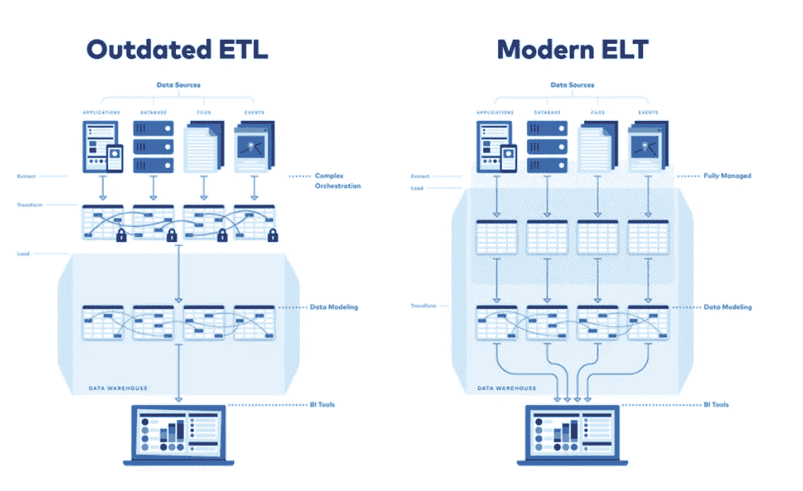
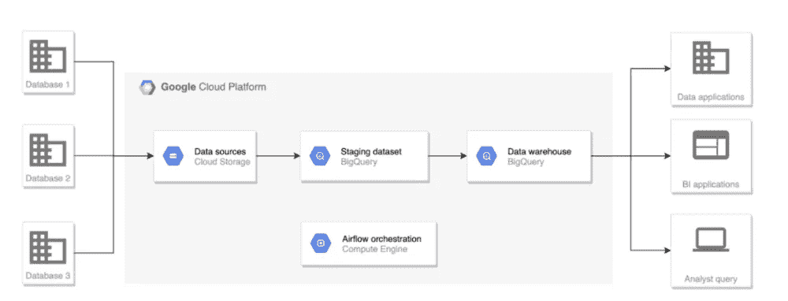

# 使用 Google Bigquery 的 ELT

> 原文：<https://medium.com/google-cloud/elt-with-google-bigquery-d4b84d77adaf?source=collection_archive---------0----------------------->

ELT——提取、加载和转换——构建 ELT 管道与构建 ETL 管道没有什么不同。这两种类型(ETL 和 ELT)的实现方法有所不同。

ETL 过程是在数据集成工具中发生转换后将数据加载到目标系统中，ELT 方法首先将数据加载到目标系统中，然后再转换数据。通常 ELT 过程比传统的 ETL 过程更受欢迎，因为它实现起来更简单，加载数据更快。下图显示了不同之处

ELT——提取、加载和转换——构建 ELT 管道与构建 ETL 管道没有什么不同。这两种类型(ETL 和 ELT)的实现方法有所不同。

ETL 过程是在数据集成工具中发生转换后将数据加载到目标系统中，ELT 方法首先将数据加载到目标系统中，然后再转换数据。通常 ELT 过程比传统的 ETL 过程更受欢迎，因为它实现起来更简单，加载数据更快。下图显示了不同之处

在加载到目标系统时转换数据。运行时的数据读取、转换和加载可以通过单个数据管道来实现。具有 GCP 服务的 ETL 管道可以通过使用从以下服务中选择的服务来实现

*   数据融合
*   数据流
*   DataProc
*   云函数

将数据加载到目标系统后转换数据称为 ELT。要在加载后应用转换，可以使用 SQL 来实现，以获得更好的性能。这种方法是从 GCP 迁移到 BigQuery 的首选方法。带 GCP 的 ELT 管线可通过使用以下管线实施-

提取/上传作业->将文件/数据加载到 GCS -> BigQuery ->转换作业(SQL/过程/函数)[使用气流的编排]

要将源数据上传到 GCP，需要在 GCP 上设置以下列表中的一组选项-

*   数据传输服务
*   使用数据流的源提取作业
*   在 dataproc 上使用 Sqoop/Spark 的数据导入作业
*   源文件上传到 GCS
*   发布\订阅到 GCS 的实时数据流
*   使用 ETL 工具将系统间的数据推送到 GCP/GCS/Bigquery

作为目标层，我们可以从以下 GCP 数据服务中进行选择-

*   BigQuery
*   云扳手

Bigquery 被广泛用作 GCP 上的数据仓库服务/无服务器数据仓库实现。这用于集成 GCP 或 GCP 以外的服务/流程。大查询性能是在 GCP 上迁移/设置数据仓库/数据湖的关键之一。BQ 还可以用作分析服务，使用任何 BI 工具/AI/ML 模型在 GCP 基础上构建分析。

**方法 1 - >数据传输服务+ BigQuery**

用于将数据复制/迁移到 GCP 的数据传输服务。使用此服务上传数据是性能的首选。一旦数据登陆到 GCP，Bigquery 就被用作数据仓库服务，以将源数据/登陆的数据暴露为暂存层。可以使用 SQL-BQ 作业、过程和函数来构建转换。可以创建 BQ 视图，以供 BI/数据科学家进行分析。

## 优势:

*   使用 GCP 本地服务
*   转换可以通过 SQL 来完成。BQ 中支持 ANSI SQL 标准(即使是技术经验较少的人员也可以实现数据准备逻辑。)
*   DTS 和 Big Query 是完全的 SaaS 技术(基础设施和扩展不需要额外的设置)。)
*   DTS 可以处理要迁移到 GCP 的任何类型的数据、卷和系统

**方法 2 - > GCS + BigQuery**

通过这种方法，我们获得了来自 GCS 登录层/存储桶的源数据。这可以使用 Nifi、GCS 实用程序、Distcp、Sqoop、Spark jobs、Dataflow 等来完成。这取决于源系统和数据卸载的类型。下面可以是一些选择→

*   源系统是 RDBMS——数据流、DataProc 临时集群上的 Sqoop/Spark、ETL 工具
*   源系统是基于文件的系统— SFTP/GSutil 将文件推送到 GCS
*   源系统是基于 Hadoop 的系统— gsutil，将文件分发到 GCS —基于卷和目标系统的推/拉方法，将数据推送到 GCS 的 Sqoop，将数据推送到 GCS 的 Spark 作业
*   源是 Teradata — TD 到 BQ 连接器以获取源数据

一旦 GCS 上的数据可用，将源数据发送到 GCS 是首选方法，而不是直接加载到 BQ。有了 GCS，我们可以归档数据集，用它来处理故障、源数据问题测试、版本控制等。

BQ 变换和目标层通常通过以下方法实现→

BQ 暂存层(源数据)-> BQ 转换层(使用 BQ SQL 的转换)-> BQ 目标层(分析层/聚合层)-> BQ 报告层(如果需要，使用视图)

## 优势:

*   使用 GCP 本地服务
*   转换可以通过 SQL 来完成。BQ 中支持 ANSI SQL 标准(即使是技术经验较少的人员也可以实现数据准备逻辑。)
*   GCS 和 Big Query 是完全的 SaaS 技术(基础设施和扩展不需要额外的设置。)
*   GCS 可以处理/存储要迁移到 GCP 的任何类型的数据、卷和系统
*   参考资料->[https://cloud . Google . com/architecture/dw2bq/dw-bq-data-pipelines](https://cloud.google.com/architecture/dw2bq/dw-bq-data-pipelines)

*   **关于我**

> *我是 DWBI 和云师！我一直在处理各种遗留数据仓库、大数据实施、云平台/迁移。我是谷歌认证的专业云架构师。您可以联系我@*[*LinkedIn*](https://www.linkedin.com/in/poojakelgaonkar)*如果您需要任何认证、GCP 实施方面的帮助！*