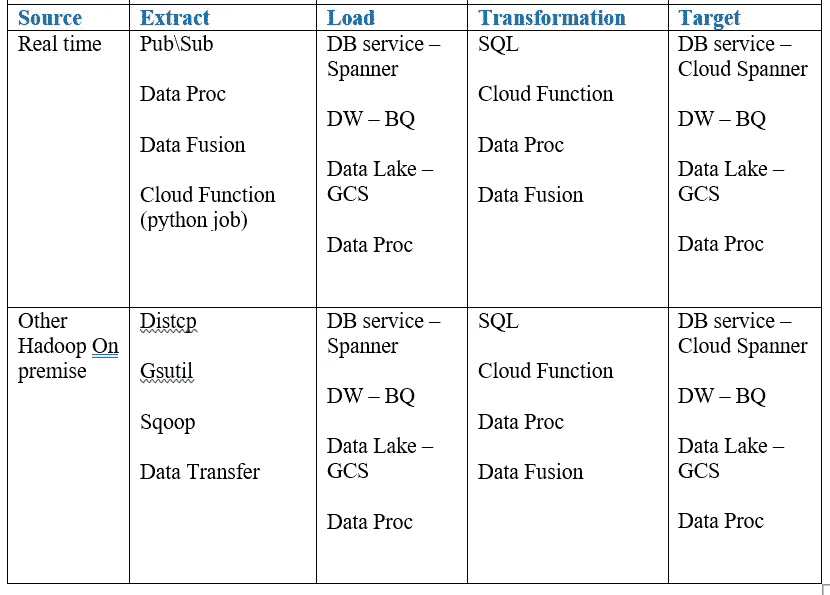
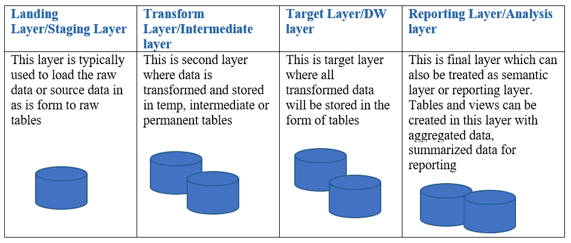

# 使用 Google Bigquery 的英语教学:第二部分

> 原文：<https://medium.com/google-cloud/elt-with-google-bigquery-part-ii-516ad42dbe7c?source=collection_archive---------0----------------------->

感谢你用谷歌大查询阅读了我的第一篇英语博客。如果你还没看，可以参考—[https://poojakelgaonkar . medium . com/ELT-with-Google-big query-d 4b 84d 77 adaf](https://poojakelgaonkar.medium.com/elt-with-google-bigquery-d4b84d77adaf)读出这篇博客的第一部分。

在以前的博客中，我们已经看到了两种不同的方法来实现 GCP 上的 ELT 与 Bigquery 和其他 GCP 服务。在这篇博客中，我们将看到在 GCP 设计/架构 ELT 的一些重要方面，特别是当我们选择 Bigquery 作为 DW/Data Lake 来存储数据时。在解释细节之前，让我们看看 Bigquery，并尝试找出许多问题的答案，如访问数据、检索数据、数据安全、数据丢失预防、运行数据分析、数据分析、生成统计数据、构建仪表板、通过报告探索数据，最重要的是，我们如何在 Bigquery 上构建/运行 ML 模型？这些是决定 GCP 数据仓库/数据湖服务选择的一些最重要的问题。GCP 提供许多数据/存储/数据库服务。关注我的下一篇博客，获得更多关于这些服务和选择这些服务的标准的见解。

更多关于 Bigquery 的讨论——让我们来看看其中的一些问题——

Bigquery 是 GCP 的服务之一，它提供数据存储、数据安全、DLP，以及在 GCP 和 GCP 以外通过各种服务访问的数据。BQ(Bigquery)是无缝可配置的，可用于任何其他 GCP 服务。我们可以在任何地方处理数据，GCP 境内或 GCP 境外的任何服务，我们可以将数据存储在 BQ 中。BQ 通过其实用程序、Rest APIs、GCP 以及连接到 BQ 的不同连接器提供互联网连接。我们还可以看到，BQ 插件也可用于大多数 ETL 和报告工具。Bigquery 允许我们像使用 ANSI SQL 查询、函数、存储过程等任何其他数据仓库一样使用它。BQ 也扩展了对 ML 的支持。我们可以使用 GCP 内置服务来访问 BQ 中保存的数据，以创建 ML 模型并使用 AI 平台进行部署。BQ 也用自己的能力支持 ML，创建 ML 模型，部署在 BQ 中，像 SQL 语句一样访问它们。BQ ML 有一些限制，如支持的算法、模型的创建和访问等。有了 BQ ML，任何了解 SQL 的商业用户都可以轻松地创建、部署和使用 ML 模型。

BQ 支持大多数 DW 函数和操作，除了行级处理或在表上运行的单个插入/更新。如果像 OLTP 那样执行单个事务，那么每天在一个表上运行的事务数量是有限制的。通过 merge 语句可以很好地处理插入/更新。BQ 的表现是其成功的关键。BQ 支持与任何其他数据仓库相同的模式分离，并且在 BQ 中被称为数据集。我们可以为数据仓库的不同层创建不同的数据集，就像可以在任何其他数据仓库中创建不同的数据库/模式一样。BQ 支持访问在数据集内和跨数据集创建的对象。关注我的下一篇博客，获得更多关于 BQ 中数据安全性和可访问性实现的见解。

在 GCP 上实施 ELT 时，BQ 是广泛用于存储和处理数据的服务之一。可以根据需求设置来源，目标可以是 BQ。现在，我们将看看在 GCP 上设计和开发 ELT 时，ELT 下的不同层和服务。我们知道一些服务，如数据流、数据融合、数据处理、云功能，使用这些服务可以在 GCP 上实施 ETL。为了在 GCP 实现英语教学，我们可以使用各种堆栈、服务和开源软件。下表列出了在 GCP 实施 ELT 的一些使用案例

在大多数场景和用例中，将数据放入 GCS 是确保源数据验证、源数据版本化和存储一段时间以避免任何类型的数据丢失的第一步。一旦数据被复制到 GCS，本地或开源实用程序就会将数据加载到适当的数据库服务中。在数据模型之下，层是推荐的，也是大多数数据仓库实施中通常遵循的——

这些是在 BQ 中实现 ELT 或 ETL 时创建的一些数据集/层。在 GCP 上实现 ETL 时，也可以创建相同的层。E 和 T 步骤、转换可能因实施而异。

希望这有助于理解 BQ 在 ELT 和 ETL 实现中的设置和使用。关注我的下一篇博客，了解更多关于 BQ 和其他 GCP 服务的信息。

**关于我**

> *我是 DWBI 和云师！我一直在处理各种遗留数据仓库、大数据实施、云平台/迁移。我是谷歌认证的专业云架构师。您可以联系我@*[*LinkedIn*](https://www.linkedin.com/in/poojakelgaonkar)*如果您需要任何认证、GCP 实施方面的帮助！*