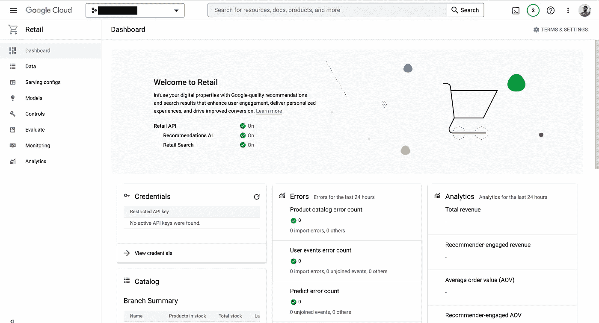
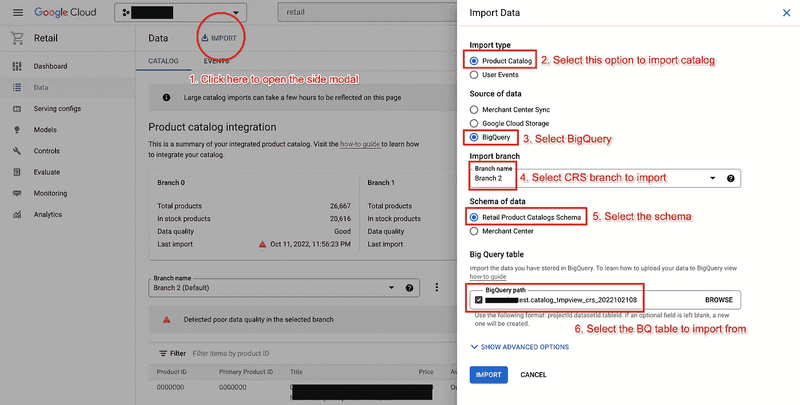
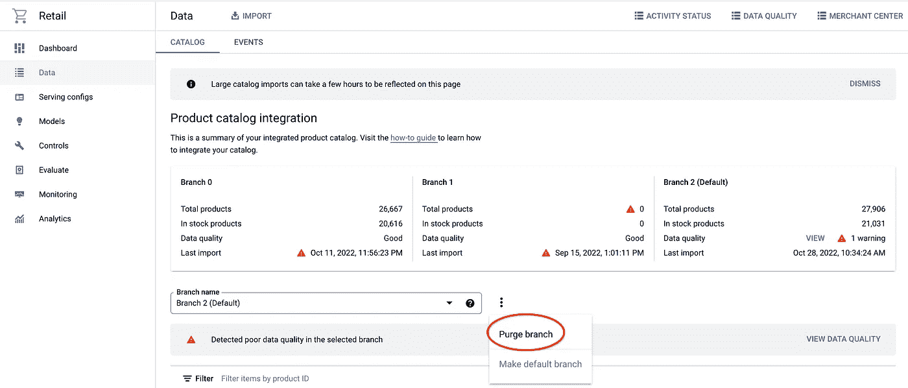
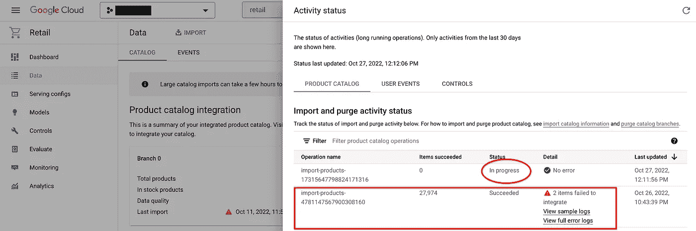
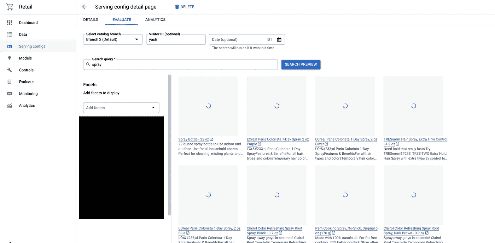

# 用谷歌质量搜索和推荐赋能零售商——第 1 部分

> 原文：<https://medium.com/google-cloud/empowering-retailers-with-google-quality-search-recommendations-7bdbba735f50?source=collection_archive---------3----------------------->

有没有想过，主要的零售商是如何在他们的电子商务网站上提供搜索和推荐的？是怎么做到的？

寻找第二部分？点击[这里](/google-cloud/empowering-retailers-with-google-quality-search-recommendations-part-2-600f05e5577f)


由[弗兰基·查马基](https://unsplash.com/@franki?utm_source=medium&utm_medium=referral)在 [Unsplash](https://unsplash.com?utm_source=medium&utm_medium=referral) 上拍摄的照片

## 让我们以一位顾客的实体购物体验为例:

> 假设你在一家大型超市/商店，你只有有限的时间来完成你的购物清单。你很匆忙&在商店里找路，问人们哪里有 X Y & Z。
> 
> 它可能就在商店的对面，或者就在你旁边！事实上，这些商品可能不会按照你购物清单上的顺序摆放。这就变成了拥挤，你最终会花更多的时间在商店的长过道里穿行。我们希望这不仅能更快(就像在任何电子商务网站上搜索一样)，还能确保我们最终穿过正确的通道，挑选出您**希望**或**以前购买过的**或您**忘记添加到列表中的**产品。
> 
> 让我们假设你也有几样东西要买，但是你完全错过了——比如在找毛巾的时候买丝瓜，或者在找零食的时候买饮料，或者为你今晚的聚会买一次性眼镜！听起来很熟悉？

## 什么是零售搜索？

*   谷歌云的发现解决方案帮助电子零售商**将休闲浏览器转化为合法买家**以及**为买家/客户个性化整体购物体验**。
*   零售搜索建立在谷歌对用户购物行为、意图、背景和整体 SKU 的全面理解之上。这通过使用谷歌支持的最先进的人工智能推荐来引导用户在你的商店上**增加参与度和每单收入**。
*   此外，您可以**提供自己的业务规则**来修改目录查看体验、扩展整体搜索查询以检索相关项目、提升&隐藏结果等等

让我们去控制台创造奇迹吧！

## 支持零售搜索

如果您是第一次访问零售控制台，请按照此处的说明[接受 T & C 并启用零售搜索。](https://cloud.google.com/retail/docs/setting-up)

> 请注意，启用零售搜索将在您启用推荐人工智能后显示为“可选”，但请确保您启用了它，因为本博客主要关注零售搜索。



首先，你需要数据——帮助零售搜索了解你的**目录**和**用户互动**以提供相关建议。

# 向零售搜索提供数据

从零售控制台的菜单进入*数据*页面，在这里你会看到**目录** & **事件**的标签。为了博客的简洁，让我们把重点放在目录数据以及如何把你的产品目录输入零售搜索。

有多种方法可以导入数据:

*   **从表/视图导入**大查询
*   **云存储从换行符分隔的 JSON 文件导入**
*   **谷歌商业中心同步**
*   **通过在 API 请求体中指定数据进行内联导入**

让我们使用 BigQuery 导入选项。

## BigQuery 导入方法

为此，您需要在零售搜索指定的 BigQuery [产品目录模式格式](https://cloud.google.com/retail/docs/catalog#schema)中创建一个模式。或者，您可以在任何现有的目录表上创建一个 BigQuery 视图，该视图应该符合产品目录模式。

> 注意，目录数据的结构符合零售搜索指定的产品目录模式格式。请参考[官方文档](https://cloud.google.com/retail/docs/reference/rest/v2/projects.locations.catalogs.branches.products)以了解更多关于字段&的信息，对您的数据进行必要的转换。

Retail 提供了 3 个分支来导入数据(0，1，2)。3 个分支中的一个被设置为 **default_branch** ，用于提供结果。使用这种筒仓有许多原因:

*   确保搜索结果对最终用户是可靠的和最新的
*   精心调试经过测试的数据以服务最终用户(通过将给定分支设置为默认)
*   正常淘汰旧数据，并确保在需要时回滚到以前的状态
*   还有更多…



将产品目录数据导入零售搜索

从零售控制台的菜单转到数据部分

1.  点击顶部的“导入”。将打开一个侧面模型。
2.  导入类型>选择"产品目录"
3.  数据源>选择" BigQuery "
4.  导入分支>选择您希望导入的分支(如果您是第一次这样做，请从 0、1 或 2 中选择您最喜欢的数字)
5.  数据模式>选择“零售产品目录模式”——这是我们讨论过的模式格式。
6.  BigQuery table >以“projectId.datasetId.tableId”的格式提供完整的表 ID—这是符合产品目录模式的表/视图

点击**导入**。

> **奖励:**
> 
> 您还可以使用零售 API 导入数据。下面是一个使用 CURL 命令运行 POST API [products.import](https://cloud.google.com/retail/docs/reference/rest/v2/projects.locations.catalogs.branches.products/import) 的例子(SSH 应该有适当的 [IAM 访问](https://cloud.google.com/retail/docs/iam)

```
$ PROJECT_ID="test-retail"
$ PROJECT_NUMBER="123456789"
$ DATASET_ID="testretail"
$ TABLE_ID="product_catalog"$ curl -X POST \
-H "Authorization: Bearer $(gcloud auth application-default print-access-token)" \
-H "Content-Type: application/json; charset=utf-8" \
-d '{
    "inputConfig": {
        "bigQuerySource": {
        "projectId": "'$*PROJECT_ID*'",
        "datasetId": "'$*DATASET_ID*'",
        "tableId": "'$*TABLE_ID*'",
        "dataSchema": "product"
        }
    },
    **"reconciliationMode": "FULL"**
    }' \
    '[https://retail.googleapis.com/v2/projects/'$*PROJECT_NUMBER*'/locations/global/catalogs/default_catalog/branches/**default_branch**/products:import'](https://retail.googleapis.com/v2/projects/'$PROJECT_NUMBER'/locations/global/catalogs/default_catalog/branches/default_branch/products:import')
```

> API 字段 ***对账模式*** *提供了导入数据* **增量** -ly 或者**完全**刷新的选项。
> 
> 如果您使用控制台 UI 导入数据，则默认为增量。要导入完全刷新的数据，您可以**清除**数据(查看下面的截图)并导入全新数据！



清除/删除分支中的数据

# 跟踪您的进口活动

一旦导入成功开始，直接进入“数据”页面上的“活动状态”模式



导入和清除活动的活动状态

*   观察正在进行的操作；成功的项目将显示导入的产品数量。请注意，每个记录应该代表一个独特的产品。
*   在上面的截图中，一个旧的操作成功地导入了 27974 个产品，2 个产品没有导入，存在模式或数据问题。因此，产品被部分导入，并提供了错误日志用于调试。
*   如果你清除了一个分支，这需要时间。因此，在导入新数据之前，您必须等待清除操作完成，可以在活动状态模式中跟踪新数据。

> 在后台，零售搜索将执行重建/索引操作，为搜索查询返回正确的结果。您现在可以开始使用零售搜索进行正常的搜索操作。这应该会给你正确的结果。

# 让我们搜索一下

*   转到零售控制台>选择服务配置。零售搜索创建一个默认配置来使用。
*   点击“default_search”服务配置>点击从顶部评估
*   根据您的数据提供搜索查询



“喷雾”的搜索结果

现在，您可以使用零售搜索提供的 SDK 在您的网站上实现这一点。下面是一个运行 POST API[placements . search](https://cloud.google.com/retail/docs/reference/rest/v2/projects.locations.catalogs.placements/search)的例子，使用 CURL 命令(SSH 应该有适当的 [IAM 访问](https://cloud.google.com/retail/docs/iam)

```
$ PROJECT_NUMBER="123456789"$ curl -X POST \
-H "Authorization: Bearer $(gcloud auth application-default print-access-token)" \
-H "Content-Type: application/json; charset=utf-8" \
-d **'{** "branch": "projects/'$*PROJECT_NUMBER'*/locations/global/catalogs/default_catalog/branches/**default_branch**",
"query": "**spray**",
"visitorId": "**yash**",
"pageSize": 28
}' \
"https://retail.googleapis.com/v2/projects/$*PROJECT_NUMBER*/locations/global/catalogs/default_catalog/placements/**default_search**:search"
```

您可能需要添加*" X-Goog-User-Project:$ Project _ NUMBER "*标题(如果需要)，以让零售搜索知道哪个项目需要计费。您可以在 API 文档中查看更多选项，以过滤搜索结果&浏览类别。

祝贺您迈出了谷歌云零售发现解决方案的第一步。接下来，我们将讨论什么是服务配置、服务控制和动态方面。

点击[此处](/google-cloud/empowering-retailers-with-google-quality-search-recommendations-part-2-600f05e5577f)进入第二部分

# 参考

[](https://cloud.google.com/retail/docs/overview) [## 实施零售|谷歌云

### 本页提供了实现零售 API 的分步指南。当你使用推荐人工智能或零售…

cloud.google.com](https://cloud.google.com/retail/docs/overview) [](https://cloud.google.com/retail/docs/apis) [## API 和参考|零售|谷歌云

### 无论您的企业正处于数字化转型的早期阶段，谷歌云都可以帮助您解决…

cloud.google.com](https://cloud.google.com/retail/docs/apis)