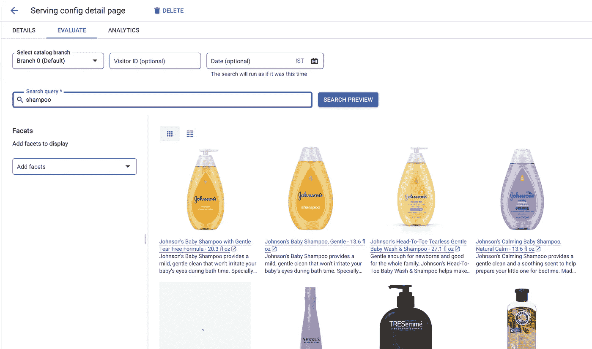

# 用谷歌质量搜索和推荐赋能零售商——第二部分

> 原文：<https://medium.com/google-cloud/empowering-retailers-with-google-quality-search-recommendations-part-2-600f05e5577f?source=collection_archive---------5----------------------->

在[之前的博客](/google-cloud/empowering-retailers-with-google-quality-search-recommendations-7bdbba735f50)中，我们讨论了零售搜索的基础知识以及如何在零售搜索目录中导入目录数据。曾经想过，我如何根据用户提供的搜索查询向他们提供正确的分面选项。或者基本上策划搜索自己可以采取一些行动的网站？

照片由[海蒂·芬](https://unsplash.com/@nofunfin?utm_source=medium&utm_medium=referral)在 [Unsplash](https://unsplash.com?utm_source=medium&utm_medium=referral) 上拍摄

例如，用户查询“洗发水”

*   您为“头发类型”提供一个面进行过滤。当然，在这种情况下，为他们提供“大小”方面是没有意义的，因为方面是不适用的！
*   此外，我可能有一个针对某些洗发水/品牌等的网页，并希望用户被重定向到该网页。
*   或者，假设我想在页面顶部显示 ABC 品牌的产品，在页面底部显示价格超过 12 美元的产品

听起来很熟悉吧？

# 动态刻面

零售搜索提供了名为动态分面的功能。但是什么是“面”呢？你一定访问过你最喜欢的电子商务网站，并试图应用一些过滤器，如过滤品牌，价格或大小。是的，过滤器选项被称为动态方面，它告诉您哪些过滤器适用于查询术语。因此，如果你正在寻找一双“牛仔裤”，它会“动态地”提供适用的方面，如颜色、尺码、洗涤、品牌、价格等。如果你搜索“太阳镜”，它会给你提供适用的方面，如尺寸、颜色、品牌、动力、类型等。

随着用户事件流入零售搜索，动态分面随着时间的推移而改进。它确实在没有用户事件的情况下提供了良好的结果。但是建议您在部署用于生产之前将用户事件提供给系统，以确保获得可接受的结果。

但是我如何启用动态分面呢？我们将在下面看到

# 服务配置

对搜索 API 的每个查询都通过服务配置进行。它帮助您配置搜索，并作为提供结果的入口点。因此，这是你可以策划网站搜索的地方！

在博客的前一部分，我们选择了“default_search”服务配置来评估和尝试对导入的数据进行零售搜索。默认情况下，零售搜索会创建此服务配置。

要为搜索创建新的服务配置-

*   从菜单中单击服务配置以列出现有的服务配置。您将在列表中看到 default_search 服务配置。
*   选择顶部的“创建服务配置”选项。
*   可以选择为推荐或搜索创建服务配置。我们将专注于搜索

*   接下来，有一个选项可以启用**动态刻面**！这将允许对该服务配置的搜索查询返回动态方面。

*   在这里，我们可以选择创建控件或添加现有控件。但是什么是**控制**？

照片由[德鲁·帕特里克·米勒](https://unsplash.com/@drewpatrickmiller?utm_source=medium&utm_medium=referral)在 [Unsplash](https://unsplash.com?utm_source=medium&utm_medium=referral) 上拍摄

# 服务控制

服务控件是服务配置的一部分，用于“控制”搜索结果。搜索查询和结果应用于链接到服务配置的所有服务控件。零售搜索提供多种服务控制选项，如下所示:

服务控制的类型

要创建新的服务控制，您可以在服务配置创建期间选择“创建新控制”选项，或者转到“控制”并选择“服务控制”选项卡

*   点击顶部的“+创建控件”按钮。右边会出现一个模式来填充细节。在“首选项”中，提供控件名称，选择“搜索”并选择控件类型。
*   我们将创建一个 Boost/bury 控件，当用户搜索“洗发水”时，在顶部(Boost)显示品牌“Johnson & Johnson”的产品。点击继续进行配置。
*   对于“触发器”，我们需要配置什么将触发该控件。如果您指定了某些查询术语，那么它将只为这些术语触发，否则它将为每个搜索请求触发。我们只想触发“洗发水”或“洗头”。输入每个术语后，按 enter 键。

> **好处:**[搜索 API](https://cloud.google.com/retail/docs/reference/rest/v2/projects.locations.catalogs.placements/search) 提供了两种检索产品的方式——搜索或浏览。当搜索 API 调用中没有“query”参数，并且指定了“pageCategories”字段和其他过滤器时，就会发生浏览请求。这意味着用户正在浏览类别。测试浏览事件的唯一方法是通过搜索 API。评估页面仅支持搜索查询。

*   单击“继续”,并选择“增强/掩埋”操作。我们决定在顶部推广“强生”产品。选择如下值。请注意，增强/隐藏滑块的范围是从-1 到 1。高值表示增强，低值表示隐藏。

*   单击继续并选择要应用的服务配置。选择您在上面创建的服务配置或将其应用于默认搜索。

现在，让我们比较结果。最初，如果我们搜索“洗发水”，我们会得到如下结果

将服务控件附加到我们的服务配置后，它应该如下所示:

在再次进入评估页面并搜索“洗发水”后，我们现在在顶部看到了“强生”的产品。请注意，其他产品向底部漂移，为顶部的增压产品让路。

> **注意:**设置为 1.0 给物品一个大提升。但是，这并不一定意味着提升的项目将始终是顶部的结果，也不意味着其他项目将被排除在外。即使没有一个结果与条件匹配，仍然可以显示结果。与搜索查询更相关的结果仍然会胜过你非常喜欢但不相关的项目。[参考文献]

您也可以尝试创建其他控件，并根据需要使用它们。还有一个选项可以导出所有控件，并根据需要导入到其他 Google Cloud 项目和环境中。

此外，您还可以使用 Retail Search 提供的 API 来创建服务[控件](https://cloud.google.com/retail/docs/reference/rest/v2/projects.locations.catalogs.controls#Control)和[配置](https://cloud.google.com/retail/docs/reference/rest/v2/projects.locations.catalogs.servingConfigs)。它帮助您自动管理控件。

我希望学习零售搜索的基础知识是非常令人兴奋的。请查阅官方文档以了解更多关于该产品的信息。

我们只是触及了表面，但直到下次！

# 参考

 [## 关于服务控件|零售|谷歌云

### 您可以将服务控件应用于服务配置，以自定义零售搜索处理搜索查询和返回的方式…

cloud.google.com](https://cloud.google.com/retail/docs/serving-control-rules)  [## 关于服务配置|零售|谷歌云

### 本页描述了服务配置。服务配置是关联模型或一组控件的服务实体…

cloud.google.com](https://cloud.google.com/retail/docs/configs)